# E.D.D.I — Multi-Agent Orchestration Middleware for Conversational AI

[](https://app.codacy.com/organizations/gh/labsai/dashboard?utm_source=github.com&utm_medium=referral&utm_content=labsai/EDDI&utm_campaign=Badge_Grade) [](https://www.bestpractices.dev/projects/12355) [](https://securityscorecards.dev/viewer/?uri=github.com/labsai/EDDI) 

[](https://github.com/labsai/EDDI/actions/workflows/ci.yml) [](https://github.com/labsai/EDDI/actions/workflows/codeql.yml)

[](https://hub.docker.com/r/labsai/eddi) [](AGENTS.md)

**E.D.D.I** (Enhanced Dialog Driven Interface) is a production-grade, **config-driven multi-agent orchestration middleware** for conversational AI. It coordinates users, AI agents, and business systems through **intelligent routing, persistent memory, and API orchestration** — without writing code.

Built with **Java 25** and **Quarkus**. Ships as a **Red Hat-certified Docker image**. Native support for **MCP** (Model Context Protocol), **A2A** (Agent-to-Agent), **Slack**, **OpenAPI**, and **OAuth 2.0**.

**Latest version: 6.0.1** · [Website](https://eddi.labs.ai/) · [Documentation](https://docs.labs.ai/) · License: Apache 2.0

---

## 📑 Table of Contents

- [🏁 Quick Start](#-quick-start)
- [💡 Why EDDI?](#-why-eddi)
- [📸 See It In Action](#-see-it-in-action)
- [✨ Features](#-features)
- [🧩 Quarkus SDK](#-quarkus-sdk)
- [📖 Documentation](#-documentation)
- [📋 Compliance & Privacy](#-compliance--privacy)
- [🏗️ Development](#️-development)
  - [Prerequisites](#prerequisites)
  - [Quarkus Dev Mode](#quarkus-dev-mode)
  - [Maven Command Reference](#maven-command-reference)
  - [Build & Docker](#build--docker)
  - [Kubernetes](#️-kubernetes)
- [🤝 Contributing](#-contributing)
- [🔒 Security](#-security)
- [📜 Code of Conduct](#-code-of-conduct)

---

## 🏁 Quick Start

The fastest way to get EDDI running is the **one-command installer**. It sets up EDDI + your choice of database via Docker Compose, deploys the [Agent Father](docs/agent-father-deep-dive.md) starter agent, and walks you through creating your first AI agent.

**Linux / macOS / WSL2:**

```bash
curl -fsSL https://raw.githubusercontent.com/labsai/EDDI/main/install.sh | bash
```

**Windows (PowerShell):**

```powershell
iwr -useb https://raw.githubusercontent.com/labsai/EDDI/main/install.ps1 | iex
```

> **Note:** If your Antivirus blocks this command as "malicious content", securely download and run it instead:
>
> ```powershell
> Invoke-WebRequest -Uri "https://raw.githubusercontent.com/labsai/EDDI/main/install.ps1" -OutFile "install.ps1"
> Unblock-File .\install.ps1
> .\install.ps1
> ```

Requires [Docker](https://docs.docker.com/get-docker/). The wizard auto-generates a unique vault encryption key for secret management.

<details>
<summary><strong>🔧 Installer options</strong></summary>

```bash
bash install.sh --defaults                 # All defaults, no prompts
bash install.sh --db=postgres --with-auth  # PostgreSQL + Keycloak
bash install.sh --full                     # Everything enabled (DB + auth + monitoring)
bash install.sh --local                    # Build Docker image from local source
```

The `--local` flag is for contributors testing pre-release builds:

```bash
./mvnw package -DskipTests    # Build the Java app
bash install.sh --local        # Build Docker image + start containers
```

</details>

### 🔄 Updating

The installer creates an `eddi` CLI wrapper that makes updating easy:

```bash
eddi update
```

This pulls the latest Docker image from the registry and restarts the containers. It works even when the same tag (e.g. `latest`) was re-published — Docker always checks the remote digest for changes.

> **`eddi` command not found?** The CLI lives at `~/.eddi/eddi` (Linux/macOS) or `~/.eddi/eddi.cmd` (Windows). Either restart your terminal so the PATH takes effect, or use the full path:
>
> ```bash
> # Linux / macOS
> ~/.eddi/eddi update
>
> # Windows (PowerShell)
> & "$HOME\.eddi\eddi.cmd" update
> ```

<details>
<summary><strong>Manual update (without the CLI)</strong></summary>

If the `eddi` CLI isn't available, run the equivalent docker commands from your install directory (`~/.eddi` by default):

```bash
cd ~/.eddi
docker compose --env-file .env -f docker-compose.yml pull
docker compose --env-file .env -f docker-compose.yml up -d
```

Adjust the `-f` flags to match your setup (e.g. add `-f docker-compose.auth.yml` if using Keycloak).

</details>

### 🐳 Docker Compose (Manual)

If you prefer manual control over Docker Compose:

```bash
# Default (EDDI + MongoDB)
docker compose up

# PostgreSQL instead of MongoDB
EDDI_DATASTORE_TYPE=postgres docker compose -f docker-compose.yml -f docker-compose.postgres.yml up

# With Keycloak authentication
docker compose -f docker-compose.yml -f docker-compose.auth.yml up

# With Prometheus + Grafana monitoring
docker compose -f docker-compose.yml -f docker-compose.monitoring.yml up

# Full stack (all overlays)
docker compose -f docker-compose.yml -f docker-compose.auth.yml \
  -f docker-compose.monitoring.yml -f docker-compose.nats.yml up
```

Available compose overlays: `docker-compose.auth.yml` (Keycloak), `docker-compose.monitoring.yml` (Prometheus+Grafana), `docker-compose.nats.yml` (NATS JetStream), `docker-compose.postgres.yml` / `docker-compose.postgres-only.yml`, `docker-compose.local.yml` (build from source).

```bash
docker pull labsai/eddi    # Pull latest from Docker Hub
```

→ [hub.docker.com/r/labsai/eddi](https://hub.docker.com/r/labsai/eddi)

---

## 💡 Why EDDI?

Most multi-agent frameworks (LangGraph, CrewAI, AutoGen) are Python/Node libraries — great for prototyping, hard to govern in production. EDDI approaches from the opposite direction: **a deterministic engine built to safely govern non-deterministic AI.**

| Dimension          | Typical Python/Node Frameworks           | EDDI                                                                        |
| ------------------ | ---------------------------------------- | --------------------------------------------------------------------------- |
| **Concurrency**    | GIL or single-threaded event loop        | Java 25 Virtual Threads — true OS-level parallelism                         |
| **Agent Logic**    | Embedded in application code             | Versioned JSON configurations — update behavior without redeployment        |
| **Security Model** | Often relies on sandboxed code execution | No dynamic code execution at all; envelope-encrypted vault, SSRF protection |
| **Compliance**     | Requires custom implementation           | GDPR, HIPAA, EU AI Act infrastructure built-in                              |
| **Audit Trail**    | Application-level logging                | HMAC-SHA256 immutable ledger with cryptographic agent signing               |
| **Deployment**     | pip/npm + manual infrastructure          | One-command Docker install, Kubernetes/OpenShift-ready                      |

> _"The engine is strict so the AI can be creative."_ — [Project Philosophy](docs/project-philosophy.md)

---

## 📸 See It In Action

<table>
<tr>
<td width="50%">
<p align="center"><strong>📊 Dashboard</strong></p>
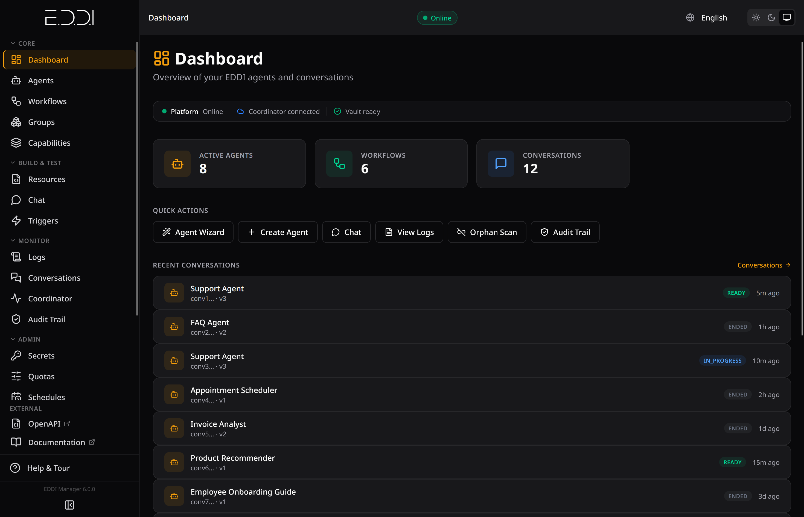
<p><em>Platform overview with active agents, workflows, quick actions, and recent conversations</em></p>
</td>
<td width="50%">
<p align="center"><strong>🤖 Agent Fleet</strong></p>
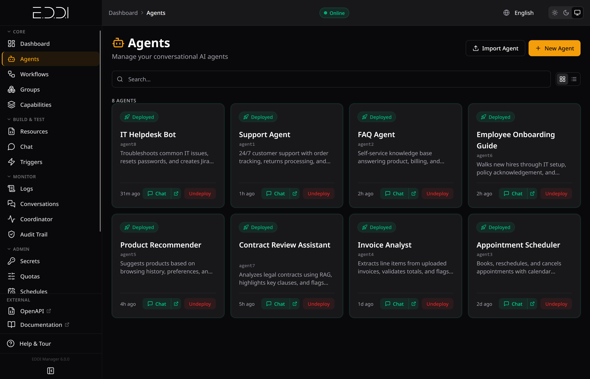
<p><em>All deployed agents at a glance with status, descriptions, and one-click chat</em></p>
</td>
</tr>
<tr>
<td width="50%">
<p align="center"><strong>💬 Live Conversation</strong></p>
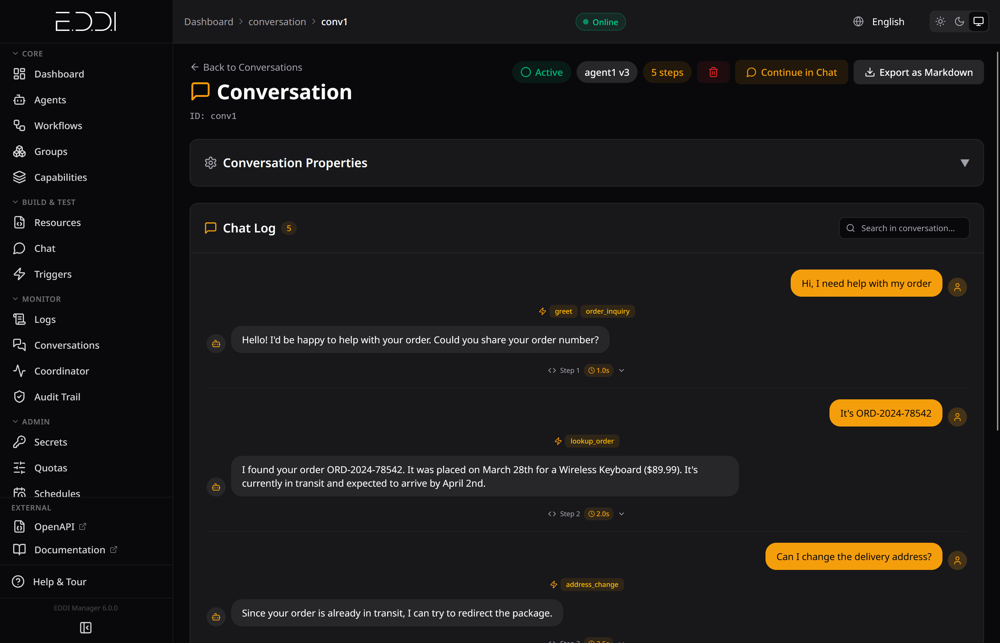
<p><em>Real-time conversation with visible actions, step timing, and tool calls</em></p>
</td>
<td width="50%">
<p align="center"><strong>🗣️ Multi-Agent Debate</strong></p>
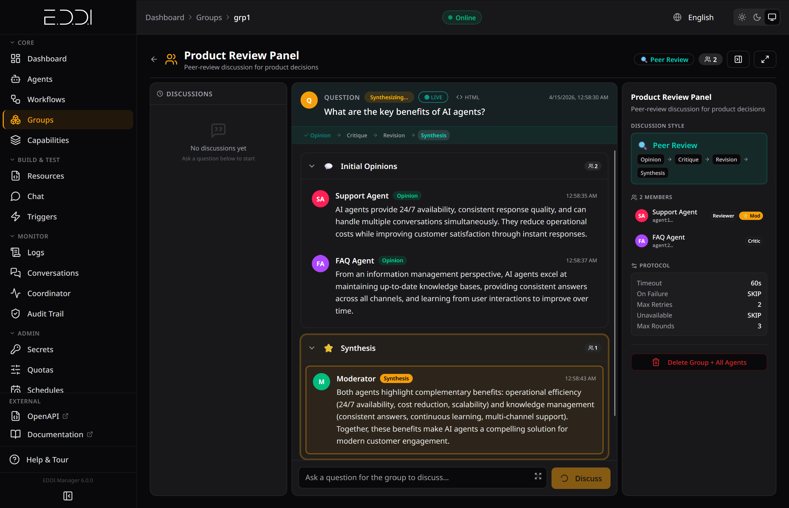
<p><em>Peer Review with phased discussion: Opinion → Critique → Revision → Synthesis</em></p>
</td>
</tr>
<tr>
<td width="50%">
<p align="center"><strong>🛡️ Secrets Vault</strong></p>
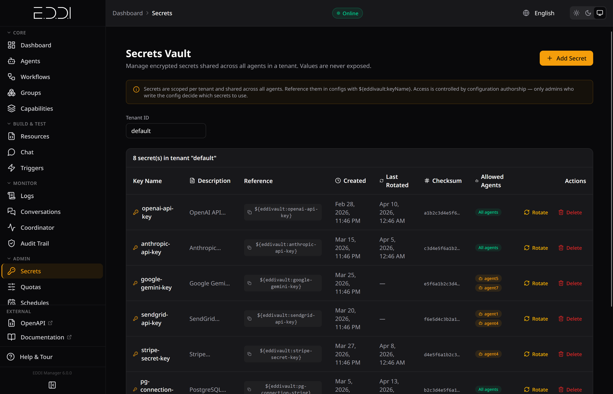
<p><em>Envelope-encrypted secrets with rotation tracking, checksums, and per-agent access control</em></p>
</td>
<td width="50%">
<p align="center"><strong>💰 Tenant Quotas</strong></p>
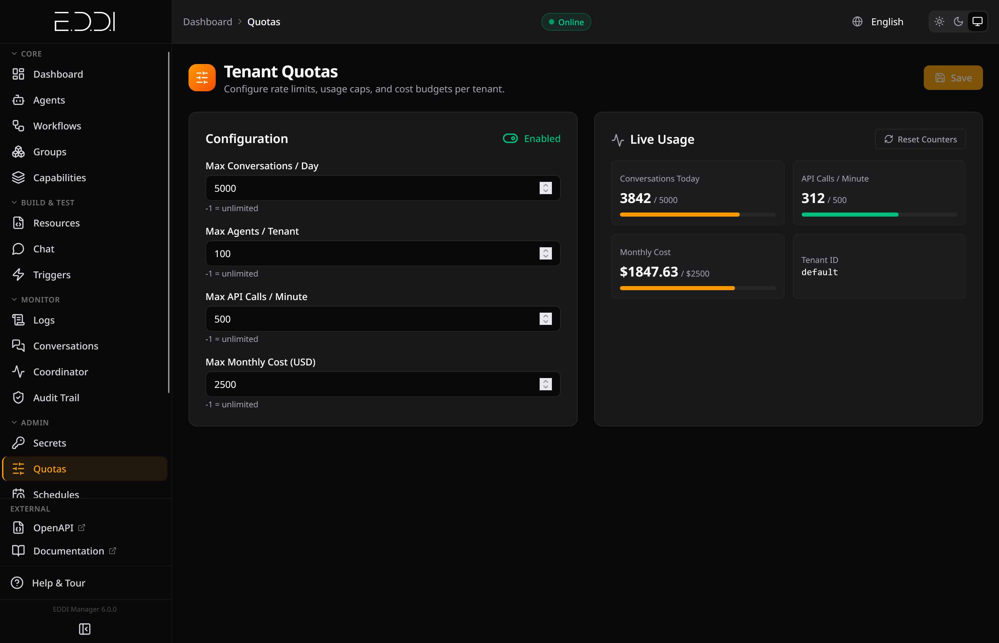
<p><em>Rate limits, cost budgets, and live usage monitoring per tenant</em></p>
</td>
</tr>
</table>

<details>
<summary><strong>More screenshots: LLM Config, Logs, User Memory, Schedules, Agent Detail</strong></summary>

<table>
<tr>
<td width="50%">
<p align="center"><strong>⚡ LLM Task Configuration</strong></p>
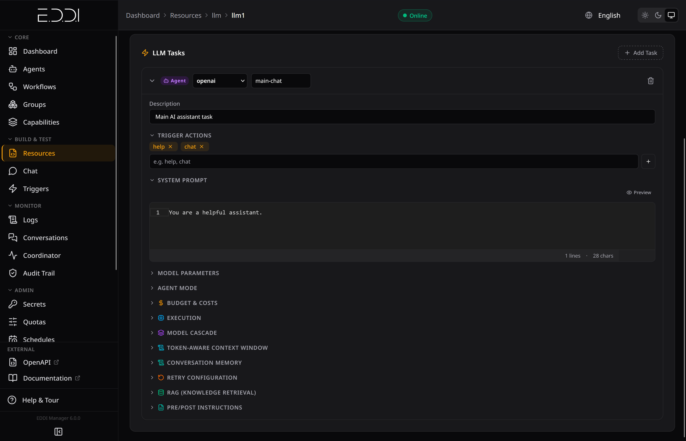
<p><em>System prompt, model parameters, cascading, RAG, context window, and budget settings</em></p>
</td>
<td width="50%">
<p align="center"><strong>📋 Real-Time Logs</strong></p>
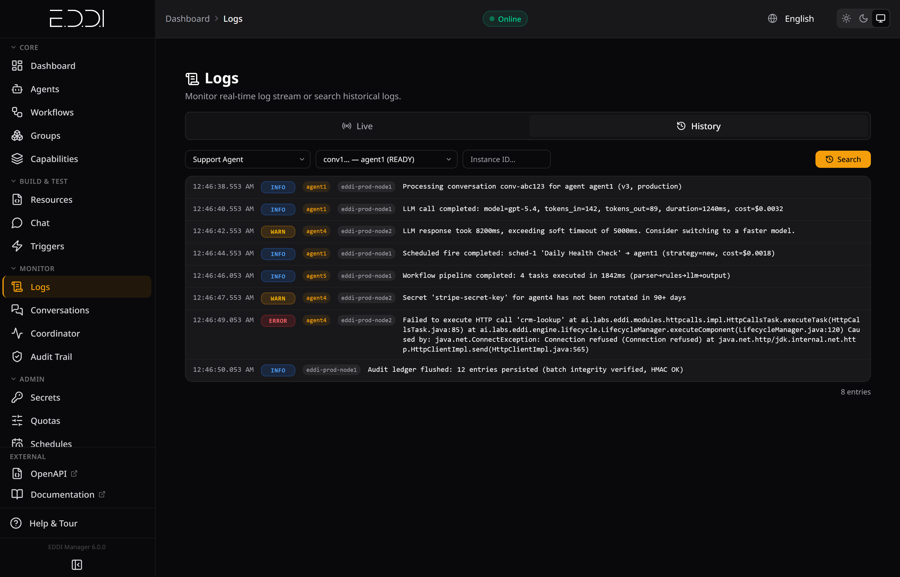
<p><em>Live log stream with per-call cost tracking, token counts, warnings, and errors</em></p>
</td>
</tr>
<tr>
<td width="50%">
<p align="center"><strong>🧠 Persistent User Memory</strong></p>
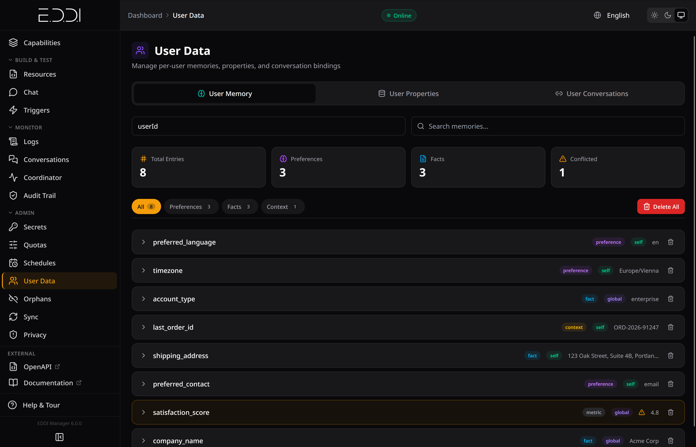
<p><em>Cross-session memory with categorized entries, visibility scoping, and conflict detection</em></p>
</td>
<td width="50%">
<p align="center"><strong>⏰ Scheduled Execution</strong></p>
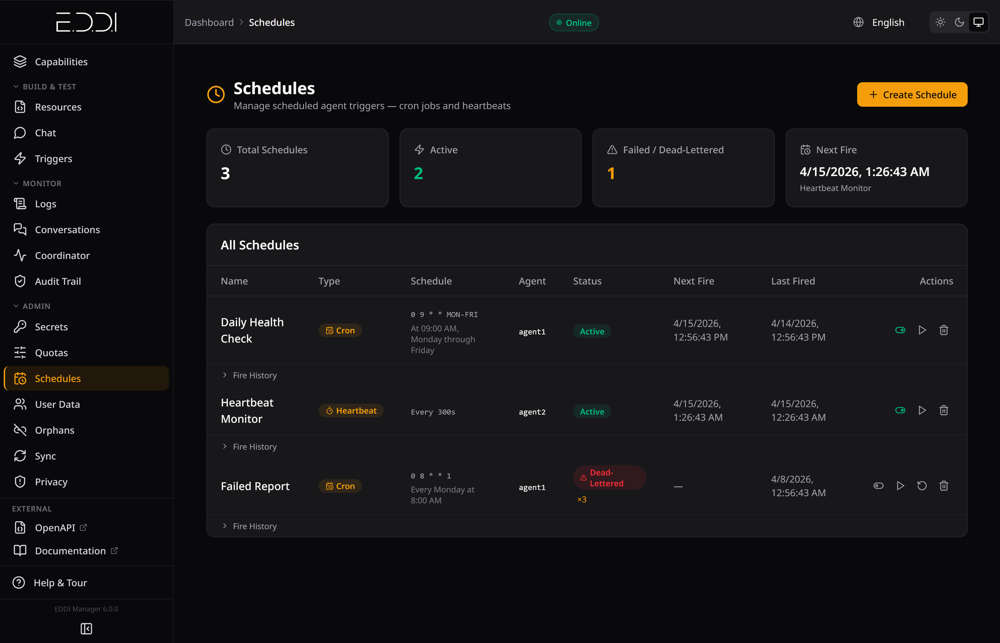
<p><em>Cron jobs and heartbeats with fire history, retry logic, and dead-letter tracking</em></p>
</td>
</tr>
<tr>
<td width="50%">
<p align="center"><strong>🔧 Agent Detail</strong></p>
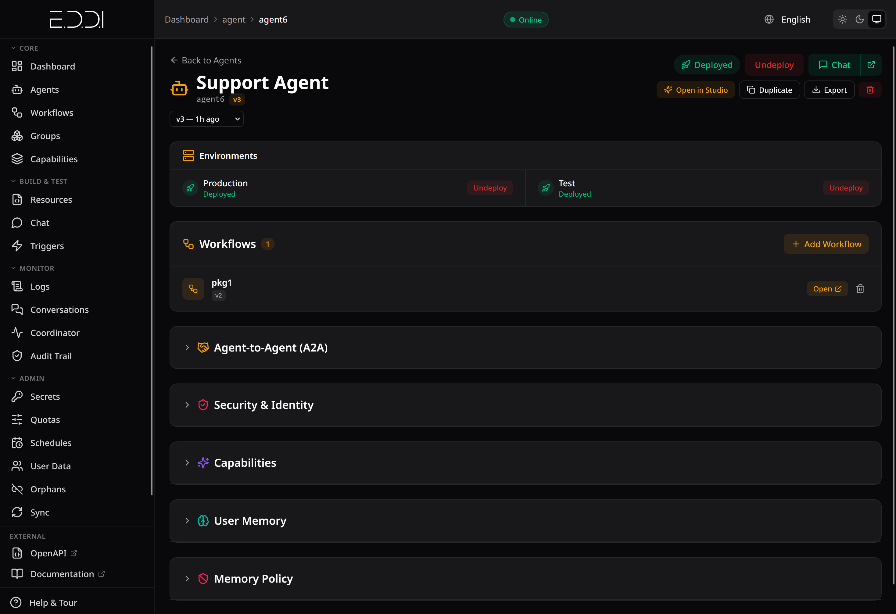
<p><em>Full agent config: environments, workflows, A2A, security, capabilities, and memory policy</em></p>
</td>
<td width="50%">
</td>
</tr>
</table>

</details>

---

## ✨ Features

### 🤖 Multi-Agent Orchestration

- 🔀 **Intelligent Routing** — Direct conversations to different agents based on context, rules, and intent
- 🗣️ **Group Conversations** — Multi-agent debates with 5 built-in discussion styles: Round Table, Peer Review, Devil's Advocate, Delphi, and Debate
- 💬 **Slack Integration** — Deploy agents to Slack channels and run multi-agent debates directly in threads
- 🪆 **Nested Groups** — Compose groups of groups for tournament brackets, red-team vs blue-team, and panel reviews
- 👥 **Managed Conversations** — Intent-based auto-routing with one conversation per user per intent
- 🎯 **Capability Matching** — Discover and route to agents by skill, confidence score, and custom attributes
- 🧙 **Agent Father** — Meta-agent that creates other agents through conversation (ships out of the box)

### 🧠 LLM Provider Support (12 Providers)

| Category             | Providers                                                             |
| -------------------- | --------------------------------------------------------------------- |
| **Cloud APIs**       | OpenAI · Anthropic Claude · Google Gemini · Mistral AI                |
| **Enterprise Cloud** | Azure OpenAI · Amazon Bedrock · Oracle GenAI · Google Vertex AI       |
| **Self-Hosted**      | Ollama · Jlama · Hugging Face                                         |
| **Compatible**       | Any OpenAI-compatible endpoint (DeepSeek, Cohere, etc.) via `baseUrl` |

### 🔗 Standards & Interoperability

EDDI implements open standards — not proprietary APIs:

| Standard                                                             | Role                            | What It Enables                                                                                          |
| -------------------------------------------------------------------- | ------------------------------- | -------------------------------------------------------------------------------------------------------- |
| **[MCP](https://modelcontextprotocol.io/)** (Model Context Protocol) | Server (42 tools) + Client      | Control EDDI from Claude Desktop, Cursor, or any MCP client. Connect agents to external MCP tool servers |
| **[A2A](https://google.github.io/A2A/)** (Agent-to-Agent Protocol)   | Full implementation             | Cross-platform agent communication, Agent Cards, and skill discovery                                     |
| **[OpenAPI](https://www.openapis.org/)** 3.1                         | Native generation + consumption | Auto-generated spec. Paste any OpenAPI spec → get a fully deployed API-calling agent                     |
| **OAuth 2.0 / OIDC**                                                 | Keycloak integration            | Authentication, authorization, and multi-tenant isolation                                                |
| **SSE** (Server-Sent Events)                                         | Streaming transport             | Real-time chat responses, group discussion feeds, and live log streaming                                 |

### 💭 Memory & Context Management

- 💾 **Persistent User Memory** — Agents remember facts, preferences, and context across conversations via structured key-value entries with visibility scoping (`global`, `agent`, `group`)
- 🧠 **LLM Memory Tools** — Built-in tools agents can call to read, write, and search their own persistent memory
- 💤 **Dream Consolidation** — Background memory maintenance: stale entry pruning, contradiction detection, and fact summarization (inspired by [Anthropic's](https://www.anthropic.com/research) research on background memory consolidation)
- 🪟 **Token-Aware Windowing** — Intelligent context packing with model-specific tokenizer support and anchored opening steps
- 📝 **Rolling Summary** — Incremental LLM-powered summarization of older turns with a **Conversation Recall Tool** for drill-back into compressed history
- 🔧 **Property Extraction** — Config-driven slot-filling with `longTerm` / `conversation` / `step` scoping — EDDI's importance extraction mechanism
- 🛡️ **Memory Policy (Commit Flags)** — Strict write discipline marks failed task output as uncommitted (hidden from LLM context) and injects concise error digests for graceful degradation
- 🔄 **Conversation State** — Full history with undo/redo support

### 📚 RAG (Retrieval-Augmented Generation)

- 📦 **7 Embedding Providers** — OpenAI, Ollama, Azure OpenAI, Mistral, Bedrock, Cohere, Vertex AI
- 🗄️ **5 Vector Stores** — pgvector, In-Memory, MongoDB Atlas, Elasticsearch, Qdrant
- 🌐 **httpCall RAG** — Zero-infrastructure RAG via any search API (BM25, Elasticsearch, custom)
- 📥 **REST Ingestion API** — Async document ingestion with status tracking

### 🛠️ Built-In AI Agent Tools

| Tool                                           | Description                                                                   |
| ---------------------------------------------- | ----------------------------------------------------------------------------- |
| 🔍 **Web Search**                              | DuckDuckGo or Google Custom Search                                            |
| 🧮 **Calculator**                              | Sandboxed recursive-descent math parser (no `eval()`, no code injection)      |
| 🌐 **Web Scraper**                             | SSRF-protected content extraction from web pages                              |
| 📄 **PDF Reader**                              | SSRF-protected document extraction                                            |
| ☁️ **Weather** · 🕐 **DateTime**               | Real-time data tools                                                          |
| 📊 **Data Formatter** · 📝 **Text Summarizer** | Data transformation tools                                                     |
| 🔌 **HTTP Calls as Tools**                     | Expose your own REST APIs as LLM-callable tools with full security sandboxing |
| 🧠 **User Memory**                             | Read/write/search persistent user memory                                      |
| 🔙 **Conversation Recall**                     | Drill back into summarized conversation history                               |
| 📎 **Multimodal Attachments**                  | Image, PDF, audio, and video input with MIME-based routing                    |

### ⏰ Scheduled Execution & Heartbeats

- 🫀 **Heartbeat Triggers** — Periodic agent wake-ups at configurable intervals for proactive behavior (inspired by [OpenClaw's](https://openclaw.ai) heartbeat architecture)
- ⏲️ **Cron Scheduling** — Standard cron expressions for timed agent execution
- 🔄 **Conversation Strategies** — `persistent` (reuse same conversation across fires) or `new` (fresh context each time)
- 📊 **Fire Logging** — Complete execution history with status, duration, cost tracking, and retry logic
- 🌙 **Dream Cycles** — Scheduled background memory consolidation with cost ceilings per run

### 📈 Smart Model Cascading

- 📉 **Cost Optimization** — Try cheap/fast models first, escalate to powerful models only when confidence is low
- 📊 **4 Confidence Strategies** — Structured output, heuristic, judge model, or none
- 💰 **Per-Conversation Budgets** — Automatic cost tracking with budget caps and eviction
- 🏢 **Tenant Cost Ceilings** — Monthly cost budgets per tenant with automatic enforcement

### 🔐 Enterprise Security & Compliance

<details open>
<summary><strong>Security Architecture</strong></summary>

- 🏦 **Secrets Vault** — Envelope encryption (PBKDF2 + AES-256) with tenant-scoped DEK/KEK rotation. Never plaintext in DB
- 🛡️ **SSRF Protection** — All tools validate URLs against private IPs, internal hostnames, and non-HTTP schemes before any request
- 🔒 **Sandboxed Evaluation** — Recursive-descent math parser only. No `eval()`, no script engines, no reflection-based execution
- 🔑 **OAuth 2.0 / Keycloak** — Multi-tenant authentication, authorization, and role-based access control
- ✍️ **Agent Signing** — Ed25519 cryptographic identity per agent; audit entries signed with agent private keys
- 🚫 **No Dynamic Code Execution** — Custom logic runs in external MCP servers, outside the EDDI security perimeter

</details>

<details open>
<summary><strong>Regulatory Compliance</strong></summary>

| Regulation                                             | EDDI Support                                                                                                                                   |
| ------------------------------------------------------ | ---------------------------------------------------------------------------------------------------------------------------------------------- |
| **[EU AI Act](https://artificialintelligenceact.eu/)** | Immutable HMAC-SHA256 audit ledger, decision traceability, risk classification guidance                                                        |
| **[GDPR](https://gdpr.eu/)**                           | Cascading data erasure (Art. 17), data portability (Art. 15/20), restriction of processing (Art. 18), per-category retention, pseudonymization |
| **[CCPA](https://oag.ca.gov/privacy/ccpa)**            | Right to delete, right to know, data portability                                                                                               |
| **[HIPAA](https://www.hhs.gov/hipaa/)**                | Deployment guide, BAA template, LLM provider BAA matrix, session timeout guidance                                                              |
| **International**                                      | PIPEDA 🇨🇦 · LGPD 🇧🇷 · APPI 🇯🇵 · POPIA 🇿🇦 · PDPA 🇸🇬🇹🇭🇲🇾 · PIPL 🇨🇳 compatibility documented                                                      |

- 📜 **Audit Ledger** — Every agent decision recorded in a write-once, HMAC-secured, append-only ledger
- 🔍 **Compliance Startup Checks** — Advisory warnings on boot for TLS and database encryption gaps
- 🗑️ **GDPR Orchestration** — One-call cascading erasure across 6 stores + audit trail pseudonymization
- 📤 **Data Portability** — Complete user data export (memories, conversations, audit entries) via REST and MCP

</details>

### ⚙️ Configuration-Driven Architecture

- 📄 **JSON Configs, Not Code** — Agent behavior defined in versioned, diffable JSON documents
- 🔧 **Lifecycle Pipeline** — Pluggable task pipeline: Input → Parse → Rules → API/LLM → Output
- 📦 **Composable Agents** — Agents assembled from reusable, version-controlled workflows and extensions
- 🧪 **Behavior Rules** — IF-THEN logic engine for routing, orchestration, and business logic
- 📤 **Import / Export** — Agents portable as ZIP files with automatic secret scrubbing on export
- 🔄 **Agent Sync** — Live instance-to-instance sync with structural matching, content diffing, and selective resource picking — no ZIP intermediary needed
- 📝 **Prompt Snippets** — Reusable, versioned system prompt building blocks available as `{{snippets.safety_rules}}`
- 📎 **Content Type Routing** — MIME-based behavior rule conditions for multimodal attachment routing

### 🚀 Cloud-Native & Observable

- 🐳 **One-Command Install** — Interactive wizard sets up EDDI + database + starter agent via Docker
- ☸️ **Kubernetes / OpenShift** — Kustomize overlays, Helm charts, HPA, PDB, NetworkPolicy
- 📊 **Prometheus & Grafana** — 50+ Micrometer metrics at `/q/metrics` (tools, vault, memory, scheduling, conversations). Pre-built [Grafana dashboard](docs/monitoring/eddi-grafana-dashboard.json) included
- 🔭 **OpenTelemetry Tracing** — Per-task distributed traces via OTLP (Jaeger, Tempo, Datadog). Every pipeline task emits spans with `task.id`, `task.type`, `conversation.id`, and `agent.id`
- 🩺 **Health Checks** — Liveness & readiness probes at `/q/health/live` and `/q/health/ready`
- 🔄 **NATS JetStream** — Async event bus for distributed processing
- ⚡ **Virtual Threads** — Java 25 virtual threads for true OS-level concurrency (no Python GIL or Node.js event loop bottleneck)
- 🗃️ **DB-Agnostic** — Choose MongoDB or PostgreSQL; switch with one env var. Single Docker image for both
- 🏗️ **Red Hat Certified** — Container certification with automated preflight checks in CI/CD

> **📖 Monitoring Guide:** See [docs/monitoring/monitoring-guide.md](docs/monitoring/monitoring-guide.md) for architecture overview, metrics reference, alerting rules, and a production checklist.

### 🖥️ Manager Dashboard & Chat UI

- 🎨 **React 19 Manager** — Modern admin dashboard for agent building, testing, deployment, and monitoring
- 💬 **Chat Widget** — Embeddable React chat UI with SSE streaming and Keycloak auth
- 🔍 **Audit Trail Viewer** — Timeline-based compliance and debugging UI
- 📋 **Logs Panel** — Live SSE log streaming + searchable history
- 🔑 **Secrets Manager** — Write-only vault UI with copy-reference support
- 🌍 **11 Languages** — English, German, Spanish, French, Portuguese, Chinese, Japanese, Korean, Arabic (RTL), Hindi, Thai

---

## 🧩 Quarkus SDK

Building a Quarkus app that talks to EDDI? Use the **[quarkus-eddi](https://github.com/quarkiverse/quarkus-eddi)** extension:

```xml
<dependency>
    <groupId>io.quarkiverse.eddi</groupId>
    <artifactId>quarkus-eddi</artifactId>
    <version>6.0.1</version>
</dependency>
```

```java
@Inject EddiClient eddi;

String answer = eddi.chat("my-agent", "Hello!");
```

Features: Dev Services (auto-starts EDDI in dev mode), fluent API, SSE streaming, `@EddiAgent` endpoint wiring, `@EddiTool` MCP bridge. See the [quarkus-eddi README](https://github.com/quarkiverse/quarkus-eddi) for full docs.

---

## 📖 Documentation

| Guide                                                        | Description                                        |
| ------------------------------------------------------------ | -------------------------------------------------- |
| **[Getting Started](docs/getting-started.md)**               | Setup and first steps                              |
| **[Developer Quickstart](docs/developer-quickstart.md)**     | Build your first agent in 5 minutes                |
| **[Architecture](docs/architecture.md)**                     | Deep dive into EDDI's design and pipeline          |
| **[LLM Configuration](docs/langchain.md)**                   | Connecting to 12 LLM providers                     |
| **[Behavior Rules](docs/behavior-rules.md)**                 | Configuring agent routing logic                    |
| **[HTTP Calls](docs/httpcalls.md)**                          | External API integration                           |
| **[RAG](docs/rag.md)**                                       | Knowledge base retrieval setup                     |
| **[MCP Server](docs/mcp-server.md)**                         | 42 tools for AI-assisted agent management          |
| **[A2A Protocol](docs/a2a-protocol.md)**                     | Agent-to-Agent peer communication                  |
| **[Slack Integration](docs/slack-integration.md)**           | Deploy agents to Slack and run group discussions   |
| **[Group Conversations](docs/group-conversations.md)**       | Multi-agent debate orchestration                   |
| **[User Memory](docs/user-memory.md)**                       | Cross-conversation fact retention                  |
| **[Memory Policy](docs/memory-policy.md)**                   | Commit flags and strict write discipline            |
| **[Model Cascading](docs/model-cascade.md)**                 | Cost-optimized multi-model routing                 |
| **[Scheduling & Heartbeats](docs/scheduling.md)**            | Cron schedules, heartbeats, dream consolidation    |
| **[Agent Sync](docs/agent-sync-guide.md)**                   | Live instance-to-instance sync and upgrade imports |
| **[Import / Export](docs/import-export-an-agent.md)**        | ZIP-based agent portability and merge              |
| **[Prompt Snippets](docs/prompt-snippets-guide.md)**         | Reusable system prompt building blocks             |
| **[Attachments](docs/attachments-guide.md)**                 | Multimodal attachment pipeline                     |
| **[Capability Matching](docs/capability-match-guide.md)**    | A2A skill discovery and routing                    |
| **[Security](docs/security.md)**                             | SSRF protection, sandboxing, and hardening         |
| **[Secrets Vault](docs/secrets-vault.md)**                   | Envelope encryption and auto-vaulting              |
| **[Audit Ledger](docs/audit-ledger.md)**                     | EU AI Act-compliant audit trail                    |
| **[Kubernetes](docs/kubernetes.md)**                         | Deploy with Kustomize or Helm                      |
| **[Monitoring & Tracing](docs/monitoring/monitoring-guide.md)** | Prometheus, Grafana, OpenTelemetry, alerting     |
| **[Red Hat OpenShift](docs/redhat-openshift.md)**            | Certified container, automated release             |
| **[Agent Father Deep Dive](docs/agent-father-deep-dive.md)** | How the meta-agent works                           |
| **[Full Documentation](https://docs.labs.ai/)**              | Complete documentation site                        |

---

## 📋 Compliance & Privacy

EDDI provides built-in infrastructure for regulatory compliance:

| Guide                                                    | Covers                                                                                                |
| -------------------------------------------------------- | ----------------------------------------------------------------------------------------------------- |
| **[GDPR / CCPA](docs/gdpr-compliance.md)**               | Data erasure, export, Art. 18 restriction of processing, per-category retention, and consent guidance |
| **[HIPAA](docs/hipaa-compliance.md)**                    | Healthcare deployment guide — encryption, BAAs, LLM provider matrix, session management               |
| **[EU AI Act](docs/eu-ai-act-compliance.md)**            | AI risk classification, decision traceability, immutable audit ledger                                 |
| **[Privacy & Data Processing](PRIVACY.md)**              | Data flows, LLM provider matrix, international regulations (PIPEDA, LGPD, APPI, POPIA, PDPA, PIPL)    |
| **[Compliance Data Flow](docs/compliance-data-flow.md)** | Single-page data flow diagram for auditors                                                            |
| **[Incident Response](docs/incident-response.md)**       | Breach response runbook (GDPR 72h, CCPA 45 days, HIPAA 60 days)                                       |

---

## 🏗️ Development

### Prerequisites

| Tool           | Version | Notes                                                             |
| -------------- | ------- | ----------------------------------------------------------------- |
| **Java (JDK)** | 25      | [Eclipse Temurin](https://adoptium.net/) recommended              |
| **Maven**      | 3.9+    | Bundled via `mvnw` / `mvnw.cmd` wrapper — no install needed       |
| **MongoDB**    | 6.0+    | Local instance or Docker (`docker run -d -p 27017:27017 mongo:7`) |
| **Docker**     | Latest  | For integration tests and container builds                        |

> **Windows users:** Replace `./mvnw` with `.\mvnw.cmd` in all commands below.

### Quarkus Dev Mode

Dev mode starts the application with **live reload** — code changes are picked up automatically without restarting:

```bash
# Linux / macOS
./mvnw compile quarkus:dev

# Windows (PowerShell)
.\mvnw.cmd compile quarkus:dev
```

Then open [http://localhost:7070](http://localhost:7070). The Quarkus Dev UI is available at [http://localhost:7070/q/dev](http://localhost:7070/q/dev).

Dev mode also enables:

- **Continuous testing** — press `r` in the terminal to re-run tests on changes
- **Dev UI** — browse endpoints, CDI beans, configuration, and health checks
- **Live reload** — Java and resource changes apply instantly

> **💡 Secrets Vault:** To use the secrets vault (storing API keys encrypted), set the master key before starting:
>
> ```bash
> # Linux/macOS
> export EDDI_VAULT_MASTER_KEY=my-dev-passphrase
>
> # Windows (PowerShell)
> $env:EDDI_VAULT_MASTER_KEY = "my-dev-passphrase"
>
> # Or in a .env file (already in .gitignore)
> echo "EDDI_VAULT_MASTER_KEY=my-dev-passphrase" > .env
> ```
>
> Without this, the vault is disabled and secret management returns HTTP 503. Any passphrase works for local development. See [Secrets Vault](docs/secrets-vault.md) for production setup.

### Maven Command Reference

| Command                                                       | What It Does                                                                |
| ------------------------------------------------------------- | --------------------------------------------------------------------------- |
| `./mvnw compile quarkus:dev`                                  | **Start dev mode** with live reload (port 7070)                             |
| `./mvnw compile`                                              | Compile sources only (fast feedback)                                        |
| `./mvnw clean compile`                                        | Clean build — delete `target/` and recompile from scratch                   |
| `./mvnw test`                                                 | Run **unit tests** (excludes `*IT.java` integration tests)                  |
| `./mvnw verify -DskipITs`                                     | Compile + unit tests + package (no integration tests)                       |
| `./mvnw verify`                                               | **Full build** — compile + unit tests + integration tests (requires Docker) |
| `./mvnw validate`                                             | Run **Checkstyle** code style checks                                        |
| `./mvnw formatter:format`                                     | **Auto-format** Java sources using the project Eclipse formatter            |
| `./mvnw package -DskipTests`                                  | Build the JAR without running tests (for `install.sh --local`)              |
| `./mvnw clean package '-Dquarkus.container-image.build=true'` | Build the app **+ Docker image**                                            |
| `./mvnw package -Plicense-gen -DskipTests`                    | Generate **third-party licenses** (Red Hat certification)                   |
| `./mvnw quarkus:dev -Dsuspend`                                | Start dev mode and **wait for debugger** on port 5005                       |
| `./mvnw quarkus:dev -Ddebug=false`                            | Start dev mode **without** the debug agent                                  |

<details>
<summary><strong>Code coverage</strong></summary>

JaCoCo is configured to run automatically during `./mvnw test`. After tests complete, find the coverage report at:

```
target/site/jacoco/index.html
```

</details>

<details>
<summary><strong>Useful system properties</strong></summary>

| Property                                    | Default                     | Description                                    |
| ------------------------------------------- | --------------------------- | ---------------------------------------------- |
| `-Dquarkus.http.port=<port>`                | `7070`                      | Override the HTTP port                         |
| `-Dquarkus.mongodb.connection-string=<uri>` | `mongodb://localhost:27017` | MongoDB connection                             |
| `-Dquarkus.profile=<profile>`               | `dev`                       | Active Quarkus profile (`dev`, `test`, `prod`) |
| `-DskipTests`                               | `false`                     | Skip all tests                                 |
| `-DskipITs`                                 | `true`                      | Skip integration tests only                    |

</details>

### Build & Docker

```bash
# Build app + Docker image
./mvnw clean package '-Dquarkus.container-image.build=true'

# Build without container (for install.sh --local)
./mvnw package -DskipTests

# Generate third-party licenses (Red Hat certification)
./mvnw package -Plicense-gen -DskipTests
```

### ☸️ Kubernetes

```bash
# Quickstart (one-file deployment)
kubectl apply -f https://raw.githubusercontent.com/labsai/EDDI/main/k8s/quickstart.yaml

# Kustomize overlays
kubectl apply -k k8s/overlays/mongodb/     # MongoDB backend
kubectl apply -k k8s/overlays/postgres/    # PostgreSQL backend

# Helm
helm install eddi ./helm/eddi --namespace eddi --create-namespace
```

Includes overlays for auth (Keycloak), monitoring (Prometheus/Grafana), NATS messaging, Ingress, and production hardening (HPA, PDB, NetworkPolicy).
See the [Kubernetes Guide](docs/kubernetes.md) for details.

---

## 🤝 Contributing

We welcome contributions! Please read our [Contributing Guide](CONTRIBUTING.md) for details on setting up your development environment, code style, commit conventions, and the pull request process.

Every PR is automatically checked by CI (build + tests), CodeQL (security), dependency review, and AI-powered code review.

## 🔒 Security

EDDI ships with security-by-default for production deployments:

- **Authentication enforced** — `AuthStartupGuard` fails startup if OIDC is disabled in production without explicit opt-out
- **Secrets encrypted at rest** — Envelope encryption (PBKDF2 → AES-256-GCM) with per-deployment salt. Never plaintext in DB
- **SSRF protection** — All LLM tool HTTP calls go through `SafeHttpClient` with private IP blocking, redirect validation, and scheme enforcement
- **Security headers** — `X-Content-Type-Options`, `X-Frame-Options`, `Content-Security-Policy` configured out of the box
- **CI scanning** — CodeQL (semantic analysis) + Trivy (CVE scanning) + dependency review on every PR

For vulnerability reports, see our [Security Policy](SECURITY.md). For architecture details, see [Security Architecture](docs/architecture.md#security-architecture).

## 📜 Code of Conduct

This project follows the [Contributor Covenant Code of Conduct](CODE_OF_CONDUCT.md).
