# E.D.D.I — Multi-Agent Orchestration Middleware for Conversational AI

[](https://www.bestpractices.dev/projects/12355) [](https://securityscorecards.dev/viewer/?uri=github.com/labsai/EDDI) [](https://app.codacy.com/organizations/gh/labsai/dashboard?utm_source=github.com&utm_medium=referral&utm_content=labsai/EDDI&utm_campaign=Badge_Grade)

[](https://github.com/labsai/EDDI/actions/workflows/ci.yml) [](https://github.com/labsai/EDDI/actions/workflows/codeql.yml)  

[](https://hub.docker.com/r/labsai/eddi) [](https://github.com/labsai/EDDI/releases) [](AGENTS.md)

**E.D.D.I** (Enhanced Dialog Driven Interface) is a production-grade, **config-driven multi-agent orchestration middleware** for conversational AI. It coordinates users, AI agents, and business systems through **intelligent routing, persistent memory, and API orchestration** — without writing code.

Built with **Java 25** and **Quarkus**. Ships as a **Red Hat-certified Docker image** with the **Manager dashboard and Chat UI built in**. Selected as a **UNIDO Trusted Partner** for Industrial AI. Native support for **MCP** (Model Context Protocol), **A2A** (Agent-to-Agent), the **OpenAI Chat Completions API**, **Slack**, **OpenAPI**, and **OAuth 2.0**.

[Website](https://eddi.labs.ai/) · [Documentation](https://docs.labs.ai/) · License: Apache 2.0

---

## 📑 Table of Contents

- [🏁 Quick Start](#-quick-start)
- [💡 Why EDDI?](#-why-eddi)
- [📸 See It In Action](#-see-it-in-action)
- [✨ Features](#-features)
- [📖 Documentation](#-documentation)
- [📋 Compliance & Privacy](#-compliance--privacy)
- [🏗️ Development](#️-development)
  - [Prerequisites](#prerequisites)
  - [Quarkus Dev Mode](#quarkus-dev-mode)
  - [Maven Command Reference](#maven-command-reference)
  - [Build & Docker](#build--docker)
  - [Kubernetes](#️-kubernetes)
- [🤝 Contributing](#-contributing)
- [🔒 Security](#-security)
- [📜 Code of Conduct](#-code-of-conduct)

---

## 🏁 Quick Start

The fastest way to get EDDI running is the **one-command installer**. It sets up EDDI + your choice of database via Docker Compose and points you at the dashboard, where the **Platform Operator** (or the form-based agent wizard) creates your first AI agent for you.

**Linux / macOS / WSL2:**

```bash
curl -fsSL https://raw.githubusercontent.com/labsai/EDDI/main/install.sh | bash
```

**Windows (PowerShell):**

```powershell
Invoke-WebRequest -UseBasicParsing -Uri "https://raw.githubusercontent.com/labsai/EDDI/main/install.ps1" -OutFile "install.ps1"
Unblock-File .\install.ps1
.\install.ps1
```

Requires [Docker](https://docs.docker.com/get-docker/). The wizard auto-generates a unique vault encryption key for secret management.

Everything is served from one port: `http://localhost:7070` opens a chooser between the **Manager** (`/manage`, the admin dashboard) and the **Workforce** workspace (`/workforce`, group conversations), and the standalone chat UI is at `/chat`. See [Getting Started](docs/getting-started.md).

<details>
<summary><strong>🔧 Installer options</strong></summary>

```bash
bash install.sh --defaults                 # All defaults, no prompts
bash install.sh --db=postgres --with-auth  # PostgreSQL + Keycloak
bash install.sh --full                     # Everything enabled (PostgreSQL + auth + monitoring)
bash install.sh --local                    # Build Docker image from local source
```

The `--local` flag is for contributors testing pre-release builds:

```bash
./mvnw package -DskipTests    # Build the Java app
bash install.sh --local        # Build Docker image + start containers
```

</details>

### 🔄 Updating

The installer creates an `eddi` CLI wrapper that makes updating easy:

```bash
eddi update
```

This pulls the latest Docker image from the registry and restarts the containers. It works even when the same tag (e.g. `latest`) was re-published — Docker always checks the remote digest for changes.

> **Upgrading across releases?** Read the upgrade guide first: [Upgrading from 6.4](docs/upgrading-from-6.4.md) lists what an existing deployment must change, because several defaults now fail closed (a Keycloak realm imported from 6.1–6.4 needs a repair that re-running the installer applies and `eddi update` does not). A database that comes from EDDI 5 starts with [Upgrading from 5.x](docs/upgrading-from-5x.md).

> **`eddi` command not found?** The CLI lives at `~/.eddi/eddi` (Linux/macOS) or `~/.eddi/eddi.cmd` (Windows). Either restart your terminal so the PATH takes effect, or use the full path:
>
> ```bash
> # Linux / macOS
> ~/.eddi/eddi update
>
> # Windows (PowerShell)
> & "$HOME\.eddi\eddi.cmd" update
> ```

<details>
<summary><strong>Manual update (without the CLI)</strong></summary>

If the `eddi` CLI isn't available, run the equivalent docker commands from your install directory (`~/.eddi` by default):

```bash
cd ~/.eddi
docker compose --env-file .env -f docker-compose.yml pull
docker compose --env-file .env -f docker-compose.yml up -d
```

Adjust the `-f` flags to match your setup (e.g. add `-f docker-compose.auth.yml` if using Keycloak).

</details>

### 🐳 Docker Compose (Manual)

If you prefer manual control over Docker Compose:

```bash
# Default (EDDI + MongoDB)
docker compose up

# PostgreSQL instead of MongoDB — a complete stack, so it is NOT layered on
# docker-compose.yml (an overlay cannot un-declare the base's mongodb service)
docker compose -f docker-compose.postgres-only.yml up

# With Keycloak authentication. No realm account ships a password (see the
# header of docker-compose.auth.yml, or let install.sh --with-auth set one)
docker compose -f docker-compose.yml -f docker-compose.auth.yml up

# With Prometheus + Grafana monitoring
docker compose -f docker-compose.yml -f docker-compose.monitoring.yml up

# With a local LLM — Ollama on the same Docker network, reachable as
# http://ollama:11434 (no host.docker.internal needed)
docker compose -f docker-compose.yml -f docker-compose.ollama.yml up -d

# The same local LLM, on the host's NVIDIA GPUs — layered on the Ollama overlay
# above, never instead of it (all it adds is `gpus: all`)
docker compose -f docker-compose.yml -f docker-compose.ollama.yml \
  -f docker-compose.ollama-nvidia.yml up -d

# Auth + monitoring + NATS together (overlays stack in any combination)
docker compose -f docker-compose.yml -f docker-compose.auth.yml \
  -f docker-compose.monitoring.yml -f docker-compose.nats.yml up
```

Available compose overlays: `docker-compose.auth.yml` (Keycloak), `docker-compose.monitoring.yml` (Prometheus+Grafana), `docker-compose.nats.yml` (NATS JetStream), `docker-compose.ollama.yml` (local LLM; add `docker-compose.ollama-nvidia.yml` on top for NVIDIA GPU access), `docker-compose.chroma.yml` (vector store), `docker-compose.mcp-sidecar.yml` (reach a stdio-only MCP server through a bridge sidecar — read the [MCP Client](docs/mcp-client.md#stdio-servers-via-a-bridge-sidecar) guide first), `docker-compose.local.yml` (build from source). `docker-compose.postgres-only.yml` is a complete standalone stack rather than an overlay — use it on its own, not with `-f docker-compose.yml`; so is `docker-compose.openwebui.yml`, a runnable [Open WebUI](docs/open-webui-integration.md) demo of the OpenAI-compatible API.

The compose files publish EDDI (and Keycloak) on `127.0.0.1` only. To reach them from another host, set `EDDI_BIND=0.0.0.0` (and `KEYCLOAK_BIND` for Keycloak) in `.env` — with authentication on.

The Ollama overlay pulls `llama3.2:3b` on first start and keeps models in a named volume; override with `OLLAMA_PULL_MODEL=qwen3:4b`, or set it empty to skip the pull. It also sets `EDDI_OLLAMA_DEFAULT_BASE_URL`, so the agent wizard and the setup API pre-fill a base URL that resolves from inside the container — the one thing that trips up every first local-LLM agent, because `localhost` there is the container, not the host.

`docker-compose.ollama-nvidia.yml` adds GPU access to that Ollama and needs two things of the host, neither of which it degrades gracefully without: **Docker Compose 2.30.0 or newer**, which is where the `gpus` service attribute was introduced — older versions fail on it, so check `docker compose version` — and the **NVIDIA Container Toolkit** configured as a Docker runtime. `gpus: all` is a device *request*: with no GPU driver registered, the daemon cannot satisfy it and the container fails to start (`could not select device driver "" with capabilities: [[gpu]]`) rather than quietly falling back to the CPU. If you want Ollama on the CPU, leave this overlay off.

```bash
docker pull labsai/eddi    # Pull latest from Docker Hub
```

→ [hub.docker.com/r/labsai/eddi](https://hub.docker.com/r/labsai/eddi)

---

## 💡 Why EDDI?

Most multi-agent frameworks (LangGraph, CrewAI, AutoGen) are Python/Node libraries — great for prototyping, hard to govern in production. EDDI approaches from the opposite direction: **a deterministic engine built to safely govern non-deterministic AI.**

| Dimension          | Typical Python/Node Frameworks           | EDDI                                                                        |
| ------------------ | ---------------------------------------- | --------------------------------------------------------------------------- |
| **Concurrency**    | GIL or single-threaded event loop        | Java 25 Virtual Threads — true OS-level parallelism                         |
| **Agent Logic**    | Embedded in application code             | Versioned JSON configurations — update behavior without redeployment        |
| **Security Model** | Often relies on sandboxed code execution | No dynamic code execution at all; envelope-encrypted vault, SSRF protection |
| **Compliance**     | Requires custom implementation           | GDPR, HIPAA, EU AI Act infrastructure built-in                              |
| **Audit Trail**    | Application-level logging                | HMAC-SHA256 immutable ledger with cryptographic agent signing               |
| **Deployment**     | pip/npm + manual infrastructure          | One-command Docker install, Kubernetes/OpenShift-ready                      |

> _"The engine is strict so the AI can be creative."_ — [Project Philosophy](docs/project-philosophy.md)

---

## 📸 See It In Action

<table>
<tr>
<td width="50%">
<p align="center"><strong>📊 Dashboard</strong></p>
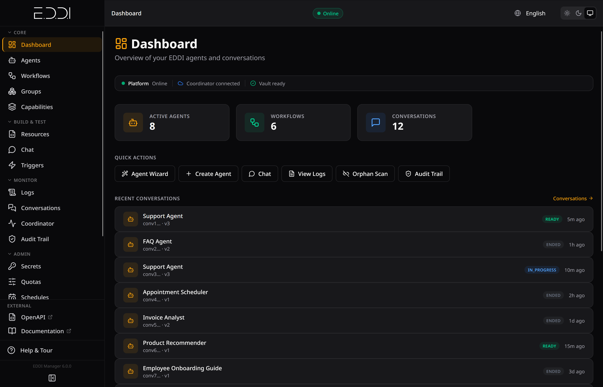
<p><em>Platform overview with active agents, workflows, quick actions, and recent conversations</em></p>
</td>
<td width="50%">
<p align="center"><strong>🤖 Agent Fleet</strong></p>
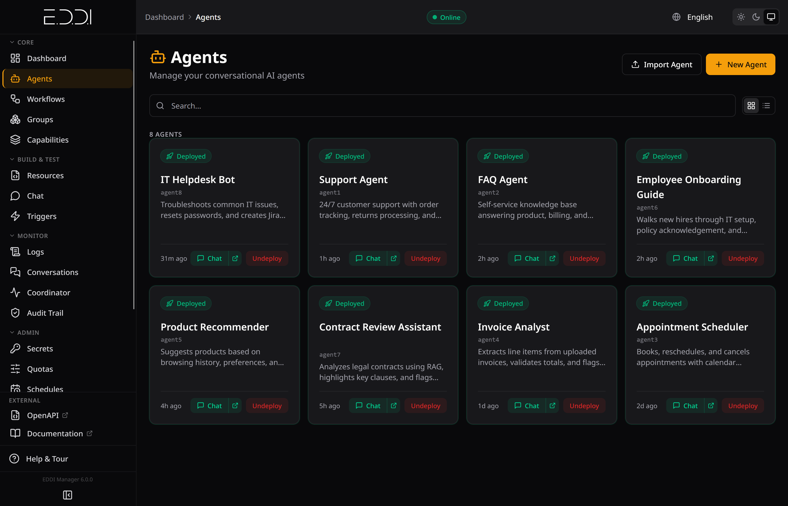
<p><em>All deployed agents at a glance with status, descriptions, and one-click chat</em></p>
</td>
</tr>
<tr>
<td width="50%">
<p align="center"><strong>💬 Live Conversation</strong></p>
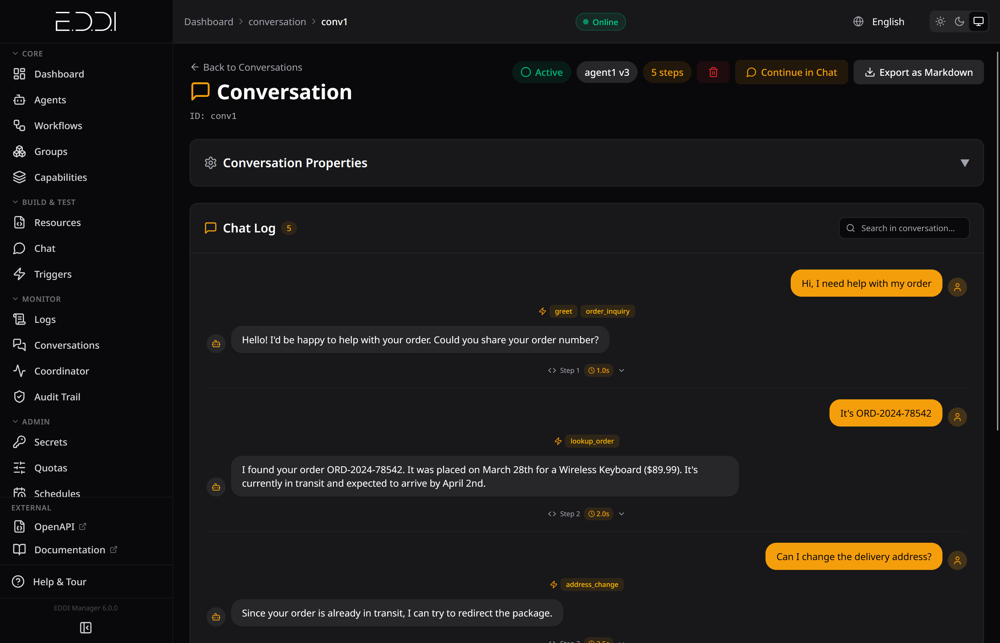
<p><em>Real-time conversation with visible actions, step timing, and tool calls</em></p>
</td>
<td width="50%">
<p align="center"><strong>🗣️ Multi-Agent Debate</strong></p>
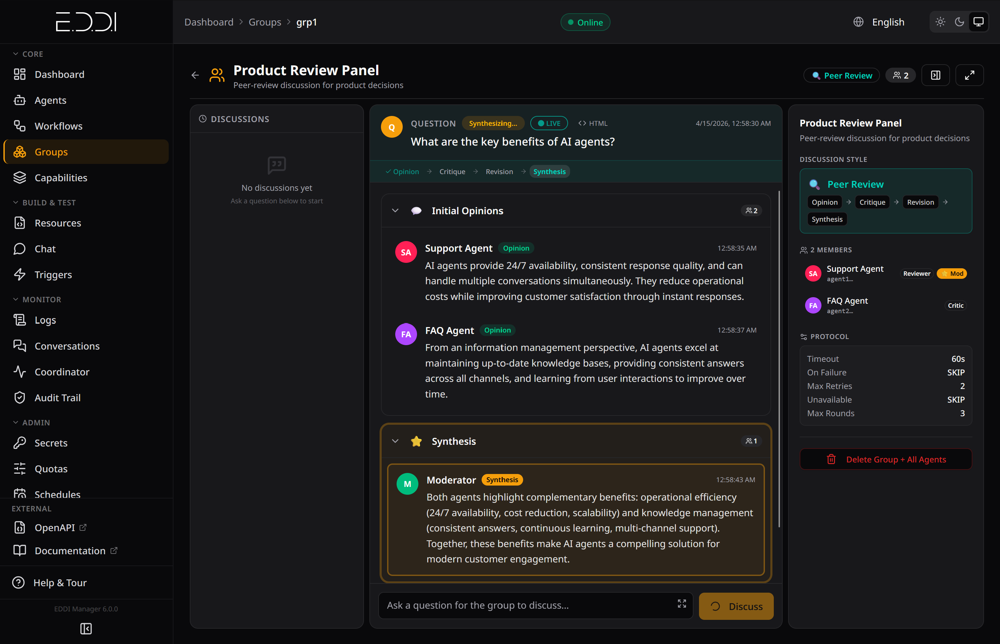
<p><em>Peer Review with phased discussion: Opinion → Critique → Revision → Synthesis</em></p>
</td>
</tr>
<tr>
<td width="50%">
<p align="center"><strong>🛡️ Secrets Vault</strong></p>
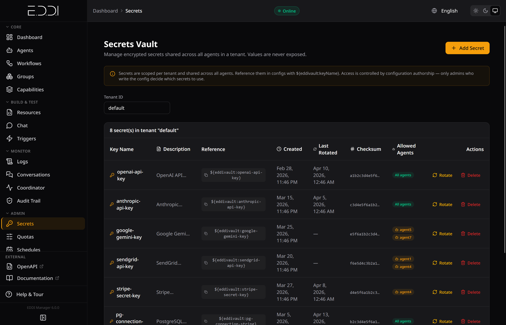
<p><em>Envelope-encrypted secrets with rotation tracking, checksums, and per-agent access control</em></p>
</td>
<td width="50%">
<p align="center"><strong>💰 Tenant Quotas</strong></p>
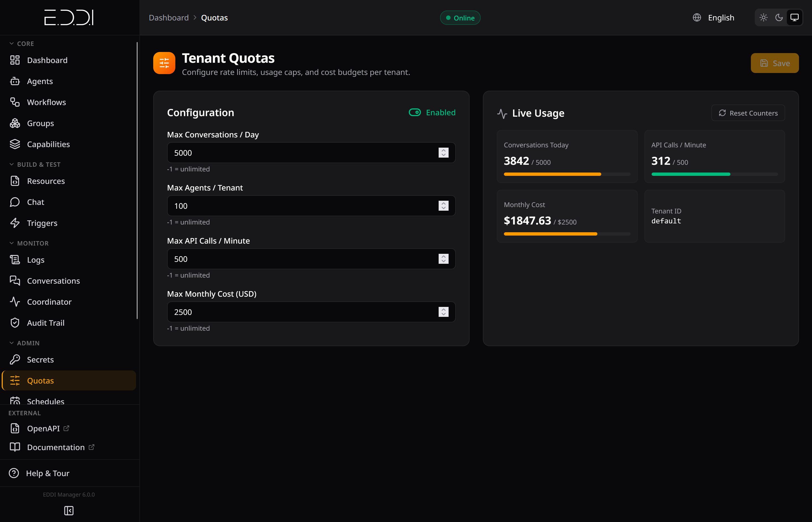
<p><em>Rate limits, cost budgets, and live usage monitoring per tenant</em></p>
</td>
</tr>
</table>

<details>
<summary><strong>More screenshots: LLM Config, Logs, User Memory, Schedules, Agent Detail</strong></summary>

<table>
<tr>
<td width="50%">
<p align="center"><strong>⚡ LLM Task Configuration</strong></p>
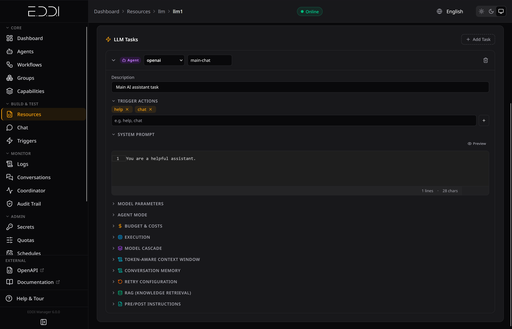
<p><em>System prompt, model parameters, cascading, RAG, context window, and budget settings</em></p>
</td>
<td width="50%">
<p align="center"><strong>📋 Real-Time Logs</strong></p>
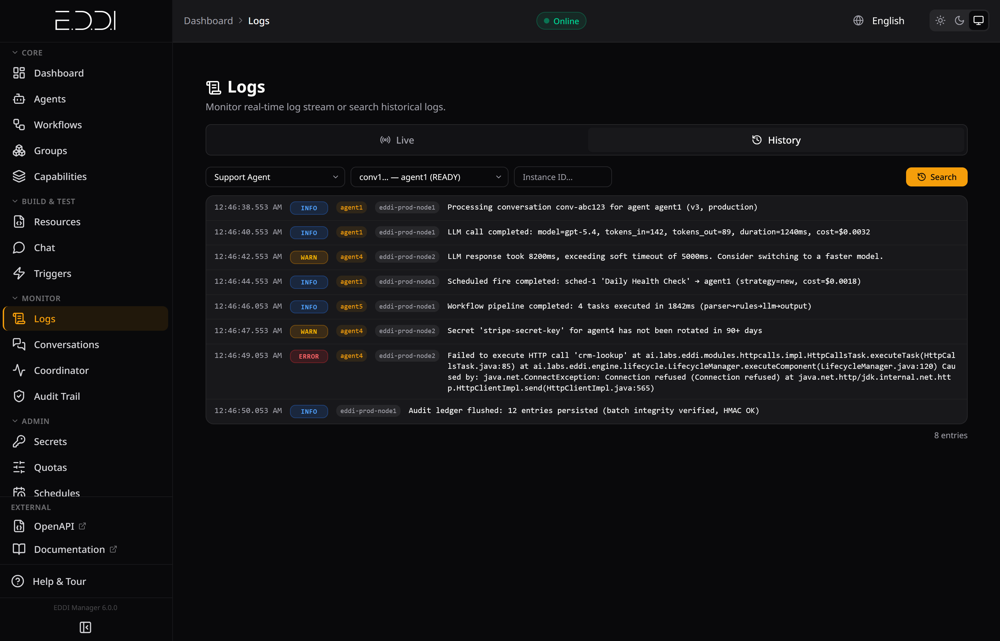
<p><em>Live log stream with per-call cost tracking, token counts, warnings, and errors</em></p>
</td>
</tr>
<tr>
<td width="50%">
<p align="center"><strong>🧠 Persistent User Memory</strong></p>
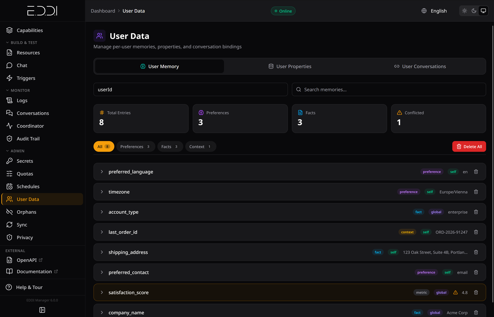
<p><em>Cross-session memory with categorized entries, visibility scoping, and conflict detection</em></p>
</td>
<td width="50%">
<p align="center"><strong>⏰ Scheduled Execution</strong></p>
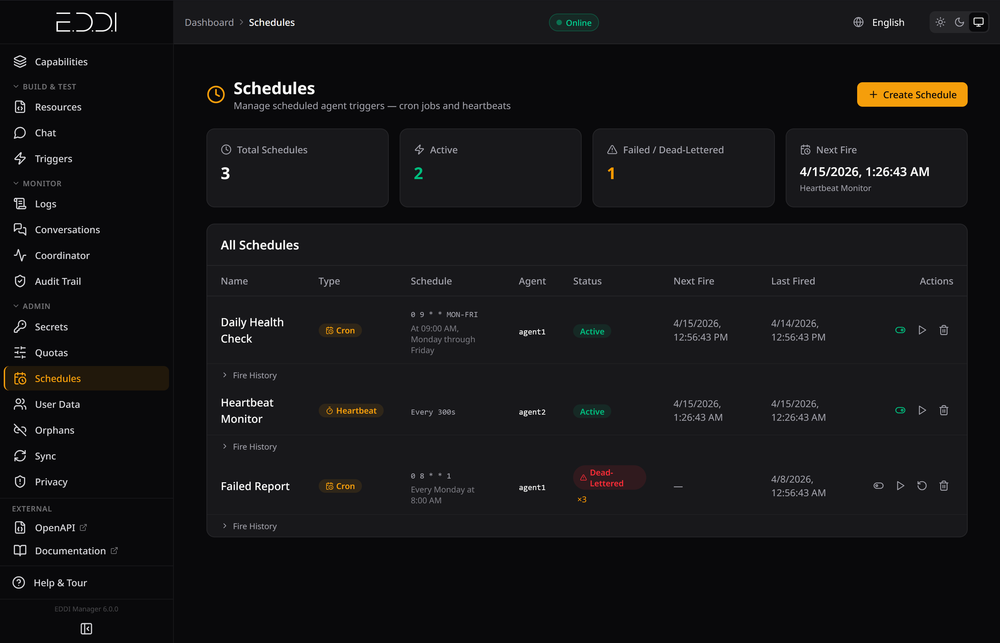
<p><em>Cron jobs and heartbeats with fire history, retry logic, and dead-letter tracking</em></p>
</td>
</tr>
<tr>
<td width="50%">
<p align="center"><strong>🔧 Agent Detail</strong></p>
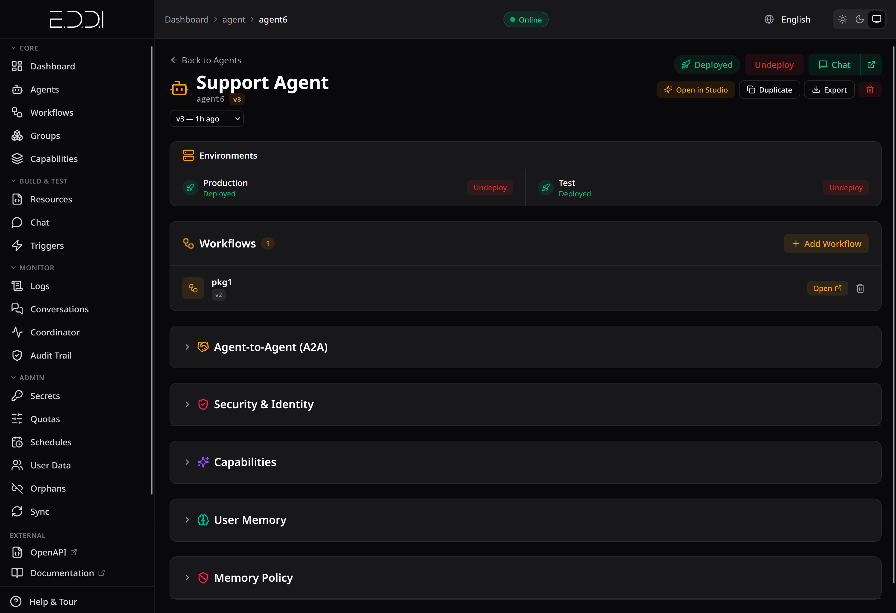
<p><em>Full agent config: environments, workflows, A2A, security, capabilities, and memory policy</em></p>
</td>
<td width="50%">
</td>
</tr>
</table>

</details>

---

## ✨ Features

### 🤖 Multi-Agent Orchestration

- 🔀 **Intelligent Routing** — Direct conversations to different agents based on context, rules, and intent
- 🗣️ **Group Conversations** — Multi-agent debates with 7 built-in discussion styles: Round Table, Peer Review, Devil's Advocate, Delphi, Debate, Task Force, and Negotiation
- 🔄 **Follow-up & Continue** — After a group discussion completes, follow up with any specific member agent or continue all phases with a new question — agents retain full context across rounds
- 💬 **Slack Integration** — Deploy agents to Slack channels and run multi-agent debates directly in threads
- 🪆 **Nested Groups** — Compose groups of groups for tournament brackets, red-team vs blue-team, and panel reviews
- 🤖 **Dynamic Agents** — Create, recruit, and delegate to new agents at runtime during group discussions with configurable guardrails
- 🗳️ **Group Voting** — `VOTE` phases collect explicit ballots (majority or approval, weighted, quorum-gated) and record a decision with the full tally, the raw ballots, and the losing side's dissents
- 📋 **Shared Artifacts** — A blackboard members co-edit through tools, with compare-and-set concurrency and declarative JSON-Schema, regex, or max-length validators — never an LLM merge
- 🧑‍🤝‍🧑 **Humans as Members** — A person can hold a seat in the group: their turn pauses the discussion until they answer, or the configured timeout policy resolves it
- 🎚️ **Facilitator** — An optional facilitator agent is briefed at checkpoints and picks one move from a config-enumerated list (end, extend, call a vote, recruit, escalate) — bounded adaptation, never free-form orchestration
- 🤝 **Negotiation** — Typed two-party bargaining: positions → proposals → a quoted concession ledger → signed acceptances, with arbitration skipped once agreement is reached
- 🎯 **Bid-Based Assignment** — Contract-Net-lite task auctions: eligible members bid blind in parallel, highest confidence wins, with deterministic tie-break and fallback to role assignment
- 🎓 **Team Memory** — A `RETRO` phase distils lessons into team-owned group memory, so they surface in every member's later discussions — institutional knowledge that compounds run over run
- 🏢 **Standing Teams** — A persistent workspace per group: a backlog that survives between discussions, cron cadences that pull from it, cross-run retry of unverified work, and running team metrics
- 📦 **Preset Group Templates** — Five packaged, validated group configs (research pod, editorial team, ops task force, decision board, negotiation table) — instantiate by assigning agents to named roles, not by hand-writing phases
- 📊 **Discussion Overview** — The Manager and the Workforce board render a running discussion as a phase rail, a members × phases matrix, and a roster of one-line member stances, updated live ([details](docs/group-conversations.md#member-stances-the-overview-dashboard))
- 👥 **Managed Conversations** — Intent-based auto-routing with one conversation per user per intent ([details](docs/managed-agents.md))
- 🎯 **Capability Matching** — Discover and route to agents by skill, confidence score, and custom attributes
- 🧙 **Platform Operator** — Meta-agent that reads and operates the deployment — including creating other agents — with every write behind a human approval gate ([how it works](docs/architecture.md#case-study-the-platform-operator))
- 🔁 **Agent Version Following** — Running conversations move to a newer agent version only when its author saved it as *compatible*; every other save is a breaking change, and the Manager previews what a deployment does to live conversations ([details](docs/deployment-management-of-agents.md#running-conversations-and-new-agent-versions))

### 🧠 LLM Provider Support (19 Providers)

| Category             | Providers                                                             |
| -------------------- | --------------------------------------------------------------------- |
| **Cloud APIs**       | OpenAI · Anthropic Claude · Google Gemini · Mistral AI                |
| **Enterprise Cloud** | Azure OpenAI · Amazon Bedrock · Oracle GenAI · Google Vertex AI       |
| **Self-Hosted**      | Ollama · Jlama · Hugging Face                                         |
| **OpenAI-compatible** | xAI Grok · DeepSeek · Moonshot Kimi · Alibaba Qwen · Z.ai GLM · MiniMax · OpenRouter · Groq |
| **Any endpoint**     | Anything else OpenAI-compatible (Cohere, gateways, etc.) via `baseUrl` |

- 🔀 **Multi-Model Cascading** — Start with cheap/fast models, escalate to powerful ones based on confidence ([details](#-smart-model-cascading))
- 📋 **JSON Response Mode** — `jsonResponseFormat` policy (`auto` | `on` | `off`) negotiates structured JSON output across all execution paths with provider-aware rules
- 🔧 **Tool Calling** — Native function/tool calling across all providers that support it
- 🗄️ **Tool Result Caching** — Per-tool cache scoping (`GLOBAL`, `USER`, `CONVERSATION`) to avoid redundant calls; fail-safe to `USER` on misconfiguration

### 🔗 Standards & Interoperability

EDDI implements open standards — not proprietary APIs:

| Standard                                                             | Role                            | What It Enables                                                                                          |
| -------------------------------------------------------------------- | ------------------------------- | -------------------------------------------------------------------------------------------------------- |
| **[MCP](https://modelcontextprotocol.io/)** (Model Context Protocol) | Server (80+ tools) + Client    | Control EDDI from Antigravity, Claude Desktop, Cursor, Windsurf, or any MCP client — [setup guide](docs/mcp-server.md#client-configuration). On an authenticated instance `/mcp` is an OAuth protected resource, so clients [sign themselves in](docs/mcp-server.md#the-client-signs-itself-in-preferred). Connect agents to external [MCP tool servers](docs/mcp-client.md) |
| **[A2A](https://google.github.io/A2A/)** (Agent-to-Agent Protocol)   | Full implementation             | Cross-platform agent communication, Agent Cards, and skill discovery                                     |
| **[OpenAPI](https://www.openapis.org/)** 3.1                         | Native generation + consumption | Auto-generated spec. Paste any OpenAPI spec → get a fully deployed API-calling agent                     |
| **OAuth 2.0 / OIDC**                                                 | Keycloak integration            | Authentication, authorization, and multi-tenant isolation. Outbound, [connections](docs/connections.md) give agents per-user OAuth grants to external systems |
| **OpenAI Chat Completions**                                          | Server (`/v1`, off by default)  | Deployed agents appear as OpenAI models to [Open WebUI](docs/open-webui-integration.md), the `openai` SDK, LangChain, LiteLLM, or any OpenAI-compatible client |
| **SSE** (Server-Sent Events)                                         | Streaming transport             | Token-by-token chat responses, including most tool-enabled turns, which stream over the provider's streaming transport instead of going silent until the tool loop finishes (a single-chunk fallback still applies to cascade agents, providers without a streaming builder, and a few other configurations) — plus a live `tool_call` event for "Using {tool}…" status, group discussion feeds, and live log streaming |

### 💭 Memory & Context Management

- 💾 **Persistent User Memory** — Agents remember facts, preferences, and context across conversations via structured key-value entries with visibility scoping (`self`, `group`, `global`)
- 🧠 **LLM Memory Tools** — Built-in tools agents can call to read, write, and search their own persistent memory; [guardrails](docs/user-memory.md#guardrails) keep the model to its own `self` memories unless the agent allows more
- 💤 **Dream Consolidation** — Background memory maintenance: stale entry pruning, contradiction detection, and fact summarization (inspired by [Anthropic's](https://www.anthropic.com/research) research on background memory consolidation)
- 🪟 **Token-Aware Windowing** — Intelligent context packing with model-specific tokenizer support and anchored opening steps
- 📝 **Rolling Summary** — Incremental LLM-powered summarization of older turns with a **Conversation Recall Tool** for drill-back into compressed history
- 🔧 **Property Extraction** — Config-driven slot-filling with `longTerm` / `conversation` / `step` scoping, plus `secret` for values that go straight into the vault — EDDI's importance extraction mechanism
- 🛡️ **Memory Policy (Commit Flags)** — Strict write discipline marks failed task output as uncommitted (hidden from LLM context) and injects concise error digests for graceful degradation
- 🧹 **Tool Context Ceiling** — `maxToolContextTokens` caps tool output within a single turn (default 60k tokens), evicting oldest tool exchanges to prevent provider context-window errors while preserving tool-call pairing
- 🔄 **Conversation State** — Full history with undo/redo support

### 📚 RAG (Retrieval-Augmented Generation)

- 📦 **8 Embedding Providers** — OpenAI, Azure OpenAI, Ollama, Mistral, Bedrock, Cohere, Google Gemini, Vertex AI — queries and documents are embedded asymmetrically where the model supports it
- 🗄️ **6 Vector Stores** — pgvector, Chroma, In-Memory, MongoDB Atlas, Elasticsearch, Qdrant
- 🕷️ **Web Crawler Sources** — A knowledge base can crawl a website itself: robots-aware, sitemap-driven, bounded by depth, page count and time budget, with deleted pages tombstoned on later runs ([details](docs/rag.md#ingestion-sources))
- 📄 **File Uploads** — Upload PDF, Word, Excel, PowerPoint, CSV, HTML, Markdown and text files to a knowledge base; the content, not the file name, decides the format
- ⏱️ **Scheduled Ingestion** — Each source runs on its own cron or on demand, with preview, purge and a run history of counters and errors — all editable in the Manager's knowledge-base editor
- 🌐 **httpCall RAG** — Zero-infrastructure RAG via any search API (BM25, Elasticsearch, custom)
- 📥 **REST Ingestion API** — Async document ingestion with status tracking and in-place replacement of an earlier version

### 🛠️ Built-In AI Agent Tools

| Tool                                           | Description                                                                   |
| ---------------------------------------------- | ----------------------------------------------------------------------------- |
| 🔍 **Web Search**                              | DuckDuckGo or Google Custom Search                                            |
| 🧮 **Calculator**                              | Sandboxed recursive-descent math parser (no `eval()`, no code injection)      |
| 🌐 **Web Scraper**                             | SSRF-protected, size-capped extraction of web pages as Markdown               |
| 📄 **PDF Reader**                              | SSRF-protected document extraction                                            |
| ☁️ **Weather** · 🕐 **DateTime**               | Real-time data tools                                                          |
| 📊 **Data Formatter** · 📝 **Text Summarizer** | Data transformation tools                                                     |
| 🔌 **HTTP Calls as Tools**                     | Expose your own REST APIs as LLM-callable tools with full security sandboxing |
| 🧠 **User Memory**                             | Read/write/search persistent user memory                                      |
| 🔙 **Conversation Recall**                     | Drill back into summarized conversation history                               |
| 📎 **Multimodal Attachments**                  | Image, PDF, audio, and video input with MIME-based routing                    |

### 📎 Multimodal Attachments

- 📤 **3 Input Paths** — URL reference, base64 inline, or file upload (`POST /conversations/{id}/attachments` with multipart/form-data)
- 🗄️ **DB-Agnostic Storage** — GridFS (MongoDB) or bytea (PostgreSQL) via `IAttachmentStore` SPI with grant-based access control and per-tenant quotas
- 📄 **Hybrid PDF Extraction** — PDFs are auto-extracted to text (shared `AttachmentTextExtractor`) and forwarded as inline context to any LLM, not just vision models
- 🔍 **readAttachment Tool** — Agents can recall attachments from earlier turns in multi-turn conversations
- 🧠 **Model Capability Gating** — `ModelCapabilityService` routes images to vision-capable LLMs and falls back to text metadata for others
- 🔀 **Content-Type Routing** — `contentTypeMatcher` behavior rule condition routes `image/*`, `application/pdf`, etc. to different workflows
- 👥 **Group Parity** — Attachments fan out with grant injection so group member agents can access the original user's files
- 🗑️ **GDPR Cleanup** — `deleteByConversation()` cascades to attachment storage when conversations are erased

### ⏰ Scheduled Execution & Heartbeats

- 🫀 **Heartbeat Triggers** — Periodic agent wake-ups at configurable intervals for proactive behavior (inspired by [OpenClaw's](https://openclaw.ai) heartbeat architecture)
- ⏲️ **Cron Scheduling** — Standard cron expressions for timed agent execution
- 🔄 **Conversation Strategies** — `persistent` (reuse same conversation across fires) or `new` (fresh context each time)
- 📊 **Fire Logging** — Complete execution history with status, duration, cost tracking, and retry logic
- 🌙 **Dream Cycles** — Scheduled background memory consolidation with cost ceilings per run

### 📈 Smart Model Cascading

- 📉 **Cost Optimization** — Try cheap/fast models first, escalate to powerful models only when confidence is low
- 📊 **4 Confidence Strategies** — Structured output, heuristic, judge model, or none
- 💰 **Per-Conversation Budgets** — Automatic cost tracking with budget caps and eviction
- 🏢 **Tenant Cost Ceilings** — Monthly cost budgets per tenant with automatic enforcement
- 🔢 **Tenant Agent Quotas** — `maxAgentsPerTenant` enforcement on agent deployment

### ✋ Human-in-the-Loop Governance

- 🚦 **Turn-Level Approval** — `PAUSE_CONVERSATION` action halts the entire pipeline; new user input returns `409 Conflict` until a human resumes
- 🔧 **Per-Tool-Call Gating** — Individual tool invocations can require human approval before execution, with glob-pattern allow/exempt lists across built-in, HTTP, MCP, A2A, dynamic, memory, and recall tools
- 👥 **Group Phase Approval** — Multi-agent discussion phases can require human sign-off at `PHASE` or `TASK` granularity
- 🧑‍🤝‍🧑 **Humans in the Room** — Beyond approving, a human can be a full group member with their own speaking turn; a facilitator can also pause a discussion to put a question to a named principal
- ⏱️ **Timeout Policies** — `WAIT_INDEFINITELY`, `AUTO_APPROVE`, `AUTO_REJECT`, or `ABORT` when humans don't respond in time
- 🔁 **No-Progress Guard** — Detects infinite approval loops (identical pause fingerprints after automated decisions) and breaks the cycle
- 💬 **Slack Approvals** — Interactive Block Kit cards with redacted argument previews and approver whitelists
- 🔌 **MCP Approvals** — External clients can list pending approvals and approve/reject via MCP tools
- 🖥️ **Manager Approvals** — One page lists pending conversation and group-phase approvals and resolves them
- 🔄 **Crash Recovery** — Pending approvals survive server restarts; timeout timers are re-armed automatically

### 🔐 Enterprise Security & Compliance

<details open>
<summary><strong>Security Architecture</strong></summary>

- 🏦 **Secrets Vault** — Envelope encryption (PBKDF2 + AES-256-GCM) with tenant-scoped DEK/KEK rotation. Never plaintext in DB. Each secret names the agents allowed to use it, checked at deploy time, and that grant can be edited without re-entering the value ([details](docs/secrets-vault.md#agent-grants-allowedagents))
- 🔗 **Connections** — One credential model for every outbound call: `${connection:name}` resolves per request to an org-wide key or the end user's own OAuth grant ([details](docs/connections.md))
- 🪪 **Caller Identity** — An HTTP call can act as the signed-in user with `${caller:token}`, released only to the caller's own origin or to EDDI itself and never persisted ([details](docs/httpcalls.md#calling-as-the-signed-in-user))
- 🤫 **Secret Context Values** — A client can pass a credential as context with `"secret": true`: usable for one turn, never stored or returned ([details](docs/passing-context-information.md#secret-context-values))
- 🛡️ **SSRF Protection** — All tools validate URLs against private IPs, internal hostnames, and non-HTTP schemes before any request; credentialed requests don't follow redirects, and downloads are size-capped
- 🔒 **Sandboxed Evaluation** — Recursive-descent math parser only. No `eval()`, no script engines, no reflection-based execution
- 🔑 **OAuth 2.0 / Keycloak** — Multi-tenant authentication, authorization, and role-based access control; the token audience is enforced and a token that names no user is refused
- 🗂️ **Workspaces & Sharing** — Opt-in per-user and per-team spaces for agents and their configuration, with explicit `USE` / `VIEW` / `EDIT` / `OWN` shares ([details](docs/workspaces.md))
- 🧾 **Restricted Templates** — Runtime templates run in a locked-down Qute engine (allow-listed namespaces and sections, bounded output), and fetched data is never rendered as a template ([details](docs/security.md#runtime-template-engine))
- ✍️ **Agent Signing** — Ed25519 cryptographic identity per agent; audit entries signed with agent private keys
- 🚫 **No Dynamic Code Execution** — Custom logic runs in external MCP servers, outside the EDDI security perimeter

</details>

<details open>
<summary><strong>Regulatory Compliance</strong></summary>

| Regulation                                             | EDDI Support                                                                                                                                   |
| ------------------------------------------------------ | ---------------------------------------------------------------------------------------------------------------------------------------------- |
| **[EU AI Act](https://artificialintelligenceact.eu/)** | Immutable HMAC-SHA256 audit ledger, decision traceability, risk classification guidance                                                        |
| **[GDPR](https://gdpr.eu/)**                           | Cascading data erasure (Art. 17), data portability (Art. 15/20), restriction of processing (Art. 18), per-category retention, pseudonymization |
| **[CCPA](https://oag.ca.gov/privacy/ccpa)**            | Right to delete, right to know, data portability                                                                                               |
| **[HIPAA](https://www.hhs.gov/hipaa/)**                | Deployment guide, BAA template, LLM provider BAA matrix, session timeout guidance                                                              |
| **International**                                      | PIPEDA 🇨🇦 · LGPD 🇧🇷 · APPI 🇯🇵 · POPIA 🇿🇦 · PDPA 🇸🇬🇹🇭🇲🇾 · PIPL 🇨🇳 compatibility documented                                                      |

- 📜 **Audit Ledger** — Every agent decision recorded in a write-once, HMAC-secured, append-only ledger
- 🔍 **Compliance Startup Checks** — Advisory warnings on boot for TLS and database encryption gaps
- 🗑️ **GDPR Orchestration** — One-call cascading erasure across every store that holds a user's data (memories, conversations, attachments, group transcripts, schedules, OAuth grants, …) plus audit trail pseudonymization, reporting any step that did not complete
- 📤 **Data Portability** — Complete user data export (memories, conversations, audit entries) via REST and MCP

</details>

### ⚙️ Configuration-Driven Architecture

- 📄 **JSON Configs, Not Code** — Agent behavior defined in versioned, diffable JSON documents
- 🔧 **Lifecycle Pipeline** — Pluggable task pipeline: Input → Parse → Rules → API/LLM → Output
- 📦 **Composable Agents** — Agents assembled from reusable, version-controlled workflows and extensions
- 🧪 **Behavior Rules** — IF-THEN logic engine for routing, orchestration, and business logic
- 📤 **Import / Export** — Agents portable as ZIP files with automatic secret scrubbing on export
- 🔄 **Agent Sync** — Live instance-to-instance sync with structural matching, content diffing, and selective resource picking — no ZIP intermediary needed
- 📝 **Prompt Snippets** — Reusable, versioned system prompt building blocks available as `{snippets.safety_rules}`
- 🌐 **Global Variables** — Deployment-wide values such as a default model, referenced as `{vars.default-model}` in any config ([details](docs/global-variables.md))
- 📎 **Content Type Routing** — MIME-based behavior rule conditions for multimodal attachment routing

### 🚀 Cloud-Native & Observable

- 🐳 **One-Command Install** — Interactive wizard sets up EDDI + database via Docker
- ☸️ **Kubernetes / OpenShift** — Kustomize overlays, Helm charts, PDB, NetworkPolicy (no HPA: EDDI is single-writer per conversation, so both delivery paths pin one replica)
- 📊 **Prometheus & Grafana** — 50+ Micrometer metrics at `/q/metrics` (tools, vault, memory, scheduling, conversations). Pre-built [Grafana dashboard](docs/monitoring/eddi-grafana-dashboard.json) included
- 🔭 **OpenTelemetry Tracing** — Per-task distributed traces via OTLP (Jaeger, Tempo, Datadog). Every pipeline task emits a span named `eddi.pipeline.task` carrying `eddi.task.id`, `eddi.task.type`, `eddi.task.index`, `eddi.conversation.id` and `eddi.agent.id`. The equivalent *metric* tags are un-prefixed (`task.id`, `task.type`)
- 🤖 **LLM Telemetry** — Every model call, on every provider, streaming or not, is timed and counted (`eddi.llm.request.duration`, `eddi.llm.tokens`, `eddi.llm.request.errors`) and traced as a `gen_ai.client.inference` span
- 🩺 **Health Checks** — Liveness & readiness probes at `/q/health/live` and `/q/health/ready`
- 🔄 **NATS JetStream** — Async event bus for distributed processing
- 🛟 **Error Handling & Recovery** — Automatic retry with exponential backoff, MCP circuit breakers (open after 3 failures within 60 s), LLM response validation (`onEmpty` / `onTruncation` / `onRefusal`), streaming timeout retry, and admin endpoint to reset stuck conversations
- ⚡ **Virtual Threads** — Java 25 virtual threads for true OS-level concurrency (no Python GIL or Node.js event loop bottleneck)
- 🗃️ **DB-Agnostic** — Choose MongoDB or PostgreSQL; switch with one env var. Single Docker image for both
- 🏗️ **Red Hat Certified** — Container certification with automated preflight checks in CI/CD

> **📖 Monitoring Guide:** See [docs/monitoring/monitoring-guide.md](docs/monitoring/monitoring-guide.md) for architecture overview, metrics reference, alerting rules, and a production checklist.

### 🖥️ Manager Dashboard & Chat UI

Both UIs live in this repository (`ui/manager`, `ui/chat`) and are built into the EDDI jar and Docker image — nothing to deploy separately.

- 🎨 **React 19 Manager** (`/manage`) — Admin dashboard for agent building, testing, deployment, and monitoring, with the Platform Operator, an agent wizard, and editors for every resource type, including knowledge-base ingestion sources
- 👥 **Workforce** (`/workforce`) — A workspace for group conversations: boards, member threads, a live discussion overview, and history
- 💬 **Chat UI** (`/chat`) — Standalone React chat with SSE streaming and Keycloak auth
- ✋ **Approvals, Connections & Sharing** — Pages for pending HITL approvals, connections and linked accounts, and sharing resources between users and teams
- 🔍 **Audit Trail Viewer** — Timeline-based compliance and debugging UI
- 📋 **Logs Panel** — Live SSE log streaming + searchable history
- 🔑 **Secrets Manager** — Write-only vault UI with copy-reference support
- 🌍 **11 Languages** — English, German, Spanish, French, Portuguese, Chinese, Japanese, Korean, Arabic (RTL), Hindi, Thai

---

## 📖 Documentation

| Guide                                                        | Description                                        |
| ------------------------------------------------------------ | -------------------------------------------------- |
| **[Getting Started](docs/getting-started.md)**               | Setup and first steps                              |
| **[Developer Quickstart](docs/developer-quickstart.md)**     | Build your first agent in 5 minutes                |
| **[Manager Dashboard](docs/agent-manager-gui.md)**           | The built-in admin UI and the Workforce workspace  |
| **[Architecture](docs/architecture.md)**                     | Deep dive into EDDI's design and pipeline          |
| **[LLM Configuration](docs/langchain.md)**                   | Connecting to 19 LLM providers                     |
| **[Behavior Rules](docs/behavior-rules.md)**                 | Configuring agent routing logic                    |
| **[Agent Config Authoring](docs/agent-config-authoring.md)** | Rules and pitfalls for writing agent JSON          |
| **[HTTP Calls](docs/httpcalls.md)**                          | External API integration                           |
| **[RAG](docs/rag.md)**                                       | Knowledge bases, crawled and uploaded sources, retrieval |
| **[MCP Server](docs/mcp-server.md)**                         | 80+ tools for AI-assisted agent management         |
| **[MCP Client](docs/mcp-client.md)**                         | Connecting agents to external MCP servers          |
| **[A2A Protocol](docs/a2a-protocol.md)**                     | Agent-to-Agent peer communication                  |
| **[OpenAI-Compatible API](docs/open-webui-integration.md)**  | Agents as OpenAI models for Open WebUI & SDKs      |
| **[Slack Integration](docs/slack-integration.md)**           | Deploy agents to Slack and run group discussions   |
| **[Connections](docs/connections.md)**                       | One credential model, including per-user OAuth     |
| **[Group Conversations](docs/group-conversations.md)**       | Debate, voting, artifacts, standing teams          |
| **[User Memory](docs/user-memory.md)**                       | Cross-conversation fact retention                  |
| **[Memory Policy](docs/memory-policy.md)**                   | Commit flags and strict write discipline            |
| **[Model Cascading](docs/model-cascade.md)**                 | Cost-optimized multi-model routing                 |
| **[Human-in-the-Loop](docs/hitl.md)**                        | Approval gates, timeout policies, Slack & MCP surfaces |
| **[Managed Agents](docs/managed-agents.md)**                 | Intent-based routing, one conversation per user    |
| **[Scheduling & Heartbeats](docs/scheduling.md)**            | Cron schedules, heartbeats, dream consolidation    |
| **[Deployment Management](docs/deployment-management-of-agents.md)** | Deploying, undeploying, and agent version following |
| **[Agent Sync](docs/agent-sync-guide.md)**                   | Live instance-to-instance sync and upgrade imports |
| **[Import / Export](docs/import-export-an-agent.md)**        | ZIP-based agent portability and merge              |
| **[Prompt Snippets](docs/prompt-snippets-guide.md)**         | Reusable system prompt building blocks             |
| **[Attachments](docs/attachments-guide.md)**                 | Multimodal attachment pipeline                     |
| **[Capability Matching](docs/capability-match-guide.md)**    | A2A skill discovery and routing                    |
| **[Security](docs/security.md)**                             | SSRF protection, sandboxing, and hardening         |
| **[Workspaces](docs/workspaces.md)**                         | Per-user and per-team isolation, and sharing       |
| **[Secrets Vault](docs/secrets-vault.md)**                   | Envelope encryption and auto-vaulting              |
| **[Global Variables](docs/global-variables.md)**             | Deployment-wide values for every config            |
| **[Audit Ledger](docs/audit-ledger.md)**                     | EU AI Act-compliant audit trail                    |
| **[Tenant Quotas](docs/tenant-quotas.md)**                   | Per-tenant usage limits, editable at runtime       |
| **[Kubernetes](docs/kubernetes.md)**                         | Deploy with Kustomize or Helm                      |
| **[Configuration Reference](docs/configuration-reference.md)** | Every `eddi.*` property, its default and env var |
| **[Upgrading from 5.x](docs/upgrading-from-5x.md)**          | First boot of an EDDI 5 database on 6.x            |
| **[Upgrading from 6.4](docs/upgrading-from-6.4.md)**         | What an existing 6.4 deployment must change for 6.5 |
| **[Monitoring & Tracing](docs/monitoring/monitoring-guide.md)** | Prometheus, Grafana, OpenTelemetry, alerting     |
| **[Red Hat & OpenShift](docs/redhat-openshift.md)**          | RHEL support, certified container, automated release |
| **[Full Documentation](https://docs.labs.ai/)**              | Complete documentation site                        |

---

## 📋 Compliance & Privacy

EDDI provides built-in infrastructure for regulatory compliance:

| Guide                                                    | Covers                                                                                                |
| -------------------------------------------------------- | ----------------------------------------------------------------------------------------------------- |
| **[GDPR / CCPA](docs/gdpr-compliance.md)**               | Data erasure, export, Art. 18 restriction of processing, per-category retention, and consent guidance |
| **[HIPAA](docs/hipaa-compliance.md)**                    | Healthcare deployment guide — encryption, BAAs, LLM provider matrix, session management               |
| **[EU AI Act](docs/eu-ai-act-compliance.md)**            | AI risk classification, decision traceability, immutable audit ledger                                 |
| **[Privacy & Data Processing](PRIVACY.md)**              | Data flows, LLM provider matrix, international regulations (PIPEDA, LGPD, APPI, POPIA, PDPA, PIPL)    |
| **[Compliance Data Flow](docs/compliance-data-flow.md)** | Single-page data flow diagram for auditors                                                            |
| **[Incident Response](docs/incident-response.md)**       | Breach response runbook (GDPR 72h, CCPA 45 days, HIPAA 60 days)                                       |

---

## 🏗️ Development

### Prerequisites

| Tool           | Version | Notes                                                             |
| -------------- | ------- | ----------------------------------------------------------------- |
| **Java (JDK)** | 25      | [Eclipse Temurin](https://adoptium.net/) recommended              |
| **Maven**      | 3.9+    | Bundled via `mvnw` / `mvnw.cmd` wrapper — no install needed       |
| **MongoDB**    | 6.0+    | Local instance or Docker (`docker run -d -p 27017:27017 mongo:7`) |
| **Docker**     | Latest  | For integration tests and container builds                        |
| **Node.js**    | —       | Not required: Maven downloads Node 24 into `ui/node/` to build the Manager and Chat UIs. Install it only to run `npm run dev` in `ui/manager` or `ui/chat` |
| **mise**       | Optional | [`mise.toml`](mise.toml) pins the exact JDK, Maven and Node versions and offers the common commands as tasks (`mise run dev`, `mise run test`) |

> **Windows users:** Replace `./mvnw` with `.\mvnw.cmd` in all commands below.

### Quarkus Dev Mode

Dev mode starts the application with **live reload** — code changes are picked up automatically without restarting:

```bash
# Linux / macOS
./mvnw compile quarkus:dev '-Djvm.args=--add-modules=jdk.incubator.vector'

# Windows (PowerShell)
.\mvnw.cmd compile quarkus:dev '-Djvm.args=--add-modules=jdk.incubator.vector'
```

`-Djvm.args` hands the forked dev JVM the same `--add-modules=jdk.incubator.vector` flag the container image sets. Only `jlama` (in-process) agents need it — without it Jlama silently falls back to scalar tensor operations and answers far too slowly — so you may drop it if you never run one. `mise run dev` passes it for you.

Then open [http://localhost:7070](http://localhost:7070). The Quarkus Dev UI is available at [http://localhost:7070/q/dev](http://localhost:7070/q/dev).

> **💡 The Manager and Chat UI build with Maven, at packaging time.** Their sources live in `ui/manager` and `ui/chat`. `./mvnw package` (and `verify`, `install`) builds them into the jar, about two minutes; `compile`, `test` and dev mode never touch npm, so dev mode serves `/manage` only after a `package`. For frontend work run `npm run dev` in `ui/manager` (port 3000, proxying to the backend on 7070). Upgrading an older checkout? Run `./mvnw clean` once.

Dev mode also enables:

- **Continuous testing** — press `r` in the terminal to re-run tests on changes
- **Dev UI** — browse endpoints, CDI beans, configuration, and health checks
- **Live reload** — Java and resource changes apply instantly

> **💡 Secrets Vault:** To use the secrets vault (storing API keys encrypted), set the master key before starting:
>
> ```bash
> # Linux/macOS
> export EDDI_VAULT_MASTER_KEY=my-dev-passphrase
>
> # Windows (PowerShell)
> $env:EDDI_VAULT_MASTER_KEY = "my-dev-passphrase"
>
> # Or in a .env file (already in .gitignore)
> echo "EDDI_VAULT_MASTER_KEY=my-dev-passphrase" > .env
> ```
>
> Without this, the vault is disabled and secret management returns HTTP 503. Any passphrase works for local development. See [Secrets Vault](docs/secrets-vault.md) for production setup.

### Maven Command Reference

| Command                                                       | What It Does                                                                |
| ------------------------------------------------------------- | --------------------------------------------------------------------------- |
| `./mvnw compile quarkus:dev '-Djvm.args=--add-modules=jdk.incubator.vector'` | **Start dev mode** with live reload (port 7070). The flag is for `jlama` agents — see above |
| `./mvnw compile`                                              | Compile sources only (fast feedback). Also runs the two `validate`-phase style gates, so it **fails** on an unused import (Checkstyle) or an unformatted file (`formatter:validate`) — neither edits your sources; run `./mvnw formatter:format` to fix formatting |
| `./mvnw clean compile`                                        | Clean build — delete `target/` and recompile from scratch                   |
| `./mvnw test`                                                 | Run **unit tests** (excludes `*IT.java` integration tests)                  |
| `./mvnw package -DskipTests -DskipUi=true` | Build the jar **without** the Manager and Chat UIs (`compile` and `test` never build them) |
| `./mvnw verify`                                               | Compile + unit tests + package. **Integration tests are skipped** — `skipITs` defaults to `true` in `pom.xml` |
| `./mvnw verify -DskipITs=false`                               | **Full build** — adds the `*IT.java` integration tests (requires Docker). This is what CI runs |
| `./mvnw validate`                                             | Run the **blocking style gates** — Checkstyle (`UnusedImports`/`RedundantImport` fail the build; `FileLength`/`LineLength` stay advisory) and `formatter:validate`, which reports unformatted files without touching them |
| `./mvnw formatter:format`                                     | **Auto-format** Java sources using the project Eclipse formatter — the fix for a `formatter:validate` failure |
| `./mvnw package -DskipTests`                                  | Build the JAR without running tests (for `install.sh --local`)              |
| `./mvnw clean package '-Dquarkus.container-image.build=true'` | Build the app **+ Docker image**                                            |
| `./mvnw package -Plicense-gen -DskipTests`                    | Generate **third-party licenses** (Red Hat certification)                   |
| `./mvnw quarkus:dev -Dsuspend '-Djvm.args=--add-modules=jdk.incubator.vector'` | Start dev mode and **wait for debugger** on port 5005 |
| `./mvnw quarkus:dev -Ddebug=false '-Djvm.args=--add-modules=jdk.incubator.vector'` | Start dev mode **without** the debug agent |

<details>
<summary><strong>Code coverage</strong></summary>

JaCoCo is configured to run automatically during `./mvnw test`. After tests complete, find the coverage report at:

```
target/site/jacoco/index.html
```

</details>

<details>
<summary><strong>Useful system properties</strong></summary>

| Property                                    | Default                     | Description                                    |
| ------------------------------------------- | --------------------------- | ---------------------------------------------- |
| `-Dquarkus.http.port=<port>`                | `7070`                      | Override the HTTP port                         |
| `-Dmongodb.connectionString=<uri>`          | dev: `mongodb://localhost:27017/eddi`  | MongoDB connection, read by `PersistenceModule`. `quarkus.mongodb.connection-string` is a different key that only the health check reads |
| `-Dmongodb.database=<name>`                 | `eddi`                      | MongoDB database name                          |
| `-Dquarkus.profile=<profile>`               | `dev`                       | Active Quarkus profile (`dev`, `test`, `prod`) |
| `-DskipTests`                               | `false`                     | Skip all tests                                 |
| `-DskipITs`                                 | `true`                      | Skip integration tests only                    |
| `-DskipUi` | `false` | Skip the npm build of `ui/manager` and `ui/chat` (the jar then serves no UI) |

</details>

### Build & Docker

```bash
# Build app + Docker image
./mvnw clean package '-Dquarkus.container-image.build=true'

# Build without container (for install.sh --local)
./mvnw package -DskipTests

# Generate third-party licenses (Red Hat certification)
./mvnw package -Plicense-gen -DskipTests
```

### ☸️ Kubernetes

No shipped manifest creates the `eddi-secrets` Secret that holds the vault master
key — a Secret in the manifests would be reconciled on every `kubectl apply` and
overwrite a live key, making everything already encrypted with it undecryptable.
So the Secret is created out-of-band, **before** the first apply. Without it the
EDDI pod sits in `ContainerCreating` (`MountVolume.SetUp failed: secret
"eddi-secrets" not found`) and never starts.

```bash
# Kustomize overlays — create the vault Secret first, then apply
bash k8s/create-secrets.sh                 # PowerShell 7: pwsh -File .\k8s\create-secrets.ps1
# ...plus the database credentials, which are no longer shipped: mongodb-secrets
# (MongoDB runs authenticated) or postgres-secrets — commands in the Kubernetes Guide
kubectl apply -k k8s/overlays/mongodb/     # MongoDB backend
kubectl apply -k k8s/overlays/postgres/    # PostgreSQL backend

# Quickstart (one-file manifest; same Secret step, see the Kubernetes Guide)
kubectl apply -f https://raw.githubusercontent.com/labsai/EDDI/main/k8s/quickstart.yaml

# Helm (renders the Secret itself, so the key is a required value). Local,
# port-forward shape without OIDC: the two opt-ins are required, see the guide.
helm install eddi ./helm/eddi \
  --set eddi.vaultMasterKey="$(openssl rand -base64 24)" \
  --set mongodb.rootPassword="$(openssl rand -base64 24)" \
  --set eddi.security.allowUnauthenticatedMcp=true \
  --set eddi.security.allowUnauthenticatedSecretStore=true \
  --namespace eddi --create-namespace
```

Includes overlays for auth (Keycloak), monitoring (Prometheus/Grafana), NATS messaging, Ingress, and production hardening (PDB, NetworkPolicy — deliberately no HPA).
See the [Kubernetes Guide](docs/kubernetes.md) for details, including the Keycloak upgrade note for existing installs.

---

## 🤝 Contributing

We welcome contributions! Please read our [Contributing Guide](CONTRIBUTING.md) for details on setting up your development environment, code style, commit conventions, and the pull request process.

Every PR is automatically checked by CI (build + tests), CodeQL (security), dependency review, and AI-powered code review.

## 🔒 Security

EDDI ships with security-by-default for production deployments:

- **Authentication enforced** — `AuthStartupGuard` fails startup if OIDC is disabled in production without explicit opt-out; tokens must carry the `eddi-backend` audience and name a user
- **Secrets encrypted at rest** — Envelope encryption (PBKDF2 → AES-256-GCM) with per-deployment salt. Never plaintext in DB. A weak vault master key stops a production boot
- **Credentials only where configured** — A `${vault:…}`, `${connection:…}` or `${caller:…}` reference resolves only where the configuration wrote it, not when it arrives through conversation data (a value EDDI auto-vaulted itself is the one exception)
- **SSRF protection** — All LLM tool HTTP calls go through `SafeHttpClient` with private IP blocking, redirect validation, and scheme enforcement
- **Security headers** — `X-Content-Type-Options`, `X-Frame-Options`, `Content-Security-Policy` configured out of the box
- **Loopback by default** — The Docker Compose files publish EDDI, Keycloak and the datastores on `127.0.0.1`, and the Helm chart and Kustomize overlays ship no default credentials
- **CI/CD security gates** — Every push/PR is scanned by:
  - **CodeQL** — Semantic SAST analysis with `security-extended` queries
  - **Trivy** — CVE scanning for both filesystem dependencies and Docker images (blocking on CRITICAL/HIGH)
  - **Gitleaks** — Git history scanning to prevent secret/credential leakage
  - **CycloneDX** — SBOM generation for supply chain transparency
  - **Jazzer** — Coverage-guided fuzz testing for security-critical parsers (PathNavigator, MatchingUtilities)
  - All actions SHA-pinned to prevent supply-chain attacks

For vulnerability reports, see our [Security Policy](SECURITY.md). For architecture details, see [Security Architecture](docs/security.md).

## 📜 Code of Conduct

This project follows the [Contributor Covenant Code of Conduct](CODE_OF_CONDUCT.md).
