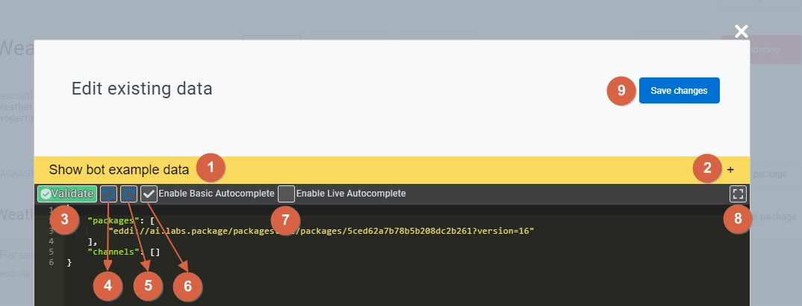
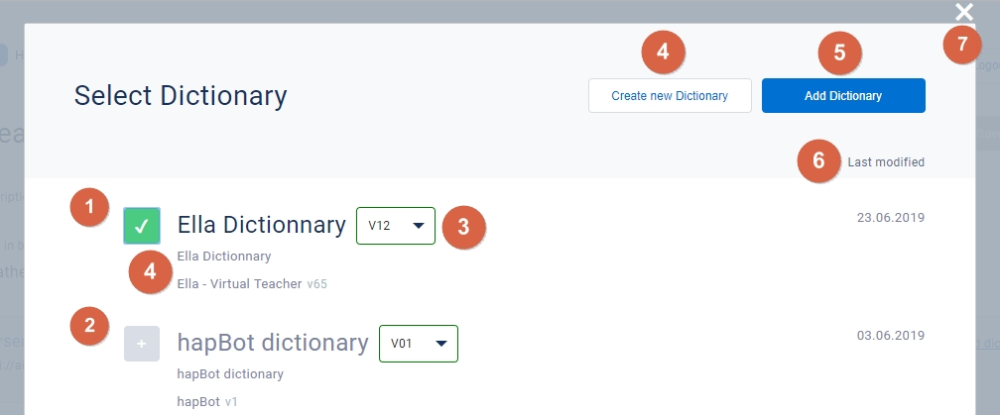

# Agent Manager GUI

## Agent Manager (GUI)

> Documentation in progress

The agent manager is a friendly Graphical user interface that help **EDDI**'s agent developers to deploy, chat, edit agents packages and also update an agent if an updated package is available!

## Access to the agent manager:

You can access to agent manager via:

> [http://localhost:7070/manage?apiUrl=http%3A%2F%2Flocalhost%3A7070](http://localhost:7070/manage?apiUrl=http%3A%2F%2Flocalhost%3A7070)

## Main page

.jpg>)

1. Allows you to log out from the agent manager and redirects you to login page.
2. This is the **agents view** where you can see the list of all agents both deployed and non deployed agents.
3. You can use the text box next t o this label to enter your search criteria such as an agent name .
4. This is the list of all agents in this image example for brevity we showed only one agent, but most likely you will find a lot of agents (deployed and non deployed).
5. Name of the agent.
6. Version of that agent that it is deployed.
7. Last modification date of the entire agent resources.
8. Opens the chat with the agent by using the chat screen, more details later
9. Undeploy this agent from this **EDDI** instance.
10. Workflows used in this agent
11. **Workflows view**: coming soon.

## Agent overview

 (1).jpg>)

1. The login allow connection with social Media such as **GitHub** or **Google**
2. Use login and password as credentials for registered users, basically you will have to go through the registration form which is pretty straightforward.

## Agent Overview

## Edit agent description modal

## Edit JSON

## Agent's packages edit view

.jpg>)

## Agent packages updates

.jpg>)

## Dictionary selection from package editing view

