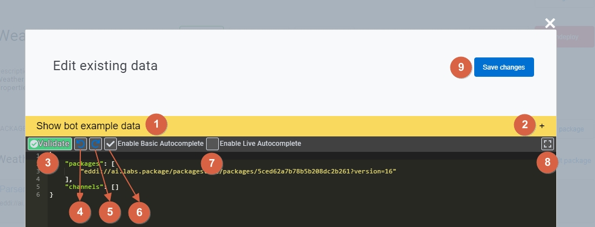

# Bot Manager GUI

## Bot Manager (GUI)

> Documentation in progress

The bot manager is a friendly Graphical user interface that help **EDDI**'s bot developers to deploy, chat, edit bots packages and also update a bot if an updated package is available!

## Access to the bot manager:

You can access to bot manager via:

> [http://localhost:7070/manage?apiUrl=http%3A%2F%2Flocalhost%3A7070](http://localhost:7070/manage?apiUrl=http%3A%2F%2Flocalhost%3A7070)

## Main page

.jpg>)

1. Allows you to log out from the bot manager and redirects you to login page.
2. This is the **bots view** where you can see the list of all bots both deployed and non deployed bots.
3. You can use the text box next t o this label to enter your search criteria such as a bot name .
4. This is the list of all bots in this image example for brevity we showed only one bot, but most likely you will find a lot of bots (deployed and non deployed).
5. Name of the bot.
6. Version of that bot that it is deployed.
7. Last modification date of the entire bot resources.
8. Opens the chat with the bot by using the chat screen, more details later
9. Undeploy this bot from this **EDDI** instance.
10. Packages used in this bot
11. **Packages view**: coming soon.

## Bot overview

 (1).jpg>)

1. The login allow connection with social Media such as **GitHub** or **Google**
2. Use login and password as credentials for registered users, basically you will have to go through the registration form which is pretty straightforward.

## Bot Overview

## Edit bot description modal

## Edit JSON

## Bot's packages edit view

.jpg>)

## Bot packages updates

.jpg>)

## Dictionary selection from package editing view

