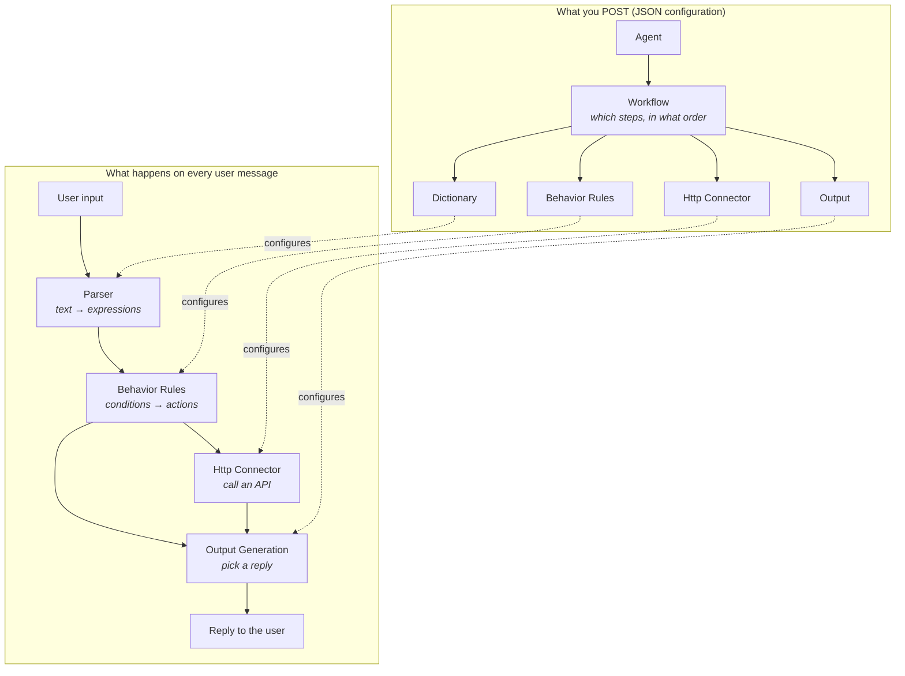

# Creating your first Agents

_Prerequisites: Up and Running instance of **EDDI** (see:_ [_Getting started_](../getting-started.md)_)_

## How does it work?

In order to build an Agent with **EDDI**, you will have to create a few configuration files and `POST` them to the corresponding REST APIs.

An **Agent** points at one or more **Workflows**, and each Workflow lists the
lifecycle steps to run in order. Every step reads its own JSON configuration, so
what the agent *does* lives in configuration rather than in code:

The **actions** emitted by Behavior Rules are the whole orchestration mechanism:
steps never call each other directly, they just react to actions. That is why
adding a capability usually means adding a rule and an output, not writing Java.

A agent can consists of the following elements:

1. (Regular) **`Dictionary`** to define the inputs from the users as well as their meanings in respective categories, expressed by a expression language `e.g. apple -> fruit(apple)`
2. **`Behavior Rules`** triggering **actions** based on execution of behavior rules checking on certain conditions within the current conversation
3. **`Http Connector`** requests/sends data to a Rest API and makes the json response available within the conversation (e.g for Output**`)`**
4. **`Output`** to answer the user's request based on **actions** triggered by behavior rules
5. **`Workflow`** to define which **\`LifecycleTasks**\` (such as the parser, behavior rules, rest api connector, output generation, ...) should be executed in order by how they are defined
6. **`Agent`** to define which packages should be executed in this agent

### Example of a resource reference

`eddi://ai.labs.dictionary/dictionarystore/dictionaries/ID?version=VERSION`

`eddi://` URI resources starting with this protocol are to be related with in EDDI&#x20;

`ai.labs.dictionary` Type of resource

`/dictionarystore/dictionaries` API path

&#x20;`ID` ID of the resources

`VERSION` Read-only version of the resource (each change is a new version)

&#x20;Version of this resource (each update operation will create a new version of the resource)
