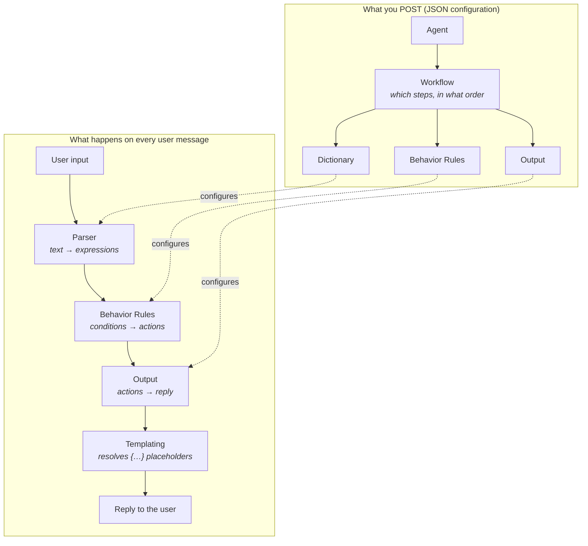

# Creating your first Agent

_Prerequisites: a running **EDDI** instance (see [Getting started](../getting-started.md)),
`curl`, and optionally `jq`. The commands assume authentication is off, as in the
bundled `docker-compose.yml`; with OIDC on, add `-H "Authorization: Bearer <token>"`._

This tutorial builds one rule-based agent in two stages, entirely over the REST API:

1. a **Hello World** agent that greets the user when a conversation starts, and
2. the same agent extended to **react to what the user types** — greetings,
   thanks, goodbyes and "how are you".

No LLM is involved, so it runs on any install. Adding a model is the next step,
covered in the [Developer Quickstart](../developer-quickstart.md#adding-an-llm-ollama-example)
and [LLM Integration](../langchain.md). If you would rather click than curl, the
Manager's agent wizard at `/manage` builds the same resources.

## How does it work?

An **Agent** points at one or more **Workflows**, and each Workflow lists the
lifecycle steps to run, in order. Every step reads its own JSON configuration, so
what the agent *does* lives in configuration rather than in code:


```mermaid
flowchart TD
    subgraph cfg ["What you POST (JSON configuration)"]
        direction LR
        A["Agent"] --> W["Workflow<br/><i>which steps, in what order</i>"]
        W --> D["Dictionary"]
        W --> B["Behavior Rules"]
        W --> O["Output"]
    end

    subgraph run ["What happens on every user message"]
        direction TB
        I["User input"] --> P["Parser<br/><i>text → expressions</i>"]
        P --> R["Behavior Rules<br/><i>conditions → actions</i>"]
        R --> G["Output<br/><i>actions → reply</i>"]
        G --> T["Templating<br/><i>resolves {…} placeholders</i>"]
        T --> Resp["Reply to the user"]
    end

    D -.configures.-> P
    B -.configures.-> R
    O -.configures.-> G
```

The **actions** emitted by behavior rules are the whole orchestration mechanism:
steps never call each other, they react to actions. That is why adding a
capability usually means adding a rule and an output, not writing Java.

The building blocks used here:

| Resource | REST store | Role |
| --- | --- | --- |
| Dictionary | `/dictionarystore/dictionaries` | Maps words and phrases to **expressions**, e.g. `hello → greeting(hello)` |
| Behavior rule set | `/rulestore/rulesets` | Turns expressions (and other conditions) into **actions** |
| Output set | `/outputstore/outputsets` | Maps actions to what the user sees |
| Workflow | `/workflowstore/workflows` | The ordered list of lifecycle steps, each pointing at its configuration |
| Agent | `/agentstore/agents` | The list of workflows to run |

Other steps — API calls (`httpcalls`), MCP calls, the LLM task, property setters,
RAG — slot into the same workflow; see [Extensions](../extensions.md).

### Resource references

Every create answers **`201 Created` with an empty body**. The new resource's
reference is in the `Location` header, as an `eddi://` URI:

```text
eddi://ai.labs.dictionary/dictionarystore/dictionaries/<ID>?version=<VERSION>
```

| Part | Meaning |
| --- | --- |
| `eddi://` | An EDDI resource reference (not an HTTP URL) |
| `ai.labs.dictionary` | The resource type |
| `/dictionarystore/dictionaries` | The REST path of its store |
| `<ID>` | The resource id |
| `<VERSION>` | The version. Resources are immutable: every update creates a new version |

The workflow and the agent refer to their parts with exactly these URIs. Set a
shell variable for the server first:

```bash
EDDI=http://localhost:7070
```

## Part 1 — Hello World

### 1. Create the output

When a conversation starts, EDDI puts the action **`CONVERSATION_START`** on
the first step by itself, so an output keyed on that action is all a greeting
needs — no rule required:

```bash
curl -i -X POST $EDDI/outputstore/outputsets \
  -H "Content-Type: application/json" \
  -d '{
    "outputSet": [
      {
        "action": "CONVERSATION_START",
        "timesOccurred": 0,
        "outputs": [
          { "valueAlternatives": [ { "type": "text", "text": "Hello World! I am E.D.D.I." } ] }
        ]
      }
    ]
  }'
```

The response is `201` with

```text
Location: eddi://ai.labs.output/outputstore/outputsets/<OUTPUT_ID>?version=1
```

| Field | Meaning |
| --- | --- |
| `outputSet[].action` | The action this entry answers |
| `outputSet[].timesOccurred` | Which occurrence of the action this entry is for: `0` the first time, `1` the second, … The highest entry not above the current count is used, so the last one repeats |
| `outputs[]` | One element per message bubble, sent in order |
| `outputs[].valueAlternatives[]` | Interchangeable variants of that bubble; one is picked at random each time |
| `valueAlternatives[].type` | `text`, `image`, `quickReply`, `inputField`, `applicationLink`, `button`, `agentFace` or `other` — see [Output Configuration](../output-configuration.md) |

### 2. Create the workflow

The workflow names the lifecycle steps and points each one at its configuration.
Hello World needs the output step, followed by the templating step (harmless when
there is nothing to resolve, and required as soon as an output contains a
`{…}` placeholder):

```bash
curl -i -X POST $EDDI/workflowstore/workflows \
  -H "Content-Type: application/json" \
  -d '{
    "workflowSteps": [
      { "type": "eddi://ai.labs.output",
        "config": { "uri": "eddi://ai.labs.output/outputstore/outputsets/<OUTPUT_ID>?version=1" } },
      { "type": "eddi://ai.labs.templating", "config": {} }
    ]
  }'
```

`Location: eddi://ai.labs.workflow/workflowstore/workflows/<WORKFLOW_ID>?version=1`

| Field | Meaning | Required |
| --- | --- | --- |
| `workflowSteps` | Array of steps, executed in order | yes |
| `workflowSteps[].type` | The lifecycle task, e.g. `eddi://ai.labs.parser`, `eddi://ai.labs.rules`, `eddi://ai.labs.output`, `eddi://ai.labs.templating` | yes |
| `workflowSteps[].config` | The step's configuration — usually `{ "uri": "<eddi:// reference>" }`; may be empty | yes |
| `workflowSteps[].extensions` | Step-specific extras; the parser takes its dictionaries and corrections here | no |

`workflowExtensions` is still accepted as an alias of `workflowSteps`. Any other
unknown top-level key is rejected with a `400` that names it.

### 3. Create the agent

An agent is a list of workflow references in the field **`workflows`**:

```bash
curl -i -X POST $EDDI/agentstore/agents \
  -H "Content-Type: application/json" \
  -d '{
    "workflows": [
      "eddi://ai.labs.workflow/workflowstore/workflows/<WORKFLOW_ID>?version=1"
    ]
  }'
```

`Location: eddi://ai.labs.agent/agentstore/agents/<AGENT_ID>?version=1`

> `packages` — the pre-6.0 name of this field — is still accepted when you write
> an agent, so old payloads keep working. Write `workflows`.

A resource created over the API has no name, so the Manager lists it as
"Unnamed". Names live on the descriptor:

```bash
curl -X PATCH "$EDDI/descriptorstore/descriptors/<AGENT_ID>?version=1" \
  -H "Content-Type: application/json" \
  -d '{ "operation": "SET", "document": { "name": "Hello World", "description": "My first agent" } }'
```

### 4. Deploy the agent

An agent must be deployed to an environment before it can talk.
`waitForCompletion=true` makes the call return the final status:

```bash
curl -s -X POST "$EDDI/administration/production/deploy/<AGENT_ID>?version=1&waitForCompletion=true"
```

```json
{ "status": "READY", "agentId": "<AGENT_ID>", "version": 1, "environment": "production" }
```

Without `waitForCompletion` the call answers `202 Accepted` and deploys in the
background; poll the status until it is `READY`:

```bash
curl -s "$EDDI/administration/production/deploymentstatus/<AGENT_ID>?version=1"
```

The status is one of `NOT_FOUND`, `IN_PROGRESS`, `ERROR` and `READY`. `ERROR`
almost always means a reference in the workflow does not resolve — check the
server log.

### 5. Talk to it

Start a conversation. The call takes no message; the new conversation's id is
the last segment of the `Location` header:

```bash
curl -i -X POST "$EDDI/agents/<AGENT_ID>/start?environment=production&userId=tutorial-user"
```

```text
HTTP/1.1 201 Created
Location: eddi://ai.labs.conversation/conversationstore/conversations/<CONVERSATION_ID>
```

Read the conversation, and you will find the greeting the start turn produced:

```bash
curl -s "$EDDI/agents/<CONVERSATION_ID>"
```

```json
{
  "conversationState": "READY",
  "conversationOutputs": [
    { "actions": ["CONVERSATION_START"],
      "output": [ { "type": "text", "text": "Hello World! I am E.D.D.I.", "delay": 0 } ] }
  ]
}
```

(abridged). The Chat UI does the same thing for you at
`http://localhost:7070/chat/production/<AGENT_ID>`.

## Part 2 — React to user input

Now teach the agent to understand a few inputs. This adds a **parser** with a
dictionary and a **behavior rule set** in front of the output.

### 6. Create a dictionary

```bash
curl -i -X POST $EDDI/dictionarystore/dictionaries \
  -H "Content-Type: application/json" \
  -d '{
    "words": [
      { "word": "hello",  "expressions": "greeting(hello)", "frequency": 0 },
      { "word": "hi",     "expressions": "greeting(hi)",    "frequency": 0 },
      { "word": "bye",    "expressions": "goodbye(bye)",    "frequency": 0 },
      { "word": "thanks", "expressions": "thanks(thanks)",  "frequency": 0 }
    ],
    "phrases": [
      { "phrase": "good afternoon", "expressions": "greeting(good_afternoon)" },
      { "phrase": "how are you",    "expressions": "how_are_you" }
    ]
  }'
```

`Location: eddi://ai.labs.dictionary/dictionarystore/dictionaries/<DICTIONARY_ID>?version=1`

| Field | Meaning |
| --- | --- |
| `words[].word` | A single word, no spaces |
| `words[].expressions` | What the word means. In `greeting(hello)`, `greeting` is the category and `hello` the value |
| `words[].frequency` | Ranking hint for the parser's matching; `0` is fine |
| `phrases[].phrase` | A multi-word phrase |
| `phrases[].expressions` | As for words |

Anything the parser cannot match comes out as `unknown(<word>)`. See
[Semantic Parser](../semantic-parser.md) for corrections (typos, stemming) and the
built-in dictionaries (numbers, e-mail addresses, times, …).

### 7. Create the behavior rules

```bash
curl -i -X POST $EDDI/rulestore/rulesets \
  -H "Content-Type: application/json" \
  -d '{
    "behaviorGroups": [
      {
        "name": "Greetings",
        "behaviorRules": [
          {
            "name": "First greeting",
            "actions": ["greet"],
            "conditions": [
              { "type": "inputmatcher",
                "configs": { "expressions": "greeting(*)", "occurrence": "currentStep" } },
              { "type": "occurrence",
                "configs": { "behaviorRuleName": "First greeting", "maxTimesOccurred": "0" } }
            ]
          },
          {
            "name": "Repeated greeting",
            "actions": ["greet_again"],
            "conditions": [
              { "type": "inputmatcher",
                "configs": { "expressions": "greeting(*)", "occurrence": "currentStep" } }
            ]
          }
        ]
      },
      {
        "name": "Goodbye",
        "behaviorRules": [
          {
            "name": "Goodbye",
            "actions": ["say_goodbye", "CONVERSATION_END"],
            "conditions": [
              { "type": "inputmatcher",
                "configs": { "expressions": "goodbye(*)", "occurrence": "currentStep" } }
            ]
          }
        ]
      },
      {
        "name": "Thanks",
        "behaviorRules": [
          {
            "name": "Thanks without goodbye",
            "actions": ["thank"],
            "conditions": [
              { "type": "inputmatcher",
                "configs": { "expressions": "thanks(*)", "occurrence": "currentStep" } },
              { "type": "negation",
                "conditions": [
                  { "type": "inputmatcher",
                    "configs": { "expressions": "goodbye(*)", "occurrence": "currentStep" } }
                ] }
            ]
          }
        ]
      },
      {
        "name": "Small talk",
        "behaviorRules": [
          {
            "name": "How are you",
            "actions": ["how_are_you"],
            "conditions": [
              { "type": "inputmatcher",
                "configs": { "expressions": "how_are_you", "occurrence": "currentStep" } }
            ]
          }
        ]
      }
    ]
  }'
```

`Location: eddi://ai.labs.rules/rulestore/rulesets/<RULESET_ID>?version=1`

What this rule set does:

- **Groups run independently; inside a group, only the first rule that
  matches fires** (the default `executionStrategy`, `executeUntilFirstSuccess`).
  "First greeting" therefore wins the first time, and "Repeated greeting" takes
  over afterwards. Rules that should fire side by side belong in separate
  groups — which is why goodbye, thanks and small talk each have their own.
- All conditions of a rule must hold (AND). The `occurrence` condition counts how
  often the named rule has fired in this conversation; `maxTimesOccurred: "0"`
  means "never before".
- `"occurrence": "currentStep"` on an `inputmatcher` restricts it to this turn's
  input. Without it, the matcher looks at the whole conversation, and a greeting
  from three turns ago would keep matching.
- A `negation` inverts its nested `conditions` (they are AND-ed first, then
  inverted). "Thanks without goodbye" fires on *thanks* only when the same input
  does not also say *bye* — "thanks, bye" gets only the goodbye.
- `CONVERSATION_END` is a reserved action: it ends the conversation after this
  turn.

| Field | Meaning |
| --- | --- |
| `behaviorGroups[].name` | Group label, shown in the Manager and in traces |
| `behaviorGroups[].executionStrategy` | `executeUntilFirstSuccess` (default) or `executeAll` |
| `behaviorGroups[].behaviorRules[].name` | Rule name; `occurrence` conditions refer to it |
| `behaviorRules[].actions` | Actions emitted when the rule matches |
| `behaviorRules[].conditions[].type` | `inputmatcher`, `actionmatcher`, `contextmatcher`, `occurrence`, `negation`, `connector`, `dependency`, `dynamicvaluematcher`, `sizematcher`, `contentTypeMatcher`, … |
| `conditions[].configs` | The condition's parameters, a map of strings — for `inputmatcher`: `expressions` and `occurrence` (`currentStep`, `lastStep`, `anyStep`, `never`) |
| `conditions[].conditions` | Nested conditions, for `negation`, `connector` and `dependency` |

The full condition reference is in [Behavior Rules](../behavior-rules.md).

### 8. Extend the output

Create a new output set that answers every action — the start greeting from Part 1
plus one entry per new action. Two entries for `greet_again` with
`timesOccurred` `0` and `1` make the second repeat sound different from the first:

```bash
curl -i -X POST $EDDI/outputstore/outputsets \
  -H "Content-Type: application/json" \
  -d '{
    "outputSet": [
      { "action": "CONVERSATION_START", "timesOccurred": 0,
        "outputs": [ { "valueAlternatives": [ { "type": "text", "text": "Hello World! I am E.D.D.I." } ] } ] },
      { "action": "greet", "timesOccurred": 0,
        "outputs": [ { "valueAlternatives": [
          { "type": "text", "text": "Hi there! Nice to meet you!" },
          { "type": "text", "text": "Hey you!" } ] } ] },
      { "action": "greet_again", "timesOccurred": 0,
        "outputs": [ { "valueAlternatives": [ { "type": "text", "text": "Did we not already say hi? Twice is better than not at all!" } ] } ] },
      { "action": "greet_again", "timesOccurred": 1,
        "outputs": [ { "valueAlternatives": [ { "type": "text", "text": "Hello again, again!" } ] } ] },
      { "action": "say_goodbye", "timesOccurred": 0,
        "outputs": [ { "valueAlternatives": [ { "type": "text", "text": "See you soon!" } ] } ] },
      { "action": "thank", "timesOccurred": 0,
        "outputs": [ { "valueAlternatives": [ { "type": "text", "text": "You are welcome!" } ] } ] },
      { "action": "how_are_you", "timesOccurred": 0,
        "outputs": [ { "valueAlternatives": [ { "type": "text", "text": "Pretty good, having lovely conversations all day long." } ] } ] }
    ]
  }'
```

`Location: eddi://ai.labs.output/outputstore/outputsets/<OUTPUT2_ID>?version=1`

(You could equally `PUT` the new content to the first output set, which would
create its version 2.)

### 9. Update the workflow

Put the parser — with the dictionary in its `extensions` — and the rules step in
front of the output. Updating with `PUT` creates version 2 of the workflow:

```bash
curl -i -X PUT "$EDDI/workflowstore/workflows/<WORKFLOW_ID>?version=1" \
  -H "Content-Type: application/json" \
  -d '{
    "workflowSteps": [
      { "type": "eddi://ai.labs.parser",
        "config": {},
        "extensions": {
          "dictionaries": [
            { "type": "eddi://ai.labs.parser.dictionaries.regular",
              "config": { "uri": "eddi://ai.labs.dictionary/dictionarystore/dictionaries/<DICTIONARY_ID>?version=1" } }
          ],
          "corrections": []
        } },
      { "type": "eddi://ai.labs.rules",
        "config": { "uri": "eddi://ai.labs.rules/rulestore/rulesets/<RULESET_ID>?version=1" } },
      { "type": "eddi://ai.labs.output",
        "config": { "uri": "eddi://ai.labs.output/outputstore/outputsets/<OUTPUT2_ID>?version=1" } },
      { "type": "eddi://ai.labs.templating", "config": {} }
    ]
  }'
```

`Location: eddi://ai.labs.workflow/workflowstore/workflows/<WORKFLOW_ID>?version=2`

### 10. Point the agent at the new workflow and redeploy

A deployed agent version never changes, so update the agent (creating its
version 2) and deploy that:

```bash
curl -i -X PUT "$EDDI/agentstore/agents/<AGENT_ID>?version=1" \
  -H "Content-Type: application/json" \
  -d '{ "workflows": [ "eddi://ai.labs.workflow/workflowstore/workflows/<WORKFLOW_ID>?version=2" ] }'

curl -s -X POST "$EDDI/administration/production/deploy/<AGENT_ID>?version=2&waitForCompletion=true"
```

### 11. Have a conversation

```bash
curl -i -X POST "$EDDI/agents/<AGENT_ID>/start?environment=production&userId=tutorial-user"
# → Location: eddi://…/conversations/<CONVERSATION_ID>

for msg in "hello" "hi" "how are you" "thanks bye"; do
  curl -s -X POST "$EDDI/agents/<CONVERSATION_ID>" -H "Content-Type: text/plain" --data "$msg"
  echo
done
```

Each call returns the turn that was just processed, for example:

```json
{
  "conversationState": "READY",
  "conversationOutputs": [
    { "input": "hello", "actions": ["greet"],
      "output": [ { "type": "text", "text": "Hey you!", "delay": 0 } ] }
  ]
}
```

and the replies go: a greeting, the "already said hi" answer, the small-talk
answer, and finally "See you soon!" with `"conversationState": "ENDED"`. A
message to an ended conversation is refused with `410 Gone` ("Conversation has
ended"); start a new one.

The message can also be sent as JSON, which lets you pass context along with it.
The conversation above has ended, so start a new one first and use its id:

```bash
curl -s -X POST "$EDDI/agents/<CONVERSATION_ID>" \
  -H "Content-Type: application/json" \
  -d '{ "input": "hello", "context": { "language": { "type": "string", "value": "en" } } }'
```

Useful query parameters on that call:

| Parameter | Default | Effect |
| --- | --- | --- |
| `returnDetailed` | `false` | Return every memory entry of the step, not only the public ones (`input:initial`, `actions`, `output*`, `quickReplies*`) — use it to see which rules matched (`behavior_rules:success`) and what the parser produced (`expressions:parsed`) |
| `returnCurrentStepOnly` | `true` | Return only the turn just processed rather than the whole conversation |

`GET $EDDI/agents/<CONVERSATION_ID>?returnDetailed=true&returnCurrentStepOnly=false`
returns the full conversation memory, every turn, at any time. All conversation endpoints are listed in the
[REST API Reference](../rest-api-reference.md).

> **Congratulations** — you have built, deployed and talked to your first EDDI agent.

## Where next

- [Developer Quickstart](../developer-quickstart.md) — the same flow plus an LLM step
- [Behavior Rules](../behavior-rules.md) — every condition type
- [Properties](../properties.md) — remember what the user said across turns
- [HTTP Calls](../httpcalls.md) — call a REST API from a rule's action
- [LLM Integration](../langchain.md) — hand unmatched input to a model
- The API is described by its own OpenAPI document at `/openapi` (browsable at
  `/q/swagger-ui`); Postman and similar tools can import it directly via
  **Import → Link**, and it always matches the running build.
