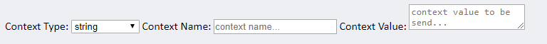

# Passing context information

In this section we will explain how **EDDI** handles the context of a conversation and which data can be passed within the scope of a conversation.

In order to talk to **EDDI** within a context, a **`POST`** request shall be sent to `/bots/{environment}/`**`{botId}`**`/`**`{conversationId}`**, (_same way as interacting in a normal conversation in EDDI_) but this time we must provide more parameters:

### Send message in a conversation with a Chatbot REST API Endpoint

| Element                          | Tags                                                                                                                                                                                                                                                                                  |
| -------------------------------- | ------------------------------------------------------------------------------------------------------------------------------------------------------------------------------------------------------------------------------------------------------------------------------------- |
| HTTP Method                      | `POST`                                                                                                                                                                                                                                                                                |
| API endpoint                     | `/bots/{environment}/{botId}/{conversationId}`                                                                                                                                                                                                                                        |
| {environment}                    | (`Path` **parameter**):`String` Deployment environment (e.g: `restricted,unrestricted,test`)                                                                                                                                                                                          |
| {botId}                          | (`Path` **parameter**):`String Id` of the bot that you wish to **continue a conversation with.**                                                                                                                                                                                      |
| {conversationId}                 | (`Path` **parameter**): `String Id` of the **conversation** that you wish to **send** the message to.                                                                                                                                                                                 |
| returnDetailed (Optional)        | (`Query` **parameter**):`Boolean` - Default : `false` Will return all sub results of the entire `conversation steps`, otherwise only public ones such as `input, action, output & quickReplies`.                                                                                      |
| returnCurrentStepOnly (Optional) | (`Query` **parameter**):`Boolean` - Default : `true` Will return only the latest `conversationStep` that has just been processed, otherwise returns all `conversationSteps` since the beginning of this `conversation`.                                                               |
| Request Body                     | a `JSON` object sent in the request body consists of the usual input text (message to the bot) only this time we are going to provide `context` information through a `key value` data structure ; the Context value must have one of the following : `string,object or expressions.` |
|                                  |                                                                                                                                                                                                                                                                                       |

## Example

Here is an example of a `JSON` object of the input data:

```javascript
{
  "input": "",
  "context": {
    "onboardingOfUser": {
      "type": "string",
      "value": "true"
    },
    "userInfo": {
      "type": "object",
      "value": {
        "username": "Barbara"
      }
    }
  }
}
```

> Additional information:

We can also use [`http://localhost:7070/chat`](http://localhost:7070/chat) to test the context parameters by providing `Context Type`,`Context Name`, `Context Value`. see image below :



[Callbacks](https://www.notion.so/Callbacks-c7cfea02c5544021a07ef6c480b5a89e)
