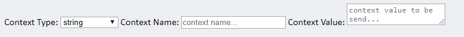

# Passing Context Information

## Overview

**Context** is external data that you pass from your application into EDDI conversations. It's how you inject real-world information—like user profiles, session data, or business state—into your agent's logic without hard-coding it.

### Why Context Matters

Context enables your agents to:

- **Personalize responses**: Use user names, preferences, account details
- **Make business decisions**: Check user roles, subscription status, account balances
- **Maintain session state**: Pass authentication tokens, session IDs
- **Adapt behavior**: Change agent responses based on time of day, location, language
- **Integrate with your systems**: Bring data from your CRM, database, or services

### Context vs Conversation Memory

| Aspect        | Context                     | Conversation Memory            |
| ------------- | --------------------------- | ------------------------------ |
| **Source**    | Your application (external) | EDDI (internal)                |
| **Direction** | Input to EDDI               | Managed by EDDI                |
| **Lifetime**  | Per request                 | Persistent across conversation |
| **Purpose**   | Inject external data        | Store conversation history     |
| **Usage**     | `${context.userName}`       | `${memory.current.input}`      |

### Context Types

EDDI supports three context types:

1. **`string`**: Simple text values

   ```json
   "userRole": {"type": "string", "value": "premium"}
   ```

2. **`object`**: Structured JSON data

   ```json
   "userInfo": {"type": "object", "value": {"name": "John", "age": 30}}
   ```

3. **`expressions`**: Parsed semantic expressions
   ```json
   "intent": {"type": "expressions", "value": "purchase(product)"}
   ```

### How Context is Used

Once passed to EDDI, context can be:

- **Matched in Behavior Rules**: Conditions check context values
- **Used in Output Templates**: `[[${context.userName}]]`
- **Included in HTTP Call Bodies**: Pass to external APIs
- **Stored as Properties**: Save to conversation memory

### Example Flow

```
Your App → POST /agents/unrestricted/agent123/conv456
{
  "input": "What's my account balance?",
  "context": {
    "userId": {"type": "string", "value": "user-789"},
    "accountType": {"type": "string", "value": "premium"}
  }
}

→ EDDI Behavior Rule checks context:
   IF context.accountType = "premium" THEN httpcall(get-balance)

→ HTTP Call uses context:
   GET /api/accounts/${context.userId}/balance

→ Output Template uses context:
   "Hello! Your premium account balance is $[[${httpCalls.balance.amount}]]"

→ Response to Your App:
   "Hello! Your premium account balance is $1,250.00"
```

## Sending Context to Conversations

In this section we will explain how **EDDI** handles the context of a conversation and which data can be passed within the scope of a conversation.

In order to talk to **EDDI** with context, send a **`POST`** request to `/agents/{environment}/`**`{agentId}`**`/`**`{conversationId}`** (same way as interacting in a normal conversation in EDDI), but this time provide context parameters:

### Send message in a conversation with a Chatagent REST API Endpoint

| Element                          | Tags                                                                                                                                                                                                                                                                                    |
| -------------------------------- | --------------------------------------------------------------------------------------------------------------------------------------------------------------------------------------------------------------------------------------------------------------------------------------- |
| HTTP Method                      | `POST`                                                                                                                                                                                                                                                                                  |
| API endpoint                     | `/agents/{environment}/{agentId}/{conversationId}`                                                                                                                                                                                                                                      |
| {environment}                    | (`Path` **parameter**):`String` Deployment environment (e.g: `restricted,unrestricted,test`)                                                                                                                                                                                            |
| {agentId}                        | (`Path` **parameter**):`String Id` of the agent that you wish to **continue a conversation with.**                                                                                                                                                                                      |
| {conversationId}                 | (`Path` **parameter**): `String Id` of the **conversation** that you wish to **send** the message to.                                                                                                                                                                                   |
| returnDetailed (Optional)        | (`Query` **parameter**):`Boolean` - Default : `false` Will return all sub results of the entire `conversation steps`, otherwise only public ones such as `input, action, output & quickReplies`.                                                                                        |
| returnCurrentStepOnly (Optional) | (`Query` **parameter**):`Boolean` - Default : `true` Will return only the latest `conversationStep` that has just been processed, otherwise returns all `conversationSteps` since the beginning of this `conversation`.                                                                 |
| Request Body                     | a `JSON` object sent in the request body consists of the usual input text (message to the agent) only this time we are going to provide `context` information through a `key value` data structure ; the Context value must have one of the following : `string,object or expressions.` |
|                                  |                                                                                                                                                                                                                                                                                         |

## Example

Here is an example of a `JSON` object of the input data:

```javascript
{
  "input": "",
  "context": {
    "onboardingOfUser": {
      "type": "string",
      "value": "true"
    },
    "userInfo": {
      "type": "object",
      "value": {
        "username": "Barbara"
      }
    }
  }
}
```

> Additional information:

We can also use [`http://localhost:7070/chat`](http://localhost:7070/chat) to test the context parameters by providing `Context Type`,`Context Name`, `Context Value`. see image below :



[Callbacks](https://www.notion.so/Callbacks-c7cfea02c5544021a07ef6c480b5a89e)
