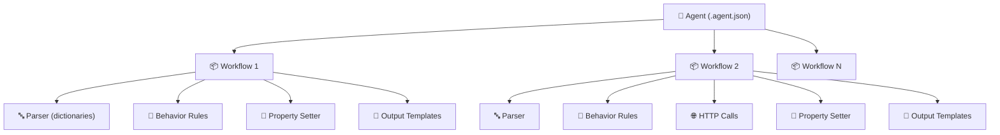
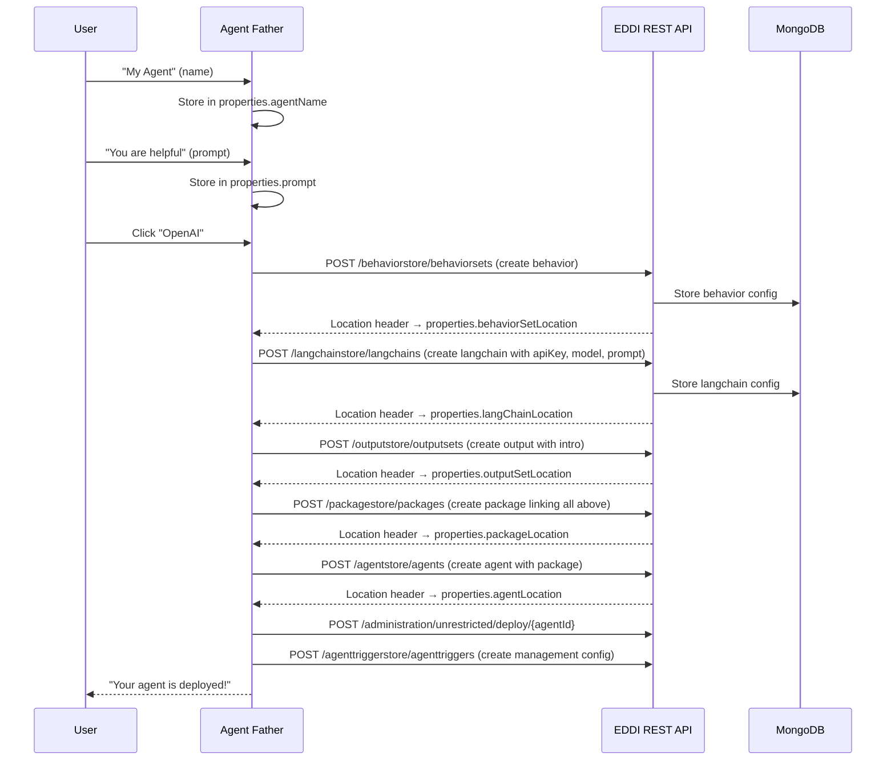
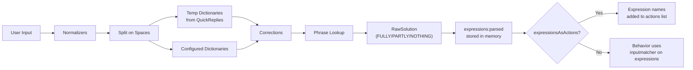
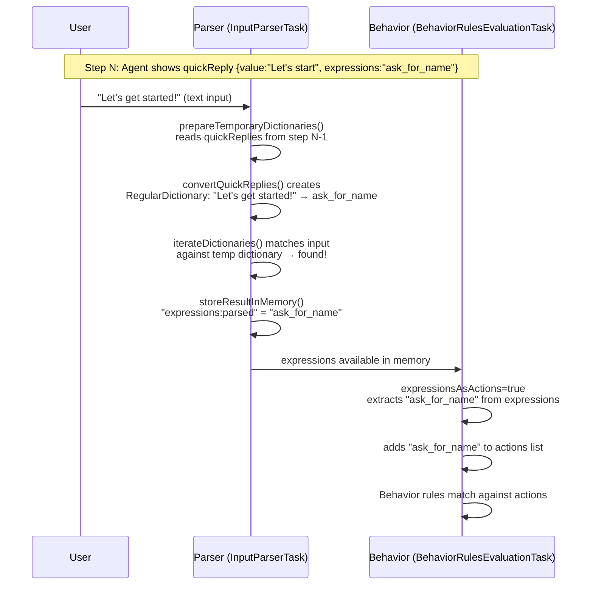
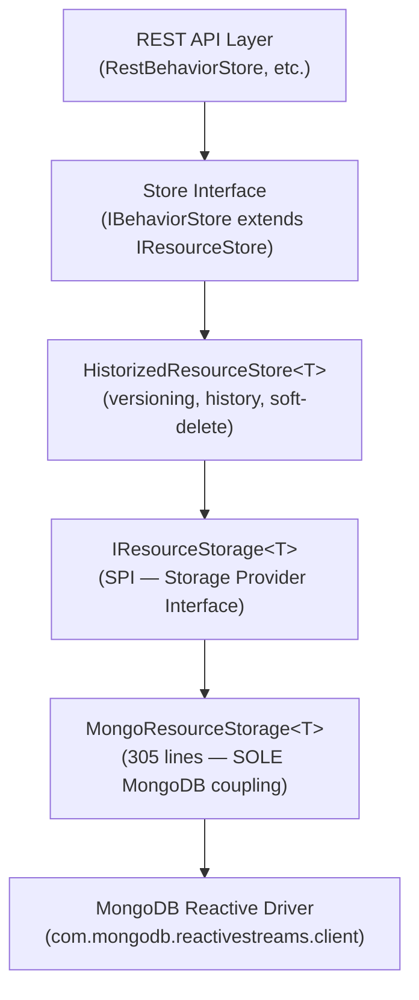

# EDDI Business Logic Deep Dive — Configuration Model & API Experience

---

## 1. The Configuration Hierarchy

EDDI's configuration model is a 4-level tree:



### Agent → Workflows → Extensions

| Level          | File                                                                                     | Purpose                                                                                                                        |
| -------------- | ---------------------------------------------------------------------------------------- | ------------------------------------------------------------------------------------------------------------------------------ |
| **Agent**      | `.agent.json`                                                                            | List of package URIs + channels. The top-level container.                                                                      |
| **Workflow**   | `.package.json`                                                                          | Ordered list of `packageExtensions` — each extension = one lifecycle task type. **Order matters**: tasks execute sequentially. |
| **Extension**  | `.behavior.json`, `.property.json`, `.httpcalls.json`, `.output.json`, `.langchain.json` | The actual configuration that drives each `ILifecycleTask`. Referenced by URI from the package.                                |
| **Descriptor** | `.descriptor.json`                                                                       | Metadata (name, description, timestamps) for any resource. Not functional, purely for UI/management.                           |

### Key Design Pattern: URI-Based References

Every resource references its dependencies by `eddi://` URI:

```
Agent → Workflow: "eddi://ai.labs.package/packagestore/packages/{id}?version=1"
Workflow → Behavior: "eddi://ai.labs.behavior/behaviorstore/behaviorsets/{id}?version=1"
Workflow → HttpCalls: "eddi://ai.labs.httpcalls/httpcallsstore/httpcalls/{id}?version=1"
```

> [!IMPORTANT]
> These URIs are the **glue** of the system. The `RestImportService` must rewrite ALL URIs when importing a agent (old IDs → new MongoDB ObjectIds). This is fragile — `#strings.substring(...)` with hardcoded character positions extract IDs from URI strings.

---

## 2. Extension Types & Their Pipeline Role

Each package runs its extensions in order: **Parser → Behavior → Property → HttpCalls → Langchain → Output** (typical order).

### 2.1 Parser (`eddi://ai.labs.parser`)

- **Input**: Raw user text
- **Output**: Expressions (structured semantic representation)
- **Key feature**: `expressionsAsActions: true` — parser expressions become actions, enabling quickReply-driven flows
- **QuickReply matching**: When the user clicks a quickReply, the Parser matches the user's text against the previous step's quickReply `value` fields and extracts the corresponding `expressions`

### 2.2 Behavior Rules (`eddi://ai.labs.behavior`)

- **Input**: Actions and expressions from current/previous steps
- **Output**: New actions that drive subsequent tasks
- **Condition types**: `actionmatcher`, `inputmatcher`, `negation`, `occurrence` (currentStep/lastStep/anyStep/never)
- **Core orchestration mechanism**: Behavior rules are the "routing logic" — they decide what happens next based on what happened before

#### Condition Matching Examples from Agent Father:

```json
// Match when lastStep had action "ask_for_agent_name"
{"type": "actionmatcher", "configs": {"actions": "ask_for_agent_name", "occurrence": "lastStep"}}

// Match any input in currentStep (wildcard)
{"type": "inputmatcher", "configs": {"expressions": "*", "occurrence": "currentStep"}}

// Match specific expression (from quickReply)
{"type": "inputmatcher", "configs": {"expressions": "temp_0_7", "occurrence": "currentStep"}}

// Negation: match anything EXCEPT specific expressions
{"type": "negation", "conditions": [
    {"type": "inputmatcher", "configs": {"expressions": "temp_0_7,temp_0_9,temp_0_2"}}
]}
```

### 2.3 Property Setter (`eddi://ai.labs.property`)

- **Input**: Current memory data
- **Output**: Stored properties (conversation-scoped or long-term)
- **Template values**: Uses `[[${memory.current.input}]]` to capture user input into named properties
- **Purpose**: Slot-filling — the wizard pattern that collects user data across conversation steps

### 2.4 HTTP Calls (`eddi://ai.labs.httpcalls`)

- **Input**: Actions, template variables from properties/memory
- **Output**: Response data stored in memory
- **Key features**:
  - `targetServerUrl` — base URL for all calls
  - `preRequest.propertyInstructions` — extract data from properties BEFORE the call
  - `postResponse.propertyInstructions` — extract data from response headers/body AFTER the call
  - `retryHttpCallInstruction` — retry with exponential backoff
  - `saveResponse` / `responseObjectName` — store response for use by later calls

### 2.5 Langchain (`eddi://ai.labs.llm`)

- **Input**: Conversation memory, system prompt, tool configurations
- **Output**: LLM response text
- **Modes**: Legacy chat (simple call) or Agent mode (tool-calling loop)
- **Parameters**: Model type, API key, temperature, timeout, built-in tools, conversation history limit

### 2.6 Output Templates (`eddi://ai.labs.output`)

- **Input**: Actions from the current step
- **Output**: Text responses + quickReplies sent to user
- **Matching**: `action` field matches against current step's actions list
- **Features**: Multiple `valueAlternatives` (response variation), `quickReplies` with `expressions` for guided flows, template variables like `[[${properties.agentName}]]`, `timesOccurred` for conditional responses

---

## 3. The Agent Father — A Meta-Agent Pattern

The Agent Father is the most fascinating architecture in EDDI: **a agent that creates other agents using EDDI's own REST API**.

### Configuration Structure (9 Workflows)

| Workflow | Name                                 | Purpose                                                                             |
| -------- | ------------------------------------ | ----------------------------------------------------------------------------------- |
| P1       | Create Connector Agent               | Wizard intro: ask name → prompt → intro → LLM choice                                |
| P2       | Create OpenAI Connector Agent        | OpenAI-specific: API key → model → temperature → timeout → tools → history → create |
| P3       | Create HuggingFace Connector Agent   | Same pattern for HuggingFace                                                        |
| P4       | Create Anthropic Connector Agent     | Same pattern for Anthropic                                                          |
| P5       | Create Gemini Connector Agent        | Same pattern for Gemini                                                             |
| P6       | Create Gemini Vertex Connector Agent | Same pattern for Gemini Vertex                                                      |
| P7       | Create Ollama Connector Agent        | Same pattern for Ollama                                                             |
| P8       | Create Jlama Connector Agent         | Same pattern for Jlama                                                              |
| P9       | Templating Utility                   | Standalone templating extension                                                     |

### Agent Creation Flow (Example: OpenAI)

The Agent Father uses `httpcalls.json` to **programmatically call EDDI's own API** to create all resources for a new agent:



> [!TIP]
> This self-referential pattern (a agent using EDDI's API to create another agent) proves EDDI's API is powerful enough for full agent lifecycle management. MCP integration could expose this same capability to external agents.

### URI-to-ID Extraction (Fragile Pattern)

The httpcalls extract MongoDB IDs from Location headers using hardcoded string positions:

```
"valueString": "[[${#strings.substring(properties.behaviorSetLocation, 51, 75)}]]"
```

This extracts 24 characters (ObjectId length) starting at position 51 of the URI. **This breaks if URI format changes.**

---

## 4. API Testing Results

### EDDI Startup & Import Flow

1. `docker-compose up -d` starts MongoDB 6.0 on default port
2. `mvnw quarkus:dev` starts EDDI on port 7070 (DevServices auto-pulls MongoDB 7.0 via Testcontainers)
3. Health check: `GET /q/health` → `{"status":"UP","checks":[MongoDB OK, Agents ready]}`
4. Initial agent import triggers automatically: `POST /backup/import/initialAgents` reads `Agent+Father-4.0.0.zip` from classpath
5. Import process: unzips → creates all resources with new IDs → rewrites URI references → deploys agent → registers agent trigger

### Conversation Flow (Tested)

```
STEP 0 (CONVERSATION_START):
  ACTIONS: CONVERSATION_START
  AGENT: "Hello there! I'm the Agent Father, and I'm here to help you create agents..."
  AGENT: "Let's get started, shall we?"
  QR: [Let's get started!] | [Not now]

STEP 1 (User: "Let's get started!"):
  ACTIONS: ask_for_agent_name
  AGENT: "Fantastic! To begin, please provide a name for your LLM connector agent."

STEP 2 (User: "My Test Agent"):
  ACTIONS: ask_for_agent_prompt
  AGENT: "Great choice! Now, let's define the (system) prompt for your "My Test Agent" connector agent"

STEP 3 (User: "You are helpful"):
  ACTIONS: ask_for_agent_intro
  AGENT: "Excellent! Now, please provide an intro message..."

STEP 4 (User: "Hello! I am your assistant."):
  ACTIONS: ask_for_llm_use
  AGENT: "Which LLM API would you like to use for your agent?"
  QR: [OpenAI] | [Hugging Face] | [Anthropic] | [Gemini] | [Gemini Vertex] | [Ollama] | [Jlama]
```

### API Issues Found

| Issue                                | Severity  | Description                                                                                                                                                                                                                                                      |
| ------------------------------------ | --------- | ---------------------------------------------------------------------------------------------------------------------------------------------------------------------------------------------------------------------------------------------------------------- |
| **~~POST say returns 500~~**         | ✅ Fixed  | ~~The POST to `/agents/{env}/{agentId}/{convId}` with `AsyncResponse` consistently returned 500.~~ **FIXED in v6**: Now returns 200 with a full conversation JSON snapshot including `conversationState: "READY"`. Confirmed via integration tests (2026-03-09). |
| **hexString error on detailed read** | 🟢 Low    | `GET /agents/{env}/{agentId}/{convId}?returnDetailed=true` fails with "hexString has 24 characters" — likely a MongoDB ObjectId parsing issue in the detailed response serialization.                                                                            |
| **No error body on 500**             | 🟡 Medium | 500 responses return no JSON error body, making debugging difficult. The server log at INFO level shows no stack traces.                                                                                                                                         |

---

## 5. Message Queue Research — Updated Recommendation

### Research Summary

| Technology        | Quarkus Support       | Ops Complexity         | Throughput | Best For                                            |
| ----------------- | --------------------- | ---------------------- | ---------- | --------------------------------------------------- |
| **Apache Kafka**  | Core connector        | High (ZooKeeper/KRaft) | Very high  | Event sourcing, replay, high-volume streaming       |
| **RabbitMQ**      | Core connector (AMQP) | Medium                 | Medium     | Traditional message routing, task queues, DLQ       |
| **NATS**          | Community connector   | **Low**                | High       | Cloud-native microservices, low latency, simplicity |
| **Redis Streams** | Via Redis client      | Low (if Redis exists)  | High       | Lightweight queuing when Redis is already in stack  |
| **Apache Pulsar** | Core connector        | High                   | Very high  | Multi-tenant, tiered storage, geo-replication       |

### Updated Recommendation: **NATS JetStream**

For EDDI's use case, **NATS** is the strongest fit:

1. **Lightweight**: Single binary, ~10MB, no JVM dependency — minimal ops overhead
2. **Cloud-native**: Designed for microservices, supports pub/sub + request/reply + queue groups
3. **JetStream persistence**: Durable message delivery with exactly-once semantics
4. **Quarkus integration**: Community SmallRye NATS JetStream connector available
5. **Low latency**: Sub-millisecond for core NATS, ideal for conversation processing
6. **Simple clustering**: Built-in clustering without external coordination services

**Fallback**: If enterprise features are needed (complex routing, priority queues), **RabbitMQ** remains a solid alternative. Agenth are supported via Quarkus Reactive Messaging, making the application code broker-agnostic.

---

## 6. Key Observations for v6.0 Roadmap

### What Works Well (Keep)

- ✅ The configuration-as-code model is powerful and flexible
- ✅ Action-based orchestration enables complex multi-step wizard flows
- ✅ The Agent Father meta-agent pattern proves the API is self-sufficient for agent lifecycle management
- ✅ QuickReply → expression matching creates guided conversation flows without code
- ✅ Multiple agent versions running in parallel enables graceful transitions
- ✅ Deployment state is persistent (auto-deploy on startup)

### What Needs Improvement

- ⚠️ URI-based references with hardcoded string positions are fragile
- ~~⚠️ The `AsyncResponse` pattern causes 500 errors even when conversations process correctly~~ — **FIXED in v6** (returns 200 with JSON snapshot)
- ⚠️ No error bodies in 500 responses makes debugging nearly impossible
- ⚠️ Every LLM provider requires its own complete package copy (7 near-identical packages in Agent Father)
- ⚠️ Workflows execute strictly sequentially — no way to conditionally skip or parallelize
- ⚠️ The same behavior/property/output patterns are duplicated per LLM provider

### v6 Opportunities from This Analysis

1. **Workflow inheritance/templates**: Instead of 7 duplicate packages for each LLM, define a base package with parameter overrides
2. ~~**Robust response handling**: Replace `AsyncResponse` with reactive streams (SSE/WebSocket)~~ — **Done in v6** (POST /say now returns synchronous 200 with conversation snapshot)
3. **Structured error responses**: Always return JSON error bodies with actionable messages
4. **Reference system overhaul**: Replace hardcoded URI string manipulation with proper URI builders or a reference registry
5. **Conditional package execution**: Allow packages to declare activation conditions (skip if not needed)
6. **Debug logging endpoint**: API to retrieve conversation processing trace for debugging

---

## 7. Parser & Expression System — Deep Dive

### 7.1 The Complete NLP Pipeline



### 7.2 Expression Model (Prolog Heritage)

The `Expression` class is a recursive tree structure from Prolog:

```
Expression:
  ├── expressionName: String       (e.g., "greeting", "intent", "weather")
  ├── domain: String               (e.g., "nlp", "custom" — from "domain.name" syntax)
  └── subExpressions: Expressions  (e.g., greeting(hello) → sub=[Expression("hello")])
```

**Syntax examples:**

```
greeting                         → simple expression (no args)
greeting(hello)                  → expression with sub-expression
intent(weather, location(NYC))   → nested sub-expressions
nlp.greeting                     → domain-qualified expression
*                                → wildcard (matches anything)
```

**Special types from `ExpressionFactory`:**
| Expression | Java Class | Purpose |
|---|---|---|
| `*` | `AnyValue` | Matches any expression |
| `all` | `AllValue` | Matches all |
| `ignored` | `Ignored` | Explicitly ignored |
| `negation` | `Negation` | Logical NOT |
| `and`/`or` | `Connector` | Logical connectors |
| Numbers | `Value` | Numeric values |

### 7.3 QuickReply → Expression Flow (The Key Bridge)

This is how quickReplies drive guided conversation flows:



**Critical implementation detail** ([InputParserTask.java:131-146](file:///c:/dev/git/EDDI/src/main/java/ai/labs/eddi/modules/nlp/InputParserTask.java#L131-L146)):

```java
// Reads quickReplies from the PREVIOUS step (conversationOutputs.size() - 2)
ConversationOutput conversationOutput = conversationOutputs.get(conversationOutputs.size() - 2);
List<QuickReply> quickReplies = extractQuickReplies(quickRepliesOutput);
temporaryDictionaries = convertQuickReplies(quickReplies, expressionProvider);
```

### 7.4 Available NLP Extensions

| Type                 | Extensions                                                                                                                                                        | Purpose                               |
| -------------------- | ----------------------------------------------------------------------------------------------------------------------------------------------------------------- | ------------------------------------- |
| **Dictionaries** (7) | `RegularDictionary`, `IntegerDictionary`, `DecimalDictionary`, `EmailDictionary`, `TimeExpressionDictionary`, `OrdinalNumbersDictionary`, `PunctuationDictionary` | Match input text → expressions        |
| **Normalizers** (4)  | `ContractedWordNormalizer`, `ConvertSpecialCharacterNormalizer`, `PunctuationNormalizer`, `RemoveUndefinedCharacterNormalizer`                                    | Clean/normalize input before matching |
| **Corrections** (3)  | `DamerauLevenshteinCorrection`, `MergedTermsCorrection`, `PhoneticCorrection`                                                                                     | Fuzzy matching, spell correction      |

### 7.5 Problems with the Current Expression System

| #   | Problem                        | Impact                                                                                                             | Example                                                              |
| --- | ------------------------------ | ------------------------------------------------------------------------------------------------------------------ | -------------------------------------------------------------------- |
| 1   | **Prolog syntax is confusing** | Users don't understand `greeting(hello)` or what sub-expressions mean                                              | "What does `occurrence(currentStep)` mean?"                          |
| 2   | **Hand-rolled parser**         | `ExpressionProvider.parseExpressions()` is a 50-line char-by-char parenthesis counter — fragile, no error messages | Missing `)` silently produces wrong results                          |
| 3   | **No validation**              | Expression strings in JSON configs are never validated at creation time — errors appear at runtime                 | `"expressions": "greeing(hello)"` (typo) silently fails to match     |
| 4   | **String-based matching**      | `InputMatcher` uses `Collections.indexOfSubList()` on parsed expression lists — ORDER-DEPENDENT                    | `greeting, hello` ≠ `hello, greeting`                                |
| 5   | **Concept overhead**           | 5 concepts to learn: dictionaries, expressions, actions, inputmatcher, actionmatcher                               | New users must understand the entire chain to build a simple agent   |
| 6   | **No IDE/UI support**          | Expression strings have no autocomplete, syntax highlighting, or inline documentation                              | `"expressions": "intent(weather, location(*))"` — what's valid here? |
| 7   | **`*` wildcard is fragile**    | `Expression.equals()` treats `*` as universal wildcard, breaking `hashCode` contract                               | Can cause issues in HashMaps/Sets                                    |

### 7.6 v6 Proposal: Expression System Overhaul

#### Option A: Simplify (Recommended for v6.0)

Keep the expression concept but **hide the Prolog syntax** behind a simpler abstraction:

```json
// v5 (current) — confusing Prolog-style
{"type": "inputmatcher", "configs": {"expressions": "intent(weather, location(*))", "occurrence": "currentStep"}}

// v6 (proposed) — intent-based with clear field names
{"type": "intentmatcher", "configs": {"intent": "weather", "entities": {"location": "*"}, "when": "currentStep"}}
```

- Parse the simplified JSON into `Expression` objects internally (backward compatible)
- Add autocomplete in Manager UI for known intents and entities based on configured dictionaries
- Add validation at config save time — reject unknown intent names
- Keep `expressionsAsActions` but rename to `autoRoute: true`

#### Option B: Replace with LLM-Based Intent Detection

For agent-mode agents, skip the parser entirely — let the LLM classify intents:

```json
// langchain.json config for intent routing
{
  "intentClassification": {
    "intents": ["weather", "billing", "support"],
    "descriptions": {"weather": "Questions about weather conditions", ...},
    "fallback": "general"
  }
}
```

The LLM classifies the intent, which becomes the action. No dictionaries needed.

#### Option C: Hybrid (Best Long-Term, More Effort)

- **Simple flows**: Use Option A (simplified expressions) for quickReply-driven wizard flows
- **Complex NLU**: Use Option B (LLM-based) for understanding free-text input
- **Raw power**: Keep Option A's Prolog syntax accessible for power users via "advanced mode"

> [!IMPORTANT]
> The parser/expression system is foundational to the quickReply mechanism used by the Agent Father and any guided flow. Any change must preserve backward compatibility with `expressionsAsActions` or provide a clear migration path.

---

## 8. Database Strategy — DB-Agnostic Analysis

### 8.1 Current Architecture (Already Well-Layered)



| Layer                         | Class                | MongoDB Coupling                                                                         |
| ----------------------------- | -------------------- | ---------------------------------------------------------------------------------------- |
| `IResourceStore<T>`           | Interface            | ❌ None — pure CRUD contract                                                             |
| `HistorizedResourceStore<T>`  | 191 lines            | ❌ None — only talks to `IResourceStorage`                                               |
| `IResourceStorage<T>`         | Interface (46 lines) | ❌ None — the SPI/abstraction point                                                      |
| **`MongoResourceStorage<T>`** | **305 lines**        | **✅ Full MongoDB coupling** (`MongoCollection`, `Filters`, `ObjectId`, BSON `Document`) |
| 13 concrete stores            | ~80 lines each       | 🟡 Inject `MongoDatabase`, create `MongoResourceStorage`                                 |

### 8.2 MongoDB-Specific Components (What Would Need to Change)

| Component                 | Lines    | MongoDB API Usage                                                                     |
| ------------------------- | -------- | ------------------------------------------------------------------------------------- |
| `MongoResourceStorage<T>` | 305      | `MongoCollection<Document>`, `Filters.eq()`, `ObjectId`, `Indexes`, reactive streams  |
| `ConversationMemoryStore` | ~200     | Complex queries: text search, aggregation, `$regex`, `Sorts.descending()`, pagination |
| `DescriptorStore`         | ~200     | `Filters.regex()`, `UpdateOneModel`, batch operations                                 |
| 13 concrete stores        | ~80 each | Only inject `MongoDatabase` + create `MongoResourceStorage` — **thin wrappers**       |
| `MongoDBSetup`            | ~50      | Database initialization, index creation                                               |

**Total MongoDB-coupled code: ~1800 lines across ~16 files.**

### 8.3 DB-Agnostic Strategy Options

#### Option 1: Quarkus Panache (Recommended)

Use Quarkus's built-in persistence abstraction with Panache:

- **MongoDB Panache**: Already Quarkus-native, keep MongoDB as default
- **Hibernate Panache**: For SQL databases (PostgreSQL, MySQL)
- **Switchable via config**: `quarkus.datasource.db-kind=postgresql` vs `quarkus.mongodb`

```java
// Panache entity approach (works for agenth MongoDB and Hibernate)
@MongoEntity(collection = "behaviorrulesets")
public class BehaviorConfiguration extends PanacheMongoEntity {
    // ... fields
}
```

**Effort**: Medium — rewrite `MongoResourceStorage` to Panache, keep `IResourceStorage` as the abstraction, `HistorizedResourceStore` unchanged.

#### Option 2: Abstract Repository Pattern

Keep `IResourceStorage` as the SPI, implement new backends:

```java
public class PostgresResourceStorage<T> implements IResourceStorage<T> { ... }
public class MongoResourceStorage<T> implements IResourceStorage<T> { ... }  // existing
```

Switchable via Quarkus CDI `@IfBuildProperty`:

```properties
# application.properties
eddi.datastore.type=mongodb  # or "postgresql" or "h2"
```

**Effort**: Medium-high — each backend needs its own `IResourceStorage` implementation + schema migration scripts.

#### Option 3: Full Migration to PostgreSQL (User's Preference)

Replace MongoDB entirely. EDDI's data is mostly JSON configs → PostgreSQL's `JSONB` column type fits perfectly:

```sql
CREATE TABLE resources (
    id VARCHAR(24) PRIMARY KEY,
    version INT NOT NULL,
    type VARCHAR(50) NOT NULL,
    data JSONB NOT NULL,
    deleted BOOLEAN DEFAULT FALSE,
    UNIQUE(id, version)
);
```

**Effort**: High but clean — rewrite `MongoResourceStorage` + `ConversationMemoryStore` + stores. Conversation search can use PostgreSQL full-text search (`tsvector`).

> [!TIP]
> **Recommended approach**: Option 2 (Abstract Repository) as the architecture, with **Option 3 (PostgreSQL) as the primary new implementation**. Keep MongoDB as a supported backend via the existing code. This gives admins the choice per the user's requirement.

### 8.4 Migration Complexity Assessment

| Area                        | Migration Effort | Notes                                                                                |
| --------------------------- | ---------------- | ------------------------------------------------------------------------------------ |
| Config resource stores (13) | 🟢 Low           | All follow identical pattern via `MongoResourceStorage`                              |
| `ConversationMemoryStore`   | 🟡 Medium        | Has complex queries: text search, aggregation, regex                                 |
| `DescriptorStore`           | 🟡 Medium        | Batch operations, regex search                                                       |
| ID generation               | 🟡 Medium        | MongoDB `ObjectId` (24-char hex) is used everywhere — need UUID migration or wrapper |
| Versioning logic            | 🟢 Low           | Already in `HistorizedResourceStore`, DB-agnostic                                    |
| Import/Export               | 🟡 Medium        | `RestImportService` uses MongoDB ObjectId strings in URIs                            |

---

## 9. Manager UX — Deep Dive Analysis

### 9.1 Technology Assessment

| Technology                | Version    | Status                       | Concern                                           |
| ------------------------- | ---------- | ---------------------------- | ------------------------------------------------- |
| React                     | 18.3.1     | ✅ Current                   | OK                                                |
| Redux                     | 5.0.1      | ✅ Current                   | Heavy boilerplate for state management            |
| redux-saga                | 1.3.0      | ⚠️ Active but unfashionable  | Complex async patterns, hard onboarding           |
| **Material-UI**           | **4.12.4** | **❌ EOL**                   | **MUI v4 reached end-of-life; v5/v6 are current** |
| **recompose**             | **0.30.0** | **❌ Deprecated since 2018** | **Should use React hooks instead**                |
| **tslint**                | **6.1.3**  | **❌ Deprecated**            | **Replaced by ESLint + @typescript-eslint**       |
| **keycloak-js**           | **13.0.1** | **❌ Very old**              | **Current is 25.x; 13 has known vulnerabilities** |
| **react-jsonschema-form** | **1.8.0**  | **❌ Very old**              | **Current is @rjsf/core 5.x**                     |
| TypeScript                | 5.4.5      | ✅ Current                   | But strict mode NOT enabled                       |
| Webpack                   | 5.x        | ⚠️ Aging                     | Vite is standard for new projects                 |
| ace-builds                | 1.4.7      | ⚠️ Old                       | For JSON editor — Monaco is more capable          |

### 9.2 UX Problems Identified

#### Problem 1: JSON-First Editing

The EditJsonModal is the **primary editing paradigm** — users must understand JSON structure to configure agents. The Manager has 12+ files in `EditJsonModal/` including `CreateNewConfig2Modal.jsx/tsx` (dual format, 7.5KB + 6KB!).

```
User wants to add behavior rule → Must write raw JSON:
{
  "name": "greeting_rule",
  "conditions": [{"type": "inputmatcher", "configs": {"expressions": "greeting(*)", "occurrence": "currentStep"}}],
  "actions": ["greet"]
}
```

**Impact**: Only developers can use the Manager. Non-technical agent designers are excluded.

#### Problem 2: Incomplete TypeScript Migration

Dual `.jsx` + `.tsx` files exist for the same component (e.g. `CreateNewConfig2Modal.jsx` AND `CreateNewConfig2Modal.tsx`). This creates confusion about which file is authoritative.

#### Problem 3: Missing Visual Configuration Builder

No drag-and-drop flow builder, no visual node editor for conversation flows. The Agent Father wizard itself proves that step-by-step guided configuration is superior to raw JSON editing.

#### Problem 4: No Live Preview

Changing a behavior rule requires: edit JSON → save → redeploy → test in chat. No inline preview of "if user says X, agent will do Y."

#### Problem 5: Outdated UI Framework

Material-UI v4 (EOL) + recompose (deprecated) + Semantic UI CSS classes (`ui container`) = inconsistent visual language.

### 9.3 v6 Manager Recommendations

| Priority        | Change                                                                 | Effort | Impact                                |
| --------------- | ---------------------------------------------------------------------- | ------ | ------------------------------------- |
| 🔴 Critical     | **Upgrade keycloak-js** to latest (security!)                          | Low    | Security fix                          |
| 🔴 Critical     | **Replace tslint** with ESLint + @typescript-eslint                    | Low    | Dev tooling                           |
| 🟠 High         | **Upgrade MUI 4 → MUI 5/6** or migrate to shadcn/ui                    | Medium | Modern UI components                  |
| 🟠 High         | **Remove recompose**, use React hooks throughout                       | Medium | Simpler code, smaller bundle          |
| 🟡 Medium       | **Visual behavior rule builder** — drag conditions/actions             | High   | Makes Manager usable by non-devs      |
| 🟡 Medium       | **Enhanced conversation debugger** — step-through replay with timeline | Medium | Debugging experience                  |
| 🟡 Medium       | **Replace Webpack with Vite** for faster dev experience                | Medium | Dev velocity                          |
| 🟢 Nice-to-have | **Monaco Editor** instead of Ace for JSON editing                      | Low    | Better JSON editing (VS Code-quality) |
| 🟢 Nice-to-have | **Live preview panel** for behavior rules                              | High   | Real-time feedback                    |
