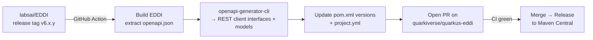
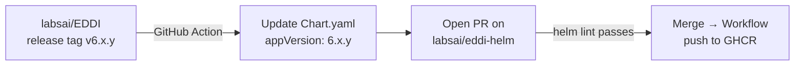

# EDDI SDK Ecosystem — Architecture Specification

> **Scope:** This document specifies the complete design for the EDDI SDK, split across **three repos**. It is linked from the main [implementation_plan.md](file:///c:/dev/git/EDDI/docs/v6-planning/implementation_plan.md) as Appendix O.
>
> **Prerequisite:** The v6 renaming (see [v6_renaming_recommendation.md](file:///c:/dev/git/EDDI/docs/v6-planning/v6_renaming_recommendation.md)) must be substantially complete before the SDK is started, so the SDK ships with v6 terminology from day one.
>
> **Timing:** Post v6.0 GA, once the API surface is stable.

---

## 1. Repo Separation

| Repo                           | Contents                                                       | Rationale                                                                                                     |
| ------------------------------ | -------------------------------------------------------------- | ------------------------------------------------------------------------------------------------------------- |
| **`quarkiverse/quarkus-eddi`** | `quarkus-eddi-client` (REST) + `quarkus-eddi-mcp-client` (MCP) | Quarkiverse standard for Quarkus extensions; published to Maven Central                                       |
| **`labsai/eddi-helm`**         | Helm chart + Kustomize overlays                                | Separate lifecycle from the Java SDK; published to GHCR + ArtifactHub; used by ops teams who don't touch Java |
| **`labsai/EDDI`**              | Sync pipeline (GitHub Actions that trigger on release)         | The source of truth for OpenAPI spec + Docker image versions                                                  |

> [!IMPORTANT]
> The Helm chart and the Quarkus extensions have completely different consumers (ops vs. devs), different release cadences (infrastructure vs. library), and different CI requirements. Keeping them in the same repo adds coupling without benefit.

---

## 2. `quarkiverse/quarkus-eddi` — Quarkus Extension

### 2.1 Project Structure

```
quarkiverse/quarkus-eddi/
├── .github/
│   ├── project.yml                         # Quarkiverse release config (version lock)
│   └── workflows/
│       ├── build.yml                       # CI: build + test on every PR
│       ├── release.yml                     # Release to Maven Central via Sonatype
│       └── ecosystem-ci.yml               # Daily: build against latest Quarkus snapshot
├── bom/
│   └── pom.xml                             # BOM artifact for consumers
├── client/
│   ├── runtime/
│   │   ├── pom.xml
│   │   └── src/main/java/io/quarkiverse/eddi/client/
│   │       ├── EddiClient.java             # High-level fluent facade
│   │       ├── EddiClientConfig.java       # @ConfigMapping interface
│   │       ├── api/                        # Generated REST client interfaces (~15 classes)
│   │       ├── model/                      # Generated DTOs (~30 classes)
│   │       ├── streaming/                  # SSE support (EddiStreamingClient, ConversationEvent, TokenEvent)
│   │       ├── health/                     # EddiHealthCheck (Quarkus readiness)
│   │       └── exception/                  # EddiClientException hierarchy
│   └── deployment/
│       └── src/main/java/io/quarkiverse/eddi/client/deployment/
│           ├── EddiClientProcessor.java    # Build step: register beans
│           └── EddiDevServicesProcessor.java# DevServices: auto-start EDDI + MongoDB
├── mcp-client/
│   ├── runtime/
│   │   ├── pom.xml
│   │   └── src/main/java/io/quarkiverse/eddi/mcp/
│   │       ├── EddiMcpClient.java          # High-level MCP facade
│   │       ├── EddiMcpClientConfig.java
│   │       ├── tools/                      # Typed wrappers (4 classes)
│   │       └── model/                      # MCP result DTOs
│   └── deployment/
│       └── src/main/java/io/quarkiverse/eddi/mcp/deployment/
│           └── EddiMcpClientProcessor.java
├── integration-tests/
│   ├── pom.xml
│   └── src/test/java/io/quarkiverse/eddi/it/
│       ├── EddiClientIT.java               # REST client integration tests
│       ├── EddiMcpClientIT.java            # MCP client integration tests
│       ├── EddiStreamingIT.java            # SSE streaming tests
│       └── EddiDevServicesIT.java          # DevServices auto-start test
├── docs/                                   # Antora module (Quarkiverse standard)
│   ├── pom.xml
│   └── modules/ROOT/pages/
│       ├── index.adoc
│       ├── getting-started.adoc
│       ├── rest-client.adoc
│       ├── mcp-client.adoc
│       ├── streaming.adoc
│       ├── devservices.adoc
│       └── configuration-reference.adoc
├── pom.xml                                 # Parent POM (packaging: pom)
└── README.md
```

### 2.2 REST Client SDK — `quarkus-eddi-client`

#### Consumer Experience

```properties
# application.properties
quarkus.eddi.url=http://eddi:7070
quarkus.eddi.api-key=${EDDI_API_KEY:}
quarkus.eddi.environment=production            # v6 default (was "unrestricted")
quarkus.eddi.connect-timeout=5s
quarkus.eddi.read-timeout=30s
```

```java
@Inject EddiClient eddi;

// Agent lifecycle (v6 terminology)
eddi.agents().deploy("agent-id", 1);
var conv = eddi.conversations().create("agent-id");
var response = eddi.conversations().say(conv.id(), "Hello!");

// Streaming (SSE)
eddi.streaming().say("agent-id", conv.id(), "Tell me a story", event -> {
    switch (event) {
        case TokenEvent t -> System.out.print(t.token());
        case TaskStartEvent s -> log.debug("Task: {}", s.taskId());
        case TaskCompleteEvent c -> log.debug("Done: {}", c.taskId());
    }
});
```

#### Typed Enums

The SDK ships typed enums rather than raw strings for provider and environment:

```java
public enum LlmProvider {
    OPENAI("openai"),
    ANTHROPIC("anthropic"),
    GEMINI("gemini"),
    GEMINI_VERTEX("gemini-vertex"),
    OLLAMA("ollama"),
    HUGGINGFACE("huggingface"),
    JLAMA("jlama");

    private final String value;
    // serialize to the string value EDDI expects
}

public enum Environment {
    PRODUCTION("production"),   // v6 (was "unrestricted")
    TEST("test");

    private final String value;
}
```

These are used throughout the SDK wherever EDDI accepts provider or environment strings, providing compile-time safety and IDE autocompletion.

#### REST API Coverage

The `EddiClient` facade groups EDDI's ~30 REST endpoints into domain-specific sub-clients:

| Sub-Client        | EDDI REST Endpoints                | Key Operations                         |
| ----------------- | ---------------------------------- | -------------------------------------- |
| `agents()`        | `/agentstore/agents/**`            | CRUD, deploy, undeploy, cascade delete |
| `conversations()` | `/agents/{env}/**`                 | create, say, read, end, undo/redo      |
| `workflows()`     | `/workflowstore/workflows/**`      | CRUD, read extensions                  |
| `rules()`         | `/rulestore/rulesets/**`           | CRUD                                   |
| `llm()`           | `/llmstore/llmconfigs/**`          | CRUD                                   |
| `apiCalls()`      | `/apicallstore/apicalls/**`        | CRUD                                   |
| `dictionaries()`  | `/dictionarystore/dictionaries/**` | CRUD                                   |
| `output()`        | `/outputstore/**`                  | CRUD                                   |
| `audit()`         | `/auditstore/**`                   | read by conversation/agent             |
| `secrets()`       | `/secretstore/**`                  | store, delete, list, metadata          |
| `schedules()`     | `/schedulerstore/**`               | CRUD, fire now, retry                  |
| `coordinator()`   | `/administration/coordinator/**`   | status, dead-letters                   |
| `exports()`       | `/backup/**`                       | export ZIP, import ZIP                 |

#### Config Properties

| Property                              | Type               | Default                  | Description                                 |
| ------------------------------------- | ------------------ | ------------------------ | ------------------------------------------- |
| `quarkus.eddi.url`                    | `String`           | —                        | **Required.** Base URL of the EDDI instance |
| `quarkus.eddi.api-key`                | `Optional<String>` | —                        | Bearer token for auth-enabled instances     |
| `quarkus.eddi.environment`            | `Environment`      | `PRODUCTION`             | Default environment for operations          |
| `quarkus.eddi.connect-timeout`        | `Duration`         | `5s`                     | HTTP connect timeout                        |
| `quarkus.eddi.read-timeout`           | `Duration`         | `30s`                    | HTTP read timeout                           |
| `quarkus.eddi.retry.max-retries`      | `int`              | `3`                      | Max retries on transient failures (5xx)     |
| `quarkus.eddi.retry.delay`            | `Duration`         | `500ms`                  | Base delay between retries                  |
| `quarkus.eddi.health.enabled`         | `boolean`          | `true`                   | Register EDDI readiness health check        |
| `quarkus.eddi.devservices.enabled`    | `boolean`          | `true`                   | Auto-start EDDI + MongoDB in dev/test       |
| `quarkus.eddi.devservices.image-name` | `String`           | `labsai/eddi:${version}` | Docker image for DevServices                |

#### DevServices

When `quarkus.eddi.devservices.enabled=true` (default in dev/test profiles), the deployment module:

1. Starts a **MongoDB container** (Testcontainers)
2. Starts an **EDDI container** (`labsai/eddi:${version}`) connected to that MongoDB
3. Auto-configures `quarkus.eddi.url` to point at the started instance
4. Waits for `/q/health/ready` before declaring ready

**Result:** Developers add one dependency and get a working EDDI instance — zero config.

#### Health Check

Registers a Quarkus readiness check that pings `{eddi.url}/q/health/ready`:

```json
{
  "name": "EDDI connection health check",
  "status": "UP",
  "data": { "url": "http://eddi:7070" }
}
```

#### Observability

- **MicroProfile Metrics** on all REST client calls (request count, latency histogram, error rate by endpoint)
- **OpenTelemetry** trace propagation — W3C `traceparent` header forwarded to EDDI
- **MDC** — agent ID and conversation ID in structured log context

### 2.3 MCP Client SDK — `quarkus-eddi-mcp-client`

#### Consumer Experience

```java
@Inject EddiMcpClient mcp;

// Setup an agent via MCP
var result = mcp.agents().setup(SetupAgentRequest.builder()
    .name("My Agent")
    .systemPrompt("You are a helpful assistant")
    .provider(LlmProvider.ANTHROPIC)           // typed enum
    .model("claude-sonnet-4-6")
    .apiKey("${vault:anthropic-key}")
    .build());

// Discover deployed agents
var agents = mcp.discovery().discoverAgents(Environment.PRODUCTION, "customer");

// Managed conversations
var response = mcp.conversations().chatManaged("support", "user-123", "Help!");
```

#### Tool Wrapper Classes

| Wrapper             | MCP Tools (v6 names)                                                                                                                                           |
| ------------------- | -------------------------------------------------------------------------------------------------------------------------------------------------------------- |
| `AgentTools`        | `setup_agent`, `create_api_agent`, `create_agent`, `get_agent`, `update_agent`, `delete_agent`, `deploy_agent`, `undeploy_agent`, `get_deployment_status`      |
| `ConversationTools` | `chat_with_agent`, `chat_managed`, `create_conversation`, `talk_to_agent`, `read_conversation`, `read_conversation_log`, `read_audit_trail`, `read_agent_logs` |
| `DiscoveryTools`    | `list_agents`, `list_agent_configs`, `discover_agents`, `list_agent_triggers`, trigger CRUD, `list_conversations`, `list_workflows`                            |
| `ResourceTools`     | `read_workflow`, `read_resource`, `create_resource`, `update_resource`, `delete_resource`, `apply_agent_changes`, `list_agent_resources`                       |

The MCP client connects to `{eddi.url}/mcp` via Streamable HTTP transport (`langchain4j-mcp`).

---

## 3. `labsai/eddi-helm` — Kubernetes Resources

### 3.1 Repo Structure

```
labsai/eddi-helm/
├── charts/
│   └── eddi/
│       ├── Chart.yaml
│       ├── values.yaml
│       ├── templates/
│       │   ├── deployment.yaml
│       │   ├── service.yaml
│       │   ├── configmap.yaml
│       │   ├── secret.yaml
│       │   ├── hpa.yaml
│       │   ├── ingress.yaml
│       │   ├── service-monitor.yaml     # Prometheus ServiceMonitor
│       │   └── _helpers.tpl
│       └── README.md
├── kustomize/
│   ├── base/                             # Minimal: Deployment + Service + ConfigMap
│   └── overlays/
│       ├── dev/                          # 1 replica, no auth
│       ├── staging/                      # 2 replicas, PostgreSQL
│       └── production/                   # HPA, NATS, Keycloak, monitoring
├── .github/workflows/
│   ├── lint.yml                          # helm lint + helm template on PR
│   └── release.yml                      # Workflow + push to GHCR + ArtifactHub
└── README.md
```

### 3.2 Helm Chart — `values.yaml` Key Sections

| Section          | Controls                                                                   |
| ---------------- | -------------------------------------------------------------------------- |
| `eddi.image`     | Repository (`labsai/eddi`), tag, pull policy, pull secrets                 |
| `eddi.replicas`  | Static count + HPA min/max/targetCPU                                       |
| `eddi.resources` | CPU/memory requests and limits                                             |
| `eddi.env`       | All EDDI config as env vars (DB URLs, secrets master key, feature flags)   |
| `eddi.datastore` | `mongodb` (default) or `postgres` — controls which DB subchart is deployed |
| `mongodb`        | Toggle + Bitnami MongoDB subchart values, or external `existingSecret`     |
| `postgresql`     | Toggle + Bitnami PostgreSQL subchart values, or external connection        |
| `nats`           | Optional NATS JetStream for async processing                               |
| `keycloak`       | Optional Keycloak for OIDC (`quarkus.oidc.*` config)                       |
| `ingress`        | Class, TLS, hosts, annotations                                             |
| `monitoring`     | Prometheus `ServiceMonitor` + optional Grafana dashboard ConfigMap         |

### 3.3 Install Example

```bash
helm install eddi oci://ghcr.io/labsai/charts/eddi \
  --set eddi.image.tag=6.0.0 \
  --set mongodb.enabled=true \
  --set eddi.env.EDDI_SECRETS_MASTER_KEY=$(openssl rand -hex 32) \
  --set ingress.enabled=true \
  --set ingress.hosts[0].host=eddi.example.com
```

---

## 4. Versioning Strategy

### 1:1 Version Lock

```
EDDI 6.0.0 → quarkus-eddi 6.0.0 → eddi-helm chart appVersion 6.0.0
EDDI 6.0.1 → quarkus-eddi 6.0.1 → eddi-helm chart appVersion 6.0.1
```

- **`.github/project.yml`** in quarkiverse always mirrors EDDI's latest version
- **`Chart.yaml` `appVersion`** always matches the EDDI Docker image tag
- Helm chart `version` (chart structure changes) is independent but starts at `1.0.0`
- If the SDK needs a bugfix independent of EDDI: use build qualifier (e.g., Maven classifier, not a version bump)

### Quarkus Platform Alignment

```xml
<!-- quarkus-eddi parent pom.xml -->
<properties>
    <quarkus.version>3.33.x</quarkus.version>  <!-- 3.33 LTS minimum -->
    <eddi.version>6.0.0</eddi.version>
</properties>
```

Minimum Quarkus version: **3.33 LTS** (GA ~March 25, 2026).

---

## 5. CI/CD & Automated Sync

### 5.1 Sync Pipeline: EDDI → quarkiverse/quarkus-eddi



### 5.2 Sync Pipeline: EDDI → labsai/eddi-helm



### 5.3 Workflow in `labsai/EDDI`: `.github/workflows/sync-sdk.yml`

```yaml
name: Sync SDK repos
on:
  release:
    types: [published]

jobs:
  sync-quarkiverse:
    runs-on: ubuntu-latest
    steps:
      - uses: actions/checkout@v4
      - uses: actions/setup-java@v4
        with: { java-version: '25', distribution: 'temurin' }
      - run: ./mvnw compile -DskipTests -q
      - name: Generate REST client from OpenAPI
        run: |
          npx @openapitools/openapi-generator-cli generate \
            -i target/openapi.json \
            -g java \
            -c .github/openapi-generator-config.json \
            -o /tmp/generated-client
      - name: Open PR on quarkiverse
        uses: peter-evans/create-pull-request@v6
        with:
          token: ${{ secrets.QUARKIVERSE_PAT }}
          path: quarkus-eddi
          branch: sync/eddi-${{ github.ref_name }}
          title: "chore: sync with EDDI ${{ github.ref_name }}"

  sync-helm:
    runs-on: ubuntu-latest
    steps:
      - uses: actions/checkout@v4
        with: { repository: labsai/eddi-helm, token: ${{ secrets.HELM_PAT }} }
      - name: Update appVersion
        run: |
          VERSION="${GITHUB_REF_NAME#v}"
          sed -i "s/appVersion:.*/appVersion: \"$VERSION\"/" charts/eddi/Chart.yaml
      - uses: peter-evans/create-pull-request@v6
        with:
          title: "chore: update appVersion to ${{ github.ref_name }}"
```

---

## 6. Enterprise-Readiness Checklist

### Security

- [ ] API key never logged (redacted in health check, redacted in debug logs)
- [ ] TLS configuration support (`quarkus.eddi.tls.*`)
- [ ] mTLS support for Kubernetes service mesh environments
- [ ] Vault reference passthrough (`${vault:key}`) in API key property

### Testing

- [ ] Unit tests: `EddiClient` facade (~30), `EddiMcpClient` wrappers (~20)
- [ ] Integration tests: Testcontainers EDDI (~15), SSE streaming (~5), DevServices (~3)
- [ ] Native image: `@QuarkusIntegrationTest` with `-Dnative`
- [ ] Helm: `helm lint`, `helm template` rendering, `ct lint` (chart-testing)

### Documentation

- [ ] Antora docs site (Quarkiverse standard, 7+ pages)
- [ ] Getting Started: from zero to working SDK in 5 minutes
- [ ] Configuration reference (auto-generated from `@ConfigMapping`)
- [ ] Migration guide for each major version

### Compatibility

- [ ] Quarkus 3.33 LTS + latest
- [ ] EDDI with MongoDB backend
- [ ] EDDI with PostgreSQL backend
- [ ] Java 21+ (matching EDDI's floor)
- [ ] Native image verified

---

## 7. Phased Effort Estimate

| Phase | What                                                                      | Where                      | SP        | Dependencies |
| ----- | ------------------------------------------------------------------------- | -------------------------- | --------- | ------------ |
| **A** | Scaffolding + OpenAPI codegen + `EddiClient` facade + health + unit tests | `quarkiverse/quarkus-eddi` | 16        | EDDI v6 GA   |
| **B** | SSE streaming + DevServices + native image verification                   | `quarkiverse/quarkus-eddi` | 8         | Phase A      |
| **C** | `EddiMcpClient` + typed tool wrappers + tests                             | `quarkiverse/quarkus-eddi` | 5         | Phase A      |
| **D** | Helm chart + Kustomize overlays + lint CI                                 | `labsai/eddi-helm`         | 7         | Independent  |
| **E** | Sync pipeline + Antora docs + observability polish                        | All 3 repos                | 8         | All phases   |
|       | **Total**                                                                 |                            | **44 SP** |              |

> [!TIP]
> **Phase D (Helm) can start immediately** — it has no dependency on v6 GA or the Java SDK. It only needs the existing Docker image.

---

## 8. Maven Coordinates

```xml
<!-- REST Client SDK -->
<dependency>
    <groupId>io.quarkiverse.eddi</groupId>
    <artifactId>quarkus-eddi-client</artifactId>
    <version>6.0.0</version>
</dependency>

<!-- MCP Client SDK (optional, add alongside or separately) -->
<dependency>
    <groupId>io.quarkiverse.eddi</groupId>
    <artifactId>quarkus-eddi-mcp-client</artifactId>
    <version>6.0.0</version>
</dependency>

<!-- BOM (manages agenth) -->
<dependency>
    <groupId>io.quarkiverse.eddi</groupId>
    <artifactId>quarkus-eddi-bom</artifactId>
    <version>6.0.0</version>
    <type>pom</type>
    <scope>import</scope>
</dependency>
```

Helm:

```bash
helm install eddi oci://ghcr.io/labsai/charts/eddi --version 1.0.0
```
