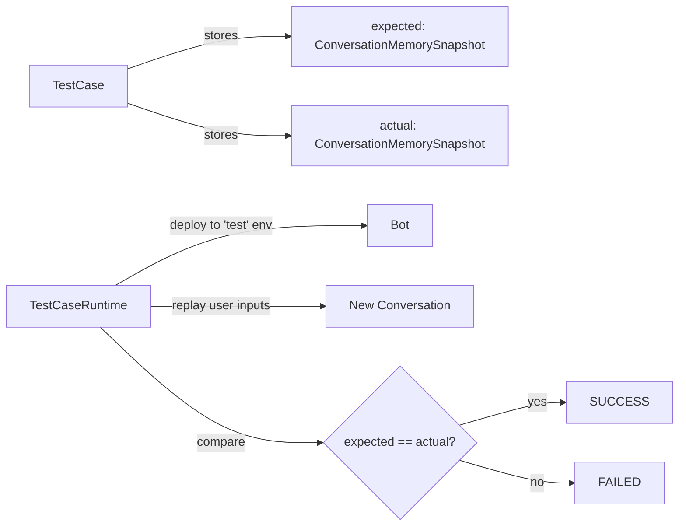

# EDDI v6.0.0 Roadmap — Deep Architecture Analysis & Extended Plan

---

## Part 1: Deep Architecture Critique (Code-Level)

### 1.1 Engine Core — Single-Instance Limitations

#### `ConversationCoordinator` — In-Memory Queues, No Persistence

[ConversationCoordinator.java](file:///c:/dev/git/EDDI/src/main/java/ai/labs/eddi/engine/runtime/internal/ConversationCoordinator.java)

```java
// Current: ConcurrentHashMap of in-memory queues — lost on restart
private final Map<String, BlockingQueue<Callable<Void>>> conversationQueues = new ConcurrentHashMap<>();
```

**Problems:**

- **No durability**: If the JVM crashes, all queued messages are lost
- **No horizontal scaling**: Two EDDI instances can't share conversation queues — a conversation is pinned to the instance that created it
- **No backpressure**: `LinkedTransferQueue` grows unbounded; a slow LLM call + fast user = memory pressure
- **No priority**: All conversations are equal; no way to prioritize VIP conversations
- **No dead-letter**: Failed messages are logged and discarded

**v6 Proposal:** Replace with an external message queue (see Section 3.3).

---

#### `BotFactory` — In-Memory Bot Registry

[BotFactory.java](file:///c:/dev/git/EDDI/src/main/java/ai/labs/eddi/engine/runtime/internal/BotFactory.java)

```java
// Current: In-memory map of deployed bots per environment
private final Map<Deployment.Environment, ConcurrentHashMap<BotId, IBot>> environments;
```

**Problems:**

- **No cross-instance sync**: If instance A deploys a bot, instance B doesn't know about it
- **Cold-start penalty**: All bots must be re-deployed after every restart
- ~~**No hot-swap**~~: ✅ _Already handled_ — Multiple versions run in parallel. New conversations start with the newest version, allowing graceful transitions for breaking changes within ongoing conversations.

**v6 Proposal:** Deployment state is already persistent (auto-deploy on startup works). Remaining gap: **cross-instance sync** — use pub/sub (via message queue) to broadcast deployment events when scaling horizontally.

---

#### `RestBotEngine` — 668-Line God-Class

[RestBotEngine.java](file:///c:/dev/git/EDDI/src/main/java/ai/labs/eddi/engine/internal/RestBotEngine.java) — 35 methods mixing REST endpoints, service logic, metrics, caching, and conversation orchestration.

**Problems:**

- **Violates Single Responsibility**: REST request handling, conversation lifecycle management, memory loading, metrics recording, state caching — all in one class
- ~~**AsyncResponse pattern is fragile**: Timeout handlers, manual `response.resume()` calls, error handling scattered through callbacks~~ — **Fixed in v6**: POST /say now returns synchronous 200 with full conversation JSON snapshot
- **No separation of controller/service**: Makes it impossible to call conversation logic from non-REST contexts (e.g., webhooks, MCP, scheduled tasks)

**v6 Proposal:** Extract into:

- `ConversationController` — REST endpoints only (thin JAX-RS layer)
- `ConversationService` — Business logic (create, say, end, read conversations)
- `ConversationMetricsService` — Micrometer instrumentation
- `ConversationStateCache` — Infinispan caching logic

---

### 1.2 Lifecycle Pipeline — Sequential-Only Execution

[LifecycleManager.java](file:///c:/dev/git/EDDI/src/main/java/ai/labs/eddi/engine/lifecycle/internal/LifecycleManager.java)

The pipeline is strictly sequential: `Parser → BehaviorRules → HttpCalls → LangChain → Output`. Each task runs one after another.

**What's missing:**

- **No parallel task execution**: Can't run HttpCalls and LangChain simultaneously when they're independent
- **No conditional branching**: Can't skip tasks based on conditions (only STOP_CONVERSATION exists)
- **No task retry/circuit-breaker**: If an LLM call fails, the entire pipeline fails
- **No task timeout**: A stuck LLM call blocks the conversation indefinitely (only bot-level 60s timeout)
- **No task priority/ordering hints**: Tasks execute in insertion order only

**v6 Proposal:** Introduce a DAG (Directed Acyclic Graph) execution model:

```
Parser ─→ BehaviorRules ─┬→ HttpCalls ──────┐
                          ├→ LangChain Task ─┤→ OutputMerger → Output
                          └→ RAG Retrieval ──┘
```

Tasks declare their dependencies. Independent tasks run in parallel. Add per-task timeouts and circuit-breakers.

---

### 1.3 `LangchainTask` — 583-Line Mixed Responsibilities

[LangchainTask.java](file:///c:/dev/git/EDDI/src/main/java/ai/labs/eddi/modules/langchain/impl/LangchainTask.java)

This single class handles:

- Legacy chat mode (simple LLM call)
- Agent mode (tool-calling loop)
- Model factory + caching (`getChatModel`, `ModelCacheKey`)
- Conversation history building
- Template processing on parameters
- Tool bridge construction
- Pre/post request processing

**v6 Proposal:** Decompose into:

- `ChatModelRegistry` — Model creation, caching, and routing
- `LegacyChatExecutor` — Simple chat mode (no tools)
- `AgentOrchestrator` — Tool-calling agent mode (extends `AgentExecutionHelper`)
- `ConversationHistoryBuilder` — Memory → ChatMessage list conversion
- `LangchainTask` — Thin orchestrator that delegates to the above

---

### 1.4 `IConversationMemory` — Stringly-Typed Data Model

[IConversationMemory.java](file:///c:/dev/git/EDDI/src/main/java/ai/labs/eddi/engine/memory/IConversationMemory.java)

```java
// Current: String keys, unchecked casts
IData<List<String>> latestData = currentStep.getLatestData("actions");
```

**Problems:**

- **No type safety**: All data accessed via string keys with unchecked generic casts
- **Silent null bugs**: `getLatestData` returns null if key doesn't exist — every caller must null-check
- **No schema**: No compile-time guarantee that "actions" contains `List<String>` vs `List<Integer>`
- **stack-of-maps pattern**: `ConversationStep` is essentially a `Map<String, Object>` inside a `Stack`

**v6 Proposal:** Introduce typed memory accessors:

```java
// Typed keys with compile-time safety
public static final MemoryKey<List<String>> ACTIONS = MemoryKey.of("actions", new TypeRef<>() {});
List<String> actions = currentStep.get(ACTIONS); // No cast needed, null-safe Optional
```

---

### 1.5 Configuration Loading — Repeated Boilerplate

Every task has the same `configure()` pattern:

```java
Object uriObj = configuration.get("uri");
URI uri = URI.create(uriObj.toString());
return resourceClientLibrary.getResource(uri, MyConfig.class);
```

This is duplicated across `HttpCallsTask`, `LangchainTask`, `BehaviorRulesEvaluationTask`, `OutputGenerationTask`, etc.

**v6 Proposal:** Extract a `ConfigurationLoader` utility or use annotation-based loading:

```java
@ConfiguredBy(uri = "uri", type = LangChainConfiguration.class)
public class LangchainTask { ... }
```

---

### 1.6 Caching — Infinispan Embedded Limitations

The current caching layer uses Infinispan Embedded with 4 custom classes (`CacheFactory`, `CacheImpl`, `ICache`, `ICacheFactory`).

**Problems:**

- **Embedded only**: Can't share cache across instances without switching to Infinispan Server / Redis
- **Custom abstraction**: Doesn't leverage Quarkus Cache (`@CacheResult`) annotations
- **No cache invalidation events**: Config changes rely on custom `@ConfigurationUpdate` annotation

**v6 Proposal:** Replace Infinispan Embedded with **Quarkus Cache + Redis** for distributed caching. Use `@CacheResult`, `@CacheInvalidate` annotations. This enables horizontal scaling with shared cache.

---

## Part 2: MCP (Model Context Protocol) Integration

### 2.1 EDDI as MCP Server — Exposing Bots as Tools/Resources

EDDI should expose its capabilities via MCP, making every bot addressable as an MCP tool:

```
MCP Client (IDE, Claude Desktop, etc.)
       │
       ▼ (MCP Protocol - JSON-RPC 2.0)
   EDDI MCP Server
       │
       ├── Tool: "talk_to_bot" (botId, message) → response
       ├── Tool: "create_conversation" (botId, environment) → conversationId
       ├── Tool: "list_bots" () → [{id, name, status}]
       ├── Resource: "bot://botId/config" → bot configuration JSON
       └── Resource: "conversation://convId/memory" → conversation state
```

**Implementation:** Use the [MCP Java SDK](https://github.com/modelcontextprotocol/java-sdk) to build an `McpServer` that wraps the existing `ConversationService` (after extracting it from `RestBotEngine`). Support both Stdio transport (for IDE plugins) and SSE transport (for web clients).

### 2.2 Bots Consuming MCP — Using External Tools via MCP

EDDI bots should be able to discover and invoke tools from external MCP servers:

```
EDDI Bot
  ├── Built-in Tools (Calculator, WebSearch, etc.)
  ├── HTTP Call Tools (configured httpcalls)
  └── MCP Tools (discovered from external MCP servers)
        ├── File system tool (from MCP file server)
        ├── Database tool (from MCP DB server)
        └── Code execution tool (from MCP sandbox)
```

**Implementation:** Add an `McpToolProvider` that connects to configured MCP servers via `McpClient`, discovers available tools, and dynamically registers them with langchain4j's tool system. Configure in `langchain.json`:

```json
{
  "mcpServers": [
    {
      "name": "filesystem",
      "command": "npx",
      "args": ["-y", "@modelcontextprotocol/server-filesystem", "/data"]
    },
    { "name": "database", "url": "http://mcp-db:8080/sse" }
  ]
}
```

### 2.3 Bot-to-Bot Communication via MCP

One EDDI bot talking to another EDDI bot as a tool:

```
User → Bot A (orchestrator)
           ├── MCP Call → Bot B (specialist: customer data)
           ├── MCP Call → Bot C (specialist: billing)
           └── Combines results → Response to User
```

---

## Part 3: Multi-Bot Orchestration

### 3.1 Parallel Model Execution

Send the same prompt to multiple models simultaneously and return the best/aggregated result:

```
User Input ──┬──→ GPT-4o ────────┐
             ├──→ Claude Sonnet ──┤──→ Response Selector ──→ Best Response
             └──→ Gemini Pro ─────┘
```

**Use cases:**

- **Quality comparison**: Which model gives the best answer?
- **Consensus**: Only accept answers where 2+ models agree
- **Speed-first**: Return whichever responds first

**Configuration in `langchain.json`:**

```json
{
  "orchestration": {
    "mode": "parallel",
    "models": ["openai:gpt-4o", "anthropic:claude-sonnet", "gemini:gemini-pro"],
    "selectionStrategy": "consensus" // or "fastest", "best-quality", "aggregate"
  }
}
```

### 3.2 Cascading Model Routing (Small → Better)

Try a cheap/fast model first. Escalate to a better model only if the first model's confidence is low or it can't handle the request:

```
User Input ──→ GPT-4o-mini ──→ Confidence Check
                                    ├── High → Return response
                                    └── Low → GPT-4o ──→ Return response
                                                 └── Still Low → Claude Opus
```

**Use cases:**

- **Cost optimization**: 80%+ of queries handled by the cheap model
- **Latency optimization**: Simple queries answered fast, complex ones take longer

### 3.3 Group of Experts / Debate Pattern

Multiple specialist agents discuss a topic and produce a collective opinion:

```
User Question: "Should we migrate to microservices?"

Round 1:
  ├── Architecture Expert → "Yes, for scalability..."
  ├── DevOps Expert → "Be careful, complexity increases..."
  └── Business Expert → "Consider the ROI..."

Round 2 (each reads others' Round 1 output):
  ├── Architecture Expert → "Acknowledging DevOps concerns, I suggest..."
  ├── DevOps Expert → "Architecture Expert makes a good point about..."
  └── Business Expert → "Given both perspectives, the ROI calculation..."

Final: Moderator Agent → Synthesized consensus opinion
```

**Implementation:** A new `DebateOrchestrationTask` that:

1. Spawns N parallel LangchainTask executions with different system prompts (expert personas)
2. Collects Round 1 outputs
3. Feeds all outputs back as context for Round 2
4. Optionally runs K rounds
5. Uses a moderator agent to synthesize the final response

---

## Part 4: OpenClaw-Inspired Features

| OpenClaw Feature                  | EDDI v6 Adaptation                                                                                                                                                                                         |
| --------------------------------- | ---------------------------------------------------------------------------------------------------------------------------------------------------------------------------------------------------------- |
| **Persistent Memory**             | Long-term user memory beyond conversation (user preferences, past interactions, learned facts). Store in dedicated MongoDB collection or vector DB. Make accessible to all bots for that user.             |
| **Heartbeat / Proactive Actions** | Scheduled bot actions (daily summaries, reminders, check-ins). Use Quarkus `@Scheduled` to trigger bots periodically. Configure per-bot: `"heartbeat": { "cron": "0 9 * * *", "action": "daily_summary" }` |
| **Self-Improving Skills**         | Bots that learn from interactions: track which tool calls succeed/fail, adjust prompts based on user feedback, accumulate FAQ from conversations.                                                          |
| **Multi-Channel Messaging**       | Beyond HTTP — WhatsApp, Telegram, Slack, Discord adapters. EDDI acts as the routing hub. Each channel adapter translates to/from EDDI's conversation API.                                                  |
| **Plugin Architecture**           | Formalize the `ILifecycleTask` plugin system: auto-discovery of tasks from JARs, plugin marketplace in Manager UI, versioned plugin dependencies.                                                          |
| **ReAct Loop**                    | Already partially implemented in `AgentExecutionHelper.executeWithTools()`. Enhance with: step-by-step reasoning trace, configurable max iterations, observation/reflection steps.                         |

---

## Part 5: Message Queue Infrastructure

### Current Architecture Problem

```
Client → REST API → ConversationCoordinator (in-memory queue) → LifecycleManager → MongoDB
```

Everything is synchronous within a single JVM. If the JVM dies, in-flight conversations are lost.

### v6 Proposed Architecture

```
Client → REST API → Message Queue (Kafka/RabbitMQ) → Worker Instances → MongoDB
              │                                            │
              └── SSE/WebSocket ◄──────────────────────────┘
```

**Why a separate queue container?**

- **Durability**: Messages survive restarts
- **Scalability**: N worker instances consuming from the same queue
- **Backpressure**: Queue acts as buffer during traffic spikes
- **Failover**: If a worker dies, another picks up the message
- **Observability**: Queue depth = system load indicator
- **Cross-service**: Other services can produce/consume conversation events

**Technology choice:**
| Option | Pros | Cons |
|---|---|---|
| **Apache Kafka** | Durability, replay, high throughput, partitioning by conversationId | Heavier ops, ZooKeeper/KRaft overhead |
| **RabbitMQ** | Simpler, mature, good for message routing, DLQ built-in | Lower throughput than Kafka |
| **Redis Streams** | Already considering Redis for caching, lightweight | Less mature for message queuing |
| **Quarkus Reactive Messaging** | Framework-native, abstracts broker choice (Kafka, AMQP, MQTT) | Adds abstraction layer |

**Recommendation:** Use **Quarkus Reactive Messaging with SmallRye** (which supports Kafka, AMQP/RabbitMQ, and MQTT). This gives you broker-agnostic code with the ability to switch implementations. Start with **RabbitMQ** for simplicity, migrate to Kafka if throughput demands it.

---

## Part 6: Database Strategy

### Current: MongoDB Only

- Configuration storage (bots, packages, extensions)
- Conversation memory (full history)
- Conversation descriptors
- Migration logs
- Properties

### Problems

- **No relational integrity**: Bot → Package → Extension relationships are maintained by application code, not DB constraints
- **Schema evolution**: 25KB `MigrationManager.java` suggests frequent painful migrations
- **Query limitations**: Aggregation on conversation analytics is cumbersome in MongoDB
- **Scaling**: Single database for both config (read-heavy) and conversations (write-heavy)

### v6 Proposed Database Architecture

| Data Type                             | Database                                                | Rationale                                                                                                                    |
| ------------------------------------- | ------------------------------------------------------- | ---------------------------------------------------------------------------------------------------------------------------- |
| **Bot configs, packages, extensions** | **PostgreSQL** (via Quarkus Hibernate/Panache)          | Relational data with versioning, referential integrity, transactional config updates, JSON/JSONB columns for flexible config |
| **Conversation memory**               | **MongoDB** (keep)                                      | Document-oriented, flexible schema, good for nested conversation steps                                                       |
| **Long-term user memory**             | **PostgreSQL** or **Vector DB** (Qdrant/pgvector)       | Structured user preferences + vector search for semantic memory                                                              |
| **Cache**                             | **Redis**                                               | Distributed cache, session state, pub/sub for cross-instance events                                                          |
| **Analytics**                         | **ClickHouse** or PostgreSQL with TimescaleDB extension | Time-series conversation metrics, model usage, costs                                                                         |

> [!IMPORTANT]
> This is the most significant breaking change. Consider a phased approach: start by adding PostgreSQL for new features (analytics, user memory, MCP registry) while keeping MongoDB for existing data.

---

## Part 7: Manager UI — UX Rethinking

### Current UX Problems (Beyond Tech Stack)

1. **Dashboard is just a bot list** — No status overview, no metrics, no recent activity, no at-a-glance health
2. **Configuration editing = raw JSON** — Users must understand the JSON schema to configure bots. No visual guidance, no validation feedback.
3. **Modal-heavy workflow** — 61 modal component files (`ModalComponent/`). Every action opens a modal. Modals stack. Context is lost.
4. **No visual flow** — The lifecycle pipeline is invisible. Users can't see how Parser → Rules → LLM → Output connects.
5. **No conversation debugger** — Can't step through a conversation to see what each task did, what data was in memory.
6. **Package management is opaque** — A "Package" is a list of URI references to extensions. There's no visual representation of what a package contains or does.
7. **No onboarding** — New users face a blank slate with no guidance on how to create their first bot.

### v6 UX Vision

#### Dashboard Redesign

```
┌──────────────────────────────────────────────────────────┐
│  EDDI Dashboard                                          │
├────────────┬────────────┬────────────┬───────────────────┤
│ Active     │ Convs      │ Avg        │ Total             │
│ Bots: 12   │ Today: 847 │ Resp: 1.2s │ Cost: $12.40      │
├────────────┴────────────┴────────────┴───────────────────┤
│ Recent Activity                    │ Bot Health          │
│ • Bot "Support" v3 deployed  2m    │ ● Support    OK     │
│ • 23 new conversations     15m     │ ● Sales      OK     │
│ • Error spike on "FAQ"     30m     │ ● FAQ        ⚠️     │
│ • Bot "Sales" config updated 1h   │ ● Billing    OK     │
├────────────────────────────────────┴────────────────────┤
│ Your Bots                           [+ Create Bot]       │
│ ┌──────────┐ ┌──────────┐ ┌──────────┐ ┌──────────┐    │
│ │ Support  │ │ Sales    │ │ FAQ      │ │ Billing  │    │
│ │ v3 ● UP  │ │ v2 ● UP  │ │ v1 ⚠️   │ │ v1 ● UP  │    │
│ │ 234 conv │ │ 156 conv │ │ 89 conv  │ │ 45 conv  │    │
│ └──────────┘ └──────────┘ └──────────┘ └──────────┘    │
└─────────────────────────────────────────────────────────┘
```

#### Visual Pipeline Builder

Replace raw JSON editing with a node-based flow editor:

```
[Input] → [Parser] → [Behavior Rules] → [LLM: GPT-4o] → [Output Templates]
                            │
                            ├── if "billing" → [HTTP: Billing API]
                            └── if "support" → [HTTP: Ticket System]
```

#### Inline Configuration with Live Preview

Instead of modals with raw JSON, use structured forms with:

- Auto-complete for template variables (`[[${memory.current.input}]]`)
- Live validation with clear error messages
- Side-by-side JSON view for power users
- Preview panel showing how the bot would respond

#### Conversation Debugger (Improve Existing)

> [!NOTE]
> The Manager already has a debugger view. The proposal below is to **significantly enhance** it from a basic log viewer to a full step-through replay tool.

Step-through replay of any conversation:

```
Step 1: User "What's the weather in NYC?"
  ├── Parser: expressions=[question(what), entity(weather), entity(NYC)]
  ├── BehaviorRules: matched "weather_query" → actions=["get_weather"]
  ├── HttpCalls: GET weather-api.com/NYC → {temp: 72, condition: "sunny"}
  ├── LangChain: "The weather in NYC is sunny at 72°F"
  └── Output: [text: "The weather in NYC is sunny at 72°F"]
```

#### Guided Bot Creation Wizard

Step-by-step wizard for new users:

1. Choose template (FAQ, Customer Support, Agent with Tools, RAG Assistant)
2. Configure LLM (model, system prompt)
3. Add tools/API connections
4. Define behavior rules (visual)
5. Test in built-in playground
6. Deploy

---

## Part 8: Updated Phased Roadmap

> **Last updated:** 2026-03-15. Phases 0–6C complete. Roadmap restructured with research gap analysis, phases split to ≤10 SP.

### Completed Phases (v6.0-alpha through v6.0-beta)

| Phase | Description | SP | Status |
|-------|------------|-----|--------|
| 0 | **Security Quick Wins** — CORS, PathNavigator | 6 | ✅ |
| 1 | **Backend Foundation** — ConversationService, LangchainTask decomp, typed memory, config consolidation | 20 | ✅ |
| 2 | **Testing Infrastructure** — 48 ITs, unit test gaps, API contracts | 14 | ✅ |
| 3 | **Manager UI Rewrite** — React 19/Vite/Tailwind, all editors, MSW, i18n, Keycloak | 36 | ✅ |
| 4 | **Hardening** — E2E Playwright, integration tests, JSON Schema, production build | 18 | ✅ |
| 5 | **NATS JetStream** — event bus abstraction, adapter, coordinator dashboard | 16 | ✅ |
| 6 | **PostgreSQL / DB-Agnostic** — repository abstraction, PG adapter, sync driver, 48 PG ITs | 26 | ✅ |
| 6C | **Infinispan → Caffeine** — 2 files rewritten, 4 POM deps removed, Caffeine via quarkus-cache | 2 | ✅ |

### Quick Wins (before Phase 7)

| Item | Description | SP | Status |
|------|------------|-----|--------|
| 6E | **quarkus-langchain4j → langchain4j Core** — Remove `io.quarkiverse.langchain4j` dependency, use `dev.langchain4j` core modules only (3 files, POM cleanup) | 2 | ⬜ |
| 6D | **Lombok Removal** — Delombok 114 files (371 annotations), `@Value`→records, `@Slf4j`→JBoss Logger | 5 | ⬜ |
| — | **Quarkus 3.33 LTS Upgrade** — waiting for GA (~March 25, 2026). 3.32.3 blocked by Java 25 `ALL-UNNAMED` issue | 2 | ⏳ |

#### Phase 6E Detail: quarkus-langchain4j → langchain4j Core

**Why**: EDDI uses `quarkus-langchain4j` 1.7.4 alongside core `langchain4j` 1.11.0 — two different versions of the same ecosystem creating version conflicts. EDDI builds models at runtime from JSON config, which is the opposite of quarkus-langchain4j's compile-time `@RegisterAiService` approach. EDDI uses none of quarkiverse's CDI magic, Dev Services, or auto-config.

**Impact**: 6 POM deps removed/replaced, 3 Java files modified, 0 config changes.

**Current usage** — only 3 of 7 builders use quarkiverse classes:

| Builder | Current (quarkiverse) | Target (core) |
|---------|----------------------|---------------|
| `VertexGeminiLanguageModelBuilder` | `io.quarkiverse.langchain4j.vertexai.runtime.gemini.VertexAiGeminiChatLanguageModel` | `dev.langchain4j.model.vertexai.VertexAiGeminiChatModel` |
| `HuggingFaceLanguageModelBuilder` | `io.quarkiverse.langchain4j.huggingface.QuarkusHuggingFaceChatModel` | `dev.langchain4j.model.huggingface.HuggingFaceChatModel` |
| `JlamaLanguageModelBuilder` | `io.quarkiverse.langchain4j.jlama.JlamaChatModel` | `dev.langchain4j.model.jlama.JlamaChatModel` |

**POM changes:**

| POM Dependency | Action |
|---|---|
| `quarkus-langchain4j-openai` | **Remove** — `OpenAILanguageModelBuilder` already uses `dev.langchain4j.model.openai.OpenAiChatModel` |
| `quarkus-langchain4j-anthropic` | **Remove** — `AnthropicLanguageModelBuilder` already uses `dev.langchain4j.model.anthropic.AnthropicChatModel` |
| `quarkus-langchain4j-ollama` | **Remove** — `OllamaLanguageModelBuilder` already uses `dev.langchain4j.model.ollama.OllamaChatModel` |
| `quarkus-langchain4j-vertex-ai-gemini` | **Replace** → `dev.langchain4j:langchain4j-vertex-ai-gemini:${langchain4j-libs.version}` |
| `quarkus-langchain4j-hugging-face` | **Replace** → `dev.langchain4j:langchain4j-hugging-face:${langchain4j-libs.version}` |
| `quarkus-langchain4j-jlama` | **Replace** → `dev.langchain4j:langchain4j-jlama:${langchain4j-libs.version}` |
| `<quarkus.langchain4j.version>` property | **Remove** entirely |

**Note on HuggingFace**: `QuarkusHuggingFaceChatModel.builder()` uses `Optional`/`OptionalInt`/`OptionalDouble` wrappers for `topK`, `topP`, `doSample`, `repetitionPenalty`. Core `HuggingFaceChatModel` likely uses plain primitives — verify API.

**Jlama decision**: Keep. Runs in-process JVM inference (niche/edge use). Ollama in a separate Docker container is far more practical for production, but Jlama costs nothing to maintain.

**Verification**: `./mvnw compile && ./mvnw test && ./mvnw dependency:tree | grep -i quarkiverse` (should return nothing)

### Phase 7: Secrets, Audit + Tenant Foundation (v6.0-beta2, 12 SP)

> Remove production blockers. Low complexity, no dependencies, maximum enterprise unlock.

| # | Item | SP | Priority |
|---|------|----|----------|
| 33 | **Secrets Vault** — `${vault:key}` references resolved at runtime, export sanitization scrubs plaintext keys | 5 | 🔴 Critical |
| 34 | **Immutable Audit Ledger** — write-once append-only trail of compiled prompts, tool calls, responses, costs (EU AI Act) | 5 | 🔴 Critical |
| 34b | **Tenant Quota Stub** — per-tenant API rate limits, usage metering counters, configurable resource caps (SaaS foundation) | 2 | 🟡 High |

### Phase 8a: MCP Servers (v6.0-beta3, 8 SP)

> EDDI's integration story. The broadest MCP scope of any JVM platform.
> **Leverage:** Core langchain4j `@Tool` annotations for MCP tool definitions. MCP server/client support available in core langchain4j.

| # | Item | SP | Priority |
|---|------|----|----------|
| 35 | **MCP Server: Bot Conversations** — `talk_to_bot`, `create_conversation`, `list_bots` tools | 5 | 🔴 Critical |
| 36 | **MCP Server: EDDI Admin API** — manage bots/packages/deploy/config via MCP | 3 | 🟡 High |

### Phase 8b: MCP Client + RAG Foundation (10 SP)

> MCP Client + basic RAG together tell the story: "EDDI bots can access any tool AND any knowledge base."
> **Leverage:** Core `langchain4j` `EmbeddingStore` + `EmbeddingModel` + `ContentRetriever` interfaces for vector store abstraction. Use `RetrievalAugmentor` and `EmbeddingStoreContentRetriever` from core langchain4j. Wrap in `ILifecycleTask` for config-driven orchestration.

| # | Item | SP | Priority |
|---|------|----|----------|
| 37 | **MCP Server: EDDI Documentation** — docs.labs.ai content as MCP resources | 2 | 🟡 High |
| 38 | **MCP Client** — bots consume external MCP tools (filesystem, database, code execution). Leverage core langchain4j MCP client support | 5 | 🟡 High |
| 38b | **RAG Lifecycle Task** — new `ILifecycleTask` for vector store retrieval. Config-driven: embedding model, store type, chunk strategy, top-K. Uses langchain4j `EmbeddingStore`/`EmbeddingModel` abstractions for provider-agnostic vector search | 3 | 🟡 High |
| — | Phase 8b includes design doc for Workspace AI Operator | — | 🟠 Medium |

### Phase 9: DAG Pipeline + Governance (v6.0-rc1, 10 SP)

> Enable parallel execution. Foundation for multi-bot.
> **Leverage:** langchain4j's `AiServices` for structured output parsing in DAG node results.

| # | Item | SP | Priority |
|---|------|----|----------|
| 39 | **3-Tier State Architecture (CQRS)** — partition memory into Execution Token / Transient Context / Telemetry Ledger | 5 | 🟡 High |
| 40 | **DAG Pipeline Execution** — parallel tasks, per-task circuit breakers, execution hash dedup, budget-aware branches | 5 | 🟡 High |
| 40b | **OpenTelemetry Tracing** — distributed trace context through pipeline steps, MCP calls, and LLM invocations. Essential for debugging multi-step agent flows | — | 🟡 High |

> [!NOTE]
> **OpenTelemetry** is bundled with DAG because that's when request tracing across parallel tasks becomes essential. Quarkus has built-in OTel support (`quarkus-opentelemetry`). The 30+ existing Micrometer metrics continue to work alongside OTel traces.

### Phase 9b: HITL Framework (5 SP)

| # | Item | SP | Priority |
|---|------|----|----------|
| 41 | **HITL Framework** — pause/resume/approve for STATE_CHANGING MCP tools, budget thresholds, human escalation | 3 | 🟡 High |
| 42 | **Workspace AI Operator** — system bot with admin API access | 2 | 🟠 Medium |

### Phase 10a: Multi-Bot Orchestration (8 SP)

> The differentiating features. Depend on DAG (Phase 9).
> **Leverage:** langchain4j's `ChatMemory` and `TokenWindowChatMemory` for cross-bot conversation context passing.

| # | Item | SP | Priority |
|---|------|----|----------|
| 43 | **Bot-to-bot routing** — orchestrator bot pattern, cascading conversation context | 5 | 🟡 High |
| 44 | **Cascading model routing** — small→better fallback, consensus modes | 3 | 🟡 High |

### Phase 10b: Advanced RAG + Debate (8 SP)

> Builds on the basic RAG task from Phase 8b. Adds provenance, multi-tenant isolation, and debate patterns.
> **Leverage:** langchain4j `ContentRetriever`, `QueryTransformer`, `QueryRouter` for advanced retrieval strategies.

| # | Item | SP | Priority |
|---|------|----|----------|
| 45 | **Advanced RAG** — document ingestion pipeline, chunk provenance tracking, tenant-level RLS on vector store, re-ranking | 5 | 🟡 High |
| 46 | **Group-of-Experts / Debate Pattern** — multi-round specialist bots with moderator synthesis | 3 | 🟠 Medium |

### Phase 11a: Persistent Memory + Heartbeat (8 SP)

> User-facing intelligence features.
> **Leverage:** langchain4j `ChatMemoryStore` interface for persistent memory backend abstraction.

| # | Item | SP | Priority |
|---|------|----|----------|
| 47 | **Persistent User Memory** — cross-conversation, cross-bot user knowledge store | 5 | 🟡 High |
| 48 | **Heartbeat / Scheduled Triggers** — cluster-safe via NATS exactly-once, bot self-scheduling via tool | 3 | 🟡 High |

### Phase 11b: Multi-Channel Adapters (5 SP)

| # | Item | SP | Priority |
|---|------|----|----------|
| 49 | **Multi-Channel Adapters** — WhatsApp/Telegram/Slack (separate services) | 5 | 🟠 Medium |

### Phase 12: CI/CD — GitHub Actions Migration (8 SP)

> CircleCI currently handles builds. This migrates to GitHub Actions for unified ecosystem.

| # | Item | SP | Priority |
|---|------|----|----------|
| 50 | **GitHub Actions: EDDI** — compile, test, Docker build, integration tests, push | 3 | 🟠 Medium |
| 51 | **GitHub Actions: Manager + Chat-UI + Website** — build, test, deploy | 5 | 🟠 Medium |

### Phase 13a: Time-Traveling Debugger (5 SP)

> Depends on Audit Ledger (Phase 7).

| # | Item | SP | Priority |
|---|------|----|----------|
| 52 | **Time-Traveling Debugger** — step-through replay from audit ledger, compiled prompt viewer, memory diffs | 5 | 🟡 High |

### Phase 13b: Visual Pipeline Builder + Taint Tracking (8 SP)

| # | Item | SP | Priority |
|---|------|----|----------|
| 53 | **Visual Pipeline Builder** — Linear/Block Hybrid editor, side-sheet inspectors | 5 | 🟠 Medium |
| 54 | **Visual Taint Tracking** — green/yellow/red data provenance indicators | 3 | 🟠 Medium |

### Phase 14a: Website — Astro Setup (5 SP)

| # | Item | SP | Priority |
|---|------|----|----------|
| 55 | Scaffold Astro + Tailwind + i18n | 2 | 🟠 Medium |
| 56 | Dark/light + RTL | 3 | 🟠 Medium |

### Phase 14b: Website — Content + Deployment (9 SP) [LAST]

| # | Item | SP | Priority |
|---|------|----|----------|
| 57 | Migrate content into components | 3 | 🟠 Medium |
| 58 | Documentation pages (Content Collections) | 5 | 🟠 Medium |
| 59 | GitHub Actions deployment | 1 | 🟠 Medium |

### Future: Deployment Coordination Enhancement

> Replace the current 10-second `@Scheduled` DB polling for bot deployments with NATS pub/sub deployment events for instant cross-instance coordination.

### Implementation Note: langchain4j / quarkus-langchain4j Leverage

> [!IMPORTANT]
> **Maximize reuse of langchain4j and quarkus-langchain4j** across all phases. EDDI already uses langchain4j for model building, tool execution, and streaming. Future phases should:
> - Use `EmbeddingStore`/`EmbeddingModel` interfaces for RAG (not custom vector clients)
> - Use `quarkus-langchain4j` MCP support for MCP server/client where it fits EDDI's config-driven model
> - Use `ChatMemoryStore` for persistent memory
> - Use `ContentRetriever`/`QueryTransformer` for advanced RAG strategies
> - Keep EDDI's `ILifecycleTask` as the orchestration layer that *wraps* langchain4j components — don't bypass the pipeline

---

## Resolved Decisions (User Confirmed)

| #   | Question                            | Decision                                                                                                                                                      | Notes                                                           |
| --- | ----------------------------------- | ------------------------------------------------------------------------------------------------------------------------------------------------------------- | --------------------------------------------------------------- |
| 1   | MCP scope                           | **Opt-in per bot**                                                                                                                                            | Security-first: bots not exposed without explicit configuration |
| 2   | Multi-bot orchestration granularity | **Per-action within behavior rules** and/or per-package                                                                                                       | More flexible than per-bot only                                 |
| 3   | Queue technology                    | **Start with NATS JetStream** (lightweight, cloud-native), RabbitMQ as fallback                                                                               | Research done — see business_logic_analysis.md Section 5        |
| 4   | PostgreSQL migration                | **DB-agnostic architecture** (Abstract Repository pattern) — admin chooses DB via config. Implement PostgreSQL as primary new backend, keep MongoDB supported | User prefers full migration or admin choice                     |
| 5   | Manager rewrite                     | Decision pending — but critical security upgrades needed immediately (keycloak-js, tslint removal)                                                            |                                                                 |
| 6   | NLP module/expressions              | **Option C: Hybrid** — keep parser for guided flows, add LLM-based intent for agents, simplify syntax for new users                                           | User confirmed after deep-dive                                  |
| 7   | Persistent memory                   | Decision pending                                                                                                                                              | Both per-user and per-user-per-bot valid                        |
| 8   | Multi-channel                       | **Separate services** for each channel adapter                                                                                                                | User preference                                                 |
| 9   | Self-improvement                    | Decision pending                                                                                                                                              |                                                                 |
| 10  | Bot Father                          | Decision pending                                                                                                                                              |                                                                 |

---

## Appendix A: Project Structure & Repos

```
c:\dev\git\EDDI\                    ← Backend (Quarkus, Java 21)
c:\dev\git\EDDI-Manager\            ← Manager UI (React 18, Redux, Webpack)
c:\dev\git\EDDI-integration-tests\  ← Integration tests
c:\dev\git\eddi-chat-ui\            ← Chat widget (React 18, CRA)
c:\dev\git\eddi-website\            ← Marketing website
```

### Backend Package Layout

```
src/main/java/ai/labs/eddi/
├── configs/             ← Configuration stores (13 resource types)
│   ├── behavior/        ← IBehaviorStore, BehaviorStore, RestBehaviorStore
│   ├── bots/            ← Bot config CRUD
│   ├── deployment/      ← Deployment state management
│   ├── http/            ← HttpCalls config CRUD
│   ├── langchain/       ← LangChain config CRUD
│   ├── migration/       ← MigrationManager (505 lines, MongoDB-coupled)
│   ├── output/          ← Output template CRUD
│   ├── packages/        ← Package config + ExtensionDescriptor
│   ├── parser/          ← Parser config CRUD
│   └── properties/      ← Properties CRUD
├── datastore/           ← Database abstraction layer
│   ├── IResourceStore.java     ← CRUD interface (66 lines)
│   ├── IResourceStorage.java   ← SPI for DB backends (46 lines)
│   └── mongo/
│       ├── HistorizedResourceStore.java   ← Versioning logic (191 lines, DB-agnostic!)
│       └── MongoResourceStorage.java      ← MongoDB implementation (305 lines, SOLE coupling)
├── engine/              ← Core runtime engine
│   ├── caching/         ← 4 Infinispan cache files (CacheFactory, CacheImpl, ICache, ICacheFactory)
│   ├── internal/        ← RestBotEngine.java (668 lines, 35 methods — THE god class)
│   ├── lifecycle/       ← ILifecycleTask (207 lines), LifecycleManager (266 lines)
│   ├── memory/          ← IConversationMemory, ConversationMemoryStore (221 lines)
│   └── runtime/         ← ConversationCoordinator (187 lines), BotFactory, IRuntime
└── modules/             ← Feature modules (lifecycle tasks + tools)
    ├── behavior/        ← BehaviorRulesEvaluationTask + conditions (inputmatcher, actionmatcher, etc.)
    ├── httpcalls/       ← HttpCallsTask
    ├── langchain/       ← LangchainTask (583 lines) + tools (13 files)
    ├── nlp/             ← InputParserTask + 77 files (expressions, dictionaries, normalizers, corrections)
    ├── output/          ← OutputGenerationTask
    ├── properties/      ← PropertySetterTask
    └── templating/      ← OutputTemplateTask
```

---

## Appendix B: ILifecycleTask Registry

All 7 lifecycle task implementations, in typical pipeline execution order:

| #   | Task Class                    | ID                        | Type             | Key File                                                                                                                                      | Lines | Purpose                                                   |
| --- | ----------------------------- | ------------------------- | ---------------- | --------------------------------------------------------------------------------------------------------------------------------------------- | ----- | --------------------------------------------------------- |
| 1   | `InputParserTask`             | `ai.labs.parser`          | `expressions`    | [InputParserTask.java](file:///c:/dev/git/EDDI/src/main/java/ai/labs/eddi/modules/nlp/InputParserTask.java)                                   | 391   | Normalize input → dictionary lookup → extract expressions |
| 2   | `BehaviorRulesEvaluationTask` | `ai.labs.behavior`        | `behavior_rules` | [BehaviorRulesEvaluationTask.java](file:///c:/dev/git/EDDI/src/main/java/ai/labs/eddi/modules/behavior/impl/BehaviorRulesEvaluationTask.java) | 218   | Evaluate IF-THEN rules → emit actions                     |
| 3   | `PropertySetterTask`          | `ai.labs.property`        | `properties`     | [PropertySetterTask.java](file:///c:/dev/git/EDDI/src/main/java/ai/labs/eddi/modules/properties/impl/PropertySetterTask.java)                 | 371   | Extract/set conversation properties (slot-filling)        |
| 4   | `HttpCallsTask`               | `ai.labs.httpcalls`       | `httpCalls`      | [HttpCallsTask.java](file:///c:/dev/git/EDDI/src/main/java/ai/labs/eddi/modules/httpcalls/impl/HttpCallsTask.java)                            | 128   | Thin wrapper — delegates to `IHttpCallExecutor`           |
| 5   | `LangchainTask`               | `ai.labs.langchain`       | `langchain`      | [LangchainTask.java](file:///c:/dev/git/EDDI/src/main/java/ai/labs/eddi/modules/langchain/impl/LangchainTask.java)                            | 583   | LLM chat (legacy mode) or agent loop (with tools)         |
| 6   | `OutputGenerationTask`        | `ai.labs.output`          | `output`         | [OutputGenerationTask.java](file:///c:/dev/git/EDDI/src/main/java/ai/labs/eddi/modules/output/impl/OutputGenerationTask.java)                 | 320   | Select output templates based on actions                  |
| 7   | `OutputTemplateTask`          | `ai.labs.output.template` | `outputTemplate` | [OutputTemplateTask.java](file:///c:/dev/git/EDDI/src/main/java/ai/labs/eddi/modules/templating/OutputTemplateTask.java)                      | 216   | Apply Thymeleaf templates to output                       |

**How to add a new task**: See `GEMINI.md` Section 3 for the complete pattern. Each new task requires:

1. Task class implementing `ILifecycleTask` with `@ApplicationScoped`
2. Configuration model POJO
3. Store interface extending `IResourceStore<T>`
4. MongoDB store implementation
5. REST API interface and implementation
6. `ExtensionDescriptor` for Manager UI

---

## Appendix C: Built-in Tool Inventory

Located at `src/main/java/ai/labs/eddi/modules/langchain/tools/`:

| Tool                 | File                                                                                                                                    | `@Tool` Annotation   | Notes                                                         |
| -------------------- | --------------------------------------------------------------------------------------------------------------------------------------- | -------------------- | ------------------------------------------------------------- |
| `CalculatorTool`     | [impl/CalculatorTool.java](file:///c:/dev/git/EDDI/src/main/java/ai/labs/eddi/modules/langchain/tools/impl/CalculatorTool.java)         | `@Tool("Calculate")` | Uses `SafeMathParser` (recursive descent), NOT `ScriptEngine` |
| `DataFormatterTool`  | [impl/DataFormatterTool.java](file:///c:/dev/git/EDDI/src/main/java/ai/labs/eddi/modules/langchain/tools/impl/DataFormatterTool.java)   |                      | Format data transformations                                   |
| `DateTimeTool`       | [impl/DateTimeTool.java](file:///c:/dev/git/EDDI/src/main/java/ai/labs/eddi/modules/langchain/tools/impl/DateTimeTool.java)             |                      | Date/time utilities                                           |
| `PdfReaderTool`      | [impl/PdfReaderTool.java](file:///c:/dev/git/EDDI/src/main/java/ai/labs/eddi/modules/langchain/tools/impl/PdfReaderTool.java)           |                      | Read PDF documents                                            |
| `TextSummarizerTool` | [impl/TextSummarizerTool.java](file:///c:/dev/git/EDDI/src/main/java/ai/labs/eddi/modules/langchain/tools/impl/TextSummarizerTool.java) |                      | Summarize text                                                |
| `WeatherTool`        | [impl/WeatherTool.java](file:///c:/dev/git/EDDI/src/main/java/ai/labs/eddi/modules/langchain/tools/impl/WeatherTool.java)               |                      | Weather API integration                                       |
| `WebScraperTool`     | [impl/WebScraperTool.java](file:///c:/dev/git/EDDI/src/main/java/ai/labs/eddi/modules/langchain/tools/impl/WebScraperTool.java)         |                      | Scrape web pages (validates URLs!)                            |
| `WebSearchTool`      | [impl/WebSearchTool.java](file:///c:/dev/git/EDDI/src/main/java/ai/labs/eddi/modules/langchain/tools/impl/WebSearchTool.java)           |                      | Web search                                                    |

**Tool infrastructure** (all tools flow through this pipeline):

```
Tool Call → ToolRateLimiter → ToolCacheService → ToolExecutionService.executeToolWrapped() → ToolCostTracker → Result
```

- [ToolExecutionService.java](file:///c:/dev/git/EDDI/src/main/java/ai/labs/eddi/modules/langchain/tools/ToolExecutionService.java) — orchestrates the pipeline
- [ToolRateLimiter.java](file:///c:/dev/git/EDDI/src/main/java/ai/labs/eddi/modules/langchain/tools/ToolRateLimiter.java) — per-tool rate limiting
- [ToolCacheService.java](file:///c:/dev/git/EDDI/src/main/java/ai/labs/eddi/modules/langchain/tools/ToolCacheService.java) — response caching
- [ToolCostTracker.java](file:///c:/dev/git/EDDI/src/main/java/ai/labs/eddi/modules/langchain/tools/ToolCostTracker.java) — tracks costs (capped at 10,000 entries per conversation)
- [EddiToolBridge.java](file:///c:/dev/git/EDDI/src/main/java/ai/labs/eddi/modules/langchain/tools/EddiToolBridge.java) — bridges langchain4j tools with EDDI's tool pipeline

> [!IMPORTANT]
> **Security**: All tools accepting URLs MUST use `UrlValidationUtils.validateUrl(url)` to block private IPs, internal hostnames, and non-HTTP schemes. See GEMINI.md Section E.2a.

---

## Appendix D: Conversation Memory Key Registry

Keys used by tasks to store/read data in `IConversationMemory`:

| Key                  | Type               | Written By                    | Read By                                                                        | Public? |
| -------------------- | ------------------ | ----------------------------- | ------------------------------------------------------------------------------ | ------- |
| `input`              | `String`           | Engine (user message)         | `InputParserTask`                                                              | Yes     |
| `input:normalized`   | `String`           | `InputParserTask`             | —                                                                              | No      |
| `expressions:parsed` | `String`           | `InputParserTask`             | `BehaviorRulesEvaluationTask`, `InputMatcher`                                  | No      |
| `intents`            | `List<String>`     | `InputParserTask`             | —                                                                              | Yes     |
| `actions`            | `List<String>`     | `BehaviorRulesEvaluationTask` | `HttpCallsTask`, `LangchainTask`, `OutputGenerationTask`, `PropertySetterTask` | Yes     |
| `httpCalls`          | varies             | `HttpCallsTask`               | —                                                                              | Yes     |
| `output`             | `List<OutputItem>` | `OutputGenerationTask`        | `OutputTemplateTask`                                                           | Yes     |
| `quickReplies`       | `List<QuickReply>` | `OutputGenerationTask`        | `InputParserTask` (next step!)                                                 | Yes     |
| `langchain`          | `String`           | `LangchainTask`               | —                                                                              | Yes     |
| `systemMessage`      | `String`           | `LangchainTask`               | —                                                                              | No      |
| `prompt`             | `String`           | `LangchainTask`               | —                                                                              | No      |

**Pattern for reading/writing** (from [GEMINI.md](file:///c:/dev/git/EDDI/.agents/GEMINI.md)):

```java
// Reading — always null-check
IData<List<String>> latestData = currentStep.getLatestData("actions");
if (latestData == null) return;
List<String> actions = latestData.getResult();

// Writing
var data = new Data<>("mykey:result", myValue);
data.setPublic(true); // only if user-visible
currentStep.storeData(data);
```

---

## Appendix E: Chat-UI Technology Assessment

| Technology              | Version   | Status                                             |
| ----------------------- | --------- | -------------------------------------------------- |
| React                   | 18.3.1    | ✅ Current                                         |
| **react-scripts (CRA)** | **5.0.1** | **❌ Deprecated** — CRA is officially unmaintained |
| **TypeScript**          | **4.9.5** | **⚠️ Old** — current is 5.x                        |
| react-markdown          | 9.0.1     | ✅ Current                                         |
| react-router-dom        | 6.23.1    | ✅ Current                                         |

**v6 proposal**: Rewrite Chat-UI using Vite. The current CRA-based setup cannot support streaming (SSE) or embeddable widget patterns (Web Components / shadow DOM).

---

## Appendix F: Concrete Implementation Notes per Roadmap Item

### Item 1: Extract `ConversationService` from `RestBotEngine`

**Current state**: [RestBotEngine.java](file:///c:/dev/git/EDDI/src/main/java/ai/labs/eddi/engine/internal/RestBotEngine.java) — 668 lines, 35 methods.

**Methods to extract** (by target service):

| Target Class                     | Methods to Move                                                                                                                                                                                                                                                                                                              | Line Range           |
| -------------------------------- | ---------------------------------------------------------------------------------------------------------------------------------------------------------------------------------------------------------------------------------------------------------------------------------------------------------------------------- | -------------------- |
| `ConversationService`            | `startConversationWithContext`, `executeConversationStep`, `endConversation`, `readConversation`, `readConversationLog`, `getConversationState`, `rerunLastConversationStep`, `loadAndValidateConversationMemory`, `loadConversationMemory`, `storeConversationMemory`, `undo`, `redo`, `isUndoAvailable`, `isRedoAvailable` | L131-620             |
| `ConversationMetricsService`     | `recordMetrics`, `createReferenceForMetrics`, all Micrometer counter/timer logic                                                                                                                                                                                                                                             | L659-666             |
| `ConversationStateCache`         | `getConversationState`, `cacheConversationState`, `setConversationState`                                                                                                                                                                                                                                                     | L274-641             |
| `ConversationController` (stays) | All `@Path`/`@POST`/`@GET` annotated REST endpoints as thin wrappers delegating to `ConversationService`                                                                                                                                                                                                                     | all REST annotations |

**Dependencies of `RestBotEngine`** (to be injected into service):

```java
@Inject: IBotFactory, IConversationCoordinator, IRuntime, IConversationSetup,
         IConversationMemoryStore, IPropertiesStore, IDocumentDescriptorStore,
         ICacheFactory, MeterRegistry
```

### Item 3: Decompose `LangchainTask`

**Current method breakdown** (all in [LangchainTask.java](file:///c:/dev/git/EDDI/src/main/java/ai/labs/eddi/modules/langchain/impl/LangchainTask.java)):

| Method                                     | Lines   | Extract To                                                                  |
| ------------------------------------------ | ------- | --------------------------------------------------------------------------- |
| `execute()`                                | 139-166 | Keep in `LangchainTask` (thin orchestrator)                                 |
| `executeTask()`                            | 168-324 | Split: legacy path → `LegacyChatExecutor`, agent path → `AgentOrchestrator` |
| `executeWithTools()`                       | 326-464 | → `AgentOrchestrator`                                                       |
| `getChatModel()`                           | 497-514 | → `ChatModelRegistry`                                                       |
| `ModelCacheKey` inner class                | 570-575 | → `ChatModelRegistry`                                                       |
| `convertMessage()` / `joinMessages()`      | 516-538 | → `ConversationHistoryBuilder`                                              |
| `configure()` / `getExtensionDescriptor()` | 540-568 | Keep in `LangchainTask`                                                     |

### Item 4: Message Queue (NATS JetStream)

**What changes**: Replace `ConversationCoordinator.submitInOrder()` with NATS publish/subscribe.

**Current flow** ([ConversationCoordinator.java](file:///c:/dev/git/EDDI/src/main/java/ai/labs/eddi/engine/runtime/internal/ConversationCoordinator.java)):

```
submitInOrder(conversationId, callable)
  → conversationQueues.computeIfAbsent(conversationId, k → new LinkedTransferQueue<>())
  → queue.offer(callable)
  → if queue was empty: runtime.submitCallable(wrapper that chains to submitNext())
```

**New flow**: Publish to NATS subject `eddi.conversation.{conversationId}`, each subject consumed by one worker (sticky consumer). NATS JetStream provides ordering guarantee per subject.

**Quarkus integration**: Use `quarkus-messaging-nats` extension or the `io.nats:jnats` client library directly.

### Item 21: PostgreSQL for Configs

**What to implement**: A new `PostgresResourceStorage<T> implements IResourceStorage<T>` alongside existing `MongoResourceStorage<T>`.

**Key interface methods to implement** (from [IResourceStorage.java](file:///c:/dev/git/EDDI/src/main/java/ai/labs/eddi/datastore/IResourceStorage.java)):

```java
IResource<T> newResource(T content) throws IOException;
IResource<T> newResource(String id, Integer version, T content) throws IOException;
void store(IResource<T> resource);
IResource<T> read(String id, Integer version);
void remove(String id);
void removeAllPermanently(String id);
IHistoryResource<T> readHistory(String id, Integer version);
IHistoryResource<T> readHistoryLatest(String id);
IHistoryResource<T> newHistoryResourceFor(IResource resource, boolean deleted);
void store(IHistoryResource<T> history);
Integer getCurrentVersion(String id);
```

**Migration challenge**: `ConversationMemoryStore` does NOT use `IResourceStorage` — it directly accesses MongoDB. It has 12 methods including `loadActiveConversationMemorySnapshot(botId, botVersion)` with complex filters and `getActiveConversationCount()` with aggregation.

---

## Appendix G: Deprecation Analysis — What to Let Go in v6

### 🔴 REMOVE (Dead Weight)

| Component                              | Files                                                                    | Why Remove                                                                                                                            | Impact                                                                |
| -------------------------------------- | ------------------------------------------------------------------------ | ------------------------------------------------------------------------------------------------------------------------------------- | --------------------------------------------------------------------- |
| **`PhoneticCorrection`**               | `PhoneticCorrection.java`, `PhoneticCorrectionProvider.java`             | Soundex/DoubleMetaphone: English-only, pre-LLM fuzzy matching. No production bots likely use this. LLMs handle misspellings natively. | Low — remove from `SemanticParserModule.produceCorrectionsProvider()` |
| **`MergedTermsCorrection`**            | `MergedTermsCorrection.java`, `MergedTermsCorrectionProvider.java`       | "usair" → "us air" splitting. Extremely niche, only useful for very specific dictionary-based bots.                                   | Low                                                                   |
| **`OrdinalNumbersDictionary`**         | `OrdinalNumbersDictionary.java`, `OrdinalNumbersDictionaryProvider.java` | Converts "first"→1, "second"→2. Rarely used. LLMs understand ordinals natively.                                                       | Low                                                                   |
| **`TimeExpressionDictionary`**         | `TimeExpressionDictionary.java`, `TimeExpressionDictionaryProvider.java` | Regex-based time parsing. LLMs + `DateTimeTool` handle this better.                                                                   | Low                                                                   |
| **`recompose` library** (Manager)      | Used in `App.tsx`, potentially others                                    | Deprecated since 2018. Replace with React hooks.                                                                                      | Medium — needs refactoring of every `compose()` usage                 |
| **Dual `.jsx`/`.tsx` files** (Manager) | `CreateNewConfig2Modal.jsx` + `.tsx` etc.                                | Confusion about which is authoritative. Remove the `.jsx` versions.                                                                   | Low                                                                   |

### 🟡 DEPRECATE (Keep but Mark as Legacy)

| Component                                   | Files                           | Why Deprecate                                                                                               | Migration Path                                                                                                       |
| ------------------------------------------- | ------------------------------- | ----------------------------------------------------------------------------------------------------------- | -------------------------------------------------------------------------------------------------------------------- |
| **`DamerauLevenshteinCorrection`**          | 2 files + similarity calculator | Most useful of the 3 corrections (handles typos), but LLMs do this better. Keep for backward compatibility. | Add `@Deprecated` annotation + log warning when used. Recommend LLM-based intent matching.                           |
| **`ExpressionProvider.parseExpressions()`** | 1 file, 141 lines               | Hand-rolled Prolog parser. Fragile, no validation.                                                          | In v6: wrap behind JSON-based config (Hybrid approach). Still callable for power users. Mark old syntax as `legacy`. |
| **Manual expression strings in configs**    | All behavior.json, output.json  | `"expressions": "greeting(hello)"` — confusing Prolog syntax                                                | Provide JSON-based alternative: `{"intent": "greeting", "entities": {"message": "hello"}}`                           |
| **`SizeMatcher`** behavior condition        | 1 file                          | No test coverage (only untested condition of 6). Checks list sizes — niche use.                             | Keep but don't invest in improvements.                                                                               |
| **`InputMatcher`** string-based matching    | 1 file                          | Uses `Collections.indexOfSubList` on expression strings — fragile, order-dependent                          | Deprecate in favor of LLM-based intent matching for agent bots. Keep for Bot Father / guided flows.                  |

### ✅ KEEP (Core Value)

| Component                                                                                            | Why Keep                                                                                                                           |
| ---------------------------------------------------------------------------------------------------- | ---------------------------------------------------------------------------------------------------------------------------------- |
| **`RegularDictionary`**                                                                              | Foundation of the entire guided-flow / quickReply system. Bot Father depends on it.                                                |
| **`IntegerDictionary` / `DecimalDictionary`**                                                        | Useful for structured data capture (amounts, quantities). Lightweight.                                                             |
| **`EmailDictionary`**                                                                                | Validates email format — simple, useful.                                                                                           |
| **`PunctuationDictionary` + `PunctuationNormalizer`**                                                | Essential pre-processing for any text input.                                                                                       |
| **`ContractedWordNormalizer`**                                                                       | "don't" → "do not" — needed for dictionary matching in English.                                                                    |
| **All 6 behavior matchers**                                                                          | `ActionMatcher`, `BaseMatcher`, `ContextMatcher`, `DynamicValueMatcher`, `InputMatcher`, `SizeMatcher` — all have valid use cases. |
| **`ConversationCoordinator` concept**                                                                | Per-conversation ordering is essential. Only the implementation (in-memory queues) changes.                                        |
| **Tool pipeline** (`ToolExecutionService`, `ToolRateLimiter`, `ToolCacheService`, `ToolCostTracker`) | Well-designed, tested, secure. Core agent infrastructure.                                                                          |
| **Versioned resource stores** (`HistorizedResourceStore`)                                            | Clean abstraction. No changes needed.                                                                                              |

### 📊 Impact Summary

| Category                  | Files Removed | Lines Saved    | Migration Effort                                 |
| ------------------------- | ------------- | -------------- | ------------------------------------------------ |
| NLP Corrections (2 of 3)  | 6 files       | ~250 lines     | 10 min — remove from `SemanticParserModule`      |
| NLP Dictionaries (2 of 7) | 4 files       | ~200 lines     | 10 min — remove from `SemanticParserModule`      |
| Manager dead code         | ~6 files      | ~400 lines     | 2-4 hours — replace recompose, remove .jsx dupes |
| **Total**                 | **~16 files** | **~850 lines** | **One afternoon**                                |

> [!NOTE]
> The deprecations are conservative. The NLP module (77 files) is not being gutted — only the clearly superseded parts are removed. The core parser + RegularDictionary + essential normalizers/dictionaries remain as the backbone for guided flows.

---

## Appendix H: Testing Strategy — AI-Agent Friendly

### H.1 Current State: Existing Test Inventory

#### Unit Tests (46 files in `EDDI/src/test/`)

| Category                      | Test Files                                                                                                                                                                                                                  | Coverage Level                                     |
| ----------------------------- | --------------------------------------------------------------------------------------------------------------------------------------------------------------------------------------------------------------------------- | -------------------------------------------------- |
| **Tools** (8/8)               | `CalculatorToolTest`, `DataFormatterToolTest`, `DateTimeToolTest`, `PdfReaderToolTest`, `TextSummarizerToolTest`, `WeatherToolTest`, `WebScraperToolTest`, `WebSearchToolTest`                                              | ✅ Excellent                                       |
| **Tool infrastructure** (4/5) | `EddiToolBridgeTest`, `ToolCostTrackerTest`, `ToolRateLimiterTest`, `UrlValidationUtilsTest`                                                                                                                                | ✅ Very good (missing `ToolCacheServiceTest`)      |
| **Behavior matchers** (5/6)   | `ActionMatcherTest`, `BaseMatcherTest`, `ContextMatcherTest`, `DynamicValueMatcherTest`, `InputMatcherTest`                                                                                                                 | ✅ Good (missing `SizeMatcherTest`)                |
| **NLP/Parser** (8 files)      | `InputParserTest`, `DictionaryUtilitiesTest`, `TemporaryDictionaryParserTest`, `IExpressionProviderTest`, `DamerauLevenshteinCorrectionTest`, `ContractedWordNormalizerTest`, `PunctuationNormalizerTest`, `TestDictionary` | ✅ Good for parser core                            |
| **NLP matches** (3)           | `IterationCounterTest`, `MatchMatrixTest`, `PermutationTest`                                                                                                                                                                | ✅ Good                                            |
| **Output** (3)                | `OutputItemContainerGenerationTaskTest`, `OutputSerializationTest`, `OutputItemContainerGenerationTest`                                                                                                                     | 🟡 Partial                                         |
| **Templating** (4)            | `OutputTemplateTaskTest`, `TemplatingEngineTest`, `EncoderWrapperTest`, `UUIDWrapperTest`                                                                                                                                   | ✅ Good                                            |
| **Properties** (2)            | `PropertySetterTaskTest`, `PropertySetterTest`                                                                                                                                                                              | ✅ Good                                            |
| **Langchain** (2)             | `LangchainTaskTest`, `AgentExecutionHelperTest`                                                                                                                                                                             | 🟡 Basic (no LLM mock)                             |
| **HttpCalls** (1)             | `HttpCallExecutorTest`                                                                                                                                                                                                      | 🟡 Executor only, not the task                     |
| **Engine** (3)                | `ConversationCoordinatorTest`, `ConversationMemoryTest`, `ConversationStepTest`                                                                                                                                             | 🟡 Partial (no LifecycleManager, no RestBotEngine) |
| **Other** (2)                 | `CallbackMatcherTest`, `ResultManipulatorTest`                                                                                                                                                                              | 🟢                                                 |

> [!IMPORTANT]
> All 46 tests are pure JUnit 5 + Mockito. **Zero `@QuarkusTest` annotations** — no tests exercise the real DI container. This means DI wiring bugs are only caught at runtime.

#### Integration Tests (6 classes in `EDDI-integration-tests/` repo)

| Test Class                  | File                                                                                                                                                 | Lines | Test Methods     | What It Tests                                                                                                                                                                                                                                                 |
| --------------------------- | ---------------------------------------------------------------------------------------------------------------------------------------------------- | ----- | ---------------- | ------------------------------------------------------------------------------------------------------------------------------------------------------------------------------------------------------------------------------------------------------------- |
| `RestBotEngineTest`         | [RestBotEngineTest.java](file:///c:/dev/git/EDDI-integration-tests/src/test/java/ai/labs/testing/integration/RestBotEngineTest.java)                 | 514   | 18               | Full conversation lifecycle: welcome message, word/phrase input, quickReplies, string/expression/object context injection, output templating, quickReply templating, property extraction, property-in-context, conversation ended state, multi-bot deployment |
| `RestSemanticParserTest`    | [RestSemanticParserTest.java](file:///c:/dev/git/EDDI-integration-tests/src/test/java/ai/labs/testing/integration/RestSemanticParserTest.java)       | 127   | 4+setup+teardown | Parser standalone: word→expression, phrase→expression, spelling correction (DamerauLevenshtein), regex matching                                                                                                                                               |
| `RestBehaviorTest`          | [RestBehaviorTest.java](file:///c:/dev/git/EDDI-integration-tests/src/test/java/ai/labs/testing/integration/RestBehaviorTest.java)                   | 56    | 4 (CRUD)         | Behavior config CRUD + versioning                                                                                                                                                                                                                             |
| `RestOutputTest`            | [RestOutputTest.java](file:///c:/dev/git/EDDI-integration-tests/src/test/java/ai/labs/testing/integration/RestOutputTest.java)                       | 62    | 5 (CRUD+PATCH)   | Output config CRUD + patch + versioning                                                                                                                                                                                                                       |
| `RestRegularDictionaryTest` | [RestRegularDictionaryTest.java](file:///c:/dev/git/EDDI-integration-tests/src/test/java/ai/labs/testing/integration/RestRegularDictionaryTest.java) | 73    | 5 (CRUD+PATCH)   | Dictionary config CRUD + patch + versioning                                                                                                                                                                                                                   |
| `RestUseCaseTest`           | [RestUseCaseTest.java](file:///c:/dev/git/EDDI-integration-tests/src/test/java/ai/labs/testing/integration/RestUseCaseTest.java)                     | 116   | 2                | Weather bot ZIP import → multi-turn conversation → cross-conversation long-term memory; managed bot endpoint                                                                                                                                                  |

#### Reusable Base Classes (Excellent patterns to keep)

**[`BaseCRUDOperations`](file:///c:/dev/git/EDDI-integration-tests/src/test/java/ai/labs/testing/integration/BaseCRUDOperations.java)** (193 lines) — Provides:

- `assertCreate(body, path, resourceUri)` — POST + assert 201 + extract Location header
- `assertRead(path)` — GET + assert 200
- `assertUpdate(body, path, resourceUri)` — PUT + assert 200 + verify version increment
- `assertPatch(body, path, resourceUri)` — PATCH + assert 200 + verify version increment
- `assertDelete(path)` — DELETE + verify 404 on re-read
- `deployBot(id, version)` — POST deploy + poll status until READY (with STOP/ERROR handling)
- `sendUserInput(resourceId, conversationId, input, detailed, currentStepOnly)` — POST to `/bots/unrestricted/`
- `createConversation(botId, userId)` — POST to create + extract conversation ID

**[`BotEngineSetup`](file:///c:/dev/git/EDDI-integration-tests/src/test/java/ai/labs/testing/integration/BotEngineSetup.java)** (123 lines) — Programmatic bot assembly:

```
setupBot(dictionaryPath, behaviorPath, outputPath)
  → load JSON fixtures from test resources
  → createResource(dictionary)  → REST POST /regulardictionarystore/
  → createResource(behavior)    → REST POST /behaviorstore/
  → createResource(output)      → REST POST /outputstore/
  → assemble package config with: parser + integer/decimal/punctuation/email/time/ordinal dictionaries
                                 + RegularDictionary (URI) + levenshtein correction (distance=2)
                                 + mergedTerms correction + behavior + output + template + property
  → createResource(package)     → REST POST /packagestore/
  → create bot with package URI → REST POST /botstore/
  → return bot URI
```

#### JSON Fixture Catalog (31 files in `src/test/resources/tests/`)

| Directory            | Files                                                                                                                 | Purpose                                                                   |
| -------------------- | --------------------------------------------------------------------------------------------------------------------- | ------------------------------------------------------------------------- |
| `botengine/`         | `regularDictionary.json`, `regularDictionary2.json`, `behavior.json`, `behavior2.json`, `output.json`, `output2.json` | Full bot configs for conversation lifecycle tests                         |
| `behavior/`          | `createBehavior.json`, `updateBehavior.json`                                                                          | CRUD test data for behavior rules                                         |
| `output/`            | `createOutput.json`, `updateOutput.json`, `patchOutput.json`                                                          | CRUD + PATCH test data for output configs                                 |
| `regularDictionary/` | `createRegularDictionary.json`, `updateRegularDictionary.json`, `patchRegularDictionary.json`                         | CRUD + PATCH test data for dictionaries                                   |
| `parser/`            | `simpleRegularDictionary.json`, `parserConfiguration.json`                                                            | Parser standalone test config                                             |
| `useCases/`          | `weather_bot_v1.zip`, `botdeployment.json`, + 9 descriptor/config files                                               | End-to-end weather bot with httpCalls, properties, and managed bot config |

> [!TIP]
> **All 31 fixture files are directly reusable in v6.** They represent real bot configurations with working expression syntax, behavior rules, and output templates. Copy to `EDDI/src/test/resources/integration/fixtures/`.

#### Current Integration Test Dependencies (Outdated!)

| Dependency     | Current Version   | Latest Stable                          | Action                                        |
| -------------- | ----------------- | -------------------------------------- | --------------------------------------------- |
| TestNG         | **6.14.3** (2018) | 7.10+                                  | ❌ **Replace with JUnit 5** (Quarkus native)  |
| RestAssured    | **3.3.0** (2018)  | 5.4+                                   | ⬆️ Upgrade (already a Quarkus dependency)     |
| Jackson        | **2.9.9** (2019)  | 2.17+                                  | ⬆️ Use Quarkus-managed version                |
| Lombok         | **1.18.8** (2019) | 1.18.32+                               | ⬆️ or remove (Quarkus prefers records)        |
| Log4j          | **2.12.0** (2019) | ⚠️ **SECURITY RISK** (CVE-2021-44228!) | ❌ **Remove** — use JBoss Logging via Quarkus |
| Maven Compiler | Java **11**       | Java **21**                            | ⬆️ Match EDDI main project                    |

---

### H.2 v6 Testing Architecture

```
                    ┌─────────────────────────────────────────────┐
                    │            Testing Layers                   │
                    ├──────────┬──────────┬──────────┬───────────┤
                    │ Unit     │ Component│Integration│ E2E      │
                    │ (JUnit)  │ (@Quark.)│ (Docker) │ (Chat-UI) │
                    ├──────────┼──────────┼──────────┼───────────┤
 Tools & Utils      │ ✅ 8/8   │          │          │           │
 Behavior Matchers  │ ✅ 5/6   │          │          │           │
 NLP Parser         │ ✅ 5+    │          │          │           │
 Lifecycle Tasks    │ 🟡 2/7  │ 🔴 0/7  │ ✅ via bot│           │
 REST Endpoints     │ 🔴 0    │ 🔴 0    │ ✅ 6     │           │
 Stores/DB          │ 🔴 0    │ 🔴 0    │ 🟡 CRUD  │           │
 LLM/Agent          │ 🔴 0    │ 🔴 0    │ 🔴 0     │           │
 Concurrent Conv.   │ 🔴 0    │ 🔴 0    │ 🔴 0     │           │
 Chat-UI            │          │          │          │ 🔴 0      │
                    └──────────┴──────────┴──────────┴───────────┘
```

---

### H.3 Proposed Testing Strategy for v6

#### Layer 1: Unit Tests (Pure JUnit 5 + Mockito)

**Goal**: Every class with logic has a test. AI agents can run these instantly.

```bash
# AI agent runs this after EVERY code change
./mvnw test -pl . -Dtest="*Test" -DfailIfNoTests=false
# Target: < 30 seconds for full unit test suite
```

**Pattern to follow** (from existing [LangchainTaskTest.java](file:///c:/dev/git/EDDI/src/test/java/ai/labs/eddi/modules/langchain/impl/LangchainTaskTest.java)):

```java
@ExtendWith(MockitoExtension.class)
class MyFeatureTaskTest {
    @Mock IConversationMemory memory;
    @Mock IWritableConversationStep currentStep;
    @InjectMocks MyFeatureTask task;

    @Test void shouldSkipWhenNoActions() { ... }
    @Test void shouldExecuteOnMatchingAction() { ... }
    @Test void shouldWriteResultToMemory() { ... }
}
```

**New test files needed**:

| Missing Test                           | What to Test                                                       | Priority     | Notes                                                        |
| -------------------------------------- | ------------------------------------------------------------------ | ------------ | ------------------------------------------------------------ |
| `SizeMatcherTest.java`                 | Only untested behavior condition                                   | 🟢 Quick win | Follow `ActionMatcherTest` pattern                           |
| `OutputGenerationTaskTest.java`        | Action → output selection, alternatives, quickReplies              | 🟡 High      | Mock `OutputGenerationTask.configure()` result               |
| `BehaviorRulesEvaluationTaskTest.java` | Rule evaluation with conditions → actions                          | 🟡 High      | Verify action emission to memory                             |
| `HttpCallsTaskTest.java`               | Action matching → executor delegation                              | 🟡 High      | Only 128 lines — verify `IHttpCallExecutor.execute()` called |
| `ToolCacheServiceTest.java`            | Cache hit/miss, TTL, key generation                                | 🟠 Medium    | Only tool infra file without test                            |
| `HistorizedResourceStoreTest.java`     | Versioning: create v1, update→v2, read v1, delete, history         | 🟠 Medium    | Test `HistorizedResourceStore` directly (DB-agnostic logic!) |
| `LifecycleManagerTest.java`            | Already exists — extend for `STOP_CONVERSATION` and type filtering | 🟠 Medium    | Verify `checkIfStopConversationAction()`                     |

#### Layer 2: Component Tests (`@QuarkusTest` + Testcontainers)

**Goal**: Test with real DI container + real MongoDB. This is where **AI agents get the most value** — fast feedback with realistic behavior.

```bash
# AI agent runs this after structural changes
./mvnw test -Pcomponent-tests
# Target: < 2 minutes with Testcontainers
```

**Setup** — Add to `pom.xml`:

```xml
<dependency>
  <groupId>io.quarkus</groupId>
  <artifactId>quarkus-junit5</artifactId>
  <scope>test</scope>
</dependency>
<dependency>
  <groupId>org.testcontainers</groupId>
  <artifactId>mongodb</artifactId>
  <scope>test</scope>
</dependency>
<dependency>
  <groupId>io.quarkus</groupId>
  <artifactId>quarkus-test-mongodb</artifactId>
  <scope>test</scope>
</dependency>
```

**Example test** (reusing pattern from existing CRUD tests):

```java
@QuarkusTest
@TestProfile(MongoTestProfile.class)
class BehaviorStoreComponentTest {
    @Inject IBehaviorStore store;

    @Test void shouldCreateAndReadBehaviorConfig() {
        // Reuse fixture from tests/behavior/createBehavior.json
        BehaviorConfiguration config = loadFixture("behavior/createBehavior.json");
        IResourceStore.IResourceId id = store.create(config);

        BehaviorConfiguration read = store.read(id.getId(), id.getVersion());
        assertThat(read.getBehaviorGroups()).hasSize(config.getBehaviorGroups().size());
    }

    @Test void shouldVersionOnUpdate() { ... }
    @Test void shouldSoftDeleteAndReturn404() { ... }
}
```

**New test files needed**:

| Test                                        | What It Tests                                                                 | Why Important for AI Agents                                                  |
| ------------------------------------------- | ----------------------------------------------------------------------------- | ---------------------------------------------------------------------------- |
| `BehaviorStoreComponentTest.java`           | CRUD + versioning with real MongoDB                                           | Validates store changes after refactoring                                    |
| `ConversationMemoryStoreComponentTest.java` | Memory persistence, `loadActiveConversationMemorySnapshot`, state transitions | Critical path — this store does NOT use `IResourceStorage`                   |
| `RestBotEngineComponentTest.java`           | Full endpoint with real DI — catches wiring issues                            | The 668-line god class: need to verify DI survives decomposition             |
| `LifecycleManagerComponentTest.java`        | Full pipeline with real task instances + real component cache                 | Validates task ordering survives refactoring                                 |
| `ConfigMigrationComponentTest.java`         | `MigrationManager` with test data                                             | 505-line file with MongoDB-coupled code — needs coverage before DB migration |

#### Layer 3: Integration Tests (Migrated from separate repo)

**Goal**: Full EDDI application + MongoDB + test bot scenarios. **Move into main repo** so AI agents have single-command test execution.

```bash
# AI agent runs this after significant changes
./mvnw verify -Pintegration-tests
# Target: < 5 minutes including Quarkus startup
```

**Migration plan from `EDDI-integration-tests/`**:

| Step | Action                                                                                                   | Effort |
| ---- | -------------------------------------------------------------------------------------------------------- | ------ |
| 1    | Copy all Java files to `EDDI/src/test/java/ai/labs/eddi/integration/`                                    | 10 min |
| 2    | Copy all 31 JSON fixtures to `EDDI/src/test/resources/integration/fixtures/`                             | 5 min  |
| 3    | Replace `@BeforeTest`/`@Test`/`@AfterTest` (TestNG) → `@BeforeEach`/`@Test`/`@AfterEach` (JUnit 5)       | 30 min |
| 4    | Replace `dependsOnMethods` chains → `@TestMethodOrder(OrderAnnotation.class)` + `@Order(n)`              | 30 min |
| 5    | Replace `super.setup()` manual `RestAssured.baseURI/port` → `@QuarkusIntegrationTest` auto-configuration | 20 min |
| 6    | Update pom.xml: remove separate repo dependencies, add `quarkus-junit5`                                  | 10 min |
| 7    | Verify all 18 `RestBotEngineTest` methods pass with `@QuarkusIntegrationTest`                            | 1 hour |

**What to reuse directly**:

| Existing Class              | Reuse Strategy                                                                                                                                                    |
| --------------------------- | ----------------------------------------------------------------------------------------------------------------------------------------------------------------- |
| `BaseCRUDOperations`        | **Keep 100%** — rename to `IntegrationTestBase`. All CRUD helpers, `deployBot()` polling, `sendUserInput()`, `createConversation()` are excellent and well-tested |
| `BotEngineSetup`            | **Keep 100%** — rename to `BotBuilder`. Programmatic bot assembly pattern is perfect for test fixtures                                                            |
| `RestBotEngineTest`         | **Keep 100%** — all 18 test methods are valid. Add `@QuarkusIntegrationTest` annotation                                                                           |
| `RestSemanticParserTest`    | **Keep 100%** — parser standalone tests with spelling correction                                                                                                  |
| `RestBehaviorTest`          | **Keep 100%** — CRUD validation                                                                                                                                   |
| `RestOutputTest`            | **Keep 100%** — CRUD + PATCH validation                                                                                                                           |
| `RestRegularDictionaryTest` | **Keep 100%** — CRUD + PATCH validation                                                                                                                           |
| `RestUseCaseTest`           | **Keep 100%** — weather bot e2e + managed bot endpoint                                                                                                            |
| `JsonSerialization`         | **Keep** — Jackson helper for test data                                                                                                                           |
| All 31 JSON fixtures        | **Keep** — copy to `src/test/resources/integration/fixtures/`                                                                                                     |

**New integration tests to add**:

| Test                                  | What It Tests                                                  | Fixture Needed                                                                            |
| ------------------------------------- | -------------------------------------------------------------- | ----------------------------------------------------------------------------------------- |
| `LangchainIntegrationTest.java`       | Bot with LLM config → send message → get LLM response          | New: `langchain-bot/` fixture + WireMock or `langchain4j-mock` for fake LLM               |
| `HttpCallsIntegrationTest.java`       | Bot with httpCalls → trigger API → store response in memory    | Reuse `useCases/weather_bot_v1.zip` (already has httpCalls!) + WireMock for target server |
| `ConcurrentConversationTest.java`     | 10 parallel conversations → all complete without data leaking  | Reuse existing `BotEngineSetup.setupBot()` + `ExecutorService.invokeAll()`                |
| `BotVersioningIntegrationTest.java`   | Deploy v1 → start conv → deploy v2 → new conv on v2, old on v1 | Two versions of behavior/output fixtures                                                  |
| `BotFatherWizardTest.java`            | Init bot-father via `/backup/import` → run wizard conversation | New: bot-father ZIP fixture                                                               |
| `StoreVersioningIntegrationTest.java` | Create → update → read v1 → read v2 → delete → 404             | Reuse existing CRUD fixtures                                                              |

#### Layer 4: Contract Tests (API Stability for AI Agents)

**Goal**: Freeze API response shapes so that Manager/Chat-UI changes don't break and AI agents can trust response parsing.

```bash
# Runs as part of integration tests
./mvnw verify -Pintegration-tests
```

**Implementation** — Use RestAssured's built-in JSON schema validation:

```java
@QuarkusIntegrationTest
class ApiContractTest extends IntegrationTestBase {

    @Test void conversationResponseMatchesSchema() {
        // Setup bot + conversation using BotBuilder
        Response res = sendUserInput(botId, convId, "hello", true, false);
        res.then()
            .assertThat()
            .body(matchesJsonSchemaInClasspath("schemas/conversation-response.json"));
    }

    @Test void botListResponseMatchesSchema() { ... }
    @Test void packageResponseMatchesSchema() { ... }
}
```

**JSON Schema files to create** (in `src/test/resources/schemas/`):

- `conversation-response.json` — validates `/bots/unrestricted/{botId}/{convId}` response
- `bot-config.json` — validates `/botstore/bots/{id}` response
- `package-config.json` — validates `/packagestore/packages/{id}` response
- `behavior-config.json` — validates `/behaviorstore/behaviorsets/{id}` response
- `output-config.json` — validates `/outputstore/outputsets/{id}` response

---

### H.4 AI Agent Testing Workflow

```
AI Agent makes code change
  ↓
  ./mvnw test                              (< 30s — unit tests)
  ↓ Fix if red
  ./mvnw test -Pcomponent-tests            (< 2min — DI + Testcontainers MongoDB)
  ↓ Fix if red
  ./mvnw verify -Pintegration-tests        (< 5min — full app + RestAssured)
  ↓ Fix if red
  Done ✅
```

**Key requirements for AI-agent effectiveness**:

| Requirement              | How                                                      | Why                                                   |
| ------------------------ | -------------------------------------------------------- | ----------------------------------------------------- |
| **Fast feedback**        | Unit tests < 30s, component < 2min                       | AI agents iterate rapidly; slow tests = wasted tokens |
| **Deterministic**        | Mock LLMs (WireMock), random seeds                       | Flaky tests cause infinite debugging loops            |
| **Self-contained**       | Testcontainers for DB, no manual Docker                  | AI agents can't run `docker-compose up`               |
| **Descriptive failures** | `shouldEmitGreetActionWhenInputMatchesGreeting()`        | AI agents parse test names to understand failures     |
| **Fixture bots**         | JSON files in `src/test/resources/integration/fixtures/` | Reuse existing 31 fixtures + add new ones             |
| **Single command**       | `./mvnw verify` runs all layers                          | AI agents shouldn't need to know which -P flag        |
| **Test-per-feature**     | Each new ILifecycleTask must include unit test           | Convention enforced in GEMINI.md Section 5            |

---

### H.5 Recommended Test Infrastructure

| Library                 | Artifact                                          | Purpose                                                                   |
| ----------------------- | ------------------------------------------------- | ------------------------------------------------------------------------- |
| Quarkus JUnit 5         | `io.quarkus:quarkus-junit5`                       | `@QuarkusTest` + `@QuarkusIntegrationTest` — native DI container in tests |
| Testcontainers MongoDB  | `org.testcontainers:mongodb`                      | Spin up MongoDB in Docker automatically — no external dependency          |
| WireMock                | `org.wiremock:wiremock`                           | Mock external HTTP services (httpCalls targets, LLM APIs)                 |
| RestAssured JSON Schema | `io.rest-assured:json-schema-validator`           | API contract validation against JSON Schema files                         |
| Quarkus JaCoCo          | `io.quarkus:quarkus-jacoco`                       | Coverage reports per module — track progress                              |
| Quarkus test resource   | `@QuarkusTestResource(MongoDBTestResource.class)` | Lifecycle management for MongoDB Testcontainer                            |

### H.6 Test Coverage Targets

| Module                     | Current       | v6 Target | Key Gaps                                                               |
| -------------------------- | ------------- | --------- | ---------------------------------------------------------------------- |
| `modules/langchain/tools/` | ~80%          | 90%+      | Add `ToolCacheServiceTest`                                             |
| `modules/behavior/`        | ~60%          | 90%+      | Add `SizeMatcherTest`, `BehaviorRulesEvaluationTaskTest`               |
| `modules/nlp/`             | ~40%          | 70%+      | Parser is tested; need `InputParserTask` test with full mock pipeline  |
| `modules/httpcalls/`       | ~30%          | 80%+      | Have executor test; need task test                                     |
| `engine/`                  | ~20%          | 80%+      | Need `LifecycleManager`, `RestBotEngine` component tests               |
| `configs/` (stores)        | **0%**        | 60%+      | Need `@QuarkusTest` with Testcontainers for every store                |
| `datastore/`               | **0%**        | 80%+      | Critical: need `MongoResourceStorage`, `HistorizedResourceStore` tests |
| **Overall**                | **~25%** est. | **70%+**  | Priority: stores → engine → tasks                                      |

---

## Appendix I: Thymeleaf & OGNL Analysis

### I.1 Current Versions & Usage

| Library       | Version       | Files Using                                   | Call Sites                         | Purpose                                                                                               |
| ------------- | ------------- | --------------------------------------------- | ---------------------------------- | ----------------------------------------------------------------------------------------------------- |
| **Thymeleaf** | 3.1.3.RELEASE | 16 files (`modules/templating/`)              | 5 consumers                        | Template processing: `${variable}` substitution in output text, httpCall URLs/bodies, property values |
| **OGNL**      | 3.3.4         | 4 files (explicit) + **Thymeleaf internally** | 6 explicit + all `${}` expressions | Deep object nav + Thymeleaf's expression engine                                                       |

> [!WARNING]
> **OGNL 3.3.4 is affected by [CVE-2025-53192](https://github.com/thymeleaf/thymeleaf/issues/1051).** Thymeleaf uses OGNL internally for all `${}` expression evaluation (unless using Spring/SpEL). This means **every Thymeleaf template in EDDI is evaluated through OGNL 3.3.4**. However, Thymeleaf 3.1.3 (latest) AND 3.1.4-SNAPSHOT both **pin** `<ognl.version>3.3.4</ognl.version>` — upgrading OGNL independently would break Thymeleaf due to API changes in OGNL 3.4.x. [thymeleaf#1058](https://github.com/thymeleaf/thymeleaf/issues/1058) tracks this.

**Two separate OGNL concerns:**

1. **Thymeleaf's internal OGNL** — powers `${variable}` expressions. Thymeleaf 3.1 added restricted expression mode that blocks object instantiation and static class access. Mitigation: restricted mode + monitor thymeleaf#1058.
2. **Explicit `Ognl.getValue()` calls** — 6 call sites in 4 files where EDDI directly calls the OGNL library for dot-path navigation. Solution: replace with safe `PathNavigator`.

### I.2 Thymeleaf — Where & How It's Used

**Architecture** — Clean interface abstraction:

```
ITemplatingEngine (interface)
  └── TemplatingEngine (72 lines)
        ├── TextTemplateEngine  (TEXT mode — default for output text)
        ├── HtmlTemplateEngine  (HTML mode — for HTML output)
        └── JavaScriptTemplateEngine (JS mode)
            + 3 custom dialects: UUIDDialect, JsonDialect, EncoderDialect
```

**Consumers** (who calls `processTemplate()`):

| Consumer             | File                                                                                                                                      | How It Uses Thymeleaf                                                                                        | Example Template                                                         |
| -------------------- | ----------------------------------------------------------------------------------------------------------------------------------------- | ------------------------------------------------------------------------------------------------------------ | ------------------------------------------------------------------------ |
| `OutputTemplateTask` | [OutputTemplateTask.java](file:///c:/dev/git/EDDI/src/main/java/ai/labs/eddi/modules/templating/OutputTemplateTask.java) (216 lines)      | Applies templates to output text                                                                             | `"Hello [[${properties.userName}]]!"`                                    |
| `PrePostUtils`       | [PrePostUtils.java](file:///c:/dev/git/EDDI/src/main/java/ai/labs/eddi/modules/httpcalls/impl/PrePostUtils.java) (316 lines)              | Templates property values, URLs, request bodies; **builds output/quickReply arrays via `th:each` iteration** | `[# th:each="item : ${response.items}"] {"text":"[[${item.name}]]"} [/]` |
| `HttpCallExecutor`   | [HttpCallExecutor.java](file:///c:/dev/git/EDDI/src/main/java/ai/labs/eddi/modules/httpcalls/impl/HttpCallExecutor.java)                  | Templates URL, headers, body before HTTP call                                                                | `"https://api.weather.com/[[${properties.city}]]"`                       |
| `PropertySetterTask` | [PropertySetterTask.java](file:///c:/dev/git/EDDI/src/main/java/ai/labs/eddi/modules/properties/impl/PropertySetterTask.java) (371 lines) | Templates property values before storing                                                                     | `"User said: [[${memory.current.input}]]"`                               |
| `LangchainTask`      | [LangchainTask.java](file:///c:/dev/git/EDDI/src/main/java/ai/labs/eddi/modules/langchain/impl/LangchainTask.java) (583 lines)            | Templates system prompt, pre-/post-instructions                                                              | `"You are helping [[${properties.userName}]] with..."`                   |

### I.3 OGNL — Where & How It's Used

| File                      | Line | What It Does                                                                                                    | Example Path                                    |
| ------------------------- | ---- | --------------------------------------------------------------------------------------------------------------- | ----------------------------------------------- |
| `MatchingUtilities.java`  | L18  | `Ognl.getValue(valuePath, conversationValues)` — navigates into memory map for behavior condition matching      | `"memory.current.actions"`                      |
| `PropertySetterTask.java` | L153 | `Ognl.getValue(fromObjectPath, templateDataObjects)` — extracts value from API response for property setting    | `"httpCalls.weather.response.data.temperature"` |
| `PropertySetterTask.java` | L155 | `Ognl.setValue(toObjectPath, templateDataObjects, obj)` — **sets** value in template map (only setValue usage!) | `"properties.extractedCity"`                    |
| `PrePostUtils.java`       | L84  | `Ognl.getValue(path, templateDataObjects)` — extracts values for post-response property instructions            | `"httpCalls.response.body.results[0].id"`       |
| `SizeMatcher.java`        | L85  | `Ognl.getValue(valuePath, memoryItemConverter.convert(memory))` — gets collection size for behavior condition   | `"memory.current.input_normalized"`             |

### I.4 Problems & Risks

#### OGNL — Dual Security Concern

> [!CAUTION]
> **OGNL 3.3.4 has CVE-2025-53192** — immediate upgrade to 3.4.9+ required. Additionally, the 6 explicit `Ognl.getValue()` calls bypass Thymeleaf's restricted expression mode, allowing arbitrary method invocation. With MCP/external config sources in v6, this attack surface grows.

- **Thymeleaf's internal OGNL** is partially mitigated by Thymeleaf 3.1's restricted mode (blocks `new`, `@ClassName@method()` in templates)
- **Explicit `Ognl.getValue()` calls** are NOT restricted — full OGNL power including method invocation
- All OGNL paths come from admin-authored JSON configs (not user input), limiting real-world risk today

#### Thymeleaf — Complexity Hotspot in `PrePostUtils.buildListFromJson()`

This method (L283-314) is the **most fragile code in the codebase**:

```java
// Constructs JSON arrays using Thymeleaf iteration — extremely hard to read
String templateCode = "[" +
    "[# th:each=\"" + iterationObjectName + " : ${" + pathToTargetArray + "}\"" +
    "   th:if=\"" + templateFilterExpression + "\"]" +
    iterationValue +      // another template string!
    "[/]]";
String jsonList = templatingEngine.processTemplate(templateCode, templateDataObjects);
jsonList = jsonList.replace("\n", "\\\\n");
// Remove last comma manually (!)
jsonList = new StringBuilder(jsonList).deleteCharAt(jsonList.lastIndexOf(",")).toString();
```

Problems:

- Template-in-a-template (nested template strings)
- Manual JSON construction via string concatenation
- Manual comma removal (!!)
- Mixing template logic (iteration) with data format (JSON)
- No validation of output JSON structure
- Very hard for new developers or AI agents to reason about

### I.5 Recommendation

| Component                              | Action                              | Rationale                                                                                                                                                                                                                                                                                  |
| -------------------------------------- | ----------------------------------- | ------------------------------------------------------------------------------------------------------------------------------------------------------------------------------------------------------------------------------------------------------------------------------------------ |
| **Thymeleaf** (`ITemplatingEngine`)    | ✅ **KEEP**                         | Well-abstracted interface. `${...}` syntax is intuitive. Custom dialects add value. Best-in-class for text templating in Java.                                                                                                                                                             |
| **Thymeleaf custom dialects**          | ✅ **KEEP**                         | UUID, JSON, Encoder are useful utilities.                                                                                                                                                                                                                                                  |
| **OGNL (Thymeleaf internal)**          | ⚠️ **BLOCKED on Thymeleaf**         | Thymeleaf 3.1.3 AND 3.1.4-SNAPSHOT both pin `<ognl.version>3.3.4</ognl.version>`. OGNL 3.4.x changed API. [thymeleaf#1058](https://github.com/thymeleaf/thymeleaf/issues/1058) is open, "needs triage". Cannot upgrade independently. Thymeleaf 3.1's restricted mode partially mitigates. |
| **OGNL (6 explicit call sites)**       | 🔴 **REPLACE** with `PathNavigator` | These bypass Thymeleaf's restricted mode. Only 6 calls = easy migration.                                                                                                                                                                                                                   |
| **`PrePostUtils.buildListFromJson()`** | 🟡 **REFACTOR**                     | Replace Thymeleaf `th:each` JSON building with Java Stream API + Jackson. Keep the same abstract contract.                                                                                                                                                                                 |
| **`pom.xml` OGNL dependency**          | ⚠️ **Monitor thymeleaf#1058**       | Can't upgrade to 3.4.x without Thymeleaf support. Keep at 3.3.4 until Thymeleaf releases a fix. Restricted mode mitigates risk.                                                                                                                                                            |

#### Alternative Template Engines Considered

| Engine                  | Pros                                                                  | Cons                                                     | Verdict                                     |
| ----------------------- | --------------------------------------------------------------------- | -------------------------------------------------------- | ------------------------------------------- |
| **Apache FreeMarker**   | Mature, powerful, designed for text output                            | Different syntax, migration effort for all configs       | ❌ Not worth the migration cost             |
| **Pebble**              | Modern syntax (Twig/Jinja-inspired), fast                             | Less ecosystem, different expression syntax              | ❌ Unfamiliar to EDDI users                 |
| **JTE**                 | Type-safe, 6x faster, precompiled                                     | Requires `.jte` template files (not inline strings)      | ❌ EDDI uses inline string templates        |
| **Mustache/Handlebars** | Logic-less, simple                                                    | Too limited — can't do `th:each` equivalent easily       | ❌ Too simple for httpCalls post-processing |
| **Thymeleaf (current)** | Already works, well-abstracted, `${}` is intuitive, 3 custom dialects | OGNL dependency (mitigated by upgrade + restricted mode) | ✅ **Keep — least risk, most value**        |

#### Explicit OGNL Replacement: `PathNavigator`

Replace all 6 `Ognl.getValue()`/`Ognl.setValue()` calls with a safe, sandboxed navigator:

```java
// Before (OGNL — can invoke arbitrary methods)
Object value = Ognl.getValue("response.data.items[0].name", templateDataObjects);

// After (Safe — only traverses Map/List, no method invocation)
Object value = PathNavigator.getValue("response.data.items[0].name", templateDataObjects);
```

Implementation: ~80 lines. Parse dot-separated keys, handle `[n]` array indices, traverse `Map`/`List` only. Also needs `setValue()` for the one `PropertySetterTask` usage.

#### `PrePostUtils.buildListFromJson()` Refactor

Keep the same abstract contract (iteration + filter + template per item) but implement cleanly:

```java
// Before: Thymeleaf th:each → string concat → manual comma removal → parse JSON
// After: Java Stream API → Jackson ObjectMapper → same result
List<Object> items = PathNavigator.getList(pathToTargetArray, templateDataObjects);
List<Object> result = items.stream()
    .filter(item -> evaluateFilter(templateFilterExpression, item, templateDataObjects))
    .map(item -> {
        // Template each item using Thymeleaf (still used for ${} substitution!)
        Map<String, Object> itemContext = new HashMap<>(templateDataObjects);
        itemContext.put(iterationObjectName, item);
        return buildOutputItem(outputTemplate, itemContext);
    })
    .collect(Collectors.toList());
```

This keeps Thymeleaf for `${variable}` substitution within each item (its strength) but removes Thymeleaf from the iteration/JSON-construction responsibility (its weakness).

### I.6 Migration Effort

| Change                                       | Files Affected              | Effort     | Priority                                      |
| -------------------------------------------- | --------------------------- | ---------- | --------------------------------------------- |
| Create `PathNavigator` utility               | New file + 4 existing files | 3-4 hours  | 🔴 High (removes explicit OGNL security risk) |
| Refactor `PrePostUtils.buildListFromJson()`  | 1 file (316 lines)          | 4-6 hours  | 🟡 Medium                                     |
| Monitor thymeleaf#1058 for OGNL 3.4.x update | pom.xml (when available)    | —          | ⚠️ Watch — update as soon as Thymeleaf adopts |
| Document Thymeleaf syntax for bot developers | New docs page               | 2 hours    | 🟢 Nice to have                               |
| **Total**                                    | **~6 files**                | **~1 day** |                                               |

---

## Appendix J: Manager UI/UX Audit

> Full audit based on: browser screenshots of all main screens, user's video walkthrough of Bot Father v4 interaction + conversation debugger, and code-level review of key React components.

### J.1 Technology Stack Assessment

| Layer            | Current                    | Status        | Notes                                                                                             |
| ---------------- | -------------------------- | ------------- | ------------------------------------------------------------------------------------------------- |
| **Framework**    | React 18                   | ✅ Current    | Solid foundation                                                                                  |
| **State mgmt**   | Redux + Redux-Saga         | ⚠️ Heavy      | Works but verbose; no Redux Toolkit                                                               |
| **UI library**   | Material-UI **v4**         | 🔴 EOL        | v4 deprecated since Sep 2021; see J.1a for alternatives                                           |
| **Styling**      | `makeStyles` (JSS)         | 🔴 Deprecated | Removed in MUI v5; must migrate regardless of framework choice                                    |
| **HOC patterns** | `recompose`                | 🔴 Abandoned  | Library unmaintained since 2019; used in `BotConversationView`, `ConversationStep`, `PackageView` |
| **Build**        | Webpack 5 + TypeScript 5.4 | ✅ OK         | Consider Vite for faster DX if doing full rewrite                                                 |
| **Linting**      | `tslint`                   | 🔴 Deprecated | Replaced by ESLint + `@typescript-eslint` years ago                                               |
| **Icons**        | `@fortawesome`             | ✅ OK         | Large bundle but functional; Lucide is lighter                                                    |
| **JSON viewer**  | `react-json-view`          | ✅ Good       | Monokai theme, collapsible — works well for debugging                                             |
| **Auth**         | Keycloak / Basic Auth      | ⚠️ Bypassed   | `AuthenticationSelectors.ts` hardcodes `authenticated: true`                                      |

#### J.1a — UI Framework Alternatives for 2026 (Full Rewrite Scenario)

Since the entire Manager UI could be refactored, MUI is not the only option. Here's a comparison of the top contenders for 2026:

| Framework | Best For | Dark/Light Mode | i18n | RTL | Bundle Size | Learning Curve | Tailwind? |
| Framework | Best For | Dark/Light Mode | i18n | RTL | Bundle Size | Learning Curve | Tailwind? |
|---|---|---|---|---|---|---|---|
| **MUI v6** | Incremental upgrade from v4 | ✅ Built-in | ❌ DIY | ✅ Built-in | Large (30% smaller than v5) | Low (familiar) | ❌ Emotion-based |
| **shadcn/ui** | Full control, developer tools | ✅ Built-in | ❌ DIY | ⚠️ Manual | Tiny (components are your code) | Medium | ✅ Native |
| **Mantine** | All-in-one, 120+ components + 70 hooks | ✅ Built-in | ❌ DIY | ✅ Built-in | Medium | Low | ⚠️ Optional |
| **Ant Design** | Enterprise dashboards, data-heavy | ✅ Built-in | ✅ Built-in | ✅ Built-in | Large | Medium | ❌ Own system |
| **Chakra UI** | Accessibility-first, composition | ✅ Built-in | ❌ DIY | ⚠️ Plugin | Medium | Low | ❌ Own system |

#### Should we use Expo (React Native)?

| Factor                  | Expo (React Native Web)                                              | Pure React Web                            |
| ----------------------- | -------------------------------------------------------------------- | ----------------------------------------- |
| **Mobile app**          | ✅ iOS + Android + Web from one codebase                             | ❌ Web only (PWA as fallback)             |
| **Web-specific libs**   | ❌ Can't use `react-json-view`, CodeMirror, etc. directly            | ✅ Full access to any web library         |
| **JSON/code editors**   | ⚠️ Limited — no native Monaco/CodeMirror                             | ✅ Monaco, CodeMirror, ACE available      |
| **Admin dashboard fit** | ⚠️ Abstraction layer adds overhead for tables, modals, complex forms | ✅ Optimized for exactly this             |
| **AI model support**    | ⚠️ Less training data for RN Web patterns                            | ✅ Maximum training data for web React    |
| **Bundle for EDDI**     | ❌ Hard to serve as static from Quarkus                              | ✅ Simple build → static files → META-INF |

> [!WARNING]
> **Expo is not recommended for EDDI Manager.** The Manager is a developer workbench with heavy web-specific needs: JSON editors, code editors, conversation debugger with expandable tree views, complex config forms. React Native Web adds an abstraction layer that blocks access to these web-specific libraries. If a mobile monitoring app is needed in the future, it should be a separate, lightweight companion app — not the same codebase as the admin dashboard.

#### AI-Friendliness Ranking (most to least)

This is a critical factor — whichever framework we choose, AI models (including me) will be writing most of the code:

| Rank | Framework                | Why AI-Friendly                                                                                                                                                                                                                           |
| ---- | ------------------------ | ----------------------------------------------------------------------------------------------------------------------------------------------------------------------------------------------------------------------------------------- |
| 🥇   | **shadcn/ui + Tailwind** | Components are plain `.tsx` files in your repo — AI reads/modifies them directly, no library abstraction. Tailwind CSS utilities are the #1 styling language in AI training data. Copy-paste model means zero dependency API to memorize. |
| 🥈   | **Mantine**              | Good TypeScript types, but AI must know Mantine-specific APIs (`useMantineTheme`, `createStyles`). Less training data than Tailwind.                                                                                                      |
| 🥉   | **MUI v6**               | Well-documented but `sx` prop, `styled()`, and Emotion CSS-in-JS create more complex patterns. AI often generates inconsistent MUI code.                                                                                                  |
| 4th  | **Ant Design**           | Massive API surface (300+ components). AI frequently hallucinates Ant Design prop names.                                                                                                                                                  |
| 5th  | **Chakra UI**            | Good for simple UIs but its composition patterns can confuse AI on complex layouts.                                                                                                                                                       |

> [!IMPORTANT]
> **Definitive Recommendation: React + Vite + shadcn/ui + Tailwind CSS + react-i18next**
>
> This stack wins on every axis that matters for EDDI in 2026:
>
> - **AI-friendliness**: Tailwind utilities + plain component files = AI can generate and modify UI with maximum accuracy and minimum hallucination
> - **No dependency rot**: You own every component file. No more MUI v4 → EOL situations.
> - **Accessibility**: Built on Radix UI primitives (WCAG-compliant by default)
> - **Dark/Light mode**: Built into Tailwind's `dark:` variant
> - **Responsive**: Mobile-first with Tailwind's `sm:`/`md:`/`lg:`/`xl:` breakpoints — every screen works on phone, tablet, and desktop
> - **i18n**: Add `react-i18next` (works with any UI framework)
> - **RTL**: Tailwind has `rtl:` variant support
> - **Build speed**: Vite is 10-100x faster than Webpack 5 for dev server
> - **Industry standard**: Used by Vercel, Linear, Supabase, and most modern dev tools
>
> **Migration path**: Build new screens in shadcn/ui alongside existing MUI v4 screens. Migrate screen-by-screen. No big-bang rewrite needed.
>
> **Responsive breakpoints** (Tailwind defaults):
> | Breakpoint | Min Width | Target |
> |---|---|---|
> | `(default)` | 0px | Phone portrait |
> | `sm:` | 640px | Phone landscape |
> | `md:` | 768px | Tablet portrait |
> | `lg:` | 1024px | Tablet landscape / small laptop |
> | `xl:` | 1280px | Desktop |
> | `2xl:` | 1536px | Large desktop |

### J.2 Screens Inventory & UX Analysis

#### J.2.1 Bots Tab (Landing Page)


**What works:**

- Card-based layout with clear bot name, version badge (V1), and last-modified date
- Action buttons (Open Chat / Undeploy / Deploy) have good color coding: teal for primary, pink/red for destructive
- Search field ("Find bot") is well-positioned
- Sub-packages listed inside cards give quick visibility into bot composition

**Issues:**

- 🔴 **Duplicate Bot Father entries**: Two identical "Bot Father V1" cards appear — different deployments of the same bot show as separate cards with no way to distinguish them. Need environment/instance labels.
- 🟡 **No status indicator**: No visual health indicator (green/red dot) on each card showing bot health
- 🟡 **Truncated package names**: "Create Connector…", "Create OpenAI Co…" — names get cut off without tooltips
- 🟢 **"Logout" button** is prominent (yellow) but has no corresponding user identity display — who am I logged in as?

#### J.2.2 Bot Detail View


**What works:**

- Clear header: Bot name, version dropdown (V01), description text
- Action toolbar: Rename, Show logs, Export bot, Edit JSON, Open Chat, Undeploy — comprehensive set
- Package list shows sub-packages with their resource types (parser, behavior, property, output, httpcalls)
- Version dropdown for each package
- "View package" link drills into package detail

**Issues:**

- 🔴 **Resource URIs as labels**: Cards show `eddi://ai.labs.parser`, `eddi://ai.labs.behavior` — these are technical internal URIs, not user-friendly labels. Should show "Input Parser", "Behavior Rules" etc.
- 🟡 **9 packages displayed vertically**: Bot Father v4 has 9 packages (Create Connector Bot, Create OpenAI Connector Bot, Create Hugging Face Connector Bot, Create Anthropic Connector Bot, Create Gemini Connector Bot, Create Gemini Vertex Connector Bot, Create Ollama Connector Bot, Create jLama Connector Bot, Templating). Long vertical scroll needed.
- 🟡 **Dense action bar**: 6 buttons in the header row can overwhelm — consider grouping secondary actions (Export, Edit JSON) into a dropdown

#### J.2.3 Conversations Tab


**What works:**

- Table format with clear columns: Bot name, Step size, Environment, Conversation state, Last message, Created on
- Color-coded state badges: READY (green implied), ERROR (visible)
- Relative timestamps ("3 months ago", "9 months ago") alongside absolute dates
- Various bot names visible: Bob Marley 2, Bot Father, Test Buddy, Station F Guide, Gemini Test, Carl Jung, Magic Learner Bot — shows real usage

**Issues:**

- 🔴 **No pagination controls visible**: 20+ rows shown; large-scale deployments would be unusable. Only "Find conversation" search exists.
- 🟡 **Missing bot names**: Some rows at bottom only show "V1" badge with no bot name — data integrity issue
- 🟡 **"Refresh" button** (green, right side) but no auto-refresh / polling for live conversations
- 🟢 **Environment column** shows "unrestricted" for all — works but could use friendlier label

#### J.2.4 Conversation Debugger (from video walkthrough)

This is the **most powerful screen** in the Manager. Clicking a conversation row opens the debug view.

**What works (observed in video):**

- **Step timeline**: Vertical timeline showing conversation turns with arrows indicating direction
- **Execution time per step**: Each step shows precise timing (e.g., "6 ms", "11 ms") with color coding — green (<500ms), yellow (500-999ms), orange (1-2s), red (>2s)
- **Action badges**: Small tags showing which behavior rule actions fired (e.g., `greeting`, `create_bot_openai`)
- **Expandable detail**: Click a step to reveal two collapsible sections:
  - **Conversation Output**: Full JSON payload (output text, quick replies, actions) using `react-json-view` with Monokai theme
  - **Conversation Step**: Internal engine state (all facts, rule matches, memory data objects)
- **Properties panel**: Shows stateful properties accumulated during conversation (like `botName: "Tom"`)
- **Conversation/Raw JSON toggle**: Switch between the step-based debugger and the raw JSON view
- **End Conversation button**: Allows manually ending an active conversation

**Issues:**

- 🟡 **No search within steps**: For long conversations, no way to jump to a specific step or search for text
- 🟡 **"Conversation Output" vs "Conversation Step"** naming is confusing — could be "Bot Response" vs "Engine Internals"
- 🟢 **No export**: Can't export a conversation log for sharing or analysis

#### J.2.5 Chat Side Panel


**What works:**

- **Right-side sliding panel** that overlays the current view — doesn't navigate away from context
- **Bot Father greeting**: "Hello there! I'm the Bot Father, and I'm here to help you create bots that connect to (LLM powered) APIs."
- **Quick reply buttons**: Styled gold/amber buttons ("Let's get started, shall we?")
- **User messages**: Distinct styling (gold background, right-aligned) vs bot messages (left-aligned, darker)
- **Free-text input**: "Type your response..." field appears when no quick replies are offered
- **Loading animation**: SVG spinner during bot processing
- **Restart and animation controls**: Via chat options menu

**Issues:**

- 🔴 **"Bot not loaded" transient state**: Shows briefly before the bot initializes — should show a cleaner loading state
- 🟡 **No conversation history persistence**: Closing/reopening chat starts a new conversation
- 🟡 **Panel width**: Fixed, can't be resized. On narrow viewports this would eat too much screen
- 🟡 **Quick reply buttons**: No hover effect or pressed state animation

#### J.2.6 Package Detail / Config Editor (from video walkthrough)

**What works (observed in video):**

- **Plugin list**: Shows each plugin type (Parser, Behavior, Property, HttpCalls, Output, Langchain) as cards
- **Parallel config editing**: "Edit JSON" opens a modal showing all configs side-by-side
- **Form/JSON toggle**: Switch between structured form fields and raw JSON editor per config
- **Next Config / Prev Config**: Sequential navigation through multiple configs within a package
- **Save & Run**: One-click save and redeploy — excellent workflow for iterating
- **Plugin ordering**: Can reorder plugins (affects execution order)
- **"Used in bots" section**: Shows which bots reference this package

**Issues:**

- 🟡 **Form view is simplistic**: Form fields map 1:1 to JSON keys. No validation, no hints, no autocomplete
- 🟡 **No diff view**: When editing, can't see what changed vs the saved version
- 🟡 **"Discard changes" button**: Appears when there are unsaved changes — good, but no undo/redo

#### J.2.7 Resources Dropdown

**Items in dropdown:**

1. Regular dictionaries
2. Behavior rules
3. Output sets
4. HTTP calls
5. Langchain _(labeled "Expert feature")_
6. Git calls
7. Properties

**Observation:** Each resource type opens a list view of all instances of that resource across all packages. Useful for reuse/auditing. The "Expert feature" label on Langchain is a good UX pattern for progressive disclosure.

### J.3 Architecture: Deployment & Repository Strategy

#### Current Setup

```
[EDDI-Manager repo]                    [EDDI repo]
   src/ → npm build → dist/    ──→    META-INF/resources/
                                           manage.html
                                           chat.html
                                           app.*.js, vendor.*.js
```

- **Manager** is built separately (`npm run build` in EDDI-Manager), then the built bundle is **manually copied** into EDDI's `src/main/resources/META-INF/resources/`
- EDDI's `RestManagerResource.java` serves `/manage` and `/manage/{path:.*}` returning `manage.html`
- The bundled `env.json` contains **production** API URL (`https://app.labs.ai`) — developers need `?apiUrl=http://localhost:7070` query param for local work

#### Repository Structure Recommendation

> **Keep separate repos** — but automate the bridge.

| Factor               | Monorepo                                 | Separate repos (current)                          |
| -------------------- | ---------------------------------------- | ------------------------------------------------- |
| **CI independence**  | ❌ Java + Node builds coupled            | ✅ Can iterate on Manager without rebuilding EDDI |
| **Skill separation** | ❌ Frontend devs need Java project setup | ✅ Pure Node.js environment for Manager           |
| **Deployment**       | ✅ Single artifact                       | ⚠️ Requires manual copy step                      |
| **Version coupling** | ❌ Forces synchronized releases          | ✅ Can version independently                      |

**Recommendation:**

1. **Keep separate repos** (EDDI + EDDI-Manager)
2. **Automate the bundle step**: Add a CI pipeline that builds Manager and publishes the bundle as a versioned artifact (e.g., npm package or Maven webjar)
3. **EDDI pulls the latest Manager bundle** as a dependency in `pom.xml` — no manual copy
4. **Fix `env.json`**: Default to relative URL (`""` or `"/"`) so the Manager auto-discovers its API host from `window.location.origin`. The `?apiUrl=` override stays for development flexibility.

### J.4 Priority Improvements

> **Complexity scale**: 🟢 Trivial (single file, <50 lines) · 🟡 Moderate (multiple files, known patterns) · 🔴 Complex (cross-cutting, new architecture) · ⚫ Architectural (design decision, multi-system)

#### 🔴 Phase 1 — Foundational (Unblocks everything else)

| #   | Issue                                                                                           | Impact                                                                                            | AI Complexity                                    |
| --- | ----------------------------------------------------------------------------------------------- | ------------------------------------------------------------------------------------------------- | ------------------------------------------------ |
| 1   | **Fix `env.json` default URL** — use relative path or `window.location.origin`                  | Eliminates "could not load bots" on fresh installs                                                | 🟢 Trivial                                       |
| 2   | **Replace `recompose`** HOCs with React hooks                                                   | Library dead since 2019; blocks React 18 features                                                 | 🟡 Moderate (3+ components, mechanical refactor) |
| 3   | **Migrate `tslint` → ESLint**                                                                   | `tslint` deprecated since 2019; no security updates                                               | 🟡 Moderate (config migration + fix lint errors) |
| 4   | **Mobile-first responsive design** — all screens must work equally well on phone/tablet/desktop | Core requirement, not an afterthought. Tailwind's `sm:`/`md:`/`lg:` breakpoints make this natural | ⚫ Architectural (baked into every screen)       |
| 5   | ✅ **UI framework: React + Vite + shadcn/ui + Tailwind CSS** (confirmed)                        | Decision made — all subsequent UI work uses this stack                                            | ✅ Done                                          |
| 6   | **Automate Manager bundle** into EDDI build (CI pipeline or Maven webjar)                       | Eliminates manual copy step                                                                       | 🔴 Complex (CI setup + Maven integration)        |

#### 🟡 Phase 2 — Core UX (Must-do for a great product)

| #   | Issue                                                                               | Impact                                                 | AI Complexity                                           |
| --- | ----------------------------------------------------------------------------------- | ------------------------------------------------------ | ------------------------------------------------------- |
| 7   | **Dark/Light mode toggle**                                                          | Reduces eye strain; professional expectation           | 🟡 Moderate (Tailwind dark: variant + toggle component) |
| 8   | **i18n framework** (react-i18next) + RTL/LTR support                                | Opens EDDI to global markets                           | 🔴 Complex (translation files + RTL layout adjustments) |
| 9   | **Pagination + sorting** on Conversations and Bots lists                            | Unusable at scale without it                           | 🟡 Moderate (backend already supports skip/limit)       |
| 10  | **Deduplicate bot entries** — group by name, show versions/environments as sub-rows | Eliminates confusion from duplicate "Bot Father" cards | 🟡 Moderate (groupBy logic + UI redesign)               |
| 11  | **Replace `eddi://` URIs** with human-readable display names everywhere             | Reduces cognitive load across the entire UI            | 🟡 Moderate (lookup + display layer)                    |
| 12  | **Fix auth bypass** — remove hardcoded `true` in `AuthenticationSelectors.ts`       | Currently auth is completely non-functional            | 🔴 Complex (Keycloak integration + token flow)          |
| 13  | **Conversation export** (JSON/CSV/clipboard)                                        | Enables offline analysis, sharing, and LLM fine-tuning | 🟡 Moderate (data already available, just needs UI)     |
| 14  | **Bot health indicators** on cards (green/yellow/red dot)                           | At-a-glance monitoring without drilling in             | 🟢 Trivial (deployment status API already exists)       |
| 15  | **Search within conversation steps** + jump-to-step                                 | Essential debugging aid for long conversations         | 🟡 Moderate (filter + scroll-to logic)                  |

#### 🟢 Phase 3 — Polish & Power Features (Makes it exceptional)

| #      | Issue                                                                                 | Impact                                                   | AI Complexity                                        |
| ------ | ------------------------------------------------------------------------------------- | -------------------------------------------------------- | ---------------------------------------------------- |
| 16     | **Form validation + autocomplete** in config editor with JSON Schema                  | Dramatic reduction in config errors                      | 🔴 Complex (schema definitions + editor integration) |
| 17     | **Resizable + persistent chat panel** (saves width preference)                        | Better UX on different viewport sizes                    | 🟢 Trivial (CSS resize + localStorage)               |
| 18     | **Diff view in config editor** — shows what changed vs saved version                  | Confidence before saving; prevents accidental overwrites | 🟡 Moderate (diff library + side-by-side UI)         |
| 19     | **Undo/Redo** in config editor (Ctrl+Z stack)                                         | Standard editor expectation                              | 🟡 Moderate (state history stack)                    |
| 20     | **Keyboard shortcuts** (Ctrl+S to save, Ctrl+Enter to Save & Run, Esc to close modal) | Power user efficiency                                    | 🟢 Trivial (event listeners + existing handlers)     |
| 21     | **Bot import/export buttons** in Manager (not just Swagger)                           | Makes import/export accessible to all users              | 🟡 Moderate (REST endpoints exist, just needs UI)    |
| 22     | **First-use onboarding tour** — highlight key features on first visit                 | Reduces learning curve for new users                     | 🟡 Moderate (tour library + step definitions)        |
| 23     | **Config version history** — show change log for each resource                        | Auditability and rollback capability                     | 🔴 Complex (requires backend version diff support)   |
| ~~24~~ | ~~Responsive layout~~ — **moved to Phase 1 (#4)** as a core requirement               | —                                                        | —                                                    |
| 25     | **Notification toasts with undo** — "Bot deployed" [Undo] instead of just alert       | Reduces accidental actions                               | 🟢 Trivial (toast component + undo callback)         |
| 26     | **Manager Tests tab** — show internal test cases, run them, see diffs (see K.1)       | Makes testing accessible to non-API users                | 🔴 Complex (new screen + test runner integration)    |

### J.5 Code Quality Observations

**Positive patterns:**

- Consistent component structure with dedicated `.styles.ts` files
- Redux-Saga for async flows is well-organized
- `ConversationHelper` utility centralizes data extraction logic
- Color-coded execution times in debugger (`getTimeColor()` < 500ms/1s/2s thresholds)
- Chat supports both quick replies and free-text input seamlessly

**Technical debt:**

- `recompose` usage in 3+ components (`compose`, `pure`, `setDisplayName`) — should be plain hooks
- `connect()` HOCs everywhere — modern Redux would use `useSelector`/`useDispatch` (already started in `Chat.tsx`)
- Mixed patterns: `Chat.tsx` uses hooks (modern), `BotConversationView.tsx` uses `recompose` + `connect` (legacy)
- `moment.js` still used (large bundle) — could be `date-fns` or `dayjs`
- `ClipLoader` from `react-spinners` for loading — inconsistent with Material UI's built-in `CircularProgress`

### J.6 Additional User Requirements (from feedback)

- **Dark/Light mode support**: Add a theme toggle with CSS variables or MUI theme provider
- **Multi-lingual (i18n)**: All UI strings should use a translation framework (e.g., `react-i18next`)
- **RTL/LTR support**: Bidirectional text layout for Arabic, Hebrew, etc. (MUI v5 has built-in RTL support)

---

## Appendix K: Internal Bot Testing, Backup/Migration & Integration Tests

### K.1 Internal Snapshot Regression Testing

> `ai.labs.eddi.testing` — A conversation-replay testing framework built into EDDI.

#### Architecture



#### Key Files

| File                                                                                                                   | Role                                                                                                       |
| ---------------------------------------------------------------------------------------------------------------------- | ---------------------------------------------------------------------------------------------------------- |
| [TestCase.java](file:///c:/dev/git/EDDI/src/main/java/ai/labs/eddi/testing/model/TestCase.java)                        | Model: `botId`, `botVersion`, `expected`/`actual` `ConversationMemorySnapshot`, `TestCaseState`, `lastRun` |
| [TestCaseState.java](file:///c:/dev/git/EDDI/src/main/java/ai/labs/eddi/testing/model/TestCaseState.java)              | Enum: `IN_PROGRESS`, `SUCCESS`, `FAILED`, `ERROR`                                                          |
| [TestCaseRuntime.java](file:///c:/dev/git/EDDI/src/main/java/ai/labs/eddi/testing/internal/impl/TestCaseRuntime.java)  | Core engine: deploys bot, replays inputs, compares snapshots                                               |
| [IRestTestCaseRuntime.java](file:///c:/dev/git/EDDI/src/main/java/ai/labs/eddi/testing/rest/IRestTestCaseRuntime.java) | REST: `POST /testcases/run/{id}`, `GET /testcases/run/{id}`                                                |
| [IRestTestCaseStore.java](file:///c:/dev/git/EDDI/src/main/java/ai/labs/eddi/testing/rest/IRestTestCaseStore.java)     | REST: Full CRUD for test cases with pagination                                                             |
| [TestCaseStore.java](file:///c:/dev/git/EDDI/src/main/java/ai/labs/eddi/testing/internal/TestCaseStore.java)           | MongoDB persistence                                                                                        |

#### How It Works

1. **Record**: Create a test case from an existing conversation → stores `expected` snapshot
2. **Run** (`POST /testcases/run/{id}`):
   - Deploys bot to `test` environment if not already deployed
   - Starts a fresh conversation
   - Replays each user input from `expected.conversationSteps` (skipping step 0, which is the initial greeting)
   - Polls `getConversationState()` between each input (1s sleep loop)
   - Loads the resulting `ConversationMemorySnapshot` as `actual`
3. **Compare**: `expected.equals(actual)` → SUCCESS or FAILED
4. **Poll**: `GET /testcases/run/{id}` returns current `TestCaseState`

#### Strengths & Issues

| ✅ Strengths                                           | ⚠️ Issues                                                             |
| ------------------------------------------------------ | --------------------------------------------------------------------- |
| Full conversation replay — tests the entire pipeline   | `.equals()` comparison is brittle — any timestamp/ID change = FAILED  |
| Uses `test` environment (isolated from `unrestricted`) | `Thread.sleep(1000)` polling — not reactive, wastes resources         |
| Async execution via `IRuntime.submitCallable()`        | Duplicated `MockAsyncResponse` (also in `RestImportService`)          |
| REST API allows automation                             | No UI in Manager — must use Swagger/curl                              |
| Supports auto-deploy of undeployed bots                | No diff output — just SUCCESS/FAILED, no indication of _what_ differs |

#### Recommendation: Remove & Replace

> [!IMPORTANT]
> **The internal snapshot testing framework was never production-ready** (per author feedback). The `.equals()` comparison is too brittle, there's no diff output, and the `Thread.sleep` polling is not robust. Rather than investing effort to fix it, the recommendation is:

**Option A — Remove entirely** (recommended if integration tests cover the same ground)

- Delete `ai.labs.eddi.testing` package (6 files)
- Remove REST endpoints `/testcases/run/**` and `/testcasestore/testcases/**`
- Remove the unused `test` deployment environment if nothing else uses it
- Redirect testing effort to Layer 2 + Layer 4 (see K.4)

**Option B — Rewrite as a proper regression suite** (if the concept is worth keeping)

- Replace `ConversationMemorySnapshot.equals()` with **selective comparison** (ignore timestamps, IDs; compare only outputs, actions, properties)
- Add **diff output** showing exactly which keys differ
- Replace `Thread.sleep` polling with `CompletableFuture`
- Extract shared `MockAsyncResponse` into utility class
- Add Manager UI "Tests" tab (see J.4 item #25)
- Estimated effort: **2-3 days**

| Factor   | Option A (Remove)         | Option B (Rewrite)                    |
| -------- | ------------------------- | ------------------------------------- |
| Effort   | 1-2 hours                 | 2-3 days                              |
| Risk     | None — code is unused     | Medium — new test infra needs testing |
| Value    | Reduces dead code         | Enables bot developers to self-test   |
| Coverage | Rely on integration tests | Adds in-process regression            |

**Recommendation: Option A for now**, with a potential future Option B as a Manager feature ("Tests" tab) if there's user demand. The integration tests (K.3) already provide E2E coverage.

---

### K.2 Backup Import/Export System

> `ai.labs.eddi.backup` — ZIP-based bot portability with URI remapping and schema migration.

#### Flow: Export → Import

```
EXPORT: POST /backup/export/{botId}?botVersion=N
  → Collects bot.json + all package configs + all resource configs
  → Bundles as ZIP with directory structure: botId/version/resources
  → Returns downloadable ZIP

IMPORT: POST /backup/import (body: ZIP)
  → Extracts ZIP to tmp/import/{uuid}/
  → For each resource type (dictionary, behavior, httpcalls, langchain, property, output):
     1. Reads old config from ZIP
     2. Applies migration if needed (via IMigrationManager)
     3. Creates new resource in MongoDB (gets new ID)
     4. Updates DocumentDescriptor (preserves name/description)
     5. Replaces old eddi:// URIs with new URIs in package config
  → Creates new package with remapped URIs
  → Creates new bot pointing to new package

INITIAL BOTS: POST /backup/import/initialBots
  → Reads /initial-bots/available_bots.txt (classpath)
  → Imports each listed ZIP
  → Deploys each to 'unrestricted' environment
  → Waits for all deployments via CompletableFuture
```

#### The Bot Update Problem (user feedback)

The import always creates **new resources** with **new IDs**. This means:

- ✅ Fresh installs: Works perfectly
- ❌ Updating an existing bot: Creates a duplicate. The old bot remains untouched.
- ❌ No merge/diff: Can't selectively update one package while keeping customizations in another

**This is why duplicate "Bot Father" entries appear in the Manager.**

#### Recommendations for Bot Versioning/Updates

| #   | Improvement                                                                                          | Impact                       | Effort    |
| --- | ---------------------------------------------------------------------------------------------------- | ---------------------------- | --------- |
| 1   | **Import with "update" mode** — match by display name + type, update existing rather than create new | Solves the duplicate problem | 1-2 days  |
| 2   | **Bot diff tool** — compare two bot versions showing config changes                                  | Enables informed updates     | 1 day     |
| 3   | **Manager UI for import/export** — currently Swagger-only                                            | Accessibility                | 4-6 hours |

---

### K.3 Integration Tests (Separate Repository)

> `EDDI-integration-tests` — External REST API testing via RestAssured + TestNG

#### Test Inventory

| Test Class                                                                                                                                      | What It Tests                                                                                                                                        | Test Count |
| ----------------------------------------------------------------------------------------------------------------------------------------------- | ---------------------------------------------------------------------------------------------------------------------------------------------------- | ---------- |
| [RestBotEngineTest](file:///c:/dev/git/EDDI-integration-tests/src/test/java/ai/labs/testing/integration/RestBotEngineTest.java)                 | Full conversation lifecycle: welcome messages, word/phrase input, quick replies, context handling, templating, property extraction, conversation end | ~18 tests  |
| [RestUseCaseTest](file:///c:/dev/git/EDDI-integration-tests/src/test/java/ai/labs/testing/integration/RestUseCaseTest.java)                     | End-to-end: weather bot import + deploy + conversation + memory + bot management                                                                     | 2 tests    |
| [RestBehaviorTest](file:///c:/dev/git/EDDI-integration-tests/src/test/java/ai/labs/testing/integration/RestBehaviorTest.java)                   | Behavior rule CRUD + validation                                                                                                                      | —          |
| [RestRegularDictionaryTest](file:///c:/dev/git/EDDI-integration-tests/src/test/java/ai/labs/testing/integration/RestRegularDictionaryTest.java) | Dictionary config CRUD                                                                                                                               | —          |
| [RestOutputTest](file:///c:/dev/git/EDDI-integration-tests/src/test/java/ai/labs/testing/integration/RestOutputTest.java)                       | Output set CRUD                                                                                                                                      | —          |
| [RestSemanticParserTest](file:///c:/dev/git/EDDI-integration-tests/src/test/java/ai/labs/testing/integration/RestSemanticParserTest.java)       | Parser configuration + parsing                                                                                                                       | —          |

#### Architecture Pattern

```java
// All tests extend BaseCRUDOperations which provides:
// - deployBot(), createConversation(), sendUserInput()
// - Helper methods for REST interaction with EDDI
// Uses @BeforeTest to import bots from ZIP, deploy them

// Example: Weather bot E2E test
@Test
public void weatherBot() {
    createConversation(...);
    sendUserInput("weather");  // → triggers ask_for_city action
    sendUserInput("Vienna");   // → triggers current_weather_in_city
    response.then().assertThat()
        .body("conversationOutputs[2].actions[0]", equalTo("current_weather_in_city"))
        .body("conversationProperties.chosenCity.valueString", equalTo("Vienna"));
}
```

#### Assessment

| ✅ Strengths                                                | ⚠️ Issues                                                |
| ----------------------------------------------------------- | -------------------------------------------------------- |
| Tests the full HTTP REST API — truly end-to-end             | Requires running EDDI instance (Docker or local)         |
| Validates conversation memory, actions, properties, outputs | TestNG (not JUnit 5) — inconsistent with Quarkus testing |
| Uses actual bot ZIPs — tests the import/deploy pipeline too | Separate repo = easy to forget / not run in CI           |
| Covers edge cases: context, quick replies, long-term memory | No coverage for Langchain/agent-mode features            |

#### Recommendations

| #   | Improvement                                                              | Impact                                            | Effort    |
| --- | ------------------------------------------------------------------------ | ------------------------------------------------- | --------- |
| 1   | **Add Langchain/agent integration tests**                                | Critical gap — agent mode is the main v4+ feature | 1-2 days  |
| 2   | **Migrate TestNG → JUnit 5** for consistency with Quarkus `@QuarkusTest` | Unifies testing framework                         | 4-6 hours |
| 3   | **Move into EDDI monorepo** or automate in CI pipeline                   | Ensures tests always run on changes               | 2-3 hours |
| 4   | **Add Testcontainers** for MongoDB + EDDI startup                        | Removes need for manual EDDI start                | 4-6 hours |

### K.4 Testing Strategy Summary (4-Layer Model)

```
┌─────────────────────────────────────────────────┐
│  Layer 4: Integration Tests (EDDI-integration)  │ ← E2E via REST API
│  RestAssured + TestNG, separate repo            │
├─────────────────────────────────────────────────┤
│  Layer 3: Snapshot Regression (ai.labs.testing)  │ ← Conversation replay
│  Built-in, REST API, compare memory snapshots   │
├─────────────────────────────────────────────────┤
│  Layer 2: Component Tests (@QuarkusTest)        │ ← Task + tool unit tests
│  Mockito mocks for memory, stores               │
├─────────────────────────────────────────────────┤
│  Layer 1: Pure Unit Tests (JUnit 5)             │ ← Utility functions, parsers
│  No framework, no DI, fast                      │
└─────────────────────────────────────────────────┘
```

---

## Appendix L: Website Upgrade Plan (eddi-website)

### L.1 Current State

| Aspect         | Current                                           | Issue                                        |
| -------------- | ------------------------------------------------- | -------------------------------------------- |
| **Framework**  | None — single 62KB `index.html`                   | Unmaintainable, no components, no SSG        |
| **Styling**    | Tailwind CDN (`cdn.tailwindcss.com`)              | CDN not for production; no purging, no build |
| **Pages**      | 3 files: `index.html`, `privacy.html`, `404.html` | Not multi-page; all content on one page      |
| **i18n**       | English only                                      | No multilingual support                      |
| **Dark/Light** | Dark only (hardcoded `bg-gray-900`)               | No theme toggle                              |
| **RTL**        | None                                              | No bidirectional support                     |
| **Analytics**  | GA4 + HubSpot (with cookie consent)               | Good — keep this                             |
| **Hosting**    | GitHub Pages (`eddi.labs.ai` via CNAME)           | ✅ Good — keep this                          |
| **Images**     | 7 files (SVG logo + JPG/WebP pairs)               | WebP is good; needs more visual content      |
| **SEO**        | Structured data, OG tags, meta tags               | ✅ Strong foundation                         |

### L.2 Proposed Stack: Astro

> [!NOTE]
> User said "axios" — interpreting as **Astro**, the modern static site generator. Astro is ideal because:
>
> - **Static output** → deploys perfectly to GitHub Pages (no server needed)
> - **Built-in i18n routing** → `/en/`, `/de/`, `/ar/` etc.
> - **Tailwind integration** → first-class support, with proper build/purge
> - **Island architecture** → ships zero JS by default, hydrates only interactive components
> - **Content Collections** → markdown-based content with frontmatter, perfect for docs/blog
> - **AI-friendly** → Astro has the `astro-docs` MCP server (I can reference Astro docs directly!)

| Feature        | Implementation                                             |
| -------------- | ---------------------------------------------------------- |
| **Framework**  | Astro 5.x + TypeScript                                     |
| **Styling**    | Tailwind CSS (proper build, not CDN)                       |
| **i18n**       | Astro's built-in i18n routing (`/en/`, `/de/`, `/ar/`)     |
| **RTL**        | `dir="rtl"` per locale + Tailwind `rtl:` variant           |
| **Dark/Light** | Tailwind `dark:` variant + `prefers-color-scheme` + toggle |
| **Hosting**    | GitHub Pages (same CNAME `eddi.labs.ai`)                   |
| **CI**         | GitHub Actions: `npm run build` → deploy to `gh-pages`     |
| **Content**    | Astro Content Collections for docs/blog                    |

### L.3 Proposed Page Structure

```
/                    → Home (hero, features, integrations, getting started)
/docs/               → Documentation hub
/docs/getting-started → Quick start guide
/docs/api/           → REST API reference
/docs/configuration/ → Bot configuration guide
/blog/               → Release notes, tutorials, case studies
/privacy/            → Privacy policy
/imprint/            → Legal imprint
/contact/            → Contact form (HubSpot embedded)
```

Each page available in all configured languages: `/en/`, `/de/`, `/ar/`, etc.

### L.4 Migration Complexity

| Task                                                        | AI Complexity                                      |
| ----------------------------------------------------------- | -------------------------------------------------- |
| Scaffold Astro project with Tailwind + i18n                 | 🟡 Moderate (Astro CLI + config)                   |
| Migrate existing `index.html` content into Astro components | 🟡 Moderate (split 1188 lines into component tree) |
| Add dark/light mode toggle                                  | 🟢 Trivial (Tailwind dark: + toggle)               |
| Add RTL support for Arabic                                  | 🟡 Moderate (dir="rtl" + Tailwind rtl: variant)    |
| Set up GitHub Actions deployment                            | 🟢 Trivial (standard Astro GH Pages action)        |
| Add documentation pages (Content Collections)               | 🔴 Complex (40 docs to organize + frontmatter)     |
| Add blog section                                            | 🟡 Moderate (Content Collection + layout)          |
| **Total**                                                   | **~2-3 days**                                      |

---

## Appendix M: Cross-Cutting Concerns (Reviewed)

### M.1 Chat UI Widget (eddi-chat-ui) — ✅ Decision Made

**Keep standalone** (serves EDDI's single-bot chat endpoint), but **extract a shared `ChatCore` component** for reuse between Chat UI and Manager's built-in chat panel.

| Issue                                  | Impact                     | Recommendation                           |
| -------------------------------------- | -------------------------- | ---------------------------------------- |
| **CRA (react-scripts)** is deprecated  | No security updates        | Migrate to Vite                          |
| **Duplicated chat logic** with Manager | Maintenance burden         | Extract `@eddi/chat-core` shared package |
| **No dark/light mode**                 | Hardcoded black background | Add Tailwind dark: variant               |
| **No i18n**                            | English-only UI chrome     | Add react-i18next                        |
| **TypeScript 4.9.5**                   | Outdated                   | Upgrade to 5.x                           |

**Shared component strategy:**

```
@eddi/chat-core (npm package or git submodule)
├── ChatMessages.tsx     # Message list with markdown rendering
├── ChatInput.tsx        # Text input + submit
├── QuickReplies.tsx     # Quick reply buttons
├── types.ts             # Message, QuickReply interfaces
└── hooks/
    ├── useConversation.ts  # Start, send, restart logic
    └── useScrollToBottom.ts
```

- Chat UI imports and renders standalone
- Manager imports and embeds in side panel

### M.2 CI/CD Pipeline — ✅ CircleCI confirmed for EDDI

**EDDI** runs CI on **CircleCI** (`.circleci/config.yml`, 71 lines):

```
checkout → restore cache → compile → unit tests → package + Docker build → integration tests → push to Docker Hub
```

| Step              | Command                                                                |
| ----------------- | ---------------------------------------------------------------------- |
| Compile           | `./mvnw clean compile`                                                 |
| Unit tests        | `./mvnw test`                                                          |
| Package + Docker  | `./mvnw package -DskipTests` with multi-tag: `5.6.0-b$BUILD`, `latest` |
| Integration tests | `./integration-tests.sh` (starts container, verifies)                  |
| Push              | Docker Hub `labsai/eddi:*` (only on `main` branch)                     |
| Infra             | `cimg/openjdk:21.0`, `large` resource class, Maven `.m2` cache         |

| Repo                       | CI              | Status                                        |
| -------------------------- | --------------- | --------------------------------------------- |
| **EDDI**                   | ✅ CircleCI     | Full pipeline: compile → test → Docker → push |
| **EDDI-Manager**           | ⚠️ Unknown      | Needs verification                            |
| **EDDI-integration-tests** | ✅ `.circleci/` | Triggered from EDDI pipeline                  |
| **eddi-chat-ui**           | ❌ None         | No CI                                         |
| **eddi-website**           | ❌ None         | Manual GitHub Pages                           |

#### CircleCI vs GitHub Actions — Should we migrate?

| Factor                   | CircleCI (current)                 | GitHub Actions                                     |
| ------------------------ | ---------------------------------- | -------------------------------------------------- |
| **Already working**      | ✅ Pipeline exists and runs        | ❌ Would need full rewrite                         |
| **GitHub integration**   | ⚠️ Separate dashboard              | ✅ Native — PR checks, badges, same UI             |
| **Free tier**            | 6,000 min/month (open source)      | 2,000 min/month (free), unlimited for public repos |
| **Docker support**       | ✅ `setup_remote_docker`           | ✅ Native                                          |
| **Org-wide consistency** | ⚠️ Only EDDI uses it               | ✅ Could unify all 5 repos                         |
| **AI-friendliness**      | ⚠️ Less common in AI training data | ✅ More examples, better copilot support           |

**Recommendation: Migrate to GitHub Actions** when convenient, but it's not urgent. The current CircleCI pipeline works well. Migration makes sense during the Phase 1 work to unify CI across all repos (especially when adding CI to Manager, Chat UI, and Website).

### M.3 Docker & Deployment — ✅ Well-structured

| Component                      | Finding                                                                          |
| ------------------------------ | -------------------------------------------------------------------------------- |
| **Base image**                 | `registry.access.redhat.com/ubi9/openjdk-21-runtime:1.23` — Red Hat certified ✅ |
| **Dockerfile.jvm**             | Quarkus fast-jar layout, non-root user (185), licenses copied ✅                 |
| **Dockerfile.native**          | GraalVM native image option available ✅                                         |
| **Dockerfile.native-micro**    | Minimal native image (micro base) ✅                                             |
| **docker-compose.yml**         | EDDI (port 7070/7443) + MongoDB 6.0, volume-mounted ✅                           |
| **docker-compose.local.yml**   | Builds from source (`Dockerfile.jvm`) ✅                                         |
| **docker-compose.testing.yml** | Adds integration-tests container ✅                                              |
| **docs/docker.md**             | Setup guide with env vars for API keys ✅                                        |

**Gaps:**

- No Kubernetes manifests or Helm chart (mentioned on website as OpenShift-certified)
- No `docker-compose.dev.yml` for local development with hot-reload
- CORS origins commented out in compose but should be configured per environment

### M.4 Documentation — ✅ Surprisingly comprehensive (40 files)

EDDI has a `docs/` directory with **40 markdown files** covering:

| Category            | Files                                                                                                               | Coverage                                     |
| ------------------- | ------------------------------------------------------------------------------------------------------------------- | -------------------------------------------- |
| **Architecture**    | `architecture.md`, `conversation-memory.md`, `extensions.md`, `tasks.md`                                            | System design, memory model, lifecycle tasks |
| **Bot Development** | `behavior-rules.md`, `httpcalls.md`, `output-configuration.md`, `output-templating.md`, `langchain.md`              | How to write bot configs                     |
| **Bot Father**      | `bot-father-deep-dive.md`, `bot-father-conversation-flow.md`, `bot-father-langchain-tools-guide.md`, etc. (6 files) | Bot Father internals and guides              |
| **Getting Started** | `getting-started.md`, `developer-quickstart.md`, `creating-your-first-chatbot/` (3 files)                           | Onboarding                                   |
| **Operations**      | `docker.md`, `security.md`, `metrics.md`, `deployment-management-of-chatbots.md`, `redhat-openshift.md`             | Deployment & ops                             |
| **Reference**       | `semantic-parser.md`, `passing-context-information.md`, `managed-bots.md`, `import-export-a-chatbot.md`             | Specific features                            |
| **Git**             | `git-commit-guide.md`, `git-support.md`                                                                             | Commit conventions                           |
| **API**             | Swagger/OpenAPI at `/q/swagger-ui`                                                                                  | Auto-generated from JAX-RS                   |

**Current publishing:** Docs are published via a third-party tool at **[docs.labs.ai](https://docs.labs.ai)**, based on the markdown files in this repo. The website upgrade (Appendix L) could pull them into Astro Content Collections at `eddi.labs.ai/docs/` for a unified experience, or continue using the existing docs.labs.ai setup.

### M.5 Security — ✅ Strong (with minor gaps)

`docs/security.md` (195 lines) documents comprehensive security:

| Area                        | Status          | Details                                                                                |
| --------------------------- | --------------- | -------------------------------------------------------------------------------------- |
| **SSRF protection**         | ✅ Excellent    | `UrlValidationUtils` blocks private IPs, cloud metadata, non-HTTP schemes              |
| **Code injection**          | ✅ Excellent    | `SafeMathParser` (recursive-descent) replaces `ScriptEngine`                           |
| **Rate limiting**           | ✅ Built-in     | Token-bucket per tool, configurable per-tool limits                                    |
| **Cost tracking**           | ✅ Built-in     | Budget caps per conversation, eviction at 10K entries                                  |
| **Conversation isolation**  | ✅ Built-in     | `ConversationCoordinator` serializes same-conversation messages                        |
| **Content-Type validation** | ✅              | Strict `equals` check prevents JSON-patch bypass                                       |
| **CORS**                    | ⚠️ **Open**     | `quarkus.http.cors.enabled=true` but **no `origins` restriction** — allows any domain  |
| **Health checks**           | ✅ **Working**  | `/q/health` returns `UP` with 2 custom checks: "Bots are ready" + "MongoDB connection" |
| **API authentication**      | ⚠️ **Bypassed** | Manager hardcodes `authenticated: true`; Keycloak integration exists but disabled      |
| **Secrets in configs**      | ⚠️              | API keys stored in `langchain.json` configs in MongoDB — should use env vars or vault  |

### M.6 Monitoring & Observability — ✅ Excellent

`docs/metrics.md` (279 lines) documents production-grade monitoring:

| Feature                    | Status | Details                                                                                                                                  |
| -------------------------- | ------ | ---------------------------------------------------------------------------------------------------------------------------------------- |
| **Prometheus export**      | ✅     | `/q/metrics` — confirmed live with `eddi_*` prefixed metrics (conversation start/processing/load/end/undo/redo counts + duration timers) |
| **Tool metrics**           | ✅     | Cache hits/misses, rate limit denied, cost per tool, execution duration — all exported as Prometheus counters/gauges/timers              |
| **Grafana dashboard**      | ✅     | Published at [grafana.com/dashboards/11179](https://grafana.com/grafana/dashboards/11179)                                                |
| **Alert rules**            | ✅     | Sample Prometheus alerts (ToolSystemDown, BudgetExceeded, HighFailureRate, CacheDegraded)                                                |
| **REST metric endpoints**  | ✅     | `/langchain/tools/cache/stats`, `/langchain/tools/costs`, `/langchain/tools/history/{id}`                                                |
| **Health endpoint**        | ✅     | `/q/health` returns `UP` with custom checks (MongoDB connection + Bots ready)                                                            |
| **Kubernetes integration** | ✅     | Liveness/Readiness endpoints documented at docs.labs.ai                                                                                  |
| **Structured logging**     | ❌     | Not reviewed — should use JSON for cloud log aggregation                                                                                 |

### M.7 Resource Versioning — Existing but needs UX improvement

EDDI already has resource versioning at the data layer — every resource (dictionary, behavior, output, httpcalls, langchain, etc.) is versioned with an incrementing version number. This enables:

- **Config reuse across bots**: The same behavior config (v3) can be shared by multiple bots
- **Controlled updating**: A bot pins to a specific version; updating the config creates a new version without breaking other bots
- **Schema migrations**: `IMigrationManager` handles data schema evolution during import

**Current gaps:**

| Area                    | Status       | Gap                                                                            |
| ----------------------- | ------------ | ------------------------------------------------------------------------------ |
| **Resource versioning** | ✅ Works     | Versions auto-increment on save                                                |
| **Config sharing**      | ✅ Works     | Bots reference configs by URI + version                                        |
| **Update propagation**  | ⚠️ Manual    | `UpdateBotsModal` and `UpdatePackagesModal` exist but require manual selection |
| **Version diff**        | ❌ Missing   | No way to compare v2 vs v3 of a config                                         |
| **"Used by" indicator** | ✅ Exists    | `PackagesUsingPlugin.tsx` shows which packages use a given resource            |
| **REST API prefix**     | ⚠️ No `/v1/` | Not needed — EDDI is self-hosted, clients are Manager + Chat UI                |

**Recommendations:**

- Add version comparison UI (diff v2 vs v3)
- Add "Update all bots to latest" bulk action for shared configs
- Skip REST API versioning — unnecessary when all clients are first-party

### M.8 Summary: Depth Coverage Map (Updated)

| Topic                  | Depth                                   | Appendix | Verdict                                                    |
| ---------------------- | --------------------------------------- | -------- | ---------------------------------------------------------- |
| Backend business logic | ✅ Deep                                 | A-H, I   | Solid architecture                                         |
| OGNL/Thymeleaf         | ✅ Deep                                 | I        | Keep current version                                       |
| Manager UI/UX          | ✅ Deep                                 | J        | Rewrite with shadcn/Tailwind                               |
| Internal testing       | ✅ Deep                                 | K.1      | Remove (Option A)                                          |
| Backup/import-export   | ✅ Deep                                 | K.2      | Add update mode                                            |
| Integration tests      | ✅ Deep                                 | K.3      | Add Langchain tests                                        |
| Website                | ✅ Planned                              | L        | Astro migration                                            |
| Chat UI                | ✅ Decision made                        | M.1      | Keep standalone + shared component                         |
| CI/CD                  | ✅ Reviewed — CircleCI for EDDI         | M.2      | Consider GitHub Actions migration for org-wide unification |
| Docker/deployment      | ✅ Reviewed — Strong                    | M.3      | Well-structured Docker setup                               |
| Documentation          | ✅ Reviewed — Published at docs.labs.ai | M.4      | Consider unifying with Astro website                       |
| Security               | ✅ Reviewed — Strong                    | M.5      | Fix CORS origins, enable health                            |
| Monitoring             | ✅ Reviewed — Excellent                 | M.6      | Health working, Prometheus confirmed, add structured logs  |
| API versioning         | ✅ Reviewed                             | M.7      | Skip for now                                               |

---

## Appendix N: Implementation Guidelines

### N.1 Branching Strategy

Use **trunk-based development** with short-lived feature branches:

```
main ──────────────────────────────────────────────────────▶
  └── feat/manager-shadcn-bots-page ──(PR)──┘
  └── feat/manager-shadcn-chat-panel ──(PR)──┘
  └── fix/env-json-relative-url ──(PR)──┘
  └── chore/tslint-to-eslint ──(PR)──┘
```

| Rule                                         | Why                                             |
| -------------------------------------------- | ----------------------------------------------- |
| **One branch per screen/feature**            | Keeps PRs reviewable (<300 lines changed ideal) |
| **Branch from `main`**, merge back to `main` | No long-lived `develop` branch (simplicity)     |
| **Feature branches live max 2-3 days**       | Avoids merge conflicts                          |
| **Squash merge**                             | Clean history on main                           |
| **Delete branch after merge**                | No clutter                                      |

### N.2 Commit Practices

Follow the existing `git-commit-guide.md` pattern (conventional commits):

```
feat(manager): add dark mode toggle to Bots page
fix(chat-ui): fix scroll-to-bottom on mobile Safari
chore(manager): migrate tslint to eslint
refactor(manager): replace recompose HOC with hooks in BotConversationView
docs(website): add getting-started page in German
ci(eddi): add GitHub Actions build workflow
```

| Commit Rule                           | Why                                    |
| ------------------------------------- | -------------------------------------- |
| **Commit often** (every working unit) | Easy to revert a single logical change |
| **Each commit should build**          | Never commit broken code to main       |
| **One concern per commit**            | Don't mix refactoring + features       |
| **Test before committing**            | `npm run build` / `mvnw compile`       |

### N.3 PR Workflow

```
1. Create branch from main
2. Make changes + commit often
3. Push branch, open PR
4. Self-review the diff
5. Run build locally: npm run build (Manager/Chat) or mvnw package (EDDI)
6. Merge (squash) → delete branch
```

Templates for different PR types:

| Type                 | Branch prefix | Example                             |
| -------------------- | ------------- | ----------------------------------- |
| New screen/component | `feat/`       | `feat/manager-shadcn-conversations` |
| Bug fix              | `fix/`        | `fix/env-json-default-url`          |
| Migration/refactor   | `refactor/`   | `refactor/recompose-to-hooks`       |
| Tooling/CI           | `chore/`      | `chore/add-github-actions`          |
| Documentation        | `docs/`       | `docs/website-astro-migration`      |

### N.4 Migration Order (Manager Rewrite)

The Manager rewrite should be done **screen-by-screen** in this order (dependencies first):

```
Phase 1: Foundation (can be done in parallel)
├── 1a. Init Vite + shadcn/ui + Tailwind project
├── 1b. Fix env.json (30 min, unblocks all testing)
├── 1c. Migrate tslint → ESLint
└── 1d. Set up CI (GitHub Actions)

Phase 2: Core screens (sequential, each is one PR)
├── 2a. Layout shell (sidebar nav, responsive, dark/light toggle)
├── 2b. Bots page (card grid with health indicators, dedup)
├── 2c. Bot detail page (packages, config editor)
├── 2d. Chat panel (shared @eddi/chat-core)
├── 2e. Conversations page (pagination, search, export)
└── 2f. Resources pages (dictionaries, behaviors, outputs, etc.)

Phase 3: Power features (parallel after core)
├── 3a. i18n + RTL
├── 3b. Import/export UI
├── 3c. Keyboard shortcuts
├── 3d. Onboarding tour
└── 3e. Config version history
```

### N.5 Rollback Safety

| Scenario                     | Action                                                          |
| ---------------------------- | --------------------------------------------------------------- |
| Bad commit on main           | `git revert HEAD` (creates reverting commit, preserves history) |
| Bad merge (multiple commits) | `git revert -m 1 <merge-sha>`                                   |
| Need to undo entire feature  | Revert the squash-merged PR commit                              |
| Production Docker issue      | Roll back to previous Docker tag: `docker pull labsai/eddi:5.5` |

### N.6 Environment Setup Checklist

Before starting implementation:

- [ ] All 5 repos cloned and on `main`
- [ ] EDDI running locally (`mvnw quarkus:dev`) with MongoDB
- [ ] Manager builds cleanly (`npm run build`)
- [ ] Chat UI builds cleanly (`npm run build`)
- [ ] Node.js 20+ and npm 10+ installed
- [ ] Git configured with conventional commit hooks (optional: [commitlint](https://commitlint.js.org/))

---

### N.7 Backend API Consistency Improvements (from Phase 4.3 Integration Testing)

Issues discovered during real-backend integration testing (2026-03-09). These are non-blocking but should be addressed for API quality.

#### N.7.1 Duplicate POST Returns 200 Instead of 201

**Current**: `POST /botstore/bots/{id}?version={v}&deepCopy=false` returns `200`  
**Expected**: `201 Created` with `Location` header (it already includes the location)  
**Files**: `RestBotStore.java`, `RestPackageStore.java` — any store with duplicate/copy endpoints  
**Fix**: Change response status to `201`

#### N.7.2 DELETE Inconsistency Across Stores

**Current behavior varies by store type:**

- Most stores: soft-delete (marks as deleted, returns `200`). Returns `409 Conflict` if a newer version exists — even if the newer version is also soft-deleted
- LangChain store: appears to hard-delete (returns `200` for latest version, `404` for older versions)

**Proposal**:

- Default: soft-delete (current majority behavior)
- Add `?permanent=true` query param for hard-delete (cascading cleanup of all versions)
- Soft-delete of resources should cascade to check if any bot/package still references them
- Standardize so LangChain store uses the same soft-delete pattern

#### N.7.3 Deployment Status Returns Plain Text

**Current**: `GET /administration/{env}/deploymentstatus/{botId}?version={v}` returns plain text body: `READY`, `NOT_FOUND`, `IN_PROGRESS`, etc.  
**Expected**: JSON: `{"status": "READY"}` or `{"status": "NOT_FOUND"}`  
**Files**: `RestBotAdministration.java`  
**Fix**: Wrap in JSON object, set `Content-Type: application/json`

#### N.7.4 Health Endpoint Returns HTML on Dev-Services Failure

**Current**: When Quarkus dev-services fail to start (e.g., port 27017 occupied), `/q/health` returns an HTML error page instead of JSON  
**Impact**: Health check consumers (integration tests, monitoring) can't parse the response  
**Workaround**: Use `/q/health/live` (liveness-only) which is more reliable  
**Fix**: Configure Quarkus error handler to always return JSON for health endpoints
