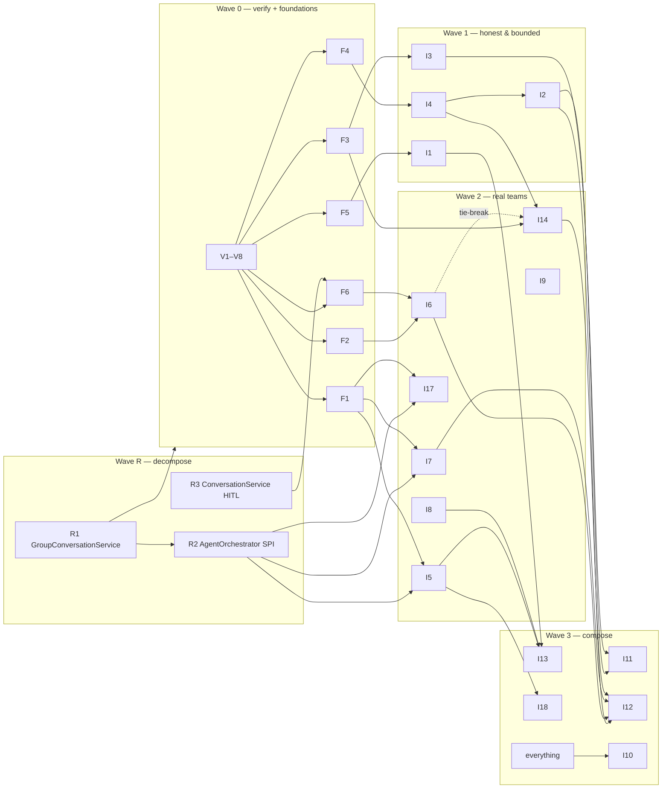

# Group Collaboration Improvements — Implementation Plan (Revision 2.1)

> **Status:** **Wave R, Wave 0 and part of Waves 1–2 are IMPLEMENTED** on `refactor/group-service-split` (PR [#626](https://github.com/labsai/EDDI/pull/626)) · **Date:** 2026-07-29 (Rev 2) · re-aligned against `main` 2026-08-01 (Rev 2.1) · implementation status added 2026-08-04
>
> ### Implementation status (2026-08-04)
>
> | Item | Status |
> | --- | --- |
> | **Wave R** — R1 (`GroupConversationService` → 8 collaborators), R2 (`AgentOrchestrator` → `ToolSourceProvider` SPI), R3 (`ConversationService` → HITL + step runner) | ✅ **Done** |
> | **Wave 0** — F1 registry, F2 ResumePoint, F3 DecisionRecord, F4 entry types + visibility, F5 cost ledger, F6 schema versioning | ✅ **Done** |
> | **Wave 1** — I1 cost ceiling, I2 convergence, I3 verdicts + deterministic synthesis, I4 abstention + minority report | ✅ **Done** |
> | **Wave 2** — I5 agent-filed tasks, I7 recruitment + configurable delegation timeout | ✅ **Done** |
> | **Wave 2** — I6, I8, I9, I14, I17 | ⬜ Not started |
> | **Wave 3** — I10, I11, I12, I13, I18 | ⬜ Not started |
>
> **Known gaps in what shipped** — read before building on these:
>
> - **I1's ceiling cannot fire for an ordinary group.** `AUDIT_COST` is written only from `cascadeCostUsd + toolCostUsd`, so a plain (non-cascade, no priced tool) model call contributes **$0**. `totalCost` stays 0, the ceiling never trips, and `memberCosts`/`totalCost` are serialized into the public payload as if authoritative. Pricing model calls is a prerequisite for I13's budgets.
> - **I7's cost sub-budget was not built.** `IConversationService.say()` has no budget parameter and single-agent conversations have no ceiling mechanism; only group `discuss()` does. Given the item above, a ceiling there would bound a number that is mostly zero.
> - **`decision_reached` never fires.** I3 sets `DecisionRecord` but no producer calls the sink event, so verdicts appear over REST/MCP but never on SSE or Slack. `SlackGroupDiscussionListener.onDecisionReached` is currently dead code.
> - **Nested-group cost is overwritten, not accumulated.** `accumulateNestedGroupCost` keys by `agentId` and each nested turn is a fresh child discussion starting at 0, so only the last child's spend survives.
> - **`allowAbstention` on a SYNTHESIS phase** yields a `COMPLETED` discussion with no answer.
> - **Parallel-phase late entries are lost.** After the batch deadline, a member finishing milliseconds late has its real entry replaced by SKIPPED. Both obvious fixes were tried and rejected (one extends the deadline that exists to bound the phase; the other loses the entries entirely) — recovering it needs the deadline contract renegotiated.
>
> **Deliberate deviations from this plan, with reasons recorded in `docs/changelog.md`:** I3 requires a two-sided roster *and* an impartial judge before producing a verdict (a role-less or moderator-less debate concludes in prose rather than fabricating a winner); I5 assigns every filed task at creation (an unowned task is never scheduled by the EXECUTE wave, so "the loop will assign it later" was not true).
> **Scope:** Refactoring workstream R1–R3, foundations F1–F6, items I1–I14 + I17–I18. Items **I15 (cross-team process DAGs) and I16 (A2A remote members) are explicitly out of scope** — do not start them.
> **Audience:** A coding agent with **no prior context**. Everything needed is in this document plus the referenced files. Read [AGENTS.md](../AGENTS.md) first and follow its workflow protocol: branch from `origin/main` (never push a `claude/*` branch name), changelog entry in the same commit as the work, conventional commits, **no AI co-author trailers**, ask before pushing, never force-push.
>
> **Changed from Rev 1:** (a) a new **Wave R refactoring workstream** decomposes the three monolith classes (`GroupConversationService` 3,962 lines, `AgentOrchestrator` 2,460 lines, `ConversationService` 2,489 lines) so features land in clean homes — R1 gates the group features, R2 gates the tool features; (b) an external research review was analyzed — its adopted findings appear as foundation **F6 (state schema versioning)**, new items **I17 (Shared Artifacts)** and **I18 (bid-based task assignment)**, plus template-level anti-sycophancy directives and extensions to I7/I9/I13/I14; its rejected findings are listed with reasons in §6; (c) sequencing updated accordingly.
>
> **Changed in Rev 2.1 (post-merge alignment):** every load-bearing claim was re-verified against merged `main`. All core theses hold (last-speaker-wins, debate team-filter defect, no group cost ceiling, recruitment roster gap, V7 asymmetry, zero identifier collisions with planned names). Deltas folded in: (a) main **partially shipped I7's delegation hardening** (`maxDelegationsPerTask` now enforced per turn; new `maxDelegationDepth`/`allowedDelegationTargets`; `allowRecruitment` now gates capability *discovery* — roster entry is still missing) — I7 re-scoped; (b) **V2 is resolved**: group-visibility memory is user-scoped by design, so I8 now specifies an *additive* synthetic-team-owner query branch instead of widening group visibility; (c) `GroupConversationService` gained a **cooperative-cancellation cluster** and documented lock ordering that R1's extractions must preserve; (d) new **graceful-shutdown machinery** exists that `ConversationService` participates in but the group service does not — wired in as an explicit R1 follow-up commit; (e) all line counts/anchors refreshed (the three classes are now 4,417 / 2,725 / 2,698 lines; the test net grew to 40 classes / ~27,500 lines); (f) new REST/Bean-Validation ceilings (`MAX_MEMBERS=100`, `MAX_DISCUSSION_ROUNDS=50`, request-size caps) set the validation conventions all new config fields must follow.

---

## 0. Why this plan exists (product rationale)

EDDI's group conversations are strong at **structured talking** (six discussion styles, phases, context scoping) and **dividing work** (TASK_FORCE with dependency-aware parallel execution and verification), but have **no machinery for deciding, trading, or co-creating**:

- Discussions cannot **end early on agreement**, cannot **vote**, and produce no machine-readable **decision** — the group's "answer" is literally the last SYNTHESIS transcript entry, and with no moderator configured, every member synthesizes and *the last speaker wins*.
- DELPHI advertises "gradual convergence" but never measures it; DEBATE's judge emits prose with no verdict.
- There is **no dollar cost ceiling** on a discussion (only turn/timeout caps), in a codebase whose own guidelines mandate dollar-based ceilings (AGENTS.md §4.7). Full-context phases re-feed the growing transcript to every member — token cost grows roughly quadratically with rounds.
- Agents cannot file work they discover, humans can only approve/reject (never *speak*), and the `allowRecruitment` config flag is **dead code** — documented as working, implemented nowhere.
- The only shared medium is the append-only transcript — there is no shared artifact for co-creation.

Strategic frame: **Wave R** makes the codebase safe to build in. **Wave 1** makes a single discussion trustworthy and cost-bounded. **Wave 2** makes teams real — self-organizing backlog, humans inside, shared artifacts, memory that compounds. **Wave 3** composes them into negotiation, adaptive facilitation, durable Standing Teams, and enterprise packaging. Deep org-chart mimicry is deliberately rejected; what transfers from real organizations is the **process layer**: bounded roles, artifact handoffs, verification gates, retrospectives, budgets.

---

## 1. Context primer — how the subsystem works today

All paths relative to repo root. Line numbers re-verified 2026-08-01 after merging `main` (`e20d510a6`); re-locate by symbol if drifted.

### 1.1 Group configuration model

`src/main/java/ai/labs/eddi/configs/groups/model/AgentGroupConfiguration.java`:

- Fields: `name`, `description`, `members` (List<GroupMember>), `moderatorAgentId`, `style` (DiscussionStyle, null → ROUND_TABLE), `maxRounds` (default 2, consumed only by ROUND_TABLE/DELPHI presets), `phases` (List<DiscussionPhase>; **non-empty overrides `style`**), `protocol` (ProtocolConfig), `tasks` (List<TaskDefinition>), `dynamicAgents` (DynamicAgentConfig), `hitlConfig` (HitlConfig).
- `GroupMember` record: `agentId`, `displayName`, `speakingOrder` (null sorts last), `role` (free string; engine-meaningful: `DEVIL_ADVOCATE`, `PRO`, `CON`, plus pseudo-role `MODERATOR`), `memberType` (`AGENT` | `GROUP`; GROUP recurses into a nested discussion, depth capped by `eddi.groups.max-depth` = 3).
- `DiscussionPhase` record: `name`, `type` (PhaseType), `participants` (`"ALL"` | `"MODERATOR"` | `"ROLE:<name>"`), `turnOrder` (`SEQUENTIAL`|`PARALLEL`), `contextScope`, `targetEachPeer`, `inputTemplate` (Qute, nullable → built-in template per PhaseType), `repeats` (≥1), `requiresApproval` (HITL pause before phase).
- `PhaseType`: `OPINION, CRITIQUE, REVISION, CHALLENGE, DEFENSE, ARGUE, REBUTTAL, SYNTHESIS, PLAN, EXECUTE, VERIFY`.
- `ContextScope`: `NONE, FULL, LAST_PHASE, ANONYMOUS, OWN_FEEDBACK, TASK_ONLY, TASK_WITH_DEPS`.
- `ProtocolConfig`: `agentTimeoutSeconds`, `onAgentFailure` (`SKIP|RETRY|ABORT`), `maxRetries`, `onMemberUnavailable` (`SKIP|FAIL`), `maxTurns` (≤0 → 50). **When `protocol` is absent, effective defaults are `(60, SKIP, 2, SKIP)`.**
- `DynamicAgentConfig`: `enabled=false`, `allowCreation=false`, **`allowRecruitment=false` (since the 2026-07/08 merge it gates capability *discovery* — `FindAgentsByCapabilityTool`, `AgentOrchestrator` ~:2152 — but roster entry is still unimplemented)**, `allowDelegation=true`, `maxCreatedAgentsPerDiscussion=5`, **`maxRecruitedAgentsPerDiscussion=10` (still dead — read nowhere)**, **`maxDelegationsPerTask=3` (now enforced as a per-turn cap via a per-instance counter in `ConverseWithAgentTool` ~:149)**, **`maxDelegationDepth=3` (~:408, new)**, **`allowedDelegationTargets` (~:415, new allowlist)**, `allowedProviders`, `allowedModels`, `inheritParentModel`, `lifecyclePolicy` (`EPHEMERAL|KEEP_DEPLOYED|UNDEPLOY_ONLY|AGENT_DECIDES`).
- `HitlConfig`: `approvalTimeout` (ISO-8601), `timeoutPolicy` (`WAIT_INDEFINITELY|AUTO_APPROVE|AUTO_REJECT|ABORT`), `granularity` (`PHASE|TASK`), `onTaskRejection` (`FAIL|RETRY`).
- **Validation conventions (new since the merge — every new config field must follow them):** the model now carries Bean Validation (`MAX_MEMBERS=100` via `@Size` on `members`, `MAX_DISCUSSION_ROUNDS=50` via `@Max` on `maxRounds`), the REST interfaces carry `@NotNull @Valid` plus request-size ceilings (`IRestGroupConversation`: `MAX_QUESTION_CHARS=50_000`, `MAX_IDENTIFIER_CHARS=256`, `MAX_ATTACHMENTS_PER_REQUEST=50`, `MAX_URL_CHARS=2048`, `@MaxInlineAttachmentSize`), and `RestGroupConversation` **re-checks server-side** (`rejectionReason(...)` ~:114–152) because interface-level Bean Validation is not proven to fire on the impl. New config fields ship with all three layers.

**Styles are pure macros.** `DiscussionStylePresets.expand(style, maxRounds)` (`configs/groups/model/DiscussionStylePresets.java` ~:250) expands `ROUND_TABLE, PEER_REVIEW, DEVIL_ADVOCATE, DELPHI, DEBATE, TASK_FORCE, CUSTOM` into `List<DiscussionPhase>`. The engine has zero style-specific logic beyond expansion. New collaboration forms = new phase types + presets + typed state, not new engines.

### 1.2 Group runtime model

`src/main/java/ai/labs/eddi/engine/internal/GroupConversationService.java` (4,417 lines — full structural inventory in §3.1):

- Entry `discuss(...)` → depth guard → load config → `resolvePhases` → create `GroupConversation` (QUESTION transcript entry) → `executeDiscussion` (~:501, 319 lines).
- **Main loop:** `for phaseIdx { for repeat { ... } }`. Dispatch precedence: PLAN/EXECUTE/VERIFY → task handlers (~:1765–2662); `targetEachPeer` → peer-targeted loop; PARALLEL → `CompletableFuture.supplyAsync` on a self-created virtual-thread executor (**:240**, bare `@PreDestroy shutdown()` at ~:253) **with a transcript snapshot taken before fan-out** (now under `synchronized (gc.getTranscript()) { List.copyOf(...) }` at three sites — a merge-era CME fix); else sequential. After each phase iteration: cross-pod terminal-state re-read, **whole-document `conversationStore.update(gc)`**, `phase_complete` event.
- **Post-merge machinery (2026-07/08 wave — R1 must preserve all of it):** a new *cooperative cancellation* section (banner ~:1633) with `MemberTurnCancellation` (static class registering/cancelling in-flight member response futures), `MemberTurnCancelledException`, and `abortWave(...)` (cancel → bounded 5s drain → `resetStrandedInProgressTasks`); `handleTaskFailure` split into `recordTaskFailure` (document write, **caller must hold the `taskList` monitor**) + `notifyTaskFailure` (SSE, outside the monitor) with documented lock order **`taskList` → `transcript`**; `reserveTurn(AtomicInteger,int)` CAS loop for the turn budget; a whole-batch parallel deadline (`parallelBatchBudgetSeconds`/`parallelBatchGraceSeconds`); `@Inject IDeploymentStore` + `retireDeploymentRecords(agentId)` in cleanup. `executeAgentTurn` is now **two overloads** — a delegating 8-arg (~:2867) and the real 9-arg (~:2881, 317 lines) taking `MemberTurnCancellation`.
- **Members speak via private conversations** (`memberConversationIds`, reused across phases). Peer content reaches a member as rendered Qute text (`buildPhaseInput` ~:3336; variables `previousResponses`, `feedbackReceived`, `allOpinions`, `challenges`, `opposingArguments`, `transcript`), scope-filtered by `filterByScope` (~:3467; drops `ERROR`/`SKIPPED`/`QUESTION`). The whole transcript object is injected as context var `groupTranscript`, plus `groupId`, `groupConversationId`, `groupDepth`, `dynamicAgentConfig`.
- **Synthesis:** final answer = last transcript entry of type SYNTHESIS. `resolveParticipants("MODERATOR")` with blank `moderatorAgentId` **falls back to ALL members** (~:1610, re-verified post-merge) — the last-speaker-wins defect. `ROLE:<x>` with no match also falls back to ALL with a warning.
- **TASK_FORCE:** PLAN (moderator emits JSON; three-tier parse JSON → Markdown → single task; pre-configured `config.tasks` skip the LLM plan; parsing already extracted to `TaskListParser.java`, 248 lines), EXECUTE (~:1952, 251 lines; wave loop cap 100; `findExecutableTasks()` → group by assignee → parallel per agent), VERIFY (single turn by first speaker; parse failure marks all passed).
- **HITL:** `requiresApproval` pauses before a phase (`AWAITING_APPROVAL`); TASK granularity pauses per task; `resumeDiscussion` (~:3944, 327 lines) re-verifies the bookmarked phase against current config; timeout schedule re-armed (`GROUP_HITL_REARM_GRACE` 2 min); task-fingerprint no-progress guard fails looping discussions. Member-level `PAUSE_CONVERSATION` inside a group turn → turn SKIPPED; nested-group HITL unsupported; `inGroupTurns` accepts only `"REJECT"` (`INBOX` rejected 400 by `HitlConfigValidation`).
- **SharedTaskList** (`configs/groups/model/SharedTaskList.java`): embedded in `GroupConversation`; all methods `synchronized`; `TaskStatus`: `PENDING, ASSIGNED, IN_PROGRESS, COMPLETED, VERIFIED, FAILED, BLOCKED (reserved, never set), AWAITING_APPROVAL`; `findExecutableTasks` (dependency-aware), `detectCycles` (DFS), strict transition guards.
- **Dynamic agents:** four `@Vetoed` LLM tools instantiated per-invocation by `AgentOrchestrator`: `CreateSubAgentTool`, `ConverseWithAgentTool` (delegation timeout **still hard-coded 60s** at ~:218 despite the new guardrails; depth rides context key `delegationDepth`), `FindAgentsByCapabilityTool` (now gated by `allowRecruitment`), `TeardownAgentTool`. Tracking via `dynamic:created_agent_ids` / `dynamic:retained_agent_ids` step-data keys, lifted onto `GroupConversation` by the static, package-private `propagateDynamicAgentTracking`. `GroupConversation.addDynamicMember()` (`GroupConversation.java:347`) **still has zero production callers**; `dynamicMembers` is only read by `findMemberIncludingDynamic`.
- **Events:** `GroupConversationEventSink` — 16 event constants; `EVENT_TOKEN`/`EVENT_SYNTHESIS_COMPLETE` declared but no listener methods (no token streaming). Slack: `SlackGroupDiscussionListener` implements the full listener.
- **Signing:** Ed25519 per transcript entry when `security.signInterAgentMessages=true` (inside `executeAgentTurn`); receiver verification incremental via the `lastVerifiedIndex` class-field map; `NonceCacheService` is consulted on the **sending** side only — `verifyPriorEntriesIfRequired` performs no replay check, so a replayed transcript entry verifies successfully today (tracked as a follow-up; see `docs/changelog.md`).
- **Persistence:** `GroupConversation` is a **single document** (`configs/groups/mongo/GroupConversationStore.java`) with CAS ops (`compareAndSetState`, `updateIfState`). States: `CREATED, IN_PROGRESS, SYNTHESIZING, COMPLETED, FAILED, CANCELLED, AWAITING_APPROVAL, CLOSED`.
- **Group memory:** `Property.Visibility` = `self|group|global`; `IUserMemoryStore.getVisibleEntries(userId, agentId, groupIds, recallOrder, maxEntries)`; the group service injects a single `groupId` conversation property at member-conversation start (~:2513).
- **Cost:** `ToolExecutionService.executeToolWrapped()` includes `ToolCostTracker` (dollar-based, per conversation); `AgentOrchestrator.conversationToolCost`/`toolCostDelta` (~:1024–1069) read it. **No group-level aggregation or ceiling exists.**

### 1.3 Single-conversation runtime (for R2/R3 and I6)

- **`ConversationService`** (`engine/internal/ConversationService.java`, 2,698 lines; §3.3 has the inventory) implements `IConversationService` (394-line interface that also carries 2 records, 2 handler interfaces, 1 enum, 5 exceptions). Entry families: env+agentId-based (`startConversation`, `say` ~:484, `sayStreaming` ~:624, undo/redo) and conversationId-only overloads (~:931/:942) behind `requireConversationAccess`. **The back ~43% is single-conversation HITL** — `resumeConversation` alone is 344 lines (~:1548–1891). Post-merge it also gained: graceful-shutdown gating (`@Inject GracefulShutdownService` ~:153, `rejectIfShuttingDown()` on start/say/sayStreaming/resume), an `AtomicInteger processingConversationCount` gauge with one-shot `ProcessingTurn` release tokens (replacing the old reference list), `IDiscardableTask`-returning step execution (~:1056) plus `guardedResume` (~:1819), and `ExecutionAbandonedException`/`LifecycleInterruptedException` branches so a zombie turn's late write cannot flip the conversation to ERROR.
- **`Conversation`** (`engine/runtime/internal/Conversation.java`, 1,066 lines) is **not a CDI bean** (constructed in `Agent.java`); owns the property lifecycle (`loadUserProperties` ~:209, `storePropertiesPermanently` ~:592, `extractGroupIds` ~:680) and a **mirror HITL block** (`pauseConversation` ~:757, `resume(HitlDecision)` ~:878). HITL state-machine logic therefore lives in **two files in different packages**. Post-merge it also carries **longTerm write-correctness machinery**: a `longTermBaseline` map captured at ctor/init so `storePropertiesPermanently` diffs against turn-start state instead of rewriting untouched memories, plus `recordPendingLongTermWrites()` (deferred writes for turns ending in HITL pause/error/cancel) — I8's store-path writes are unaffected, but do not bypass this when touching property persistence.
- **`AgentOrchestrator`** (`modules/llm/impl/AgentOrchestrator.java`, 2,725 lines; §3.2 has the inventory) is package-private, `@ApplicationScoped`, **implements no interface**, 30 ctor params (+ field-injected `IDeploymentStore`). It runs the tool-call loop for `LlmTask` (its sole CDI injector) and is passed as a *method parameter* into `CascadingModelExecutor`. System-prompt composition lives in `LlmTask.executeTask` (:274–470); model binding lives in `ChatModelRegistry` (527 lines) — both already external to AgentOrchestrator.
- Tool infra already extracted: `ToolExecutionService` (rate limit → cache → execute → cost), `ToolCostTracker`, `ToolRateLimiter`, `ToolCacheService`, `ToolResponseTruncator`, `McpToolProviderManager` (268), `A2AToolProviderManager` (367), `ConversationHistoryBuilder` (384), `SummarizationService`, `ConversationSummarizer`.

### 1.4 Hard constraints (do not violate)

1. **DB-agnostic**: no Mongo-specific `$push`/`$inc` in shared logic — a PostgreSQL adapter exists. Use the store-interface patterns.
2. **Backward compat concern is stored JSON only**: internal Java APIs may change freely; old group configs in MongoDB / ZIP imports must keep working. **Every new config field is optional with a default preserving current behavior; no preset expansion changes behavior without opt-in.**
3. **Stateless services, stateful documents.** The explicit exceptions built here (F1 live registry, existing `lastVerifiedIndex`/`activeTokens` maps) are in-JVM caches over documents, not state ownership — document them as such.
4. **Local test reality**: `*IT.java` and socket-binding tests don't run locally (CI is source of truth). The unit suites are the safety net — and they are large (§3.4). The local suite has known environmental baseline failures; **baseline the exact test classes you touch before blaming your change**. Surefire gotcha: `-Dtest=Class#method` silently runs 0 tests for `@Nested` methods — filter by whole class.
5. **Type-signature refactors need `./mvnw clean compile`** — incremental builds reuse stale `.class` files and hide breaks in unedited callers.
6. Every `mvnw` build auto-formats non-compliant tracked sources — expect spurious diffs; don't commit unrelated reformatting. Run `./mvnw formatter:format` + `./mvnw validate` before committing. JBoss Logger, simple-name imports, no inline FQNs.

---

## 2. Verify-first tasks (Wave 0 gate — do before feature code)

Each ≤1 hour. Record findings in the first commit's changelog entry.

- **V1 — Dollar-cost source coverage.** *(Partially answered by the merge — confirm the remainder.)* Evidence so far: `ToolCostTracker` covers **tool executions** (read via `AgentOrchestrator.conversationToolCost`/`toolCostDelta` ~:1079–1093, surfaced as `toolCostUsd` metadata, enforced at ~:1613 `isWithinBudget`), while `DreamService` estimates **model-call** cost separately (`SummarizationOutcome.estimatedCostUsd`, `maxCostPerRun` now the primary ceiling at `DreamService.java` ~:456 with the call-count cap demoted to a deprecated backstop). Confirm LlmTask model calls are indeed unrecorded per-conversation; if so, I1 must add model-call cost recording **reusing whichever price source `SummarizationOutcome` uses** — no second pricing mechanism.
- **V2 — Group-visibility query semantics. RESOLVED (2026-08-01):** `MongoUserMemoryStore.buildVisibilityFilter` (~:217–250) wraps **all** branches in `eq(userId, ...)` — group visibility is **user-scoped by design** (it shares one user's memories across that user's agents in a group, not across users), and the new `UserMemoryToolScopingTest` pins per-user isolation. **Decision: do NOT widen group visibility cross-user** (that would leak one user's entries to others and break the pinned semantics). Instead, I8's prep commit adds an **additive branch** to `getVisibleEntries`: also match entries whose `userId` equals a synthetic team owner (`"group:" + groupId` for each supplied groupId) with `visibility=group`. Personal entries stay user-scoped; team-owned lessons become readable by all members. Apply in Mongo + the Postgres adapter + interface Javadoc, and extend the scoping test to prove personal entries still do not cross users.
- **V3 — Timing of `groupId` injection vs member `Conversation.init()`.** The group service injects `groupId` at member-conversation start (~:2513); `Conversation.loadUserProperties` (:128) runs during init. Confirm group-visible memory actually loads into member conversations on their first turn; if injection is too late, pass groupId into conversation creation instead.
- **V4 — Shared summarization service.** `SummarizationService` / `ConversationSummarizer` (`modules/llm/impl/`) exist. Confirm which one the conversation-window rolling summary uses and whether its LLM-call core is reusable for group-transcript summarization (I9) and the convergence judge (I2). If coupled to ChatMessage types, extract the core — do not duplicate.
- **V5 — Same-JVM invariant.** Confirm `executeAgentTurn` always runs member turns in-process with the discussion loop (virtual threads in the same JVM; the 2026-07-28 caller-identity changelog entries enumerate every dispatch site). F1 depends on this; document it in the registry's Javadoc.
- **V6 — Overlap with possibly-open fix sessions.** Two fixes may be in flight from separate sessions: (a) DEBATE `opposingArguments` team-filter bug, (b) `docs/group-conversations.md` accuracy fixes. **As of the 2026-08-01 merge, neither has landed on `main`** — the defect is still at `GroupConversationService` ~:3398–3407 (the comment even says "filtered by different speaker, not role label") and the docs file is untouched. Re-check `git log --all --oneline -i --grep=debate --grep=group-conversations` before starting; both are also specified here (I3, §8) so this plan stands alone either way.
- **V7 — Suspected defect: dynamic tools skipped without whitelist.** *(Re-confirmed post-merge.)* In `AgentOrchestrator.collectAllBuiltInTools` (~:2088–2215), the whitelist branch (~:2092–2176, incl. the anonymous `{}` block ~:2116–2175) constructs the four dynamic-agent tools, but the no-whitelist `else` (~:2177–2192) **never adds them** — an agent with `enableBuiltInTools=true`, no whitelist, and `dynamicAgents.enabled=true` silently gets no dynamic tools. The merge tightened the whitelist branch (recruitment gate, delegation depth, `seedCreatedAgentIds`) without touching the `else`. Verify intent against docs and the new `AgentOrchestratorBuiltInToolWiringTest` (which likely pins current behavior — the fix must update it deliberately). If a defect (likely), fix as a **separate, labeled behavior-change commit after R2's characterization**, never silently inside the refactor.
- **V8 — Coverage baseline.** Before Wave R, run the three per-class unit suites and capture JaCoCo instruction/branch coverage for the three classes (`./mvnw test -Dtest='GroupConversationService*'` etc.; report at `target/site/jacoco/index.html`). These numbers are the refactor's regression budget: coverage on the extracted code must not drop.

---

## 3. Wave R — decompose the three monoliths (gates the feature waves)

**Why first:** ~80% of this plan's group features would otherwise land inside a 4,417-line class whose three largest methods hold ~960 lines; the tool features (I5, I7, I17) would extend a ~700-line tool-assembly block that has no abstraction; the HITL features (F2, F6, I6) would grow an ~1,150-line HITL cluster. Refactoring after would mean moving every new feature twice.

**What makes this safe:** the three classes carry an unusually strong characterization net — **40 test classes, ~27,500 lines** (post-merge: 12 group / 12 orchestrator / 16 conversation-service classes; new since Rev 2: `GroupConversationServiceConcurrencyTest` 645 ln, `AgentOrchestratorBuiltInToolWiringTest`, `AgentOrchestratorToolGovernanceTest`, `ConversationServiceProcessingGaugeTest`, `ConversationServiceStaleTurnTest`) — plus 10 author-marked `// ====` section banners in GroupConversationService that align exactly with method clusters. The seams are pre-drawn; the job is mechanical extraction, not redesign.

### 3.0 Refactoring ground rules (all of R1–R3)

1. **Behavior-preserving only.** No logic changes, no "while I'm here" fixes. Suspected defects found en route (e.g. V7) are recorded and fixed in separate, labeled commits after the extraction around them is complete.
2. **One extraction per commit**, conventional message `refactor(scope): extract <X> from <Y>`, changelog entry per AGENTS.md rule 8 (a single running entry per class, extended commit by commit, is fine).
3. **Facade pattern, stable public surface.** `IGroupConversationService` and `IConversationService` signatures do not change. The service classes remain as facades that validate, meter, and delegate.
4. **Collaborators are plain classes constructed in the facade's constructor, NOT new CDI beans.** Rationale (this is deliberate — do not "improve" it): the 34 test classes construct the services **directly**; both services already field-inject `IAttachmentStore` specifically to keep those tests compiling (comments at `GroupConversationService:114–116`, `ConversationService:114–115`). Changing constructor signatures breaks ~25k lines of tests for zero functional gain. New *bean* dependencies introduced by features (F1 registry, F5 ledger) follow the established field-injection-with-test-setter pattern. Promotion of collaborators to CDI beans is allowed later as its own decision, not during Wave R.
5. **Extracted classes take their dependencies via their own constructors** (passed by the facade), keep package-private visibility where possible, and get **new focused unit tests** in addition to the untouched characterization suites.
6. **After every extraction:** `./mvnw clean compile` (rule 1.4/5 — clean, not incremental), run the full per-class suites (whole classes, not `#method` filters), compare JaCoCo against the V8 baseline, `git diff --stat` review to catch accidental drift, formatter + validate.
7. **Static clusters extract first** (they are pure moves), then instance clusters, then the monster methods get split *within* their new homes.
8. **Do not unify the duplicated HITL logic** between `ConversationService` and `Conversation.java` in Wave R — it is a behavior-risk redesign, recorded in §12 as follow-up. Wave R only relocates code.
9. Coordinate with any open PRs touching these files first (`git log --all` on the three paths) — these are the repo's hottest files; rebase discipline per AGENTS.md, and re-run the silent-auto-merge checks after any merge.

### 3.1 R1 — `GroupConversationService` (4,417 → facade of roughly 600–800 lines)

Current cluster map (2026-07-29 structural survey; sizes/anchors drifted by the 2026-08-01 merge — the *shape* is unchanged and banners are in the source, now 10 of them; re-locate by banner/symbol). **New since the survey:** a *cooperative cancellation* cluster (banner ~:1633 — `MemberTurnCancellation`, `MemberTurnCancelledException`, `abortWave`), the `recordTaskFailure`/`notifyTaskFailure` split with documented lock order **`taskList` → `transcript`**, `reserveTurn` CAS, whole-batch parallel deadlines, and synchronized transcript snapshots — all covered by `GroupConversationServiceConcurrencyTest` (645 lines), which is the primary characterization suite for exactly the code R1 moves.

| Cluster | Lines (approx) | Content |
|---|---|---|
| C2 entry/overloads | ~120 | `discuss`×3, `startAndDiscussAsync`×2 |
| C3 attachments | ~112 | `materializeAttachments`, `rehydrateAttachmentsFromStore`, `grantAndInjectAttachments` |
| C4 core driver | ~380 | `executeDiscussion` (325), `notifyCancelled`, `persistedTerminalOverride` |
| C5+C15 HITL | ~750 (two non-adjacent regions) | `commitPause`, fingerprint/no-progress, cancel-signal conversion, timeout schedule; `cancelDiscussion`, `resumeDiscussion` (336), `restoreGroupPause`, audits, cleanup |
| C6 post-discussion ops | ~380 | `followUpWithMember` (147), `continueDiscussion` (104), `closeGroupConversation`, read/delete/list, pending approvals |
| C7 ephemeral cleanup | ~60 | `cleanupEphemeralAgents`(×2) |
| C8 resolution | ~90 | `resolvePhases/Protocol/AgentTimeout/Participants` |
| C9 TASK_FORCE | ~785 | plan/execute/verify phases + parsing/formatting + assignment helpers |
| C10 debate-style executors | ~150 | sequential / parallel / peer-targeted |
| C11 member turns | ~400 | `executeAgentTurn` (273), member tool-pause resolution, member pause handling |
| C12+C13 input & scoping | ~155 | `buildPhaseInput` (112), `selectDefaultTemplate`, `filterByScope` |
| C14 helpers | ~380 | entry mapping, group-member (nested) turns, failure paths, signing verification (112), dynamic tracking (static) |

**Extraction order and target classes** (all in `ai.labs.eddi.engine.internal.groups` — new subpackage; move nothing out of `engine/internal` that REST classes reference):

1. **`GroupAttachmentBinder`** ← C3. Pure move; deps: `IAttachmentStore`, `IJsonSerialization`. Its `@Nested Attachments` tests move to a new `GroupAttachmentBinderTest`.
2. **`GroupContextBuilder`** ← C12+C13+`mapPhaseToEntryType`+`findLatestResponse`+`extractResponse`+`buildPlainTextFallback`. Deps: `ITemplatingEngine`, `IJsonSerialization`. **F4's visibility matrix lands here.** This class is the single place that decides what any participant sees.
3. **`GroupSigningGuard`** ← `verifyPriorEntriesIfRequired` (112) + signing block currently inside `executeAgentTurn` (~:2618–2680) + the `lastVerifiedIndex` map + `NonceCacheService` usage. Deps: `AgentSigningService`, `NonceCacheService`.
4. **`MemberTurnExecutor`** ← C11 rest: both `executeAgentTurn` overloads (split into: render input → create/reuse member conversation → invoke → harvest output/cost → sign), **`MemberTurnCancellation` registration/cancellation plumbing**, `tryResolveMemberToolPause`, `handleMemberPause`, plus `executeGroupMemberTurn` (nested groups) and `handleAgentFailure`/`errorEntry` from C14. Deps: `IConversationService`, `IAgentFactory`, `CallerIdentityContext`, `GroupSigningGuard`, `GroupContextBuilder`.
5. **`PhaseExecutionEngine`** ← C10 + the dispatch branch of `executeDiscussion`: interface `PhaseExecutor { PhaseOutcome execute(PhaseRun run); }` with `SequentialPhaseExecutor`, `ParallelPhaseExecutor` (owns the synchronized transcript snapshot, the **whole-batch deadline** (`parallelBatchBudgetSeconds`/grace), `abortWave` + bounded drain, `reserveTurn`, and the virtual-thread executor service), `PeerTargetedPhaseExecutor`. `PhaseOutcome` carries the F2/I2 `PhaseExitSignal`. Deps: `MemberTurnExecutor`, protocol values.
6. **`TaskForceEngine`** ← C9 wholesale (largest single win, ~900 lines post-merge) + existing `TaskListParser` stays its collaborator. Split `executeTaskExecutionPhase` internally into wave-scheduling vs per-agent execution. **Must preserve the merge-era concurrency contracts verbatim:** `recordTaskFailure` (write under the `taskList` monitor) vs `notifyTaskFailure` (SSE outside it), lock order `taskList` → `transcript`, and `resetStrandedInProgressTasks` scanning under `synchronized (taskList)` — the ConcurrencyTest pins these. Deps: `MemberTurnExecutor`, `GroupContextBuilder`, `IJsonSerialization`.
7. **`GroupHitlCoordinator`** ← C5+C15 (both regions united): pause commit, fingerprints/no-progress, cancel tokens (`activeTokens` map moves here), timeout scheduling (`IScheduleStore`), `cancelDiscussion`, `resumeDiscussion` (split: validate request → rebuild runtime state → route to re-entry), `restoreGroupPause`, HITL audits (`AuditLedgerService`). **F2 (ResumePoint) and F6 (schema version check) land here.**
8. **`GroupLifecycleOps`** ← C6+C7: follow-up, continue, close, delete/read/list, pending approvals, ephemeral cleanup, plus `failConversation`/`cleanupAfterTerminalState` from C14/C15 and the static `propagateDynamicAgentTracking`.
9. **What remains in `GroupConversationService`:** the `IGroupConversationService` implementation — entry overloads, validation, depth guard, metrics, event fan-out, C8 resolution (30 lines), and a slimmed `executeDiscussion` that iterates phases and delegates to the engines. Target ≤800 lines.
10. **Post-R1 behavior commit — wire groups into graceful shutdown.** `ConversationService` now rejects new turns while `GracefulShutdownService.drain()` runs; the group service does not participate at all (bare `@PreDestroy` on its own executor). After the extractions, add `rejectIfShuttingDown()`-equivalent gating to `discuss`/`startAndDiscussAsync`/`resumeDiscussion` and let the drain await in-flight discussions (or cancel them gracefully via the existing `CANCEL_GRACEFUL` path). This is a **deliberate behavior change with its own commit, changelog entry, and tests** — never folded into a refactor commit.

**Post-condition for R1 (gate for Wave 0/1):** all 12 existing group test classes green (including `GroupConversationServiceConcurrencyTest`), JaCoCo not below V8 baseline, `GroupConversationService` under ~800 lines, and the new classes each have a focused test class covering their public surface.

### 3.2 R2 — `AgentOrchestrator` (2,725 lines; the tool-source SPI is the point)

The decomposition targets the documented seams: tool assembly (~700 lines at the file's tail; `buildToolSetup` ~:871, `collectAllBuiltInTools` ~:2088–2215), token-budget cluster (~230 lines, mostly static), gate helpers (~260 lines, 11/13 static), resume path (~355 lines), tool-call loop (~290 lines). Post-merge notes: `ToolSetup` gained a 6th component (`Map<String,String> toolEndpoints`, populated from `httpCallTools.endpoints()` so approval patterns can address `http.post:/path`); the new `AgentOrchestratorBuiltInToolWiringTest` and `AgentOrchestratorToolGovernanceTest` pin exactly the assembly behavior R2 moves — keep them green, and treat them as the V7 fix's deliberate-update surface.

1. **Introduce the SPI** in `ai.labs.eddi.modules.llm.tools.spi`:

```java
public record ToolContribution(List<ToolSpecification> specs,
                               Map<String, ToolExecutor> executors,
                               Map<String, String> toolSources,     // name → "builtin"|"http"|"mcp"|"a2a"|"dynamic"|"memory"|"recall"|...
                               Map<String, String> toolEndpoints,   // name → "post:/path" (http source only; feeds endpoint-qualified approval patterns)
                               List<ProviderFailure> failures) {}   // structured per-server/per-tool failures (McpToolsResult already carries these)

public interface ToolSourceProvider {
    String source();
    ToolContribution contribute(ToolAssemblyContext ctx);            // never throws; empty contribution on failure (log WARN)
}
```

   `ToolAssemblyContext` is a record carrying what `buildToolSetup` already has: `IConversationMemory memory`, the LLM task config, whitelist, resolved `DynamicAgentConfig`, userId/agentId, and (new, for group features) the values of the `groupConversationId`/`groupTaskConfig` context vars. It unifies the three result records — post-merge shapes: `HttpCallToolsResult(toolSpecs, executors, endpoints)` (~:2500), `McpToolsResult(toolSpecs, executors, failures)` (`McpToolProviderManager` ~:226), `A2AToolsResult(toolSpecs, executors)` — the two provider-manager classes keep their internals but return `ToolContribution` (endpoints and failures map onto the new components; missing pieces are empty).

2. **Extract providers** (plain classes, constructed in the AgentOrchestrator ctor per rule 3.0-4, iterated in fixed order): `BuiltinToolsProvider` (the 9 tool beans + whitelist logic from `collectEnabledTools`/`collectAllBuiltInTools`; the if-chain becomes a name→supplier map), `DynamicAgentToolsProvider` (**extracts the anonymous block ~:2116–2175**, including its step-data tracking writes, the `allowRecruitment` gate on `FindAgentsByCapabilityTool`, the delegation-depth resolution (`resolveDelegationDepth`/`parseDelegationDepth` over context key `delegationDepth`), and `seedCreatedAgentIds` — V7's asymmetry is thereby made visible and testable), `UserMemoryToolProvider`, `ConversationRecallToolProvider`, `AttachmentToolProvider`, `HttpCallToolsProvider` (~:2510ff, contributes `toolEndpoints`), `McpToolsProvider`, `A2AToolsProvider`. `buildToolSetup` becomes: iterate providers → merge contributions → `computeInitialActiveSpecs`. `activateDiscoveredTools` stays orchestrator-side (it operates on merged state).
   **This SPI is why R2 gates Wave 2:** I5 (`GroupTaskToolsProvider`), I7 (`RecruitAgentTool` inside `DynamicAgentToolsProvider`), and I17 (`ArtifactToolsProvider`) become new providers instead of edits to an if-chain.
3. **Extract `ToolContextBudget`** ← the static token cluster (:1270–1498) + `TokenCounterFactory` dep.
4. **Extract `ToolApprovalGateSupport`** ← gate helpers (:1682–1944); it accompanies the existing self-instantiated `ToolApprovalGate`.
5. **Extract `ToolLoopRunner`** ← `executeWithTools`, `runToolCallLoop` (200), `executeSingleToolCall*`, cost-delta helpers. **Extract `ToolLoopResumer`** ← the C4 resume path (`resumeToolLoop`, journal/envelope helpers). Both take the providers' merged setup; `AgentOrchestrator` retains the public entry overloads, `buildToolSetup`, and delegation.
6. **Introduce `IAgentOrchestrator`** (new interface in `modules/llm/api` or alongside): `executeIfToolsEnabled(...)` + `resumeToolLoop(...)` signatures as-is. `LlmTask` injects the interface; `CascadingModelExecutor`'s method parameters switch to it. Pure-move commit; enables mocking in the 10 orchestrator test classes to stay as-is (they construct the concrete class — unchanged).
7. **Leave alone:** the 30-param constructor (grouping the 9 tool beans into a holder would break all 12 test classes for cosmetics — recorded in §10 as optional follow-up), prompt composition (LlmTask), model binding (ChatModelRegistry).

**Post-condition for R2 (gate for I5/I7/I17):** all 12 orchestrator suites green (including the new wiring/governance tests); a new `ToolSourceProviderTest` proves provider isolation (a provider throwing yields an empty contribution and the loop continues); JaCoCo ≥ baseline; V7 decision recorded (and, if defect confirmed, fixed in its own commit with a deliberate update to `AgentOrchestratorBuiltInToolWiringTest`).

### 3.3 R3 — `ConversationService` (2,698 lines; independent track, finish before I6)

1. **Extract `ConversationHitlService`** ← the HITL cluster (the back ~43%: `resumeConversation` ~:1548 (344 lines) through `deleteHitlTimeoutSchedule` ~:2687): `cancelConversation`, `resumeConversation` (split: request validation → tool-decision validation (`validateToolDecisions`) → no-progress guard (`evaluateAndApplyNoProgressGuard` + `NoProgressOutcome`) → re-entry), the merge-added `guardedResume`/`IDiscardableTask` handling and `ExecutionAbandonedException` branches, timeout scheduling/bookmarks, effective-policy resolution, HITL audits and metrics, `listPendingApprovals`. The inner enum/exception move with it. Facade keeps the `IConversationService` HITL methods delegating.
2. **Extract `ConversationStepRunner`** ← C4 core: `processConversationStep` (now `IDiscardableTask`-returning), `runGuardedConversationStep`, `waitForExecutionFinishOrTimeout`, the `ProcessingTurn`/`processingConversationCount` gauge-and-release-token mechanics, memory load/store/state-cache helpers. `ConversationServiceProcessingGaugeTest` and `ConversationServiceStaleTurnTest` pin this cluster — keep them green.
3. **Keep in the facade:** entry surfaces (env-based + id-only + `requireConversationAccess`), the `rejectIfShuttingDown()` graceful-shutdown gating (it guards *entry*, which is facade responsibility), `createPropertiesHandler`, undo/redo, metrics.
4. **Explicit non-goals in Wave R** (record in §12): merging `say`/`sayStreaming` (288 parallel lines — a redesign, not a move); unifying the `Conversation.java` mirror HITL block; splitting the 394-line `IConversationService` interface file (its 6 nested types are public API — moving them breaks callers for cosmetics).

**R3 gates nothing in Waves 0–1** and can run in parallel with them; schedule it before I6 (human members lean on group-side HITL, but F6's schema-version check must also be applied to single-conversation pause documents, which lands naturally during this extraction).

---

## 4. Cross-cutting foundations (Wave 0 — after R1)

Each an isolated commit; each lands inside its R1/R3 home.

### F1 — `LiveDiscussionRegistry`

**Why:** I5/I7/I17 let LLM tools mutate the *running* discussion. The loop persists via **whole-document updates** after each phase — a tool writing through a separate store call would be clobbered by the loop's next stale-snapshot write. Tools and loop run in the same JVM (V5), so the correct move is mutating **the same in-memory `GroupConversation` instance** the loop holds.

**What:** `@ApplicationScoped` bean (field-injected into the facade per rule 3.0-4):

```java
public class LiveDiscussionRegistry {
    private final ConcurrentHashMap<String, GroupConversation> live = new ConcurrentHashMap<>();
    public void register(GroupConversation gc) { ... }        // executeDiscussion start + resume re-entry
    public void unregister(String gcId) { ... }               // finally-block of executeDiscussion; before persisting a pause
    public Optional<GroupConversation> get(String gcId) { ... }
}
```

Tools resolve via the `groupConversationId` context var; absent from registry (paused/finished) → actionable error string, never an exception at the LLM. Mutations go through the already-`synchronized` model methods; the loop's next phase-boundary persist writes them. Crash between mutation and persist loses the mutation — same window that already applies to mid-phase transcript entries; documented, not fixed.

**Tests:** lifecycle; tool mutation visible in the loop's next persisted document (stubbed store captures the update); unregistered-id error path.

### F2 — Speaker-level `ResumePoint`

**Why:** HITL pauses only at phase boundaries today; I6 pauses **mid-phase** at a specific speaker.

**What:** on `GroupConversation`: `ResumePoint resumePoint` (nullable) = `{int phaseIdx, int repeatIdx, int speakerIdx, String pauseKind}`. `SequentialPhaseExecutor` accepts a starting speaker offset; `GroupHitlCoordinator.resumeDiscussion` extends its existing bookmark-drift validation with speaker bounds. PARALLEL phases never set `speakerIdx` (they re-run the whole fan-out from the snapshot; results join at the end — idempotent by design, note in Javadoc).

**Tests:** pause mid-sequential-phase → resume completes only remaining speakers (per-speaker turn counts); config-drift restores the pause; parallel resume re-runs cleanly.

### F3 — `DecisionRecord`

**Why:** I3 (verdicts), I11 (agreements), I14 (votes), I18 (awards) need one typed outcome; today the only output is prose.

**What:** in `ai.labs.eddi.configs.groups.model`:

```java
public record DecisionRecord(
    DecisionType type,            // VERDICT | VOTE | AGREEMENT | AWARD | NONE
    String outcome,               // human-readable one-liner
    String winner,                // nullable
    Map<String, Object> tally,    // nullable (VOTE: option→weight; VERDICT: scores; AWARD: bids)
    List<Dissent> dissents,       // Dissent = (agentId, displayName, position)
    String method,                // "debate-judgment" | "majority" | "approval" | "negotiation" | "arbitration" | "bid-award" | ...
    String decidedAtPhase,
    String raw)                   // unparsed source text, for audit
```

Field `decision` on `GroupConversation`. Surfaced in the REST status payload, MCP group tools, and a new sink event `decision_reached` (constant + listener method + payload record + no-op default; Slack posts a compact block).

### F4 — Transcript entry types + visibility matrix

**What:** add entry types `ABSTAINED, DISSENT, CONVERGENCE, FACILITATION, VOTE, PROPOSAL, BARGAIN, HUMAN_INPUT, RETRO, BID`. In `GroupContextBuilder.filterByScope`, peers **do not see**: `ABSTAINED`, `CONVERGENCE`, `FACILITATION`, plus `VOTE`/`BID` entries **of the still-running phase** (blind ballots/bids; visible once the phase completes). Peers see `DISSENT`, `PROPOSAL`, `BARGAIN`, `HUMAN_INPUT`, `RETRO`, and completed-phase `VOTE`/`BID`. Observers (SSE/Slack) see everything. Existing drops (`ERROR`, `SKIPPED`, `QUESTION`) stay.

**Tests:** one table-driven test asserting the exact matrix — it is the spec.

### F5 — Cost accounting access

**What:** `GroupCostLedger` helper: per-turn cost delta harvested from the member conversation (source per V1), accumulated into `Map<String, Double> memberCosts` + `double totalCost` on `GroupConversation`; hook in `MemberTurnExecutor`'s post-turn path. Nested groups add the child's total to the parent member's attribution. If V1 shows model-call costs are missing from the tracker, close that gap first inside the existing tracker.

### F6 — Paused-document schema versioning *(adopted from research review)*

**Why:** paused discussions (`AWAITING_APPROVAL`, and with I6 `AWAITING_HUMAN_INPUT`) can sit in storage for days. Deploying new code that alters the document shape then resuming a stale document produces deserialization or semantic drift failures. The group side already guards one axis (resume re-verifies the bookmarked phase against current config); the document itself is unversioned.

**What:** `int schemaVersion` on `GroupConversation` (current = 1; bump whenever a Wave adds fields that resume-time logic depends on) and on the single-conversation pause bookmark structure (lands in R3's `ConversationHitlService`). Loader behavior: `stored > code` → refuse resume with an actionable error ("document written by a newer version"); `stored < code` → run registered migration functions (a simple `Map<Integer, UnaryOperator<GroupConversation>>` chain; most bumps ship an identity migration since new fields default via Jackson). **Every plan item that adds resume-relevant fields ships its migration entry.** Tests: fixture documents at old versions resume correctly; newer-than-code refuses.

---

## 5. The items (Wave 1 — after R1+F*)

Numbering matches the running analysis (I15/I16 intentionally absent). Each item: **Why → Design (decisions made; do not relitigate silently) → Implementation → Guardrails → Tests → docs/metrics/events.** Build order within waves: **W1:** I1 → I3 → I4 → I2 · **W2:** I5 → I7 → I14 → I9 → I17 → I8 → I6 · **W3:** I11 → I18 → I12 → I13 → I10.

### I1 — Group cost ceiling + attribution *(S · Wave 1)*

**Why:** a discussion multiplies spend (members × phases × repeats × tools); nothing caps dollars. Best ratio in the plan; protects every later feature (facilitator checks, negotiation rounds, cadenced teams, bid rounds).

**Design:** `ProtocolConfig` gains `Double maxCostPerDiscussion` (null = unlimited) and `CostPolicy onCostExceeded = ABORT | SYNTHESIZE_NOW` (default SYNTHESIZE_NOW: stop scheduling turns, jump to the first remaining SYNTHESIS phase; ABORT → FAILED with reason). Check **before** each turn and each EXECUTE wave; an in-flight turn may overshoot (accepted, documented). Nested groups: child's effective ceiling = min(child's own, parent's remaining), passed via the internal depth call; child total rolls up into the parent member's attribution (F5).

**Implementation:** config + defaults; ceiling check in the phase loop and `TaskForceEngine` wave loop; transcript `SKIPPED` entry "Cost ceiling reached: $X of $Y — <policy>"; metrics gauge `eddi_group_cost_dollars`, counter `eddi_group_cost_ceiling_hit_total`.

**Guardrails:** cost-read failure never kills a discussion (log ERROR, treat 0, count `eddi_group_cost_read_errors_total`); ceiling ≤ 0 → treated as null with save-time warning.

**Tests:** SYNTHESIZE_NOW mid-phase (non-synthesis phases skipped, synthesis ran); ABORT; nested budget derivation; attribution sums to total. **Mutation-check:** revert the pre-turn check → test must fail.

### I2 — Convergence detection + early exit *(S–M · Wave 1)*

**Why:** DELPHI always runs exactly `maxRounds` — "convergence" is prompt text. Early exit is the honest semantics and saves tokens. The exit plumbing (`PhaseExitSignal`) is also required by I11 (agreement) and I12 (END_PHASE).

**Design:** two mechanisms, one exit path. (a) *Deterministic:* with I4 enabled, all participants PASS in a repeat → converged, zero cost. (b) *Semantic:* optional judge comparing this repeat's entries to the previous repeat's. Phase-level `ConvergenceConfig convergence = {enabled=false, minRepeats=2, threshold=0.8, judge="MODERATOR"|"SERVICE"}` ("SERVICE" = shared summarization service per V4). Judge contract: JSON `{"agreementScore":0..1,"converged":bool,"summary":"..."}`, three-tier parse; **parse failure never converges and never fails the discussion**. Result recorded as `CONVERGENCE` entry (peer-hidden per F4) + events `convergence_checked`/`convergence_reached`. **No preset changes** (compat rule) — recommended DELPHI config documented instead; I10 templates ship it turned on. `PhaseOutcome`/`PhaseExitSignal` (CONTINUE / END_REPEATS / END_DISCUSSION) implemented in `PhaseExecutionEngine`.
*Anti-sycophancy (research-adopted):* the judge's built-in template instructs scoring **substantive positional agreement, not stylistic similarity or politeness**.

**Tests:** all-abstain exit; judge exit at exact threshold; parse-failure continues; minRepeats honored; events. Mutation-check: disable the loop break → test fails.

### I3 — Structured verdicts + deterministic synthesis *(S · Wave 1)*

**Why:** three concluding defects: moderator-less synthesis → **last speaker wins**; DEBATE judgment is prose; DEBATE's `opposingArguments` filters by **speaker identity, not team** (~:2940–2952), so PRO agents see teammates' arguments as the opposition's.

**Design:** (a) SYNTHESIS with no moderator → **exactly one** synthesizer: first member by `speakingOrder`, WARN log; save-time validation warning (not rejection — old configs must load). Behavior change only in the currently-buggy degenerate case; changelog-flagged. (b) Judgment template instructs JSON `{"winner":"PRO"|"CON"|"TIE","scores":{"PRO":0-10,"CON":0-10},"reasoning":"..."}`; three-tier parse; populate `DecisionRecord{type=VERDICT, method="debate-judgment"}`; parse failure → prose-only, `type=NONE`, never fails the discussion. *Anti-sycophancy:* judge template directs scoring **argument quality and factual support, explicitly not assertiveness or style** (research: judge-driven failure mode). (c) Team filter fix: `opposingArguments` = entries whose author's role is on the opposing team (PRO↔CON via config members), still excluding self — coordinate V6; skip if already landed.

**Tests:** single deterministic synthesizer; verdict parse happy/fallback/garbage; 2v2 debate — PRO member's `opposingArguments` contains only CON entries (mutation-check: revert filter → fail).

### I4 — Abstention + minority report *(XS–S · Wave 1)*

**Why:** every speaker must currently produce output every phase — N restatements of agreement burn tokens and bury signal; synthesis papers over disagreement. Abstention also gives I2 its free convergence signal.

**Design:** (a) `boolean allowAbstention` on `DiscussionPhase` (default false). Engine appends to the rendered input: *"If you have nothing new to add, reply with exactly PASS."* Detection: trimmed case-insensitive **exact-token** equality (never substring — "I'll PASS on point one" must not abstain). Result: `ABSTAINED` entry (peer-hidden), no conversation-output that round, counts toward `maxTurns`. (b) `boolean recordDissents` on the group config (default false): after each SYNTHESIS turn, every non-synthesizer participant gets one short turn — *"In ≤3 sentences, state where you still materially disagree with this synthesis — or reply exactly PASS."* Non-PASS → public `DISSENT` entry + `DecisionRecord.dissents` (create a NONE-type record if none exists). Opt-in because it costs N short calls; it is the honest design (the synthesizer must not ventriloquize dissent). *Anti-sycophancy:* built-in OPINION/CRITIQUE templates gain one directive line — *"State your genuine assessment; do not adjust your position merely to agree with prior speakers."*

**Tests:** exact-token detection incl. substring negative; all-PASS triggers I2 hook; dissents land in record + transcript; PASS dissents produce nothing.

### I5 — Agent-writable shared task list *(S–M · Wave 2, after R2)*

**Why:** the task list is written only by PLAN/config; work an agent *discovers* mid-execution dies in prose. Filing work converts TASK_FORCE from push to pull; the wave loop already re-queries `findExecutableTasks()` each wave, so filed tasks flow into execution with zero scheduler changes.

**Design:** **two tools only** — `addGroupTask(subject, description, assignToRole?, dependsOnSubjects?, priority?)` and `listGroupTasks()`. **No claim/complete tools** (the wave loop owns task-state transitions; a second writer would race it — deliberate cut). New `GroupTaskConfig taskListConfig` on the group config: `{allowAgentTaskCreation=false, maxAgentAddedTasksPerDiscussion=20, maxPerTurn=3}`. Implemented as a **`GroupTaskToolsProvider`** (R2 SPI), active only when `ToolAssemblyContext` carries `groupConversationId` + permitting config — no permissive standalone default. Mutation path: F1 registry → live `GroupConversation` → synchronized `SharedTaskList.addTask` with `detectCycles` inside the same synchronized block (no TOCTOU). Actionable rejections: duplicate subject, unknown `dependsOnSubjects`, cycle, caps ("the task list is full for this discussion (20); finish existing tasks instead"). `TaskItem` gains nullable `createdByAgentId`. Per-turn counter via step-data key `grouptasks:added_this_turn` (mirrors `dynamic:*` pattern).

**Guardrails:** subject ≤200 chars, description ≤4,000; outside EXECUTE-capable discussions the tools still work but the description tells the LLM the tasks surface as proposed follow-up work.

**Tests:** add → next wave executes it; cycle rejection; both caps; registry-absent path; concurrent adds from parallel speakers (N virtual threads, assert count). Event `task_added_by_agent`; counter `eddi_group_agent_tasks_added_total`.

### I6 — Human as group member *(M · Wave 2, after R3+F2+F6)*

**Why:** humans can gate but not *speak*; real deployments are hybrid teams. Reuses the HITL pause/timeout machinery and per-member Slack threading; derisks every agent-only weakness (ties, arbitration, judgment).

**Design:** `MemberType.HUMAN`; `agentId` carries the human principal id; `displayName` required (save-time validation). Turn flow: render the phase input exactly like an agent's → persist F2 `ResumePoint{pauseKind=HUMAN_TURN}` + `PendingHumanInput{memberId, phaseIdx, repeatIdx, speakerIdx, renderedPrompt, requestedAt}` → CAS to **new state `AWAITING_HUMAN_INPUT`** (do not overload `AWAITING_APPROVAL`: approval endpoints must not accept free text, and inboxes must distinguish "approve/reject" from "you're up") → event `human_input_requested` → unregister F1 → return. Submission: `POST /groups/conversations/{id}/human-input` `{memberId, content}` + MCP `submit_group_human_input`; caller must be the member's principal or admin (mirror `/approve` authorization). Entry type = the phase's natural type (a human OPINION is an OPINION; `HUMAN_INPUT` reserved for out-of-band interjections, unused v1). Resume from `speakerIdx+1`.
Timeout: `HumanMemberConfig {turnTimeout (ISO-8601, null=wait), onTimeout=SKIP_TURN|ABORT}` reusing the HITL scheduler; SKIP_TURN writes `SKIPPED` ("no response from <name> within <d>").
**v1 cuts (validated at save):** HUMAN members rejected in nested groups and `targetEachPeer` phases; EXECUTE assignment to humans rejected (wave-timeout math assumes agent latencies). In PARALLEL phases: agent futures complete first, then humans prompted sequentially against the pre-fan-out snapshot. Human moderator allowed (synthesis pauses like any turn; validation warns about latency). Slack: prompt posted in the member's thread with a deep link; **free-text reply capture from Slack is out of scope v1**. `availableActions` gains `SUBMIT_HUMAN_INPUT`; pending inputs join the cross-group inbox via a `kind` field on the existing pending-approvals payload (no third inbox).
*Research mapping:* the four HITL primitives approve/edit/reject/respond — approve/reject exist; "edit" already exists for tool calls (amended arguments, see `ConversationServiceToolDecisionValidationTest`); "respond" is exactly this item.

**Tests:** pause→submit→resume ordering; timeout SKIP_TURN; wrong-principal 403; submissions rejected in every other state; save-time validation matrix; PARALLEL ordering; crash-recovery — pending input survives restart (same reload path HITL resume uses); F6 — resume of a pre-I6 document (schemaVersion migration) works.

### I7 — Runtime recruitment + delegation hardening *(M · Wave 2, after R2)*

**Why (re-scoped in Rev 2.1 — main shipped part of this):** the 2026-07/08 merge delivered most of the delegation *bounds*: `allowDelegation` refusal, an `allowedDelegationTargets` allowlist, `maxDelegationDepth` (default 3, hop count riding context key `delegationDepth` and read back by `AgentOrchestrator.resolveDelegationDepth`), and `maxDelegationsPerTask` enforced as a per-turn cap (per-instance counter in `ConverseWithAgentTool` ~:149). It also made `allowRecruitment` gate capability **discovery** (`FindAgentsByCapabilityTool`, `AgentOrchestrator` ~:2152). **What is still missing** — and is this item's scope: the discovered agent can never *join the roster* (`addDynamicMember` still has zero production callers; `maxRecruitedAgentsPerDiscussion` still read nowhere), and the delegation **timeout is still hard-coded 60s** (`ConverseWithAgentTool` ~:218, message ~:264) with no cost sub-budget.

**Design:** (a) `RecruitAgentTool.recruitAgent(agentId, role, reason)` inside `DynamicAgentToolsProvider`, gated by `dynamicAgents.enabled && allowRecruitment`. Validations in order, actionable errors: agent deployed & ready; not already a config/dynamic member; `maxRecruitedAgentsPerDiscussion` (finally enforced); no self-recruitment. Mutation via F1 → `gc.addDynamicMember(new GroupMember(agentId, resolvedDisplayName, MAX_ORDER, role, AGENT))` + `FACILITATION` entry ("<recruiter> recruited <name> as <role>: <reason>"). Participation: `resolveParticipants` unions config members with `gc.getDynamicMembers()` then applies ALL/MODERATOR/ROLE filters — recruits join **from the next phase iteration** (no mid-phase roster mutation). Recruited agents are **never torn down** (track `recruitedAgentIds` mirroring `createdAgentIds`; `cleanupEphemeralAgents` must not touch them). Member conversations create lazily on first turn (existing path).
(b) **Remaining delegation hardening:** `ConverseWithAgentTool` — replace the hard-coded 60s timeout with `DynamicAgentConfig.delegationTimeoutSeconds` (default 60; also fix the hard-coded "(60s limit)" message ~:264); pass a cost sub-budget when I1 is active (delegate conversation's ceiling = remaining group budget). Do **not** re-implement the caps main already shipped (`maxDelegationsPerTask` per-turn counter, `maxDelegationDepth`, `allowedDelegationTargets`) — extend their tests instead. HITL: recruitment is gated like any `builtin`-source tool via existing `toolApprovals` (endpoint-qualified patterns do not apply — built-ins have no endpoint); document that `inGroupTurns: REJECT` therefore vetoes it inside member turns.

**Tests:** recruit → speaks next phase (mutation-check: remove the union in `resolveParticipants` → fail); every validation path; `maxRecruitedAgentsPerDiscussion` finally enforced; cleanup leaves recruits deployed; delegation timeout configurable (mutation-check: config ignored → fail); sub-budget derivation. Docs: rewrite the recruitment section of `docs/group-conversations.md` to the actual mechanism (V6).

### I8 — Retro phase → group memory *(S–M · Wave 2)*

**Why:** every discussion evaporates; nothing improves run-over-run. Lessons in group-visible memory give compounding institutional knowledge — the substrate for Standing Teams (I13) and any future reputation.

**Design:** new `PhaseType.RETRO`; built-in template (participants MODERATOR or ALL-sequential): *"Review this discussion. What worked, what failed, what should this group do differently next time? Output JSON {"lessons":[{"lesson":"...","context":"..."}]} — max {maxLessonsPerRun} items."* Three-tier parse. `RetroConfig {maxLessonsPerRun=3, maxStoredLessons=50}`. Storage (**V2 resolved — design decided**): `IUserMemoryStore.upsert` with `visibility=group`, `groupIds=[groupId]`, synthetic owner userId `"group:"+groupId`. Prep commit: add the **additive synthetic-team-owner branch** to `getVisibleEntries` (match `userId == "group:"+gid` ∧ `visibility=group` for each supplied groupId) in Mongo (`buildVisibilityFilter` ~:217–250) **and** the Postgres adapter, with interface Javadoc and an extension of `UserMemoryToolScopingTest` proving personal entries still never cross users. Do not widen the existing user-scoped group branch. Idempotency key `retro:<hash(lesson)>`; FIFO at `maxStoredLessons` (bounded growth is non-negotiable). Team-owned entries are invisible to `UserMemoryTool`'s eviction logic (it evicts only the agent's own entries), so tool capacity handling cannot silently delete lessons — assert this in a test anyway. Recall: member conversations already load group-visible entries at init when groupId reaches them (V3) — lessons surface as `{properties.*}`; no new namespace. `RETRO` entry public; event `retro_recorded`. No preset changes; I10 templates and docs show the full-phase-list override (explicit `phases` replace the whole preset — the docs must show complete lists).

**Tests:** parse tiers; idempotent upsert; FIFO cap (51st in, oldest out); recall path with stubbed store.

### I9 — Group transcript windowing *(M · Wave 2)*

**Why:** FULL-scope phases re-feed the entire transcript to every member every turn — ~quadratic cost, drowned context. Single conversations already solved this (rolling summary); groups reuse it (unification rule).

**Design:** group-level `ContextWindowConfig contextWindow = {enabled=false, maxRecentEntries=30, summarizeOverflow=true}`. When the scope-filtered list exceeds the cap, rendered context = `[summary of entries 0..k] + [last maxRecentEntries entries]`. Summary computed **incrementally at phase boundaries only**; fields `summaryUpToIndex`/`transcriptSummary` on `GroupConversation`; extension via the shared summarization service (V4). Applies to `FULL` and `ANONYMOUS` only; ANONYMOUS summarizer input uses the same "Anonymous" labels the scope filter produces (no de-anonymization). `summarizeOverflow=false` → plain truncation marker "[{n} earlier entries omitted]". Summarization cost counts toward I1; summarizer failure → truncation fallback (WARN, never blocks). The full transcript is never modified (derived views only); signing verification operates on raw entries, untouched. Lands in `GroupContextBuilder`.
*Research-adopted note:* built-in templates prefer compact tag-style constraint headers (e.g. `[limit: 3 sentences]`) over verbose instruction prose — apply when touching templates.

**Tests:** boundary at exactly `maxRecentEntries`; incremental extension (summarizer called only with the new slice); truncation fallback; ANONYMOUS label preservation; I2 judge input is not windowed (already bounded to two rounds).

### I10 — Org/team preset templates *(S–M · Wave 3 — ships last)*

**Why:** enterprises understand "research pod" and "decision board", not `contextScope: OWN_FEEDBACK`. A large share of the workforce story is packaging. Ships last so templates only reference existing features.

**Design:** template JSONs in `src/main/resources/group-templates/*.json` — complete valid `AgentGroupConfiguration` minus member `agentId`s, plus manifest `{templateId, title, description, requiredRoles:[{role, description}]}`. v1 set: `research-pod` (DELPHI + I2 convergence + I8 retro + I9 windowing + I1 ceiling), `editorial-team` (PEER_REVIEW + I4 dissents + I3 synthesis + I17 shared artifact), `ops-task-force` (TASK_FORCE + I5 + I7 + I18 bidding + ceiling), `decision-board` (ROUND_TABLE + I14 vote + I6 human tie-break + dissents), `negotiation-table` (I11 + human arbiter option). REST: `GET /groupstore/templates`, `GET /groupstore/templates/{id}`, `POST /groupstore/templates/{id}/instantiate` `{name, roleAssignments}` → normal store path (versioning/validation apply). MCP: `list_group_templates`, `create_group_from_template`. Classpath-scan loading (pattern exists for `initial-agents/`).

**Tests:** every template instantiates and passes save-time validation with dummy assignments (doubles as an integration test of all Wave 1–2 config surfaces); unknown role/agent errors.

### I11 — NEGOTIATION style *(M · Wave 3)*

**Why:** EDDI has win/lose forms and no **trade** form. Same-principal negotiation is a process for surfacing trade-offs — output: a drafted compromise with an explicit concession ledger for human sign-off. The typed structure is precisely what stops sycophantic instant-agreement.

**Design:** phase types `PROPOSAL`, `BARGAIN`; conditional phase `skipIf="AGREEMENT_REACHED"` (single enum condition — deliberately not an expression language). `NegotiationState` on `GroupConversation`: `proposals [{id, byAgentId, round, terms (String v1), status OPEN|SUPERSEDED|ACCEPTED_BY:[ids]|REJECTED}]`, `concessions [{byAgentId, round, gaveUp, inReturnFor, refProposalId}]`. Turn contract (BARGAIN template): JSON `{"accept": "<proposalId>"|null, "proposal": {"terms":"..."}|null, "concessions":[{"gaveUp":"...","inReturnFor":"..."}]}` + free-text reasoning; three-tier parse; unparseable turns are prose with no state effect (WARN). Baked-in rules: *"Do not accept any proposal that fails your stated interests. Every concession must name what you received in return. The ledger below is the record — it will be quoted in the outcome."* Ledger + open proposals rendered into every BARGAIN turn (accountability is the anti-sycophancy mechanism). Agreement: all non-moderator participants accept the same open proposal → `END_REPEATS` (I2 plumbing) + `DecisionRecord{type=AGREEMENT, method="negotiation"}`; signed acceptance entries **are** the co-signatures (reference entry indices in `tally.signedAcceptances`; no new crypto). Preset `DiscussionStyle.NEGOTIATION`: ① Positions & Interests (ALL, PARALLEL, NONE — interests enable integrative trades) ② Opening Proposals (SEQUENTIAL, FULL, PROPOSAL) ③ Bargaining (SEQUENTIAL, FULL, BARGAIN, repeats=maxRounds) ④ Arbitration (MODERATOR, FULL, `skipIf=AGREEMENT_REACHED` → `DecisionRecord{VERDICT, "arbitration"}`) ⑤ Synthesis (MODERATOR, FULL — quotes the ledger). Enum addition is compat-safe.

**Tests:** unanimous-acceptance mid-repeats exit; arbitration skip/run; ledger accumulation; supersession; parse-failure inertness; signed-acceptance indices; scripted 3-round mocked-LLM bargain converging in round 3 (living documentation of the protocol).

### I12 — Facilitator with bounded moves *(L · Wave 3)*

**Why:** orchestration is static choreography; nothing reacts ("we've agreed — stop", "we need a specialist — recruit"). A full LLM orchestrator conflicts with deterministic governance; the resolution is a facilitator choosing among **config-enumerated moves**, validated, capped, audit-logged. Deterministic adaptivity (I2/I4) ships first deliberately; build this last-but-one because its moves *are* the features (I2, I6, I7, I14).

**Design:** `FacilitatorConfig {enabled=false, agentId (required when enabled), allowedMoves (default: CONTINUE only), checkAfter=EACH_PHASE|EACH_REPEAT (default EACH_PHASE), maxMovesPerDiscussion=10 (non-CONTINUE)}`. Moves v1: `CONTINUE`, `END_PHASE` (skip remaining repeats), `EXTEND_PHASE` (+1 repeat; ≤2 extensions per phase; bounded by `maxTurns`), `CALL_VOTE` (inserts a one-off VOTE phase next; options from its briefing output), `RECRUIT` (I7 validation path), `ESCALATE_HUMAN` (I6 pending input to a configured principal with the facilitator's question). Checkpoint: compact briefing (phase/repeat, entry counts, convergence score, cost vs ceiling, task stats, roster) — **never the full transcript**; JSON `{"move","args","reason"}`; parse failure or disallowed/invalid move → CONTINUE + WARN + `FACILITATION` entry recording the rejected attempt (audit must show the model *tried*). Every executed move: `FACILITATION` entry (peer-hidden) + audit-ledger event + counter `eddi_group_facilitator_moves_total{move}`. Runtime phase-list mutation: the loop iterates a runtime copy; on divergence, persist it (F6 bump) and extend the resume drift-check accordingly. Facilitator cost counts toward I1; facilitator failure → CONTINUE.

**Tests:** every move happy/disallowed/malformed; move cap; extension cap; runtime-phase persistence across a pause; briefing boundedness (no full transcript). Mutation-check: let an un-listed move through validation → fail.

### I13 — Standing Teams *(L · Wave 3 — flagship)*

**Why:** a group *conversation* is an episode; a **team** persists — backlog, memory, cadence, metrics. Converts the feature from one-shot Q&A into recurring operations. Deliberately thin glue over I1/I5/I8 + existing schedulers.

**Design:** new resource **`GroupWorkspace`** — one document per group config id, own collection (not embedded in the versioned config). Standard store pattern (§4.3 of AGENTS.md minus lifecycle-task parts): model, `IGroupWorkspaceStore`, Mongo impl, REST interface + impl, MCP tools. Fields: `groupId`, `backlog` (reuse `SharedTaskList`), `metrics {discussions, tasksVerified, totalCost, lastRunAt, perMemberStats: Map<agentId,{tasksVerified, tasksFailed}>}`, `cadences [{cadenceId, scheduleRef, inputTemplate (Qute over a backlog summary), maxBacklogTasksPerRun=5}]`, `schemaVersion`, timestamps. **Per-member stats are reliability *recording* only** (research-adopted substrate for future reputation weighting — no routing/weighting logic in this plan). Cadence execution via `ScheduleFireExecutor`/`SchedulePollerService` (**never a custom scheduler**), **mirroring the pattern DreamService established in the 2026-08 merge**: a metadata type contract (like `METADATA_TYPE_KEY="dreamType"` → a `"team_cadence"` equivalent) + a dedicated `ScheduleFireExecutor.fireTeamCadence(...)` entry point (template: `fireDreamConsolidation`, `ScheduleFireExecutor.java` ~:106–242) so cluster-awareness, fire logging, and retries come free. Each fire → load workspace → select top-N executable backlog tasks by priority → start a discussion with those injected as a runtime copy of `config.tasks` + rendered cadence input. DreamService's ceiling precedent also applies: dollar-primary (`maxCostPerRun`-style), call counts at most a deprecated backstop. Writeback on terminal states: COMPLETED → mark outcomes (VERIFIED stays; FAILED returns to PENDING with reviewer feedback appended — the cross-run retry loop), update metrics, accumulate cost; FAILED/CANCELLED → return pulled tasks to PENDING. Retro lessons flow via I8 (no duplication). Concurrency: CAS a `runningDiscussionId` on the workspace before starting; occupied → skip-and-log (cluster-safe; no in-JVM locks). Backlog REST/MCP for human PMs (`add_team_task`, `list_team_backlog`); `maxBacklogSize=200` with actionable error. GDPR: register with the cascading-erasure framework; workspace deleted with its group config. Not in v1: cross-team handoff, Manager UI, reputation weighting.

**Tests:** cadence fire → discussion with injected tasks (stubbed scheduler, capture the call); writeback matrix; CAS skip; backlog cap; erasure hook. Mutation-check: break writeback → fail.

### I14 — Voting *(M · Wave 2)*

**Why:** ordered after I3's lite decision layer on purpose — LLM ballots are **correlated** (shared priors, sycophancy), so the durable value is the auditable process artifact (tally + dissent), not the epistemics. Independence is engineered structurally: ballots cast in PARALLEL with `ContextScope.NONE` (the pre-fan-out transcript snapshot already guarantees no one sees this phase's ballots) — that *is* commit-reveal for LLM purposes. Consumed by I12 (CALL_VOTE) and I10 (decision board).

**Design:** `PhaseType.VOTE`; `VoteConfig {method=MAJORITY|APPROVAL (RANKED deferred), optionsSource=LAST_SYNTHESIS|EXPLICIT(options[]), quorum=0.5, weights: Map<agentId,Double> (default 1.0), weightByConfidence=false, tiePolicy=MODERATOR_DECIDES|HUMAN_DECIDES|NO_DECISION (default)}`. **Save-time validation rejects VOTE phases that are not PARALLEL+NONE** (independence is enforced, not advisory). Options: EXPLICIT is the reliable path; LAST_SYNTHESIS extracts `Option A: ... / Option B: ...` lines (the built-in pre-vote synthesis template emits that shape). Ballot: JSON `{"vote":"<option>","confidence":0..1,"statement":"..."}` (APPROVAL: `"votes":[...]`); parse JSON → exact option-text scan → non-ballot (counts against quorum). Abstentions count **toward** the quorum denominator (a mostly-abstaining team has not reached quorum — that is signal). Ballots are `VOTE` entries, peer-hidden until the phase completes (F4). Tally: weighted count; `weightByConfidence=true` multiplies each ballot by its self-reported confidence (**research-adopted ReConcile-style option; default off; Javadoc carries the correlated-self-report caveat**). Result → `DecisionRecord{type=VOTE, tally (per-option weights + per-member ballots in raw), dissents = losing-side statements}`. Quorum failure / tie → `tiePolicy`: MODERATOR_DECIDES (one moderator turn choosing among tied options, `method="vote+moderator-tiebreak"`), HUMAN_DECIDES (I6 pending input), NO_DECISION (`type=NONE`, discussion continues). Event `decision_reached`; Slack tally block.

**Tests:** weighted majority incl. exact tie; approval multi-select; confidence weighting on/off; quorum failure; each tiePolicy (HUMAN_DECIDES asserts the I6 pause); ballot blindness (a member's rendered context during the vote phase contains no peer ballots — the snapshot mutation-check); non-ballot counted against quorum.

### I17 — Shared Artifacts (blackboard-lite) *(M · Wave 2, after R2+F1 — adopted from research review, scoped down)*

**Why:** "Create together" is a confirmed gap — the transcript is the only medium, so every structured thing an agent produces is prose the next agent re-parses. The research's full blackboard (version vectors, operational transforms, LLM fusion arbiter) is over-engineered and collides with the single-document persistence model; the durable core is **typed shared artifacts with optimistic concurrency and success-gated writebacks**.

**Design:**
- **Model:** `SharedArtifact` — **own collection** (not embedded; the research and Rev-1 both flag document growth): `{artifactId, groupConversationId, name, type: TEXT|MARKDOWN|JSON, content, version (long), lastEditorAgentId, status: DRAFT|FINAL, history: last N=10 (content, editor, version, at) — capped, oldest dropped, full history is the transcript's job, updatedAt}`. Store via the standard pattern (`ISharedArtifactStore`, Mongo impl). Size cap: content ≤ 256 KB (actionable error).
- **Concurrency (decided):** compare-and-set on `version` — `proposeArtifactUpdate(artifactId, newContent, expectedVersion)`; stale `expectedVersion` → rejection string "artifact changed since you read it (now v{n}); re-read and merge your change" and the LLM retries with a fresh read. **Deterministic CAS-and-retry, explicitly not an LLM fusion arbiter** — cheaper, auditable, and the failure mode is a retry rather than a silent bad merge.
- **Success gates (decided):** optional per-artifact validation chain configured on the group: `artifactConfig {allowArtifactTools=false, maxArtifactsPerDiscussion=5, validators: [{kind: JSON_SCHEMA|REGEX|MAX_LENGTH, spec}]}`. Validators are **declarative only in v1 — never arbitrary code execution**. Failed validation → rejection string with the validator's message; nothing is written.
- **Tools** (`ArtifactToolsProvider`, R2 SPI, gated like I5): `createArtifact(name, type, content)`, `readArtifact(nameOrId)`, `proposeArtifactUpdate(nameOrId, content, expectedVersion)`, `listArtifacts()`. Writes go through the store directly (own collection — no F1-clobber risk), but the registry is still consulted to confirm the discussion is live and to stamp `groupConversationId`.
- **Transcript/visibility:** each accepted update writes a compact `FACILITATION`-style public entry? No — decided: new public entry type is unnecessary; accepted updates append a short `RETRO`-like… **Decision:** reuse existing mechanism — an accepted update appends a public transcript line via the member's normal output plus a `task_added_by_agent`-style sink event `artifact_updated` (constant + payload + Slack line). Peers *read* artifacts via the tool, not the transcript (that is the point: state lives outside the dialogue).
- **Lifecycle:** artifacts of a discussion are listed in the final REST status payload; `closeGroupConversation`/delete cascades to the artifact collection; GDPR erasure registered. A `CREATE_TOGETHER`-oriented template ships in I10 (`editorial-team`: writer drafts artifact → editors propose updates → SYNTHESIS quotes the final artifact).

**Tests:** CAS happy/stale/retry; validator chain (schema pass/fail, regex, length); caps (count, size); cascade delete; concurrent updates from parallel speakers (one wins, one gets the retry message); erasure hook.

### I18 — Bid-based task assignment (CNP-lite) *(M · Wave 3 — adopted from research review, scoped down)*

**Why:** TASK_FORCE assigns by role/plan; the planner cannot know members' actual fit or load. The Contract Net Protocol's announce-bid-award loop maps cleanly onto the existing wave scheduler. The research's turn-auction extension (VCG bidding for speaking turns) is **rejected** — an extra LLM call per member per turn to decide who talks doubles cost to save cost, and self-reported "value density" is exactly as gameable as any self-report.

**Design:** `TaskDefinition`/`GroupTaskConfig` gain `assignmentMode = ROLE (default) | BID`. In `TaskForceEngine`, when a wave contains unassigned executable BID-mode tasks: eligible members (role-filtered as today) receive a **blind, parallel** bid prompt per task batch (`ContextScope.NONE`; the snapshot guarantees blindness): JSON `{"bids":[{"subject":"...","confidence":0..1,"estimatedComplexity":"XS|S|M|L","rationale":"..."}]}`; three-tier parse; non-bidders simply don't bid. Award: highest confidence, deterministic tie-break by `speakingOrder`; no bids → fall back to ROLE assignment (never stall a wave). Bids recorded as `BID` entries (peer-hidden until phase end per F4) and the award in `DecisionRecord{type=AWARD, method="bid-award"}`-style per-task metadata on the `TaskItem` (`awardedBid {confidence, rationale}`) rather than a global decision record. Bid-round cost counts toward I1. Caps: bidding only when ≥2 eligible members and ≥2 unassigned tasks (otherwise it's pure overhead — log the skip).

**Tests:** award to highest confidence; tie-break determinism; no-bids fallback; blindness (rendered bid context contains no peer bids); cost attribution; skip-conditions.

---

## 6. Research review — adopted vs rejected (traceability)

An external research report (multi-agent orchestration literature + industry failure modes, July 2026) was analyzed. Verdicts:

| Research proposal | Verdict | Where / why |
|---|---|---|
| State schema versioning + migration hooks for paused workflows | **Adopted** | F6 — real gap; long-lived pauses (I6) widen the window |
| Shared blackboard (versioned state, success-gated writebacks) | **Adopted, scoped** | I17 — CAS + declarative validators; **rejected**: version vectors/OT, LLM fusion arbiter (deterministic CAS-retry instead) |
| Contract Net Protocol task allocation | **Adopted, scoped** | I18 — blind bid + deterministic award inside the existing wave loop |
| VCG / value-density auctions for speaking turns | **Rejected** | An LLM call per member per turn to decide who talks doubles cost to save cost; self-reports are gameable |
| Confidence-weighted voting (ReConcile) | **Adopted as option** | I14 `weightByConfidence`, default off, correlated-self-report caveat documented |
| Reliability tables / reputation-weighted influence | **Adopted as recording only** | I13 `perMemberStats`; weighting/routing explicitly deferred (also `planning/agentic-improvements-plan.md` §8.7) |
| GNN / knowledge-graph agent routing (BiRouter) | **Rejected** | No training data or infra; conflicts with config-driven determinism; capability registry + roles suffice at this scale |
| Anti-sycophancy: blind first rounds, dissent preservation, accuracy-over-agreement directives, judge scores substance not style | **Adopted** | Blind rounds pre-existed (PARALLEL+NONE); directives distributed into I2/I3/I4/I11/I14 templates |
| "Peacemaker/troublemaker" paired personas as engine primitives | **Rejected as engine feature** | Already expressible via roles + DEVIL_ADVOCATE preset + member prompts; no new machinery warranted |
| Dynamic sub-agent spawning with isolated context ("AgentSpawn") | **Already exists; hardened** | `CreateSubAgentTool`/`ConverseWithAgentTool` are exactly this; I7 adds the missing bounds (timeout, per-turn cap, sub-budget) |
| Approve/edit/reject/respond HITL primitives | **Confirmed covered** | approve/reject exist; edit = amended tool arguments (exists); respond = I6 |
| Compact tag-based constraint headers in prompts | **Adopted as guideline** | Template-authoring note (I9) |
| Middleware-enforced budgets; rolling windows (token elasticity, quadratic growth) | **Already in plan** | I1, I9 — research confirms priority |
| Fusion arbiter for concurrent shared memory | **Rejected** | F1 live-instance + synchronized model methods (group doc) and CAS (artifacts) make it unnecessary; LLM merges are silent-failure machines |

---

## 7. Sequencing & dependencies



- **One PR per item / per extraction cluster.** Branch names `refactor/group-service-split`, `feat/group-<slug>`, from `origin/main`. Each PR: code + tests + `docs/group-conversations.md` updates + changelog in the same commit set. Ask before pushing.
- **Definition of done per item:** `./mvnw clean compile`; targeted suites green locally (baseline first); JaCoCo ≥ V8 baseline for Wave R; formatter + validate clean; docs + changelog updated; metrics/events wired; a legacy-config fixture (build it in Wave 0, extend per item) round-trips and executes identically with defaults.
- **Feature flags:** none beyond config defaults — everything is off unless configured; the config *is* the flag.

## 8. Known drift to fix opportunistically (check V6/V7 first)

- `docs/group-conversations.md`: recruitment described as working (I7 fixes the docs); `agentTimeoutSeconds` documented default 180 vs effective 60 without a `protocol` block; REST/MCP tables missing HITL/lifecycle endpoints; task-status table missing `BLOCKED`/`AWAITING_APPROVAL`.
- `AGENTS.md` Phase 10b says "recruitment" is complete — true only after I7.
- DEBATE `opposingArguments` team filter (I3) — re-confirmed present post-merge at ~:3398–3407.
- `AgentOrchestrator` no-whitelist branch omits dynamic tools (V7) — re-confirmed post-merge.
- `GroupConversationService` does not participate in the new graceful-shutdown drain (`ConversationService` does) — addressed as the explicit behavior commit R1 step 10.

## 9. Out of scope — do not build

- **I15 process DAGs** and **I16 A2A remote members** (excluded XL items).
- Manager UI (separate repo; this plan guarantees the REST/SSE surfaces).
- Slack free-text reply capture for human turns (modal wiring — follow-up after I6).
- Reputation/trust *weighting* (recording only, I13); GNN/learned routing; turn auctions; LLM fusion arbiter; OT/CRDT artifact merging.
- Token-level streaming of member output (`EVENT_TOKEN` stays listener-less).
- Nested-group HITL; `inGroupTurns: INBOX` (pre-existing limitations, unchanged).

## 10. Wave-R follow-ups recorded, not scheduled

- Merge `say`/`sayStreaming` behind one core with a response-handler abstraction.
- Unify the duplicated HITL state machine (`ConversationService`/`ConversationHitlService` vs `Conversation.java`'s mirror block).
- Promote Wave-R collaborator classes to CDI beans; group `AgentOrchestrator`'s 9 built-in tool ctor params into a holder bean.
- Split the 6 nested types out of the 394-line `IConversationService` interface file.

## 11. Open questions (safe defaults chosen; flag in the PR if changed)

1. I3's moderator-less SYNTHESIS: warn-only at save (chosen) vs reject for new configs?
2. I8's synthetic `group:{groupId}` memory owner — if V2 reveals a cleaner existing convention for non-user-owned entries, prefer it.
3. I13 cadence input templates render over a backlog summary — freeze the REST payload shape only after checking what the Manager team needs.
4. I17 artifact content cap (256 KB) and history depth (10) are defensible defaults — revisit only with a concrete consumer.
